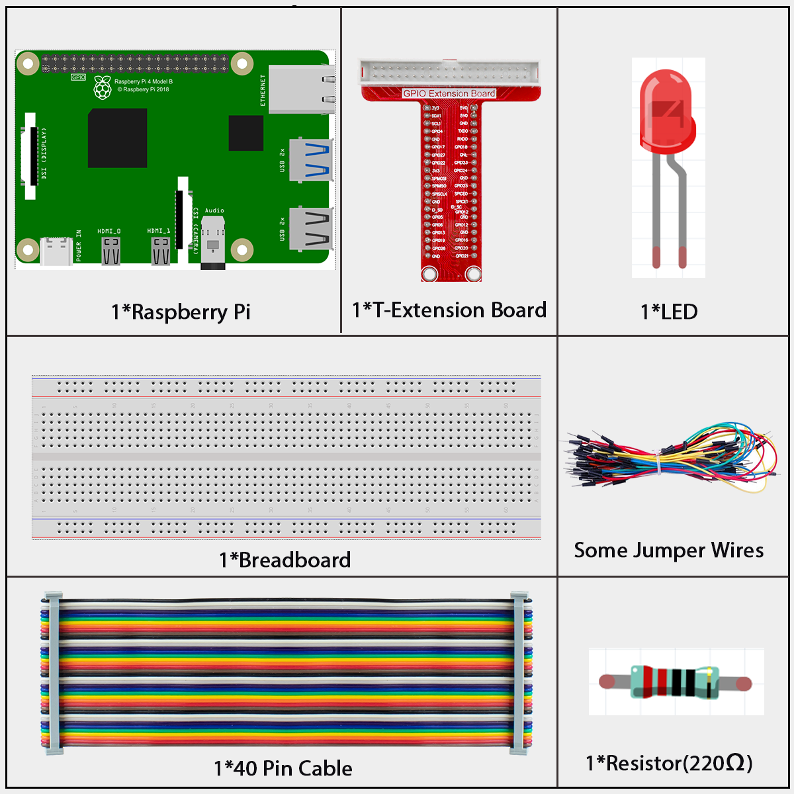
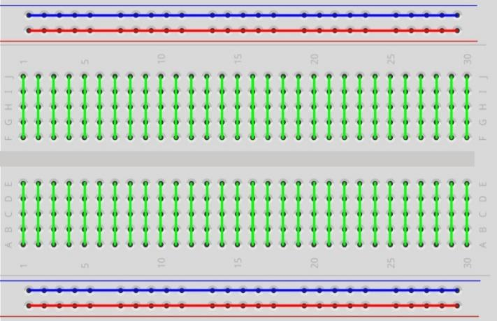
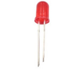
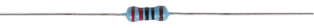
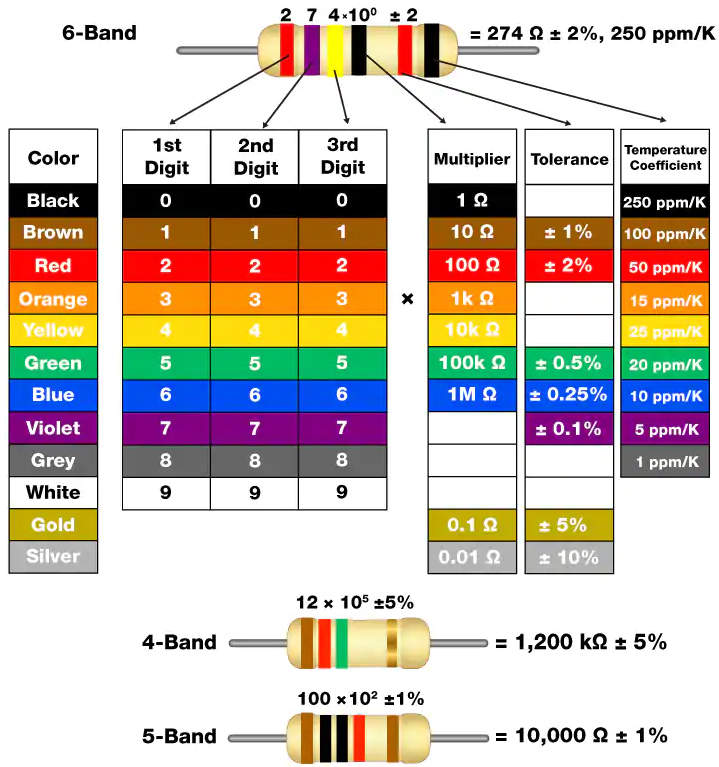
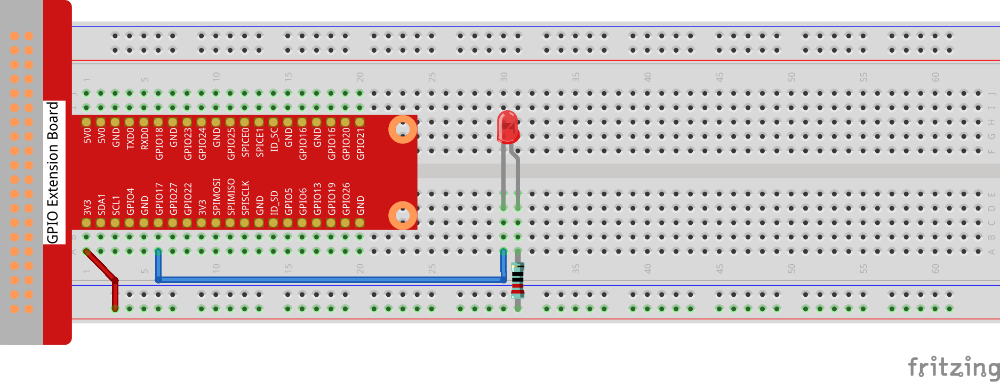
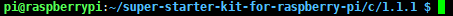
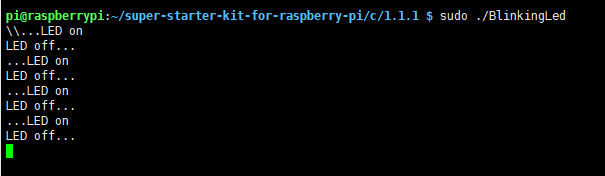
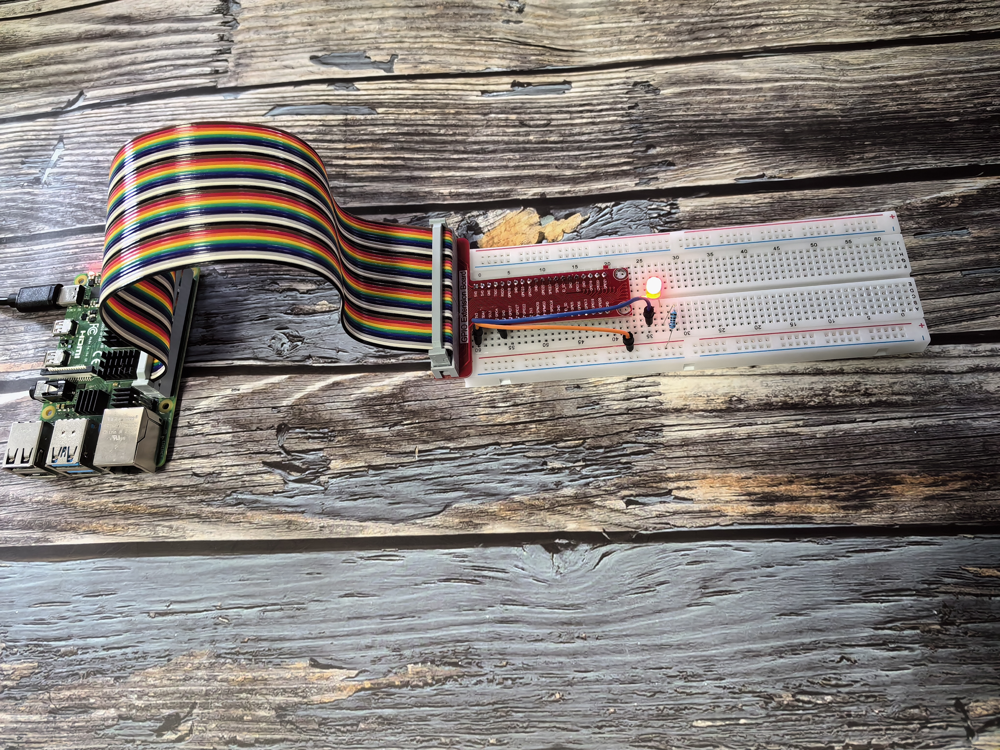

==================
1.1.1 Blinking LED
==================

Introduction
------------

This chapter is the Start Point in the journey to build and explore Raspberry Pi Pico electronic projects. We will start with simple “Blink” project.

In this project, we will use Pico to control blinking a common LED.

Components
----------

.. warning::

    In order to proceed smoothly, you need to bring your own Raspberry Pi, TF card and Raspberry Pi power.

**Breadboard**

A breadboard is an essential tool for creating electronic prototypes. It offers a solderless method to build and test circuits, enabling quick assembly and modification. The holes on the board are interconnected in rows by metal strips, which simplifies the process of connecting components such as ICs, resistors, and jumper wires.

**LED**

An LED (Light Emitting Diode) is a semiconductor that emits light when current passes through it. It functions as a diode, meaning it only allows current to flow in one direction. For the LED to light up, its longer pin (the anode) must be connected to the positive voltage, and the shorter pin (the cathode) to the negative. It is crucial to use a current-limiting resistor in series with the LED to protect it from excessive current.

**Resistor**

A resistor is a fundamental electronic component designed to impede the flow of electric current. This kit utilizes fixed resistors, which maintain a constant resistance value. Their primary role is to safeguard other components, like LEDs, from damage by limiting the current. The resistance value can be identified by interpreting the color bands on the resistor's body or by using a multimeter for a precise measurement. Resistance is measured in Ohms (Ω).

.. list-table::
   :widths: 50 50
   :align: center

   * - .. image:: ./img/image45.png
     - .. image:: ./img/image46.png

To determine a resistor's value without a multimeter, you can use the color code chart. Each color on the band represents a specific digit, multiplier, or tolerance, allowing you to calculate the resistance.

As shown in the card, each color stands for a number.

Connect
-------

In this experiment, connect a 220Ω resistor to the anode (the long pin of the LED), then the resistor to 3.3 V, and connect the cathode (the short pin) of the LED to GPIO17 of Raspberry Pi. Therefore, to turn on an LED, we need to make GPIO17 low (0V) level. We can get this phenomenon by programming

.. warning::

    Please note that **Pin 11** on the Raspberry Pi header corresponds to different numbers depending on the programming environment, as detailed in the table below.

The Raspberry Pi's GPIO pins can be referenced in multiple ways. In this project, we are using physical **Pin 11**. For C programming with the `wiringPi` library, this pin is identified as **0**. For Python programming using BCM numbering, it is known as **17**.

.. list-table::
   :header-rows: 1
   :widths: 25 25 25 25

   * - T-Board
     - Physical Pin
     - wiringPi
     - BCM
   * - GPIO17
     - Pin 11
     - 0
     - 17

.. note:: 

    In the following lessons, we will use the command line to compile or start programs. You can also use a graphical interface (such as VNC).

Code
----
For C Languag
~~~~~~~~~~~~~~~~~~
**1. Navigate to the Code's Folder**

First, you need to tell your Raspberry Pi where to find the C code file. You do this by using the `cd` (change directory) command.

.. code-block:: shell

   cd ~/super-starter-kit-for-raspberry-pi/c/1.1.1/

.. note::

   The `~` symbol is a shortcut for your home directory. This command tells the Pi to navigate from your home folder into the specific folder for this project.

**2. Compile the Code**

The C code you've written is like a recipe in a human language. To make the Raspberry Pi understand it, you need to "compile" it into an executable program. We use a program called `gcc` for this, which acts like a translator.

.. code-block:: shell

   gcc 1.1.1_BlinkingLed.c -o BlinkingLed -lwiringPi

.. note::

   Let's break down this command:
   * `gcc`: The name of our compiler program.
   * `1.1.1_BlinkingLed.c`: The source code file you want to compile.
   * `-o BlinkingLed`: This tells the compiler to create an executable file named `BlinkingLed`. The `-o` stands for "output".
   * `-lwiringPi`: This links the `wiringPi` library. A library is a collection of pre-written code that makes it easier to perform common tasks, like controlling GPIO pins.

**3. Run the Program**

Now that you have your compiled program, you can run it.

.. code-block:: shell

   sudo ./BlinkingLed

.. note::

   * `sudo`: This command stands for "Superuser Do" and gives you administrator privileges, which are necessary for controlling hardware like GPIO pins.
   * `./BlinkingLed`: This tells the Pi to run the `BlinkingLed` program located in the current directory (`./`).

After running the command, you should see your LED start to blink!

**4. Edit the Code (Optional)**

If you want to make changes to the code, you first need to stop the current program by pressing `Ctrl + C`. Then, you can use the `nano` text editor to open the file.

.. code-block::

   nano 1.1.1_BlinkingLed.c

.. note::
   `nano` is a simple, command-line based text editor. After making your changes in nano, press `Ctrl+X`, then `Y` to confirm you want to save, and finally `Enter` to exit. You'll need to re-run the compile and run steps to see your changes take effect.

For Python Languag
~~~~~~~~~~~~~~~~~~
**Go to the folder of the code.**

.. code-block:: shell

   cd ~/super-starter-kit-for-raspberry-pi/python/1.1.1/

**Run**

.. code-block:: shell

   python 1.1.1_BlinkingLed.py

After running the command, you should see your LED start to blink!

Phenomenon
----------

