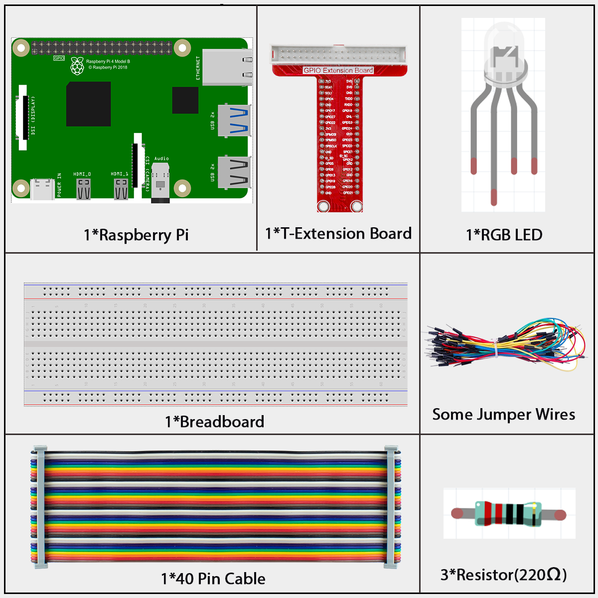
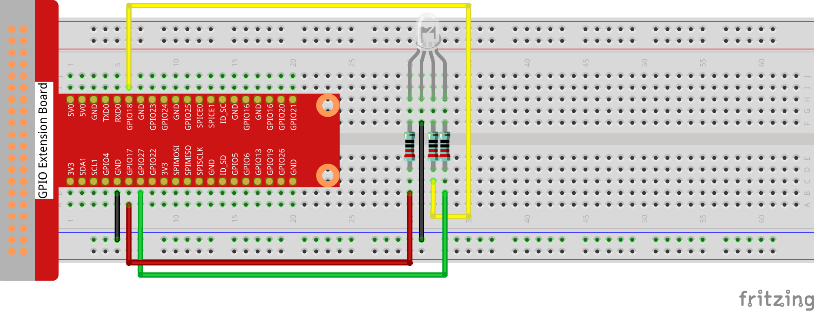

=================
1.1.2 RGB LED
=================

Introduction
------------
In this project, we will use PWM to control RGB LEDs to display different colors.

Components
----------

An RGB LED contains three LEDs in one package - red, green, and blue. By adjusting the brightness of each color, we can mix them to create various colors. On the Raspberry Pi, we use PWM (Pulse Width Modulation) to control LED brightness. Since Raspberry Pi has limited hardware PWM outputs, we use the softPwm library to simulate PWM signals through software. This allows us to control all three channels of the RGB LED simultaneously, creating a wide range of colorful lighting effects.

Connect
-------
.. list-table::
   :header-rows: 1
   :widths: 25 25 25 25

   * - T-Board Name
     - physical
     - wiringPi
     - BCM
   * - GPIO17
     - Pin 11
     - 0
     - 17
   * - GPIO18
     - Pin 12
     - 1
     - 18
   * - GPIO27
     - Pin 13
     - 2
     - 27

Code
----

For C Language User
~~~~~~~~~~~~~~~~~~~~~~

Go to the folder of the code.

.. code-block:: shell

   cd ~/super-starter-kit-for-raspberry-pi/c/1.1.2/

Compile the code. 

.. code-block:: shell

   gcc 1.1.2_rgbLed.c -lwiringPi

.. note::

    When the instruction "gcc" is executed, if "-o" is not called, then the executable file is named "a.out".

Run the executable file.

.. code-block:: shell

   sudo ./a.out

After the code runs, you will see that RGB displays red, green, blue, yellow, pink, and cyan.

.. note:: 

    If it does not work after running, or there is an error prompt: "wiringPi.h: No such file or directory", please refer to C code is not working?.

This is the complete code

.. code-block:: c

   #include <wiringPi.h>
    #include <softPwm.h>
    #include <stdio.h>

    // Define GPIO pins for the RGB LED.
    #define LED_PIN_RED    0
    #define LED_PIN_GREEN  1
    #define LED_PIN_BLUE   2

    // Define PWM range for colors (0-255).
    #define PWM_RANGE 255

    // Define a structure to hold color values and names.
    typedef struct {
        const char* name;
        unsigned char red;
        unsigned char green;
        unsigned char blue;
    } Color;

    // Array of colors to display in sequence.
    const Color COLORS[] = {
        {"Red",    0xff, 0x00, 0x00},
        {"Green",  0x00, 0xff, 0x00},
        {"Blue",   0x00, 0x00, 0xff},
        {"Yellow", 0xff, 0xff, 0x00},
        {"Purple", 0xff, 0x00, 0xff},
        {"Cyan",   0xc0, 0xff, 0x3e}
    };
    const int NUM_COLORS = sizeof(COLORS) / sizeof(COLORS[0]);

    /**
    * @brief Initializes wiringPi and sets up software PWM for RGB LED pins.
    * @return 0 on success, 1 on failure.
    */
    int setupHardware() {
        // Attempt to initialize the wiringPi library.
        if (wiringPiSetup() == -1) {
            printf("Failed to setup wiringPi!\n");
            return 1;
        }
        
        // Create software PWM on each of the RGB pins with a range of 0-255.
        softPwmCreate(LED_PIN_RED,   0, PWM_RANGE);
        softPwmCreate(LED_PIN_GREEN, 0, PWM_RANGE);
        softPwmCreate(LED_PIN_BLUE,  0, PWM_RANGE);
        
        return 0;
    }

    /**
    * @brief Sets the RGB LED to a specific color.
    * @param red   The red intensity (0-255).
    * @param green The green intensity (0-255).
    * @param blue  The blue intensity (0-255).
    */
    void setLedColor(unsigned char red, unsigned char green, unsigned char blue) {
        softPwmWrite(LED_PIN_RED,   red);
        softPwmWrite(LED_PIN_GREEN, green);
        softPwmWrite(LED_PIN_BLUE,  blue);
    }

    /**
    * @brief The main application loop to cycle through a predefined set of colors.
    */
    void colorCycleLoop() {
        int colorIndex = 0;
        while (1) {
            // Get the current color from the array.
            const Color* currentColor = &COLORS[colorIndex];

            printf("Displaying color: %s\n", currentColor->name);
            
            // Set the LED to the current color.
            setLedColor(currentColor->red, currentColor->green, currentColor->blue);
            
            // Wait for 500ms before changing to the next color.
            delay(500);

            // Move to the next color, and loop back to the start if at the end.
            colorIndex = (colorIndex + 1) % NUM_COLORS;
        }
    }

    /**
    * @brief Main function.
    * @return Integer status code. 0 for success, 1 for error.
    */
    int main(void) {
        // Initialize the hardware.
        if (setupHardware() != 0) {
            return 1; // Exit if setup fails.
        }
        
        // Start the color cycling loop.
        colorCycleLoop();
        
        return 0; // This is unreachable.
    }

For Python Language User
~~~~~~~~~~~~~~~~~~~~~~~~~

Go to the code folder and run.

.. code-block:: shell

   cd ~/super-starter-kit-for-raspberry-pi/python

.. code-block:: shell

   python 1.1.2_rgbLed.py

After the code runs, you will see that RGB displays red, green, blue, yellow, pink, and cyan.

This is the complete code

.. code-block:: python

   #!/usr/bin/env python3

    import RPi.GPIO as GPIO
    import time

    # Define GPIO pins for the RGB LED
    LED_PIN_RED = 17
    LED_PIN_GREEN = 18
    LED_PIN_BLUE = 27

    # Define PWM frequency
    PWM_FREQ = 2000

    # Define a structure to hold color values and names (using dictionary)
    COLORS = [
        {"name": "Red",    "red": 0xff, "green": 0x00, "blue": 0x00},
        {"name": "Green",  "red": 0x00, "green": 0xff, "blue": 0x00},
        {"name": "Blue",   "red": 0x00, "green": 0x00, "blue": 0xff},
        {"name": "Yellow", "red": 0xff, "green": 0xff, "blue": 0x00},
        {"name": "Purple", "red": 0xff, "green": 0x00, "blue": 0xff},
        {"name": "Cyan",   "red": 0xc0, "green": 0xff, "blue": 0x3e}
    ]

    NUM_COLORS = len(COLORS)

    # Global PWM objects
    p_R = None
    p_G = None  
    p_B = None

    def setupHardware():
        """
        Initializes RPi.GPIO and sets up software PWM for RGB LED pins.
        Returns: 0 on success, 1 on failure.
        """
        global p_R, p_G, p_B
        
        try:
            # Set the GPIO modes to BCM Numbering
            GPIO.setmode(GPIO.BCM)
            # Disable GPIO warnings
            GPIO.setwarnings(False)
            
            # Set all LedPin's mode to output and initial level to High(3.3v)
            GPIO.setup(LED_PIN_RED, GPIO.OUT, initial=GPIO.HIGH)
            GPIO.setup(LED_PIN_GREEN, GPIO.OUT, initial=GPIO.HIGH)
            GPIO.setup(LED_PIN_BLUE, GPIO.OUT, initial=GPIO.HIGH)
            
            # Create software PWM on each of the RGB pins with frequency 2KHz
            p_R = GPIO.PWM(LED_PIN_RED, PWM_FREQ)
            p_G = GPIO.PWM(LED_PIN_GREEN, PWM_FREQ)
            p_B = GPIO.PWM(LED_PIN_BLUE, PWM_FREQ)
            
            # Set all begin with value 0
            p_R.start(0)
            p_G.start(0)
            p_B.start(0)
            
            print("GPIO setup successful!")
            return 0
            
        except Exception as e:
            print(f"Failed to setup GPIO: {e}")
            return 1

    def MAP(x, in_min, in_max, out_min, out_max):
        """
        Define a MAP function for mapping values. Like from 0~255 to 0~100
        """
        return (x - in_min) * (out_max - out_min) / (in_max - in_min) + out_min

    def setLedColor(red, green, blue):
        """
        Sets the RGB LED to a specific color.
        Parameters:
            red   - The red intensity (0-255)
            green - The green intensity (0-255) 
            blue  - The blue intensity (0-255)
        """
        # Map color value from 0~255 to 0~100
        R_val = MAP(red, 0, 255, 0, 100)
        G_val = MAP(green, 0, 255, 0, 100)
        B_val = MAP(blue, 0, 255, 0, 100)
        
        # Change the colors - Assign the mapped duty cycle value to the corresponding PWM channel
        p_R.ChangeDutyCycle(R_val)
        p_G.ChangeDutyCycle(G_val)
        p_B.ChangeDutyCycle(B_val)
        
        print(f"color_msg: R_val = {R_val:.1f}, G_val = {G_val:.1f}, B_val = {B_val:.1f}")

    def colorCycleLoop():
        """
        The main application loop to cycle through a predefined set of colors.
        """
        colorIndex = 0
        while True:
            # Get the current color from the array
            currentColor = COLORS[colorIndex]
            
            print(f"Displaying color: {currentColor['name']}")
            
            # Set the LED to the current color
            setLedColor(currentColor['red'], currentColor['green'], currentColor['blue'])
            
            # Wait for 500ms before changing to the next color
            time.sleep(0.5)
            
            # Move to the next color, and loop back to the start if at the end
            colorIndex = (colorIndex + 1) % NUM_COLORS

    def destroy():
        """
        Clean up function for GPIO resources.
        """
        # Stop all pwm channel
        p_R.stop()
        p_G.stop()
        p_B.stop()
        # Release resource
        GPIO.cleanup()
        print("GPIO cleanup completed")

    def main():
        """
        Main function.
        Returns: Integer status code. 0 for success, 1 for error.
        """
        # Initialize the hardware
        if setupHardware() != 0:
            return 1  # Exit if setup fails
        
        try:
            # Start the color cycling loop
            colorCycleLoop()
        except KeyboardInterrupt:
            # When 'Ctrl+C' is pressed, the program destroy() will be executed
            print("\nProgram interrupted by user")
            destroy()
            return 0
        except Exception as e:
            print(f"An error occurred: {e}")
            destroy()
            return 1

    # If run this script directly, do:
    if __name__ == '__main__':
        main()

Phenomenon
----------

.. image:: ./img/phenomenon/112.gif