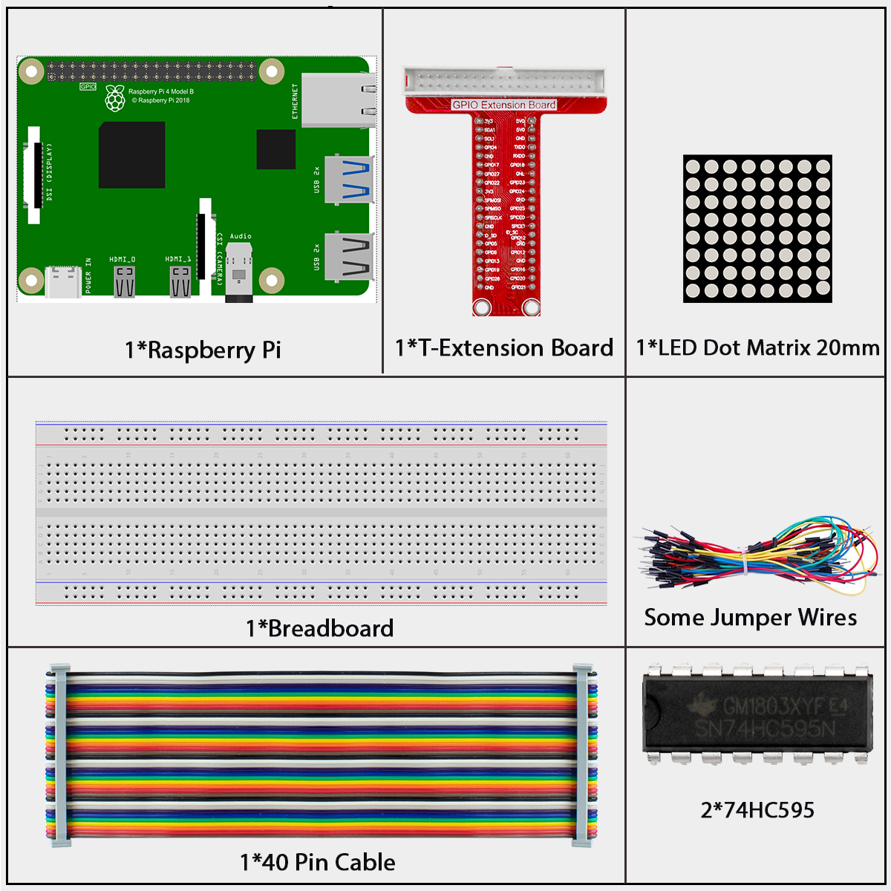
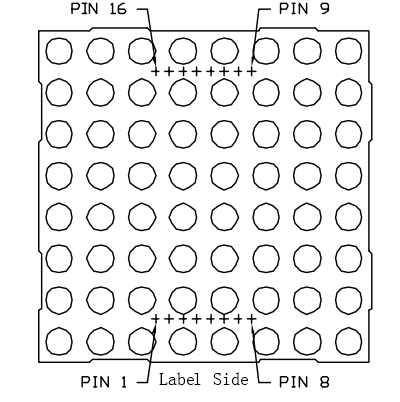
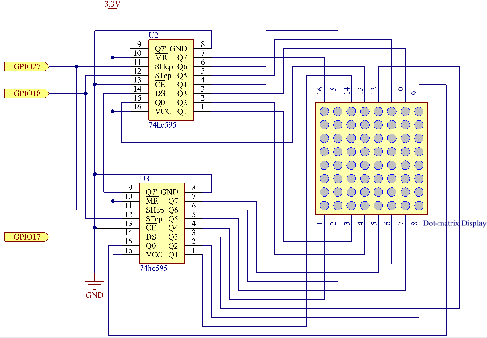
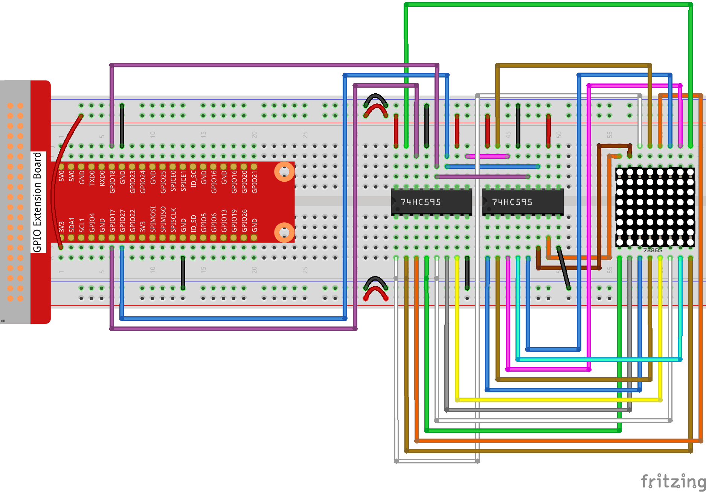

======================
1.1.3 LED Dot Matrix
======================

Introduction
------------

An LED dot matrix is an array of LEDs arranged in rows and columns that can display characters, symbols, and patterns when controlled properly.

Components
----------

**LED Dot Matrix**

LED dot matrices come in two main types: common cathode (CC) and common anode (CA). In this kit, we use a CA type (labeled as 788BS).

The matrix has 16 pins arranged at the back - pins 1-8 on one side and pins 9-16 on the other side.

The external view:

In our common anode (CA) LED matrix:
- ROW pins (9, 14, 8, 12, 1, 7, 2, 5) connect to the anodes (+)
- COL pins (13, 3, 4, 10, 6, 11, 15, 16) connect to the cathodes (-)

To light an LED at a specific position, you need to set its ROW pin HIGH and its COL pin LOW. For example, to light the top-left LED, set pin 9 (row) HIGH and pin 13 (column) LOW.

Pin numbering corresponding to the rows and columns:

.. list-table::
   :header-rows: 1
   :widths: 25 25 25 25 25 25 25 25 25

   * - **COL**
     - **1**
     - **2**
     - **3**
     - **4**
     - **5**
     - **6**
     - **7**
     - **8**
   * - **Pin No.**
     - **13**
     - **3**
     - **4**
     - **10**
     - **6**
     - **11**
     - **15**
     - **16**
   * - **ROW**
     - **1**
     - **2**
     - **3**
     - **4**
     - **5**
     - **6**
     - **7**
     - **8**
   * - **Pin No.**
     - **9**
     - **14**
     - **8**
     - **12**
     - **1**
     - **7**
     - **2**
     - **5**

Connect
-------

.. note::

   In the Fritzing image above, the side with label is at the bottom.

Code
----

For C Language User
~~~~~~~~~~~~~~~~~~~~~

Go to the code folder compile and run.

.. code-block:: shell

   cd ~/super-starter-kit-for-raspberry-pi/c/1.1.3/

.. code-block:: shell

   gcc 1.1.3_LedMatrix.c -lwiringPi

.. code-block:: shell

   sudo ./a.out

After the code runs, the LED dot matrix lights up and out row by row and column by column.

This is the complete code

.. code-block:: c
   
   /*
   * LED Matrix Control Program using 74HC595 Shift Register - FINAL VERSION
   * This program creates animated patterns on an 8x8 LED matrix
   * Hardware: Raspberry Pi + 74HC595 + 8x8 LED Matrix
   */

   #include <wiringPi.h>
   #include <stdio.h>
   
   // Pin definitions for 74HC595 shift register
   #define SDI     0   // Serial Data Input (DS pin on 74HC595)
   #define RCLK    1   // Register Clock (ST_CP pin) - latches data to output
   #define SRCLK   2   // Shift Register Clock (SH_CP pin) - shifts data
   
   #define DISPLAY_DELAY   100  // Delay between pattern changes (ms)
   
   // Animation pattern data
   unsigned char scan_down_high[8] = {0x01, 0x02, 0x04, 0x08, 0x10, 0x20, 0x40, 0x80};
   unsigned char scan_down_low[8]  = {0x00, 0x00, 0x00, 0x00, 0x00, 0x00, 0x00, 0x00};
   
   unsigned char scan_right_high[8] = {0xff, 0xff, 0xff, 0xff, 0xff, 0xff, 0xff, 0xff};
   unsigned char scan_right_low[8]  = {0x7f, 0xbf, 0xdf, 0xef, 0xf7, 0xfb, 0xfd, 0xfe};
   
   // Arrow patterns
   unsigned char arrow_up_high[8] = {0x01, 0x02, 0x04, 0x08, 0x10, 0x20, 0x40, 0x80};
   unsigned char arrow_up_low[8]  = {0xe7, 0xc3, 0x81, 0x00, 0xe7, 0xe7, 0xe7, 0xe7};
   
   unsigned char arrow_right_high[8] = {0x01, 0x02, 0x04, 0x08, 0x10, 0x20, 0x40, 0x80};
   unsigned char arrow_right_low[8]  = {0xef, 0xcf, 0x8f, 0x00, 0x00, 0x8f, 0xcf, 0xef};
   
   unsigned char arrow_down_high[8] = {0x01, 0x02, 0x04, 0x08, 0x10, 0x20, 0x40, 0x80};
   unsigned char arrow_down_low[8]  = {0xe7, 0xe7, 0xe7, 0xe7, 0x00, 0x81, 0xc3, 0xe7};
   
   unsigned char arrow_left_high[8] = {0x01, 0x02, 0x04, 0x08, 0x10, 0x20, 0x40, 0x80};
   unsigned char arrow_left_low[8]  = {0xf7, 0xf3, 0xf1, 0x00, 0x00, 0xf1, 0xf3, 0xf7};
   
   void initPins(void) {
  	 pinMode(SDI, OUTPUT);
  	 pinMode(RCLK, OUTPUT);
  	 pinMode(SRCLK, OUTPUT);
  	 digitalWrite(SDI, LOW);
  	 digitalWrite(RCLK, LOW);
  	 digitalWrite(SRCLK, LOW);
   }
   
   /*
    * Send one byte of data to the 74HC595 shift register
    */
   void shiftOutByte(unsigned char data) {
  	 for (int bit = 0; bit < 8; bit++) {
  		 digitalWrite(SDI, (data & 0x80) ? HIGH : LOW);
  		 data <<= 1;
  		 
  		 digitalWrite(SRCLK, HIGH);
  		 delayMicroseconds(10);
  		 digitalWrite(SRCLK, LOW);
  	 }
   }
   
   /*
    * Latch the data from shift register to output pins
    */
   void latchOutput(void) {
  	 digitalWrite(RCLK, HIGH);
  	 delayMicroseconds(10);
  	 digitalWrite(RCLK, LOW);
   }
   
   /*
    * 🆕 Clear the entire LED matrix display
    * Turns off all LEDs by sending zeros to both shift registers
    */
   void clearDisplay(void) {
  	 shiftOutByte(0x00);  // Clear column data (all columns OFF)
  	 shiftOutByte(0x00);  // Clear row data (all rows OFF)
  	 latchOutput();       // Apply the changes
   }
   
   void displayPattern(unsigned char low_byte, unsigned char high_byte) {
  	 shiftOutByte(low_byte);
  	 shiftOutByte(high_byte);
  	 latchOutput();
  	 delay(DISPLAY_DELAY);
   }
   
   /*
    * Display a complete 8x8 pattern using row scanning
    */
   void displayCompletePattern(unsigned char* row_data, unsigned char* col_data, int duration_ms) {
  	 unsigned long start_time = millis();
  	 
  	 while ((millis() - start_time) < duration_ms) {
  		 for (int row = 0; row < 8; row++) {
  			 shiftOutByte(col_data[row]);
  			 shiftOutByte(row_data[row]);
  			 latchOutput();
  			 delayMicroseconds(500);
  			 
  			 if ((millis() - start_time) >= duration_ms) {
  				 break;
  			 }
  		 }
  	 }
   }
   
   void playTopToBottomScan(void) {
  	 printf("Playing: Top-to-bottom scan...\n");
  	 for (int i = 0; i < 8; i++) {
  		 displayPattern(scan_down_low[i], scan_down_high[i]);
  	 }
  	 delay(200);
   }
   
   void playLeftToRightScan(void) {
  	 printf("Playing: Left-to-right scan...\n");
  	 for (int i = 0; i < 8; i++) {
  		 displayPattern(scan_right_low[i], scan_right_high[i]);
  	 }
  	 delay(200);
   }
   
   /*
    * Stage 3: Arrow animation (clockwise rotation)
    * 🔧 ADDED: Clear display after each arrow and at the end
    */
   void playArrowAnimation(void) {
  	 printf("Playing: Arrow rotation...\n");
  	 
  	 printf("  ↑ UP\n");
  	 displayCompletePattern(arrow_up_high, arrow_up_low, 1000);
  	 clearDisplay();  // 🆕 Clear after UP arrow
  	 delay(100);      // Brief pause to see the clear
  	 
  	 printf("  → RIGHT\n");  
  	 displayCompletePattern(arrow_right_high, arrow_right_low, 1000);
  	 clearDisplay();  // 🆕 Clear after RIGHT arrow
  	 delay(100);
  	 
  	 printf("  ↓ DOWN\n");
  	 displayCompletePattern(arrow_down_high, arrow_down_low, 1000);
  	 clearDisplay();  // 🆕 Clear after DOWN arrow
  	 delay(100);
  	 
  	 printf("  ← LEFT\n");
  	 displayCompletePattern(arrow_left_high, arrow_left_low, 1000);
  	 clearDisplay();  // 🆕 Clear after LEFT arrow - THIS FIXES THE ISSUE!
  	 
  	 printf("Arrow sequence completed, clearing display...\n");
  	 delay(500);      // Pause before next cycle
   }
   
   int main(void) {
  	 if (wiringPiSetup() == -1) {
  		 printf("Error: Failed to initialize wiringPi!\n");
  		 return 1;
  	 }
   
  	 printf("LED Matrix Animation Started...\n");
  	 printf("Animation sequence: Top-to-bottom → Left-to-right → Arrow rotation\n");
  	 printf("Display clears between animations for clean transitions\n");
  	 printf("Press Ctrl+C to exit\n");
   
  	 initPins();
  	 
  	 // 🆕 Clear display at startup
  	 clearDisplay();
  	 printf("Display initialized and cleared\n");
   
  	 while (1) {
  		 playTopToBottomScan();
  		 clearDisplay();        // 🆕 Clear after top-to-bottom scan
  		 delay(100);
  		 
  		 playLeftToRightScan();
  		 clearDisplay();        // 🆕 Clear after left-to-right scan  
  		 delay(100);
  		 
  		 playArrowAnimation();  // Already has clear after each arrow
  		 
  		 printf("=== Starting new animation cycle ===\n");
  	 }
   
  	 return 0;
   }
   

For Python Language User
~~~~~~~~~~~~~~~~~~~~~~~~~~

Go to the code folder and run.

.. code-block:: shell

   cd ~/super-starter-kit-for-raspberry-pi/python

.. code-block:: shell
   
   python 1.1.3_LedMatrix.py

This is the complete code

.. code-block:: python

   #!/usr/bin/env python3
   """
   @brief LED Matrix Control Program using 74HC595 Shift Register - Python Version
   @description This program creates animated patterns on an 8x8 LED matrix
               Hardware: Raspberry Pi + 74HC595 + 8x8 LED Matrix
   """

   import RPi.GPIO as GPIO
   import time
   import signal
   import sys
   from threading import Event

   # ========== PIN CONFIGURATION ==========
   # Pin definitions for 74HC595 shift register (BCM numbering)
   SDI_PIN = 17        # Serial Data Input (DS pin on 74HC595)
   RCLK_PIN = 18       # Register Clock (ST_CP pin) - latches data to output
   SRCLK_PIN = 27      # Shift Register Clock (SH_CP pin) - shifts data

   # ========== TIMING CONFIGURATION ==========
   DISPLAY_DELAY = 0.1     # Delay between pattern changes (seconds)
   ARROW_DURATION = 1.0    # Duration for each arrow display (seconds)
   STAGE_PAUSE = 0.2       # Pause between animation stages (seconds)
   CLEAR_PAUSE = 0.1       # Pause after clearing display (seconds)

   # ========== ANIMATION PATTERN DATA ==========
   # Stage 1: Top-to-bottom scanning (8 frames)
   scan_down_high = [0x01, 0x02, 0x04, 0x08, 0x10, 0x20, 0x40, 0x80]
   scan_down_low  = [0x00, 0x00, 0x00, 0x00, 0x00, 0x00, 0x00, 0x00]

   # Stage 2: Left-to-right scanning (8 frames)  
   scan_right_high = [0xff, 0xff, 0xff, 0xff, 0xff, 0xff, 0xff, 0xff]
   scan_right_low  = [0x7f, 0xbf, 0xdf, 0xef, 0xf7, 0xfb, 0xfd, 0xfe]

   # Stage 3: Arrow patterns (4 directions)
   # Row selection data (same for all arrows)
   arrow_row_select = [0x01, 0x02, 0x04, 0x08, 0x10, 0x20, 0x40, 0x80]

   # Column data for different arrow directions
   arrow_up_cols    = [0xe7, 0xc3, 0x81, 0x00, 0xe7, 0xe7, 0xe7, 0xe7]  # Arrow pointing UP ↑
   arrow_right_cols = [0xef, 0xcf, 0x8f, 0x00, 0x00, 0x8f, 0xcf, 0xef]  # Arrow pointing RIGHT →
   arrow_down_cols  = [0xe7, 0xe7, 0xe7, 0xe7, 0x00, 0x81, 0xc3, 0xe7]  # Arrow pointing DOWN ↓
   arrow_left_cols  = [0xf7, 0xf3, 0xf1, 0x00, 0x00, 0xf1, 0xf3, 0xf7]  # Arrow pointing LEFT ←

   # ========== GLOBAL VARIABLES ==========
   program_running = Event()
   program_running.set()

   class LEDMatrixController:
      """Class to control 8x8 LED Matrix using 74HC595 shift register"""
      
      def __init__(self):
         """Initialize the LED Matrix controller"""
         self.setup_exit_handler()
         self.initialize_gpio()
         
      def setup_exit_handler(self):
         """Setup signal handler for graceful exit"""
         signal.signal(signal.SIGINT, self.handle_program_exit)
         print("🛡️  Press Ctrl+C to safely exit")
         
      def handle_program_exit(self, signum, frame):
         """Handle program exit (Ctrl+C)"""
         print("\n🛑 Ctrl+C pressed! Shutting down...")
         
         # Clear the display
         self.clear_display()
         print("📺 Display cleared")
         print("👋 LED Matrix Animation terminated!")
         
         program_running.clear()
         GPIO.cleanup()
         sys.exit(0)
         
      def initialize_gpio(self):
         """Initialize all GPIO pins"""
         print("🔧 Initializing LED Matrix System...")
         
         try:
               # Set GPIO mode to BCM numbering
               GPIO.setmode(GPIO.BCM)
               GPIO.setwarnings(False)
               
               # Configure shift register control pins as outputs
               GPIO.setup(SDI_PIN, GPIO.OUT)      # Data line to shift register
               GPIO.setup(RCLK_PIN, GPIO.OUT)     # Latch pin to update display
               GPIO.setup(SRCLK_PIN, GPIO.OUT)    # Clock pin for shifting data
               
               # Initialize all pins to LOW
               GPIO.output(SDI_PIN, GPIO.LOW)
               GPIO.output(RCLK_PIN, GPIO.LOW)
               GPIO.output(SRCLK_PIN, GPIO.LOW)
               
               print("✅ GPIO pins configured and initialized")
               print("🚀 Hardware initialization complete!\n")
               
         except Exception as e:
               print(f"❌ ERROR: Failed to initialize GPIO: {e}")
               sys.exit(1)
               
      def shift_out_byte(self, data):
         """
         Send one byte of data to the 74HC595 shift register
         Data is sent MSB first (bit 7 to bit 0)
         
         Args:
               data (int): The 8-bit value to send (0-255)
         """
         for bit in range(8):
               # Extract the MSB and send it to SDI pin
               bit_value = (data & 0x80) != 0
               GPIO.output(SDI_PIN, bit_value)
               data <<= 1  # Shift left for next bit
               
               # Pulse the shift clock to move data into register
               GPIO.output(SRCLK_PIN, GPIO.HIGH)
               time.sleep(0.00001)  # 10 microseconds delay
               GPIO.output(SRCLK_PIN, GPIO.LOW)
               
      def latch_output(self):
         """
         Latch the data from shift register to output pins
         This makes the data visible on the LED matrix
         """
         GPIO.output(RCLK_PIN, GPIO.HIGH)
         time.sleep(0.00001)  # 10 microseconds delay
         GPIO.output(RCLK_PIN, GPIO.LOW)
         
      def clear_display(self):
         """
         Clear the entire LED matrix display
         Turns off all LEDs by sending zeros to both shift registers
         """
         self.shift_out_byte(0x00)  # Clear column data (all columns OFF)
         self.shift_out_byte(0x00)  # Clear row data (all rows OFF)
         self.latch_output()        # Apply the changes
         
      def display_pattern(self, low_byte, high_byte):
         """
         Display one frame of the LED matrix pattern
         
         Args:
               low_byte (int): Column data (0-255)
               high_byte (int): Row selection data (0-255)
         """
         self.shift_out_byte(low_byte)   # Send low byte first
         self.shift_out_byte(high_byte)  # Send high byte second
         self.latch_output()             # Update the display
         time.sleep(DISPLAY_DELAY)       # Hold the pattern
         
      def display_complete_pattern(self, row_data, col_data, duration_seconds):
         """
         Display a complete 8x8 pattern using row scanning (multiplexing)
         
         Args:
               row_data (list): List of 8 bytes for row selection
               col_data (list): List of 8 bytes for column patterns
               duration_seconds (float): How long to display the pattern
         """
         start_time = time.time()
         
         while (time.time() - start_time) < duration_seconds:
               if not program_running.is_set():
                  break
                  
               # One complete scan of all 8 rows
               for row in range(8):
                  self.shift_out_byte(col_data[row])
                  self.shift_out_byte(row_data[row])
                  self.latch_output()
                  time.sleep(0.0005)  # 0.5ms per row
                  
                  # Check if time is up during scanning
                  if (time.time() - start_time) >= duration_seconds:
                     break
                     
      def play_top_to_bottom_scan(self):
         """
         Stage 1: Top-to-bottom scanning animation
         Lights up one row at a time from top to bottom
         """
         print("🔽 Playing: Top-to-bottom scan...")
         for i in range(8):
               if not program_running.is_set():
                  break
               self.display_pattern(scan_down_low[i], scan_down_high[i])
         time.sleep(STAGE_PAUSE)
         
      def play_left_to_right_scan(self):
         """
         Stage 2: Left-to-right scanning animation  
         Lights up one column at a time from left to right
         """
         print("➡️  Playing: Left-to-right scan...")
         for i in range(8):
               if not program_running.is_set():
                  break
               self.display_pattern(scan_right_low[i], scan_right_high[i])
         time.sleep(STAGE_PAUSE)
         
      def play_arrow_animation(self):
         """
         Stage 3: Arrow animation (clockwise rotation)
         Shows arrows pointing up → right → down → left
         """
         print("🏹 Playing: Arrow rotation...")
         
         arrows = [
               ("↑ UP", arrow_up_cols),
               ("→ RIGHT", arrow_right_cols),
               ("↓ DOWN", arrow_down_cols),
               ("← LEFT", arrow_left_cols)
         ]
         
         for direction, col_data in arrows:
               if not program_running.is_set():
                  break
                  
               print(f"  {direction}")
               self.display_complete_pattern(arrow_row_select, col_data, ARROW_DURATION)
               self.clear_display()  # Clear after each arrow
               time.sleep(CLEAR_PAUSE)
               
         print("🏹 Arrow sequence completed, clearing display...")
         time.sleep(0.5)  # Pause before next cycle
         
      def run_animation_loop(self):
         """Main animation loop"""
         print("🚀 Starting LED Matrix Animation...")
         print("📺 Animation sequence: Top-to-bottom → Left-to-right → Arrow rotation")
         print("✨ Display clears between animations for clean transitions")
         print("💡 Press Ctrl+C to exit\n")
         
         # Clear display at startup
         self.clear_display()
         print("📺 Display initialized and cleared\n")
         
         cycle_count = 0
         
         while program_running.is_set():
               try:
                  cycle_count += 1
                  print(f"🔄 === Animation Cycle {cycle_count} ===")
                  
                  # Stage 1: Top-to-bottom scanning
                  self.play_top_to_bottom_scan()
                  self.clear_display()
                  time.sleep(CLEAR_PAUSE)
                  
                  # Stage 2: Left-to-right scanning
                  self.play_left_to_right_scan()
                  self.clear_display()
                  time.sleep(CLEAR_PAUSE)
                  
                  # Stage 3: Arrow animations
                  self.play_arrow_animation()
                  
                  print(f"✅ Cycle {cycle_count} completed\n")
                  
               except KeyboardInterrupt:
                  break
               except Exception as e:
                  print(f"❌ Error in animation loop: {e}")
                  time.sleep(0.1)
                  
      def display_startup_info(self):
         """Display startup information"""
         print("=" * 50)
         print("🎮 LED Matrix Animation System - Python Version")
         print("=" * 50)
         print("📝 This program creates animated patterns on an 8x8 LED matrix")
         print("⚡ Uses 74HC595 shift register for multiplexing")
         print("🐍 Python version with RPi.GPIO library")
         print(f"📍 SDI pin: {SDI_PIN} (BCM)")
         print(f"📍 RCLK pin: {RCLK_PIN} (BCM)")
         print(f"📍 SRCLK pin: {SRCLK_PIN} (BCM)")
         print(f"⏱️  Arrow duration: {ARROW_DURATION}s each")
         print(f"⏱️  Display delay: {DISPLAY_DELAY}s")
         print()

   def test_display_patterns():
      """Test function to verify display is working correctly"""
      print("🧪 Testing LED Matrix Display...")
      controller = LEDMatrixController()
      
      # Test simple patterns
      test_patterns = [
         (0x00, 0x01, "Single row"),
         (0xff, 0x01, "Full row"),
         (0x81, 0xff, "Two columns"),
         (0x00, 0x00, "All off")
      ]
      
      for low, high, description in test_patterns:
         print(f"📺 Testing: {description}")
         controller.display_pattern(low, high)
         time.sleep(1)
         
      controller.clear_display()
      print("✅ Display test complete!")

   def main():
      """Main function - Program entry point"""
      try:
         # Create and run the LED matrix controller
         controller = LEDMatrixController()
         controller.display_startup_info()
         controller.run_animation_loop()
         
      except KeyboardInterrupt:
         print("\n🛑 Program interrupted")
      except Exception as e:
         print(f"❌ Fatal error: {e}")
      finally:
         GPIO.cleanup()
         print("🧹 GPIO cleanup complete")

   if __name__ == "__main__":
      # 🧪 Uncomment the next line to run display test instead of main program
      # test_display_patterns()
      
      main()

Phenomenon
----------

.. image:: ./img/phenomenon/113.gif