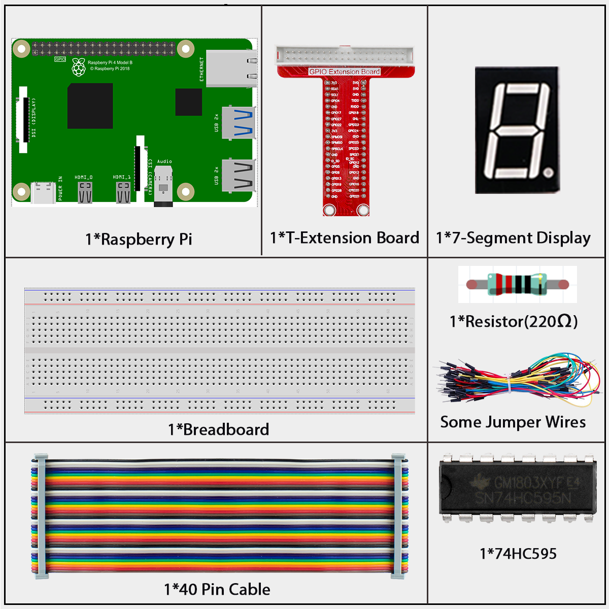
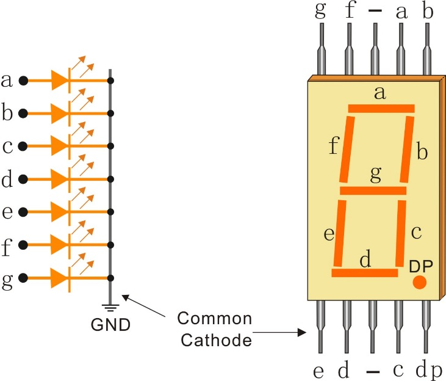
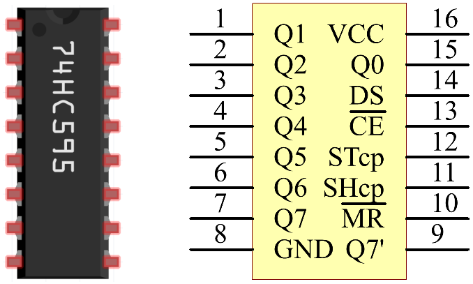
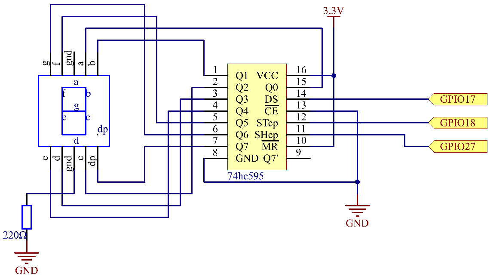
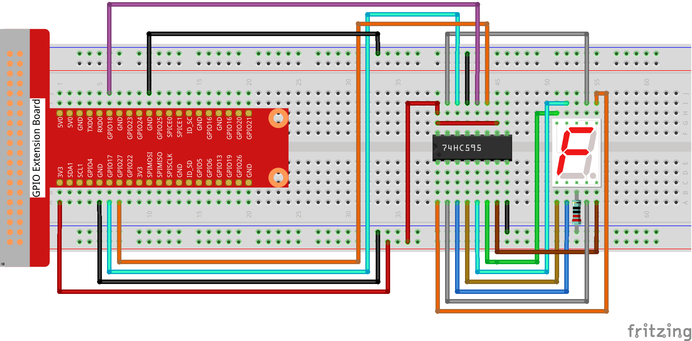

# 1.1.4 7-segment Display

## Introduction

Let’s try to drive a 7-segment display to show a figure from 0 to 9 and A to F.

## Components



**7-Segment Display**

A 7-segment display is an 8-shaped component which packages 7 LEDs. Each LED is called a segment - when energized, one segment forms part of a numeral to be displayed.

There are two types of pin connection: Common Cathode (CC) and Common Anode (CA). As the name suggests, a CC display has all the cathodes of the 7 LEDs connected when a CA display has all the anodes of the 7 segments connected. In this kit, we use the former.



Each of the LEDs in the display is given a positional segment with one of its connection pins led out from the rectangular plastic package. These LED pins are labeled from “a” through to “g” representing each individual LED. The other LED pins are connected together forming a common pin. So by forward biasing the appropriate pins of the LED segments in a particular order, some segments will brighten and others stay dim, thus showing the corresponding character on the display.

**Display Codes**

To help you get to know how 7-segment displays(Common Cathode) display Numbers, we have drawn the following table. Numbers are the number 0-F displayed on the 7-segment display; (DP) GFEDCBA refers to the corresponding LED set to 0 or 1, For example, 00111111 means that DP and G are set to 0, while others are set to 1. Therefore, the number 0 is displayed on the 7-segment display, while HEX Code corresponds to hexadecimal number.


**74HC595**

The 74HC595 consists of an 8−bit shift register and a storage register with three−state parallel outputs. It converts serial input into parallel output so you can save IO ports of an MCU.

When MR (pin10) is high level and OE (pin13) is low level, data is input in the rising edge of SHcp and goes to the memory register through the rising edge of SHcp. If the two clocks are connected together, the shift register is always one pulse earlier than the memory register. There is a serial shift input pin (Ds), a serial output pin (Q) and an asynchronous reset button (low level) in the memory register. The memory register outputs a Bus with a parallel 8-bit and in three states. When OE is enabled (low level), the data in memory register is output to the bus.



**Pins of 74HC595 and their functions**:

- **Q0-Q7**: 8-bit parallel data output pins, able to control 8 LEDs or 8 pins of 7-segment display directly.
- **Q7’**: Series output pin, connected to DS of another 74HC595 to connect multiple 74HC595s in series.
- **MR**: Reset pin, active at low level;
- **SHcp**: Time sequence input of shift register. On the rising edge, the data in shift register moves successively one bit, i.e. data in Q1 moves to Q2, and so forth. While on the falling edge, the data in shift register remain unchanged.
- **STcp**: Time sequence input of storage register. On the rising edge, data in the shift register moves into memory register.
- **CE**: Output enable pin, active at low level.
- **DS**: Serial data input pin
- **VCC**: Positive supply voltage
- **GND**: Ground

Connect pin ST_CP of 74HC595 to Raspberry Pi GPIO18, SH_CP to GPIO27, DS to GPIO17, parallel output ports to 8 segments of the LED segment display. Input data in DS pin to shift register when SH_CP (the clock input of the shift register) is at the rising edge, and to the memory register when ST_CP (the clock input of the memory) is at the rising edge. Then you can control the states of SH_CP and ST_CP via the Raspberry Pi GPIOs to transform serial data input into parallel data output so as to save Raspberry Pi GPIOs and drive the display.

| T-Board Name | physical | wiringPi | BCM  |
| ------------ | -------- | -------- | ---- |
| GPIO17       | Pin 11   | 0        | 17   |
| GPIO18       | Pin 12   | 1        | 18   |
| GPIO27       | Pin 13   | 2        | 27   |



## Connect



## Code

### For  C  Language User

Go to the code folder compile and run.

```sh
cd ~/davinci-kit-for-raspberry-pi/c/1.1.4/
gcc 1.1.4_7-Segment.c -lwiringPi
sudo ./a.out
```

After the code runs, you’ll see the 7-segment display display 0-9, A-F.

This is the complete code

```c
#include <wiringPi.h>
#include <stdio.h>

#define   SDI   0   //serial data input
#define   RCLK  1   //memory clock input(STCP)
#define   SRCLK 2   //shift register clock input(SHCP)

unsigned char SegCode[16] = {0x3f,0x06,0x5b,0x4f,0x66,0x6d,0x7d,0x07,0x7f,0x6f,0x77,0x7c,0x39,0x5e,0x79,0x71};

void init(void){
	pinMode(SDI, OUTPUT); 
	pinMode(RCLK, OUTPUT); 
	pinMode(SRCLK, OUTPUT); 

	digitalWrite(SDI, 0);
	digitalWrite(RCLK, 0);
	digitalWrite(SRCLK, 0);
}

void hc595_shift(unsigned char dat){
	int i;

	for(i=0;i<8;i++){
		digitalWrite(SDI, 0x80 & (dat << i));
		digitalWrite(SRCLK, 1);
		delay(1);
		digitalWrite(SRCLK, 0);
	}

		digitalWrite(RCLK, 1);
		delay(1);
		digitalWrite(RCLK, 0);
}

int main(void){
	int i;

	if(wiringPiSetup() == -1){ //when initialize wiring failed, print messageto screen
		printf("setup wiringPi failed !");
		return 1; 
	}

	init();
	while(1){
		for(i=0;i<16;i++){
			printf("Print %1X on Segment\n", i); // %X means hex output 
			hc595_shift(SegCode[i]);
			delay(500);
		}
	}

	return 0;
}
```

**For  Python  Language User**

Go to the code folder and run.

```sh
cd ~/super-starter-kit-for-raspberry-pi/python
python 1.1.4_7-Segment.py
```

After the code runs, you’ll see the 7-segment display display 0-9, A-F.

This is the complete code

```c
import RPi.GPIO as GPIO
import time

# Set up pins
SDI   = 17
RCLK  = 18
SRCLK = 27

# Define a segment code from 0 to F in Hexadecimal
# Common cathode
segCode = [0x3f,0x06,0x5b,0x4f,0x66,0x6d,0x7d,0x07,0x7f,0x6f]

def setup():
	GPIO.setmode(GPIO.BCM)
	GPIO.setup(SDI, GPIO.OUT, initial=GPIO.LOW)
	GPIO.setup(RCLK, GPIO.OUT, initial=GPIO.LOW)
	GPIO.setup(SRCLK, GPIO.OUT, initial=GPIO.LOW)

# Shift the data to 74HC595
def hc595_shift(dat):
	for bit in range(0, 8):	
		GPIO.output(SDI, 0x80 & (dat << bit))
		GPIO.output(SRCLK, GPIO.HIGH)
		time.sleep(0.001)
		GPIO.output(SRCLK, GPIO.LOW)
	GPIO.output(RCLK, GPIO.HIGH)
	time.sleep(0.001)
	GPIO.output(RCLK, GPIO.LOW)

def main():
	while True:
		# Shift the code one by one from segCode list
		for code in segCode:
			hc595_shift(code)
			print ("segCode[%s]: 0x%02X"%(segCode.index(code), code)) # %02X means double digit HEX to print
			time.sleep(0.5)

def destroy():
	GPIO.cleanup()

if __name__ == '__main__':
	setup()
	try:
		main()
	except KeyboardInterrupt:
		destroy()

```

## Phenomenon


