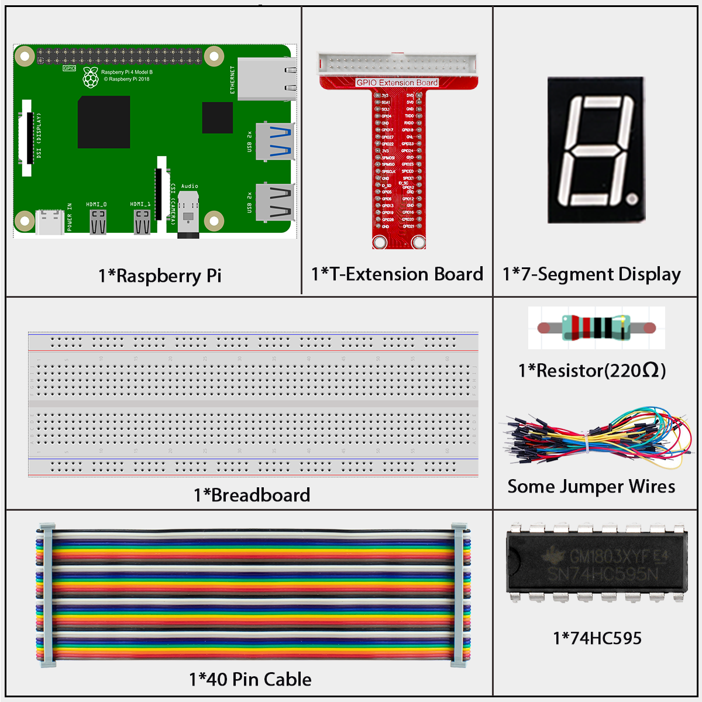
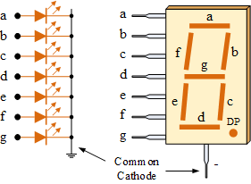
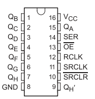
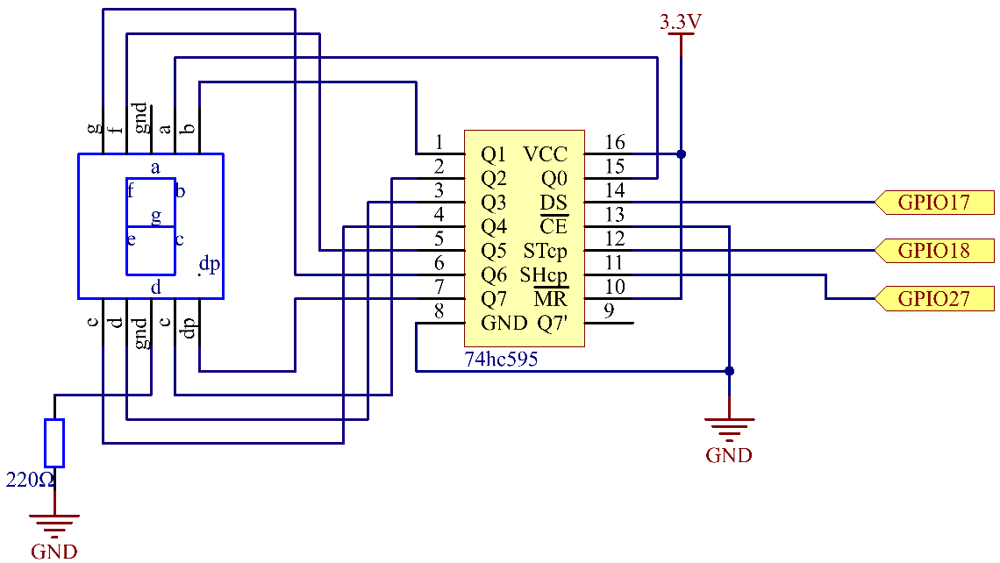

========================
1.1.4 7-segment Display
========================

Introduction
------------

Let's try to drive a 7-segment display to show a figure from 0 to 9 and A to F.

Components
----------

**7-Segment Display**

A 7-segment display contains seven LEDs arranged in an 8-shape pattern. By controlling which segments light up, we can display numbers 0-9 and letters A-F.

There are two types:
- **Common Cathode (CC)**: All LED cathodes (-) are connected together
- **Common Anode (CA)**: All LED anodes (+) are connected together

In this kit, we use a Common Cathode display.

Each segment is labeled with a letter from 'a' through 'g'. To display different characters, we turn specific segments on or off according to predefined patterns. For example, to display the number "8", we turn on all segments, while for "1", we only turn on segments 'b' and 'c'.

**Display Codes**

The table below shows the segment patterns for displaying numbers 0-9 and letters A-F. Each digit in the binary pattern (dp)gfedcba represents whether a segment is ON (1) or OFF (0). For example, the pattern 00111111 for number 0 means segments a through f are ON, while g and dp (decimal point) are OFF.

.. list-table:: 7-Segment Display Codes
   :header-rows: 1
   :widths: 10 45 20 25
   
   * - Number
     - Binary Pattern (dp)gfedcba
     - Hex Code
     - Segments Lit
   * - 0
     - 00111111
     - 0x3F
     - a, b, c, d, e, f
   * - 1
     - 00000110
     - 0x06
     - b, c
   * - 2
     - 01011011
     - 0x5B
     - a, b, d, e, g
   * - 3
     - 01001111
     - 0x4F
     - a, b, c, d, g
   * - 4
     - 01100110
     - 0x66
     - b, c, f, g
   * - 5
     - 01101101
     - 0x6D
     - a, c, d, f, g
   * - 6
     - 01111101
     - 0x7D
     - a, c, d, e, f, g
   * - 7
     - 00000111
     - 0x07
     - a, b, c
   * - 8
     - 01111111
     - 0x7F
     - a, b, c, d, e, f, g
   * - 9
     - 01101111
     - 0x6F
     - a, b, c, d, f, g
   * - A
     - 01110111
     - 0x77
     - a, b, c, e, f, g
   * - B
     - 01111100
     - 0x7C
     - c, d, e, f, g
   * - C
     - 00111001
     - 0x39
     - a, d, e, f
   * - D
     - 01011110
     - 0x5E
     - b, c, d, e, g
   * - E
     - 01111001
     - 0x79
     - a, d, e, f, g
   * - F
     - 01110001
     - 0x71
     - a, e, f, g

**74HC595 Shift Register**

The 74HC595 is an integrated circuit that converts serial data into parallel output. It's perfect for controlling multiple outputs (like the 7 segments of our display) using only a few pins from the Raspberry Pi.

**How it works:** 
- You send data one bit at a time through a single pin
- The chip stores this data and outputs it on 8 parallel pins simultaneously
- This allows us to control all 7 segments plus the decimal point using just 3 control pins

**Key Pins and Their Functions**:

.. list-table::
   :header-rows: 1
   :widths: 20 80
   
   * - Pin Name
     - Function
   * - **DS** (Data)
     - Serial data input - where we feed in our binary data one bit at a time
   * - **SH_CP** (Shift Clock)
     - When pulsed, shifts each bit of data into the register
   * - **ST_CP** (Storage Clock)
     - When pulsed, transfers the data from the shift register to the output pins
   * - **Q0-Q7**
     - The 8 output pins that connect to our 7-segment display (7 segments + decimal point)
   * - **OE** (Output Enable)
     - Controls whether outputs are active (LOW) or disabled (HIGH)

**Connection to Raspberry Pi**:

1. Connect **DS** (Data) to **GPIO17**
2. Connect **SH_CP** (Shift Clock) to **GPIO27**
3. Connect **ST_CP** (Storage Clock) to **GPIO18**
4. Connect the 8 output pins (Q0-Q7) to the 7-segment display

This setup allows us to control all 8 segments using just 3 GPIO pins from the Raspberry Pi.

.. list-table::
   :header-rows: 1
   :widths: 25 25 25 25

   * - T-Board Name
     - physical
     - wiringPi
     - BCM
   * - GPIO17
     - Pin 11
     - 0
     - 17
   * - GPIO18
     - Pin 12
     - 1
     - 18
   * - GPIO27
     - Pin 13
     - 2
     - 27

Connect
-------

.. image:: ./img/connect/1.1.4.png

Code
----

For C Language User
~~~~~~~~~~~~~~~~~~~~

Go to the code folder compile and run.

.. code-block:: shell

   cd ~/davinci-kit-for-raspberry-pi/c/1.1.4/

.. code-block:: shell

   gcc 1.1.4_7-Segment.c -lwiringPi

.. code-block:: shell

   sudo ./a.out

After the code runs, you'll see the 7-segment display display 0-9, A-F.

This is the complete code

.. code-block:: c

   #include <wiringPi.h>
	#include <stdio.h>

	// Pin definitions for the 74HC595 shift register.
	#define SDI_PIN   0   // Serial Data Input (DS)
	#define RCLK_PIN  1   // Storage Register Clock (STCP)
	#define SRCLK_PIN 2   // Shift Register Clock (SHCP)

	// Delay between displaying numbers in milliseconds.
	#define DISPLAY_DELAY 500

	/**
	* @brief Common-anode 7-segment display codes for 0-F.
	* Segments are mapped as: g, f, e, d, c, b, a
	* A low bit turns a segment ON.
	*/
	const unsigned char SEGMENT_CODES[16] = {
		0x3f, // 0
		0x06, // 1
		0x5b, // 2
		0x4f, // 3
		0x66, // 4
		0x6d, // 5
		0x7d, // 6
		0x07, // 7
		0x7f, // 8
		0x6f, // 9
		0x77, // A
		0x7c, // B
		0x39, // C
		0x5e, // D
		0x79, // E
		0x71  // F
	};
	const int NUM_DIGITS = sizeof(SEGMENT_CODES) / sizeof(SEGMENT_CODES[0]);

	/**
	* @brief Initializes GPIO pins for the shift register.
	* @return 0 on success, 1 on failure.
	*/
	int setupHardware() {
		if (wiringPiSetup() == -1) {
			printf("Failed to setup wiringPi!\n");
			return 1;
		}

		pinMode(SDI_PIN, OUTPUT);
		pinMode(RCLK_PIN, OUTPUT);
		pinMode(SRCLK_PIN, OUTPUT);

		digitalWrite(SDI_PIN, 0);
		digitalWrite(RCLK_PIN, 0);
		digitalWrite(SRCLK_PIN, 0);
		
		return 0;
	}

	/**
	* @brief Sends a segment pattern to the 74HC595 shift register.
	* @param segmentData The 8-bit pattern for the 7-segment display.
	*/
	void displayDigit(unsigned char segmentData) {
		// Shift out the 8 bits of data (MSB first).
		for (int i = 0; i < 8; i++) {
			digitalWrite(SDI_PIN, (0x80 & (segmentData << i)) ? 1 : 0);
			// Pulse the shift register clock to shift the bit in.
			digitalWrite(SRCLK_PIN, 1);
			delayMicroseconds(1);
			digitalWrite(SRCLK_PIN, 0);
		}

		// Pulse the storage register clock to update the display output.
		digitalWrite(RCLK_PIN, 1);
		delayMicroseconds(1);
		digitalWrite(RCLK_PIN, 0);
	}

	/**
	* @brief Main application loop to cycle through digits 0-F.
	*/
	void cycleDigitsLoop() {
		while (1) {
			for (int i = 0; i < NUM_DIGITS; i++) {
				printf("Displaying '0x%X' on 7-segment display.\n", i);
				displayDigit(SEGMENT_CODES[i]);
				delay(DISPLAY_DELAY);
			}
		}
	}

	/**
	* @brief Main function.
	* @return Integer status code.
	*/
	int main(void) {
		if (setupHardware() != 0) {
			return 1; // Exit if hardware setup fails.
		}

		cycleDigitsLoop();

		return 0; // Unreachable.
	}

For Python Language User
~~~~~~~~~~~~~~~~~~~~~~~~~~~

Go to the code folder and run.

.. code-block:: shell

   cd ~/super-starter-kit-for-raspberry-pi/python

.. code-block:: shell

   python 1.1.4_7-Segment.py

After the code runs, you'll see the 7-segment display display 0-9, A-F.

This is the complete code

.. code-block:: python

   #!/usr/bin/env python3

	import RPi.GPIO as GPIO
	import time

	# Pin definitions for the 74HC595 shift register
	SDI_PIN = 17     # Serial Data Input (DS)
	RCLK_PIN = 18    # Storage Register Clock (STCP)  
	SRCLK_PIN = 27   # Shift Register Clock (SHCP)

	# Delay between displaying numbers in milliseconds
	DISPLAY_DELAY = 0.5

	# Common-anode 7-segment display codes for 0-F
	# Segments are mapped as: g, f, e, d, c, b, a
	# A low bit turns a segment ON
	SEGMENT_CODES = [
		0x3f, # 0
		0x06, # 1
		0x5b, # 2
		0x4f, # 3
		0x66, # 4
		0x6d, # 5
		0x7d, # 6
		0x07, # 7
		0x7f, # 8
		0x6f, # 9
		0x77, # A
		0x7c, # B
		0x39, # C
		0x5e, # D
		0x79, # E
		0x71  # F
	]

	NUM_DIGITS = len(SEGMENT_CODES)

	def setupHardware():
		"""
		Initializes GPIO pins for the shift register.
		Returns: 0 on success, 1 on failure.
		"""
		try:
			GPIO.setmode(GPIO.BCM)
			GPIO.setwarnings(False)
			
			GPIO.setup(SDI_PIN, GPIO.OUT, initial=GPIO.LOW)
			GPIO.setup(RCLK_PIN, GPIO.OUT, initial=GPIO.LOW)
			GPIO.setup(SRCLK_PIN, GPIO.OUT, initial=GPIO.LOW)
			
			print("GPIO setup successful!")
			return 0
			
		except Exception as e:
			print(f"Failed to setup GPIO: {e}")
			return 1

	def displayDigit(segmentData):
		"""
		Sends a segment pattern to the 74HC595 shift register.
		Parameters: segmentData - The 8-bit pattern for the 7-segment display.
		"""
		# Shift out the 8 bits of data (MSB first)
		for i in range(8):
			GPIO.output(SDI_PIN, 0x80 & (segmentData << i))
			# Pulse the shift register clock to shift the bit in
			GPIO.output(SRCLK_PIN, GPIO.HIGH)
			time.sleep(0.001)
			GPIO.output(SRCLK_PIN, GPIO.LOW)
		
		# Pulse the storage register clock to update the display output
		GPIO.output(RCLK_PIN, GPIO.HIGH)
		time.sleep(0.001)
		GPIO.output(RCLK_PIN, GPIO.LOW)

	def cycleDigitsLoop():
		"""
		Main application loop to cycle through digits 0-F.
		"""
		while True:
			for i in range(NUM_DIGITS):
				print(f"Displaying '0x{i:X}' on 7-segment display.")
				displayDigit(SEGMENT_CODES[i])
				time.sleep(DISPLAY_DELAY)

	def destroy():
		"""
		Clean up function for GPIO resources.
		"""
		GPIO.cleanup()
		print("GPIO cleanup completed")

	def main():
		"""
		Main function.
		Returns: Integer status code. 0 for success, 1 for error.
		"""
		# Initialize the hardware
		if setupHardware() != 0:
			return 1  # Exit if hardware setup fails
		
		try:
			# Start the digit cycling loop
			cycleDigitsLoop()
		except KeyboardInterrupt:
			print("\nProgram interrupted by user")
			destroy()
			return 0
		except Exception as e:
			print(f"An error occurred: {e}")
			destroy()
			return 1

	# If run this script directly, do:
	if __name__ == '__main__':
		main()

Phenomenon
----------

.. image:: ./img/phenomenon/114.gif