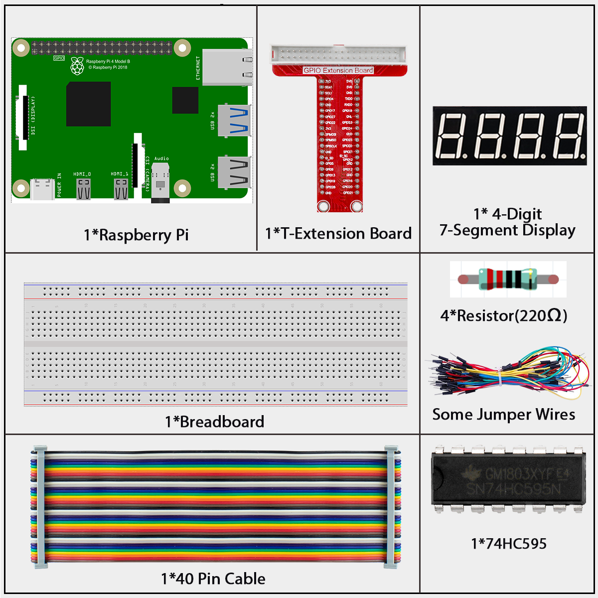
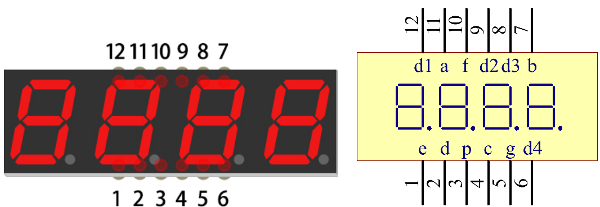
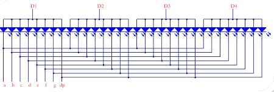
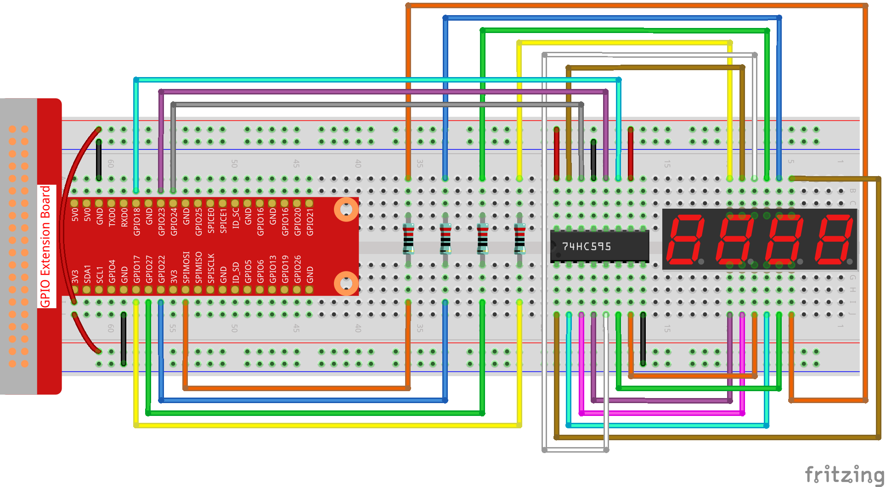

================================
1.1.5 4-Digit 7-Segment Display
================================

Introduction
------------

In this project, we'll learn how to control a 4-digit 7-segment display to show numbers and create a simple counter.

Components
----------

**4-Digit 7-Segment Display**

A 4-digit 7-segment display combines four individual 7-segment displays in one package, allowing us to show numbers up to 4 digits.

**How It Works: Multiplexing**

This display uses a technique called **multiplexing** to show all four digits with minimal connections:

1. Only one digit is actually illuminated at any given moment
2. The display rapidly cycles through each digit (typically switching every 5ms)
3. Due to persistence of vision (how our eyes retain an image briefly), we perceive all four digits as continuously lit

For example, to display "1234":
- First, we activate digit 1 and show "1"
- Then quickly switch to digit 2 and show "2"
- Then digit 3 showing "3"
- Then digit 4 showing "4"
- Repeat this cycle rapidly (200+ times per second)

This cycling happens so fast that our eyes see all four digits simultaneously.

**Display Codes**

Each digit uses the same segment patterns as the single 7-segment display:

.. list-table:: 7-Segment Display Codes
   :header-rows: 1
   :widths: 10 45 20 25
   
   * - Number
     - Binary Pattern (dp)gfedcba
     - Hex Code
     - Segments Lit
   * - 0
     - 00111111
     - 0x3F
     - a, b, c, d, e, f
   * - 1
     - 00000110
     - 0x06
     - b, c
   * - 2
     - 01011011
     - 0x5B
     - a, b, d, e, g
   * - 3
     - 01001111
     - 0x4F
     - a, b, c, d, g
   * - 4
     - 01100110
     - 0x66
     - b, c, f, g
   * - 5
     - 01101101
     - 0x6D
     - a, c, d, f, g
   * - 6
     - 01111101
     - 0x7D
     - a, c, d, e, f, g
   * - 7
     - 00000111
     - 0x07
     - a, b, c
   * - 8
     - 01111111
     - 0x7F
     - a, b, c, d, e, f, g
   * - 9
     - 01101111
     - 0x6F
     - a, b, c, d, f, g
   * - A
     - 01110111
     - 0x77
     - a, b, c, e, f, g
   * - B
     - 01111100
     - 0x7C
     - c, d, e, f, g
   * - C
     - 00111001
     - 0x39
     - a, d, e, f
   * - D
     - 01011110
     - 0x5E
     - b, c, d, e, g
   * - E
     - 01111001
     - 0x79
     - a, d, e, f, g
   * - F
     - 01110001
     - 0x71
     - a, e, f, g

Connect
-------

.. list-table::
   :header-rows: 1
   :widths: 25 25 25 25

   * - T-Board Name
     - physical
     - wiringPi
     - BCM
   * - GPIO17
     - Pin 11
     - 0
     - 17
   * - GPIO27
     - Pin 13
     - 2
     - 27
   * - GPIO22
     - Pin 15
     - 3
     - 22
   * - SPIMOSI
     - Pin 19
     - 12
     - 10
   * - GPIO18
     - Pin 12
     - 1
     - 18
   * - GPIO23
     - Pin 16
     - 4
     - 23
   * - GPIO24
     - Pin 18
     - 5
     - 24

**How the Circuit Works:**

1. The 74HC595 shift register controls which segments are lit
2. The Raspberry Pi directly controls which digit is active at any moment
3. By rapidly switching between digits and changing segment patterns, we can display different numbers on each digit

Code
----

For C Language User
~~~~~~~~~~~~~~~~~~~~~~~~

Go to the code folder compile and run.

.. code-block:: shell

   cd ~/davinci-kit-for-raspberry-pi/c/1.1.5/

.. code-block:: shell

   gcc 1.1.5_4-Digit.c -lwiringPi

.. code-block:: shell

   sudo ./a.out

This is the complete code

.. code-block:: c

   #include <wiringPi.h>
   #include <stdio.h>
   #include <wiringShift.h>
   #include <signal.h>
   #include <unistd.h>
   
   #define SDI 5
   #define RCLK 4
   #define SRCLK 1
   
   const int placePin[] = {12, 3, 2, 0};
   unsigned char number[] = {0x3f, 0x06, 0x5b, 0x4f, 0x66, 0x6d, 0x7d, 0x07, 0x7f, 0x6f};
   
   int counter = 0;
   
   void pickDigit(int digit)
   {
       for (int i = 0; i < 4; i++)
       {
           digitalWrite(placePin[i], 1);
       }
       digitalWrite(placePin[digit], 0);
   }
   
   void hc595_shift(int8_t data)
   {
       int i;
       for (i = 0; i < 8; i++)
       {
           digitalWrite(SDI, 0x80 & (data << i));
           digitalWrite(SRCLK, 1);
           delayMicroseconds(1);
           digitalWrite(SRCLK, 0);
       }
       digitalWrite(RCLK, 1);
       delayMicroseconds(1);
       digitalWrite(RCLK, 0);
   }
   
   void clearDisplay()
   {
       int i;
       for (i = 0; i < 8; i++)
       {
           digitalWrite(SDI, 0);
           digitalWrite(SRCLK, 1);
           delayMicroseconds(1);
           digitalWrite(SRCLK, 0);
       }
       digitalWrite(RCLK, 1);
       delayMicroseconds(1);
       digitalWrite(RCLK, 0);
   }
   
   void loop()
   {
       while(1){
       clearDisplay();
       pickDigit(0);
       hc595_shift(number[counter % 10]);
   
       clearDisplay();
       pickDigit(1);
       hc595_shift(number[counter % 100 / 10]);
   
       clearDisplay();
       pickDigit(2);
       hc595_shift(number[counter % 1000 / 100]);
    
       clearDisplay();
       pickDigit(3);
       hc595_shift(number[counter % 10000 / 1000]);
       }
   }
   
   void timer(int timer1)
   { 
       if (timer1 == SIGALRM)
       { 
           counter++;
           alarm(1); 
           printf("%d\n", counter);
       }
   }
   
   void main(void)
   {
       if (wiringPiSetup() == -1)
       { 
           printf("setup wiringPi failed !");
           return;
       }
       pinMode(SDI, OUTPUT); 
       pinMode(RCLK, OUTPUT);
       pinMode(SRCLK, OUTPUT);
       
       for (int i = 0; i < 4; i++)
       {
           pinMode(placePin[i], OUTPUT);
           digitalWrite(placePin[i], HIGH);
       }
       signal(SIGALRM, timer); 
       alarm(1);               
       loop(); 
   }

For Python Language User
~~~~~~~~~~~~~~~~~~~~~~~~~~~

Go to the code folder and run.

.. code-block:: shell

   cd ~/super-starter-kit-for-raspberry-pi/python

.. code-block:: shell

   python 1.1.5_4-Digit.py

This is the complete code

.. code-block:: python

   #!/usr/bin/env python3

    import RPi.GPIO as GPIO
    import time
    import threading

    # Pin definitions for the 74HC595 shift register
    SDI_PIN = 24     # Serial Data Input (DS)
    RCLK_PIN = 23    # Storage Register Clock (STCP)
    SRCLK_PIN = 18   # Shift Register Clock (SHCP)

    # Pins for selecting one of the four digits on the 4-digit display
    DIGIT_PINS = [10, 22, 27, 17]
    NUM_OF_DIGITS = len(DIGIT_PINS)

    # Common-anode 7-segment display codes for digits 0-9
    SEGMENT_CODES = [0x3f, 0x06, 0x5b, 0x4f, 0x66, 0x6d, 0x7d, 0x07, 0x7f, 0x6f]

    # Volatile counter updated by the timer interrupt
    counter = 0
    timer1 = None

    def writeToShiftRegister(data):
        """
        Sends a byte to the 74HC595 shift register.
        Parameters: data - The 8-bit data to send.
        """
        for i in range(8):
            GPIO.output(SDI_PIN, 0x80 & (data << i))
            GPIO.output(SRCLK_PIN, GPIO.HIGH)
            time.sleep(0.0001)
            GPIO.output(SRCLK_PIN, GPIO.LOW)
        
        GPIO.output(RCLK_PIN, GPIO.HIGH)
        time.sleep(0.0001)
        GPIO.output(RCLK_PIN, GPIO.LOW)

    def selectDigit(digitIndex):
        """
        Selects which of the 4 digits to activate.
        Parameters: digitIndex - The index of the digit to activate (0-3).
        """
        # Deactivate all digits first
        for i in range(NUM_OF_DIGITS):
            GPIO.output(DIGIT_PINS[i], GPIO.HIGH)
        
        # Activate the selected digit by setting its pin to LOW
        if 0 <= digitIndex < NUM_OF_DIGITS:
            GPIO.output(DIGIT_PINS[digitIndex], GPIO.LOW)

    def displayNumber():
        """
        Displays a single number on a single digit.
        This function is called rapidly for each digit to create the illusion of a solid number.
        """
        digits = [0] * NUM_OF_DIGITS
        tempCounter = counter
        
        # Extract each digit from the counter
        digits[0] = tempCounter % 10
        digits[1] = (tempCounter // 10) % 10
        digits[2] = (tempCounter // 100) % 10
        digits[3] = (tempCounter // 1000) % 10
        
        # Rapidly cycle through each digit, displaying its corresponding number
        for i in range(NUM_OF_DIGITS):
            for j in range(NUM_OF_DIGITS):
                GPIO.output(DIGIT_PINS[j], GPIO.HIGH)
            
            writeToShiftRegister(SEGMENT_CODES[digits[i]])
            GPIO.output(DIGIT_PINS[i], GPIO.LOW)
            
            time.sleep(0.0025)

    def timerHandler():
        """
        Timer handler function. Increments the counter every second.
        """
        global counter, timer1
        
        counter += 1
        print(f"Counter: {counter}")
        
        # Reschedule the timer for 1 second later
        timer1 = threading.Timer(1.0, timerHandler)
        timer1.start()

    def setup():
        """
        Initializes hardware, sets up GPIOs and the timer interrupt.
        Returns: 0 on success, 1 on failure.
        """
        global timer1
        
        try:
            GPIO.setmode(GPIO.BCM)
            GPIO.setwarnings(False)
            
            # Setup shift register pins
            GPIO.setup(SDI_PIN, GPIO.OUT, initial=GPIO.LOW)
            GPIO.setup(RCLK_PIN, GPIO.OUT, initial=GPIO.LOW)
            GPIO.setup(SRCLK_PIN, GPIO.OUT, initial=GPIO.LOW)
            
            # Setup digit selection pins
            for i in range(NUM_OF_DIGITS):
                GPIO.setup(DIGIT_PINS[i], GPIO.OUT, initial=GPIO.HIGH)  # Deactivate all digits initially
            
            # Setup the timer interrupt
            timer1 = threading.Timer(1.0, timerHandler)
            timer1.start()
            
            print("GPIO and timer setup successful!")
            return 0
            
        except Exception as e:
            print(f"Failed to setup hardware: {e}")
            return 1

    def destroy():
        """
        Clean up function for GPIO resources and timer.
        """
        global timer1
        
        if timer1:
            timer1.cancel()  # Cancel the timer
        
        GPIO.cleanup()
        print("GPIO cleanup and timer cancelled")

    def main():
        """
        Main function.
        Returns: Integer status code. 0 for success, 1 for error.
        """
        # Initialize the hardware
        if setup() != 0:
            return 1  # Exit if setup fails
        
        try:
            # Main loop for display multiplexing
            while True:
                displayNumber()
        except KeyboardInterrupt:
            print("\nProgram interrupted by user")
            destroy()
            return 0
        except Exception as e:
            print(f"An error occurred: {e}")
            destroy()
            return 1

    # If run this script directly, do:
    if __name__ == '__main__':
        main()

Phenomenon
----------

.. image:: ./img/phenomenon/115.gif