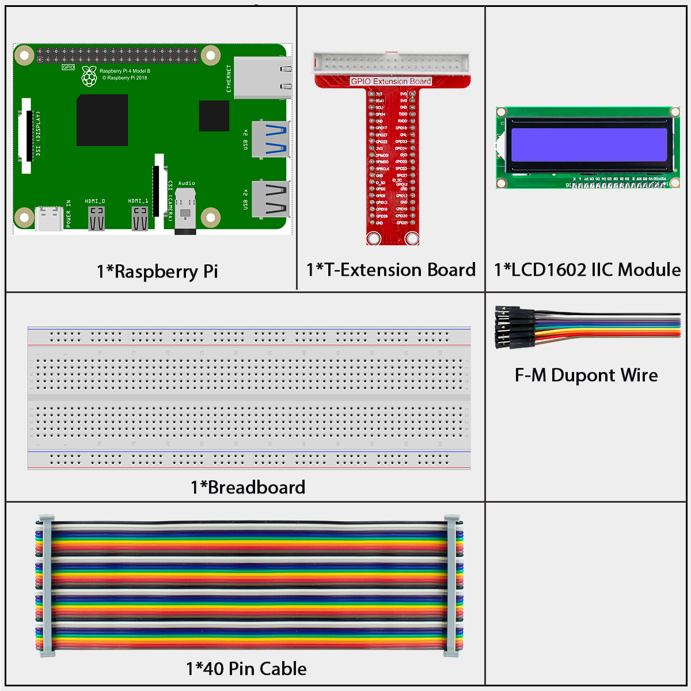
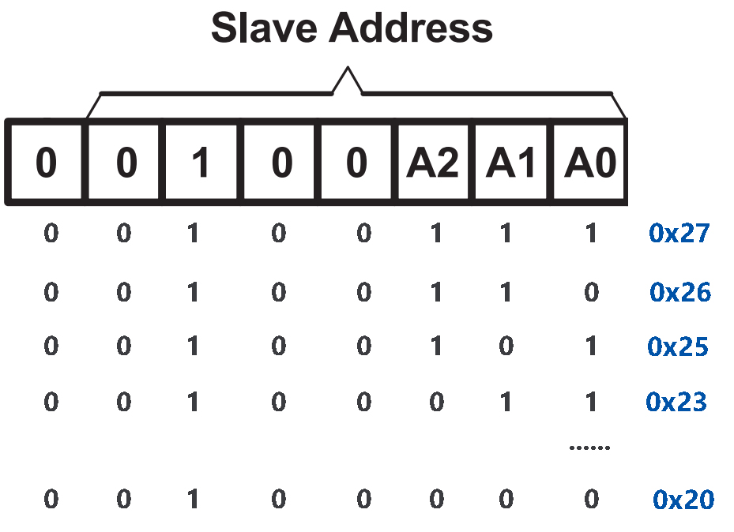
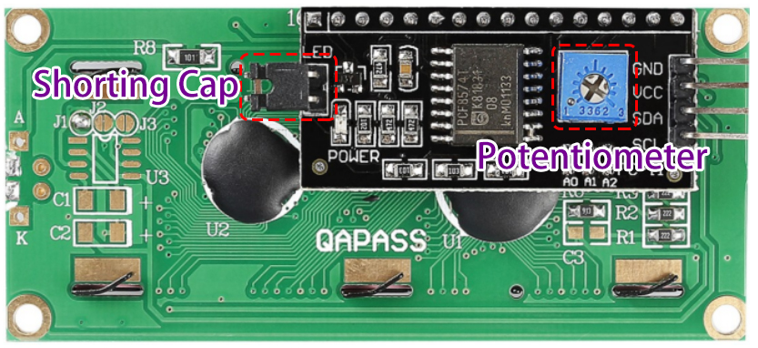
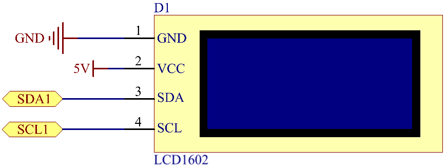
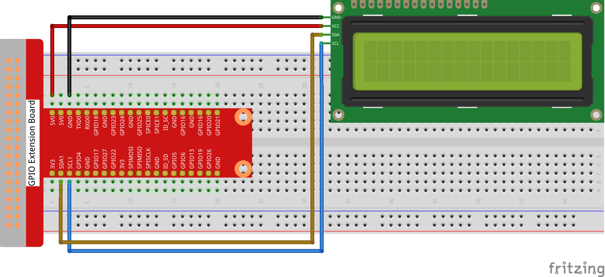

# 1.1.6 I2C LCD1602

## Introduction

LCD1602 is a character type liquid crystal display, which can display 32 (16*2) characters at the same time.

## Components



I2C LCD1602 I2C

- **GND**: Ground
- **VCC**: Voltage supply, 5V.
- **SDA**: Serial data line. Connect to VCC through a pullup resistor.
- **SCL**: Serial clock line. Connect to VCC through a pullup resistor.

As we all know, though LCD and some other displays greatly enrich the man-machine interaction, they share a common weakness. When they are connected to a controller, multiple IOs will be occupied of the controller which has no so many outer ports. Also it restricts other functions of the controller.

Therefore, LCD1602 with an I2C module is developed to solve the problem. The I2C module has a built-in PCF8574 I2C chip that converts I2C serial data to parallel data for the LCD display.

**I2C Address**

The default address is basically 0x27, in a few cases it may be 0x3F.

Taking the default address of 0x27 as an example, the device address can be modified by shorting the A0/A1/A2 pads; in the default state, A0/A1/A2 is 1, and if the pad is shorted, A0/A1/A2 is 0.\



**Backlight/Contrast**

Backlight can be enabled by jumper cap, unplugg the jumper cap to disable the backlight. The blue potentiometer on the back is used to adjust the contrast (the ratio of brightness between the brightest white and the darkest black).



- **Shorting Cap**: Backlight can be enabled by this cap，unplugg this cap to disable the backlight.

- **Potentiometer**: It is used to adjust the contrast (the clarity of the displayed text), which is increased in the clockwise direction and decreased in the counterclockwise direction.

  

## Connect



## Code

### For  C  Language User

Go to the code folder compile and run.

```sh
cd ~/super-starter-kit-for-raspberry-pi/c/1.1.7/
gcc 1.1.7_Lcd1602.c -lwiringPi
sudo ./a.out
```

After the code runs, you can see "Hello World!","From LAFVIN" displaying on the LCD.

This is the complete code

```c
#include <stdio.h>
#include <wiringPi.h>
#include <wiringPiI2C.h>
#include <string.h>

int LCDAddr = 0x27;
int BLEN = 1;
int fd;

void write_word(int data){
    int temp = data;
    if ( BLEN == 1 )
        temp |= 0x08;
    else
        temp &= 0xF7;
    wiringPiI2CWrite(fd, temp);
}

void send_command(int comm){
    int buf;
    // Send bit7-4 firstly
    buf = comm & 0xF0;
    buf |= 0x04;                    // RS = 0, RW = 0, EN = 1
    write_word(buf);
    delay(2);
    buf &= 0xFB;                    // Make EN = 0
    write_word(buf);

    // Send bit3-0 secondly
    buf = (comm & 0x0F) << 4;
    buf |= 0x04;                    // RS = 0, RW = 0, EN = 1
    write_word(buf);
    delay(2);
    buf &= 0xFB;                    // Make EN = 0
    write_word(buf);
}

void send_data(int data){
    int buf;
    // Send bit7-4 firstly
    buf = data & 0xF0;
    buf |= 0x05;                    // RS = 1, RW = 0, EN = 1
    write_word(buf);
    delay(2);
    buf &= 0xFB;                    // Make EN = 0
    write_word(buf);

    // Send bit3-0 secondly
    buf = (data & 0x0F) << 4;
    buf |= 0x05;                    // RS = 1, RW = 0, EN = 1
    write_word(buf);
    delay(2);
    buf &= 0xFB;                    // Make EN = 0
    write_word(buf);
}

void init(){
    send_command(0x33);     // Must initialize to 8-line mode at first
    delay(5);
    send_command(0x32);     // Then initialize to 4-line mode
    delay(5);
    send_command(0x28);     // 2 Lines & 5*7 dots
    delay(5);
    send_command(0x0C);     // Enable display without cursor
    delay(5);
    send_command(0x01);     // Clear Screen
    wiringPiI2CWrite(fd, 0x08);
}

void clear(){
    send_command(0x01);     //clear Screen
}

void write(int x, int y, char data[]){
    int addr, i;
    int tmp;
    if (x < 0)  x = 0;
    if (x > 15) x = 15;
    if (y < 0)  y = 0;
    if (y > 1)  y = 1;

    // Move cursor
    addr = 0x80 + 0x40 * y + x;
    send_command(addr);

    tmp = strlen(data);
    for (i = 0; i < tmp; i++){
        send_data(data[i]);
    }
}


void main(){
    fd = wiringPiI2CSetup(LCDAddr);
    init();
    write(0, 0, "Hello World!");
    write(1, 1, "From SunFounder");
}
```

### For  Python  Language User

Go to the code folder and run.

```sh
cd ~/super-starter-kit-for-raspberry-pi/python
python 1.1.7_Lcd1602.py
```

This is the complete code

```python
import LCD1602
import time

def setup():
	LCD1602.init(0x27, 1)	# init(slave address, background light)
	LCD1602.write(0, 0, 'Hello World!')
	LCD1602.write(1, 1, 'From LAFVIN')
	time.sleep(2)

def destroy():
	LCD1602.clear()

if __name__ == "__main__":
	try:
		setup()
	except KeyboardInterrupt:
		destroy()

```

After the code runs, you can see "Hello World!!","From LAFVIN" displaying on the LCD.

## Phenomenon

