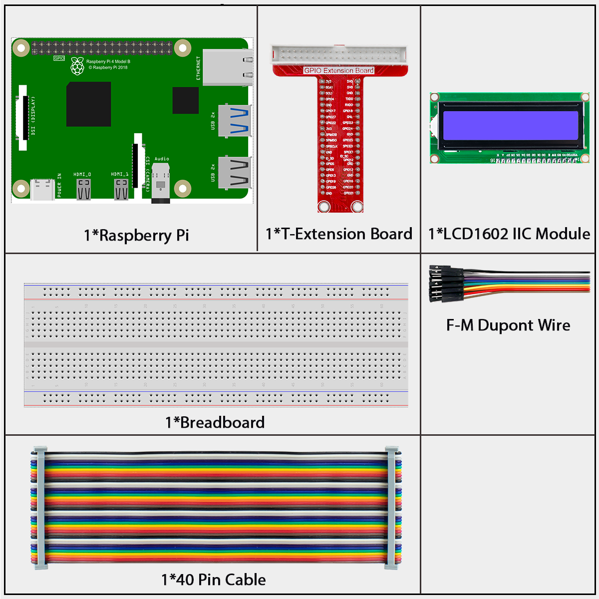
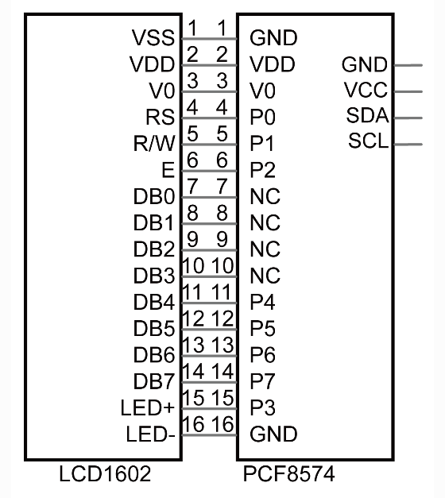
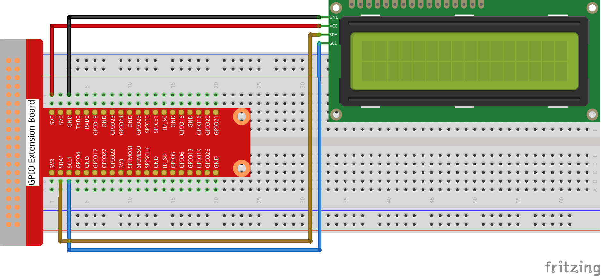
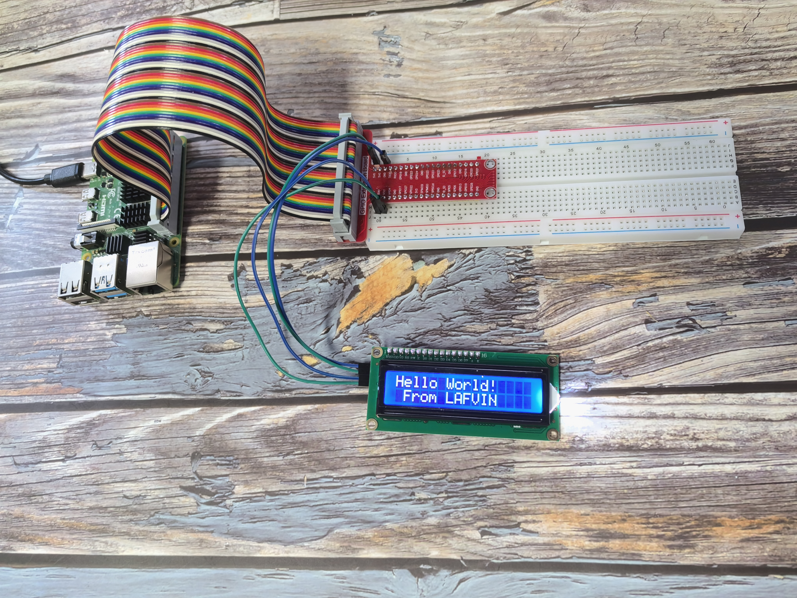

===================
1.1.6 I2C LCD1602
===================

Introduction
------------

The LCD1602 is a versatile character display that shows 32 characters arranged in 2 rows of 16 characters each. In this project, we'll use an I2C-enabled LCD1602, which simplifies connections and saves GPIO pins on your Raspberry Pi.

Components
----------

**I2C LCD1602 Module**

The I2C LCD1602 combines a standard 16×2 character LCD with an I2C interface adapter, requiring only 4 pins for connection:

- **GND**: Ground connection
- **VCC**: Power supply (5V)
- **SDA**: Serial Data line for I2C communication
- **SCL**: Serial Clock line for I2C communication

**Why Use I2C?**

A standard LCD1602 requires at least 6 GPIO pins to operate. The I2C adapter module solves this problem by:

1. Reducing connection pins from 6+ to just 4
2. Freeing up GPIO pins for other components
3. Simplifying the wiring process

The adapter uses a PCF8574 I2C chip that converts serial data from the Raspberry Pi into the parallel data format needed by the LCD.

**I2C Address Settings**

The default I2C address for the module is **0x27**, though some modules may use **0x3F**.

You can customize the address by modifying the A0/A1/A2 jumper pads on the back of the module:
- Default state: A0=1, A1=1, A2=1 (address 0x27)
- Shorting a pad changes its value to 0, modifying the address

**Display Adjustments**

.. image:: ./img/back_lcd1602.jpg

- **Contrast Adjustment**: The blue potentiometer controls text visibility
  - Clockwise rotation: Increases contrast (darker text)
  - Counter-clockwise: Decreases contrast (lighter text)

Connect
-------

The I2C connection requires only 4 wires:

.. list-table::
   :header-rows: 1
   :widths: 30 30 40

   * - LCD1602 Pin
     - Raspberry Pi Pin
     - Function
   * - GND
     - Any GND
     - Ground connection
   * - VCC
     - 5V
     - Power supply
   * - SDA
     - Pin 3 (GPIO2, SDA)
     - I2C Serial Data
   * - SCL
     - Pin 5 (GPIO3, SCL)
     - I2C Serial Clock

.. note::
   Before using I2C devices, make sure I2C is enabled on your Raspberry Pi. You can check the appendix section for I2C configuration instructions.

Code
----

For C Language User
~~~~~~~~~~~~~~~~~~~

**Running the Example Code**

Follow these steps to compile and run the LCD1602 example:

1. **Navigate to the code directory**:

   .. code-block:: shell

      cd ~/super-starter-kit-for-raspberry-pi/c/1.1.6/

2. **Compile the code** (linking the wiringPi library):

   .. code-block:: shell

      gcc 1.1.6_Lcd1602.c -lwiringPi

3. **Run the program** (requires sudo for hardware access):

   .. code-block:: shell

      sudo ./a.out

When the program runs successfully, you'll see "Hello World!" on the first line and "From LAFVIN" on the second line of the LCD display.

**Understanding the I2C LCD Code**

The C code below provides a well-structured interface for controlling the LCD1602 through I2C communication. This implementation uses modern programming practices with clear function names, documentation, and error handling.

**Key Components:**

- **Constants**: Defines important values like I2C address and LCD commands
- **Function Prototypes**: Declares all functions at the beginning for better organization
- **Documentation**: Uses Doxygen-style comments to explain function parameters and behavior

**Key Functions:**

- **lcd_init()**: Sets up the I2C connection and initializes the LCD in 4-bit mode
- **lcd_write_byte()**: Sends a byte to the LCD with the appropriate mode (command or data)
- **lcd_toggle_enable()**: Pulses the Enable pin to latch data into the LCD
- **lcd_print_at()**: Positions the cursor and displays text at that location

**LCD Commands Used:**
- 0x01: Clear display
- 0x0C: Display on, cursor off, no blink
- 0x28: 2 lines, 5x7 dot matrix
- 0x06: Entry mode - cursor moves right

**Complete Code:**

.. code-block:: c

    #include <stdio.h>
    #include <stdlib.h> // Required for exit()
    #include <string.h>
    #include <wiringPi.h>
    #include <wiringPiI2C.h>

    // --- Constants ---

    // I2C Address of the PCF8574A chip on the LCD's I2C backpack.
    #define I2C_ADDR   0x27

    // LCD Command and Character constants.
    #define LCD_CHR  1 // Mode: Sending data (characters)
    #define LCD_CMD  0 // Mode: Sending command

    // LCD Line addresses.
    #define LINE1  0x80 // Address for the 1st line.
    #define LINE2  0xC0 // Address for the 2nd line.

    // Bitmask for the backlight. On: 0x08, Off: 0x00.
    #define LCD_BACKLIGHT 0x08

    // Enable bit.
    #define ENABLE 0x04

    // --- Function Prototypes ---
    void lcd_init(int* fd_ptr);
    void lcd_write_byte(int fd, int bits, int mode);
    void lcd_toggle_enable(int fd, int bits);
    void lcd_clear(int fd);
    void lcd_set_cursor(int fd, int col, int row);
    void lcd_print(int fd, const char* message);
    void lcd_print_at(int fd, int col, int row, const char* message);

    /**
    * @brief Toggles the Enable (EN) pin to latch data into the LCD.
    * @param fd File descriptor for the I2C device.
    * @param bits The data packet to send.
    */
    void lcd_toggle_enable(int fd, int bits) {
        delayMicroseconds(500);
        wiringPiI2CWrite(fd, (bits | ENABLE));
        delayMicroseconds(500);
        wiringPiI2CWrite(fd, (bits & ~ENABLE));
        delayMicroseconds(500);
    }

    /**
    * @brief Writes a single byte to the LCD in 4-bit mode.
    * @param fd File descriptor for the I2C device.
    * @param bits The byte to write.
    * @param mode LCD_CMD for commands, LCD_CHR for data.
    */
    void lcd_write_byte(int fd, int bits, int mode) {
        // Send the high nibble (4 bits).
        int bits_high = mode | (bits & 0xF0) | LCD_BACKLIGHT;
        wiringPiI2CWrite(fd, bits_high);
        lcd_toggle_enable(fd, bits_high);

        // Send the low nibble (4 bits).
        int bits_low = mode | ((bits << 4) & 0xF0) | LCD_BACKLIGHT;
        wiringPiI2CWrite(fd, bits_low);
        lcd_toggle_enable(fd, bits_low);
    }

    /**
    * @brief Initializes the LCD display in 4-bit mode.
    * @param fd_ptr Pointer to an integer where the file descriptor will be stored.
    */
    void lcd_init(int* fd_ptr) {
        *fd_ptr = wiringPiI2CSetup(I2C_ADDR);
        if (*fd_ptr == -1) {
            printf("Failed to initialize I2C device with address %d.\n", I2C_ADDR);
            exit(1);
        }
        
        // Initialization sequence for 4-bit mode.
        lcd_write_byte(*fd_ptr, 0x33, LCD_CMD); // Must be sent to ensure 8-bit mode for init
        lcd_write_byte(*fd_ptr, 0x32, LCD_CMD); // Now set to 4-bit mode
        lcd_write_byte(*fd_ptr, 0x06, LCD_CMD); // Entry mode: cursor moves to the right
        lcd_write_byte(*fd_ptr, 0x0C, LCD_CMD); // Display control: display on, cursor off, no blink
        lcd_write_byte(*fd_ptr, 0x28, LCD_CMD); // Function set: 2 lines, 5x8 dots
        lcd_write_byte(*fd_ptr, 0x01, LCD_CMD); // Clear display
        delay(1);
    }

    /**
    * @brief Clears the LCD screen and returns the cursor to home.
    * @param fd File descriptor for the I2C device.
    */
    void lcd_clear(int fd) {
        lcd_write_byte(fd, 0x01, LCD_CMD); // Clear display command
        delay(1);
    }

    /**
    * @brief Positions the cursor at a specified column and row.
    * @param fd File descriptor for the I2C device.
    * @param col The column (0-15).
    * @param row The row (0-1).
    */
    void lcd_set_cursor(int fd, int col, int row) {
        if (row == 0) {
            lcd_write_byte(fd, LINE1 + col, LCD_CMD);
        } else {
            lcd_write_byte(fd, LINE2 + col, LCD_CMD);
        }
    }

    /**
    * @brief Prints a string to the LCD at the current cursor position.
    * @param fd File descriptor for the I2C device.
    * @param message The string to print.
    */
    void lcd_print(int fd, const char* message) {
        while (*message) {
            lcd_write_byte(fd, *message++, LCD_CHR);
        }
    }

    /**
    * @brief A utility function to set the cursor and print a string.
    * @param fd File descriptor for the I2C device.
    * @param col The column (0-15).
    * @param row The row (0-1).
    * @param message The string to print.
    */
    void lcd_print_at(int fd, int col, int row, const char* message) {
        lcd_set_cursor(fd, col, row);
        lcd_print(fd, message);
    }

    /**
    * @brief Main function.
    * @return 0 on success, 1 on failure.
    */
    int main(void) {
        int lcd_fd;

        // wiringPiSetup is essential for delay functions and I2C.
        if (wiringPiSetup() == -1) {
            printf("wiringPiSetup failed!\n");
            return 1;
        }

        lcd_init(&lcd_fd);

        lcd_print_at(lcd_fd, 0, 0, "Hello World!");
        lcd_print_at(lcd_fd, 1, 1, "From LAFVIN");

        return 0;
    }

For Python Language User
~~~~~~~~~~~~~~~~~~~~~~~~

**Running the Python Example**

Follow these steps to run the Python version of the LCD1602 example:

1. **Navigate to the Python code directory**:

   .. code-block:: shell

      cd ~/super-starter-kit-for-raspberry-pi/python

2. **Run the Python script** (requires sudo for hardware access):

   .. code-block:: shell

      sudo python 1.1.6_Lcd1602.py

**Understanding the Python Code**

.. code-block:: python

   #!/usr/bin/env python3

    import LCD1602
    import time

    def setup():
        """
        Initialize the LCD1602 display with I2C address and backlight settings.
        Returns: 0 on success, 1 on failure.
        """
        try:
            LCD1602.init(0x27, 1)  # init(slave address, background light)
            print("LCD1602 initialized successfully!")
            return 0
        except Exception as e:
            print(f"Failed to initialize LCD1602: {e}")
            return 1

    def display_static_message():
        """Display static welcome messages on the LCD."""
        LCD1602.write(0, 0, 'Hello World!')
        LCD1602.write(1, 1, 'From LAFVIN')
        time.sleep(2)

    def destroy():
        """Clean up the LCD display."""
        try:
            LCD1602.clear()
            print("LCD cleared and cleaned up")
        except Exception as e:
            print(f"Error during cleanup: {e}")

    def main():
        """
        Main function - simple LCD display.
        Returns: Integer status code. 0 for success, 1 for error.
        """
        # Initialize the LCD
        if setup() != 0:
            return 1
        
        try:
            # Display welcome message
            display_static_message()
            print("Message displayed on LCD successfully!")
            return 0
            
        except KeyboardInterrupt:
            print("\nProgram interrupted by user")
            destroy()
            return 0
        except Exception as e:
            print(f"An error occurred: {e}")
            destroy()
            return 1

    if __name__ == "__main__":
        main()

**Code Structure Explained**

The Python code above demonstrates a well-structured approach to working with the LCD1602:

1. **Modular Design**: The code is organized into separate functions for initialization, display, and cleanup
2. **Error Handling**: Comprehensive try/except blocks catch and report potential issues
3. **Documentation**: Each function includes docstrings explaining its purpose and return values
4. **Clean Exit**: The destroy() function ensures proper cleanup when the program terminates

**Key Functions:**

- **setup()**: Initializes the LCD with address 0x27 and enables the backlight
- **display_static_message()**: Shows "Hello World!" and "From LAFVIN" on the display
- **destroy()**: Properly clears the display during shutdown
- **main()**: Orchestrates the program flow and handles errors

When running successfully, you'll see the text displayed on your LCD screen, and the program will provide informative status messages in the terminal.

Phenomenon
----------

Below is what you should see on your LCD1602 display:

