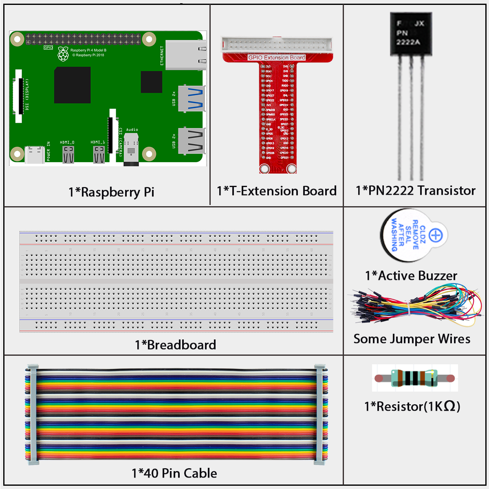
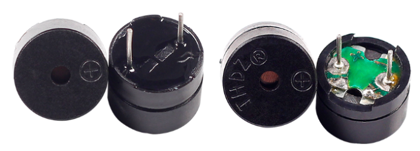
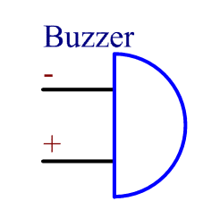
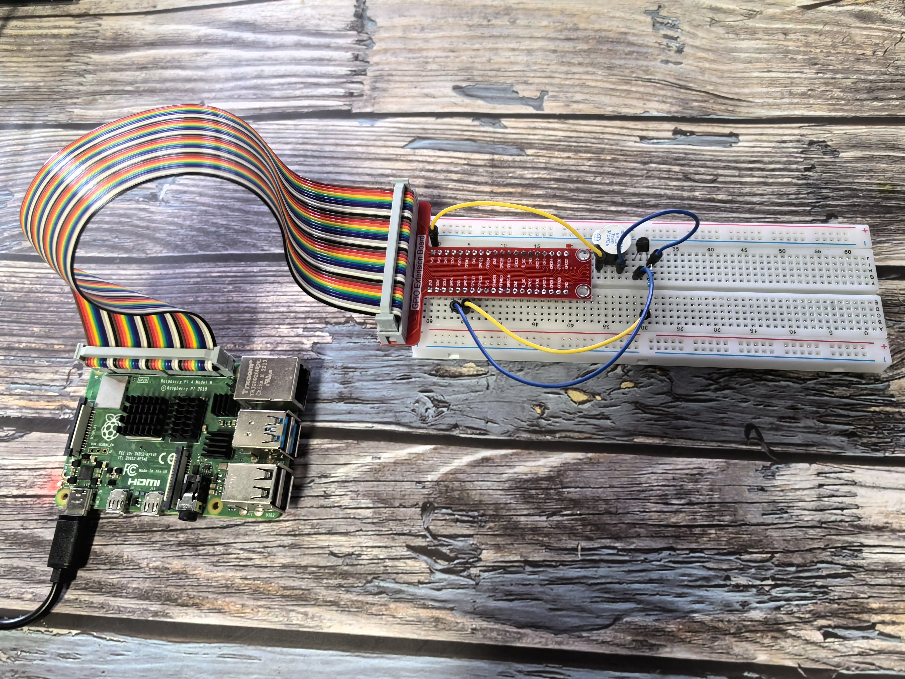

======================
1.2.1 Active Buzzer
======================

Introduction
------------

In this project, we'll make a simple alarm by controlling an active buzzer with our Raspberry Pi.

**Components**
--------------

**What is a Buzzer?**

A buzzer is an electronic device that makes a beeping sound when electricity flows through it. They're used in many everyday devices like alarm clocks, microwaves, and toys to create sounds or alerts.

**Active vs. Passive Buzzers - What's the Difference?**

There are two main types of buzzers:

1. **Active Buzzer** (We're using this one!)
   - Has a built-in circuit that creates sound automatically
   - Just needs simple on/off power to work
   - Produces a single, fixed tone
   - Easy to identify: Usually has black tape covering it

2. **Passive Buzzer**
   - Has no built-in sound generator
   - Requires changing signals (like music notes) to make different sounds
   - Can produce different tones and simple melodies
   - Easy to identify: Usually has a green circuit board visible

**Connecting the Buzzer**

The buzzer has two pins:
- The longer pin is positive (+) called the anode
- The shorter pin is negative (-) called the cathode

.. warning::
   Make sure to connect the pins correctly! If you mix them up, the buzzer won't make any sound.

**How Our Circuit Works**

In this project, we use:
1. An active buzzer to make sound
2. A transistor that acts like an electronic switch
3. A resistor to protect our components

When we send a LOW signal (0V) from the Raspberry Pi's GPIO17 pin, the transistor turns ON, completing the circuit and making the buzzer beep. When we send a HIGH signal, the transistor turns OFF, and the buzzer stops.

Connect
-------
.. list-table::
   :header-rows: 1
   :widths: 25 25 25 25

   * - T-Board Name
     - physical
     - wiringPi
     - BCM
   * - GPIO17
     - Pin 11
     - 0
     - 17

Follow these steps to connect your buzzer to the Raspberry Pi:

1. Connect the buzzer's positive pin (longer pin with + mark) to the collector of the transistor
2. Connect the buzzer's negative pin (shorter pin) to the 3.3V pin on the Raspberry Pi
3. Connect the transistor's emitter to GND (ground)
4. Connect a 1kΩ resistor between GPIO17 (physical pin 11) and the transistor's base

.. warning::
   Double-check your buzzer connections! The positive pin (anode) usually has a "+" mark or is longer.

.. image:: ./img/connect/1.2.1.png

Code
----

For C Language User
~~~~~~~~~~~~~~~~~~~~

Go to the code folder compile and run.

.. code-block:: shell

   cd ~/super-starter-kit-for-raspberry-pi/c/1.2.1/

.. code-block:: shell

   gcc 1.2.1_ActiveBuzzer.c -lwiringPi

.. code-block:: shell

   sudo ./a.out

When the program runs successfully, your buzzer will start beeping in a pattern of short beeps with pauses in between.

This is the complete code

.. code-block:: c

   #include <wiringPi.h>
   #include <stdio.h>
   #include <stdlib.h> // Required for exit()

   // Define the GPIO pin connected to the active buzzer.
   #define BUZZER_PIN 0

   // Define the duration for each beep state (on/off) in milliseconds.
   #define BEEP_INTERVAL_MS 100

   /**
   * @brief Initializes wiringPi and configures the buzzer pin as an output.
   */
   void setup_buzzer() {
      if (wiringPiSetup() == -1) {
         printf("Failed to setup wiringPi!\n");
         exit(1);
      }
      pinMode(BUZZER_PIN, OUTPUT);
   }

   /**
   * @brief Main application loop to make the buzzer beep intermittently.
   */
   void beep_loop() {
      while (1) {
         // Turn the buzzer ON. A LOW signal is used, which is common
         // for modules connected between VCC and a GPIO pin.
         printf("Buzzer ON\n");
         digitalWrite(BUZZER_PIN, LOW);
         delay(BEEP_INTERVAL_MS);

         // Turn the buzzer OFF.
         printf("Buzzer OFF\n");
         digitalWrite(BUZZER_PIN, HIGH);
         delay(BEEP_INTERVAL_MS);
      }
   }

   /**
   * @brief Main function.
   * @return Integer status code.
   */
   int main(void) {
      setup_buzzer();
      beep_loop();
      return 0; // This code is unreachable.
   }

For Python Language User
~~~~~~~~~~~~~~~~~~~~~~~~~~~~

Go to the code folder and run.

.. code-block:: shell

   cd ~/super-starter-kit-for-raspberry-pi/python

.. code-block:: shell

   python 1.2.1_ActiveBuzzer.py

When the program runs successfully, your buzzer will start beeping in a pattern of short beeps with pauses in between.

This is the complete code

.. code-block:: python

   #!/usr/bin/env python3

   import RPi.GPIO as GPIO
   import time
   import sys

   # Define the GPIO pin connected to the active buzzer
   BUZZER_PIN = 17

   # Define the duration for each beep state (on/off) in seconds
   BEEP_INTERVAL_MS = 0.1

   def setup_buzzer():
      """
      Initializes GPIO and configures the buzzer pin as an output.
      Returns: 0 on success, 1 on failure.
      """
      try:
         # Set the GPIO modes to BCM Numbering
         GPIO.setmode(GPIO.BCM)
         GPIO.setwarnings(False)
         
         # Set buzzer pin's mode to output with initial level High (3.3V)
         # HIGH = buzzer off, LOW = buzzer on for active buzzer modules
         GPIO.setup(BUZZER_PIN, GPIO.OUT, initial=GPIO.HIGH)
         
         print("Buzzer GPIO setup successful!")
         return 0
         
      except Exception as e:
         print(f"Failed to setup GPIO: {e}")
         return 1

   def beep_loop():
      """
      Main application loop to make the buzzer beep intermittently.
      This function runs indefinitely until interrupted.
      """
      try:
         while True:
               # Turn the buzzer ON. A LOW signal is used, which is common
               # for modules connected between VCC and a GPIO pin.
               print("Buzzer ON")
               GPIO.output(BUZZER_PIN, GPIO.LOW)
               time.sleep(BEEP_INTERVAL_MS)

               # Turn the buzzer OFF.
               print("Buzzer OFF")
               GPIO.output(BUZZER_PIN, GPIO.HIGH)
               time.sleep(BEEP_INTERVAL_MS)
               
      except KeyboardInterrupt:
         print("\nBuzzer loop interrupted by user")
         raise  # Re-raise to be handled by main()

   def destroy():
      """
      Clean up function for GPIO resources.
      Ensures buzzer is turned off and GPIO is properly cleaned up.
      """
      try:
         # Turn off buzzer
         GPIO.output(BUZZER_PIN, GPIO.HIGH)
         # Release GPIO resources
         GPIO.cleanup()
         print("GPIO cleanup completed")
         
      except Exception as e:
         print(f"Error during cleanup: {e}")

   def main():
      """
      Main function.
      Returns: Integer status code. 0 for success, 1 for error.
      """
      # Initialize the buzzer GPIO
      if setup_buzzer() != 0:
         return 1  # Exit if setup fails
      
      try:
         # Start the main beeping loop
         beep_loop()
         
      except KeyboardInterrupt:
         print("\nProgram interrupted by user")
         destroy()
         return 0
         
      except Exception as e:
         print(f"An error occurred: {e}")
         destroy()
         return 1

   # If run this script directly, do:
   if __name__ == '__main__':
      exit_code = main()
      sys.exit(exit_code)

Phenomenon 
----------

