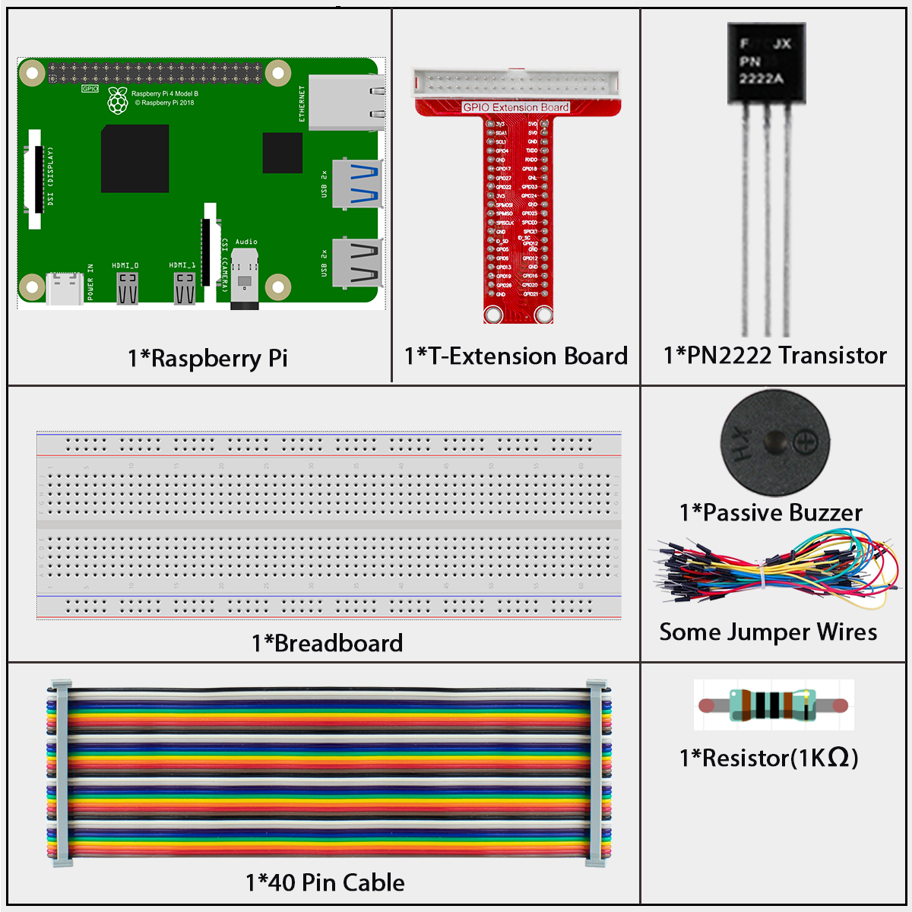
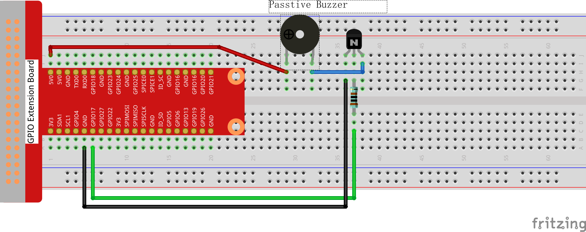
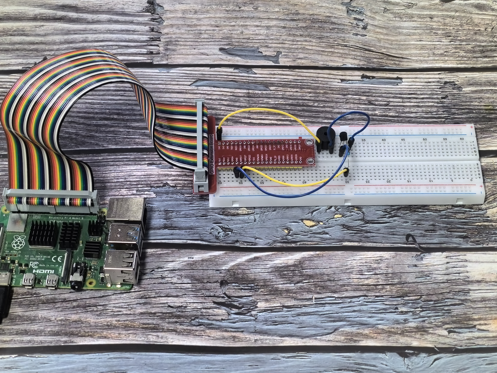

======================
1.2.2 Passive Buzzer
======================

Introduction
------------

In this project, we'll learn how to make a passive buzzer play different tones and simple melodies.

Components
----------

**What is a Passive Buzzer?**

Unlike the active buzzer we used in the previous project, a passive buzzer:
- Has no built-in sound generator
- Can produce different musical tones (not just a single beep)
- Requires changing signals to create sound
- Is perfect for playing simple songs and melodies

**How It Works**

Our circuit uses:
1. A passive buzzer that can create different tones
2. An NPN transistor that acts as an electronic switch
3. A 1kΩ resistor to protect our components

The magic happens when we send different frequency signals to the buzzer through GPIO17. By changing how quickly we turn the signal on and off, we can create different musical notes. This is called Pulse Width Modulation (PWM).

Connect
-------
.. list-table::
   :header-rows: 1
   :widths: 25 25 25 25

   * - T-Board Name
     - physical
     - wiringPi
     - BCM
   * - GPIO17
     - Pin 11
     - 0
     - 17

Follow these steps to connect your passive buzzer to the Raspberry Pi:

1. Connect the buzzer's positive pin (longer pin with + mark) to the collector of the NPN transistor
2. Connect the buzzer's negative pin (shorter pin) to the 3.3V pin on the Raspberry Pi
3. Connect the transistor's emitter to GND (ground)
4. Connect a 1kΩ resistor between GPIO17 (physical pin 11) and the transistor's base

.. warning::
   Double-check your buzzer connections! The positive pin usually has a "+" mark or is longer.

Code
----

For C Language User
~~~~~~~~~~~~~~~~~~~~

Go to the code folder compile and run.

.. code-block:: shell

   cd ~/super-starter-kit-for-raspberry-pi/c/1.2.2/

.. code-block:: shell

   gcc 1.2.2_PassiveBuzzer.c -lwiringPi

.. code-block:: shell

   sudo ./a.out

The code run, the buzzer plays a piece of music.

This is the complete code

.. code-block:: c

   #include <wiringPi.h>
    #include <softTone.h>
    #include <stdio.h>
    #include <stdlib.h> // Required for exit()

    // Define the GPIO pin for the passive buzzer.
    #define BUZZER_PIN 0

    // Define the base duration for one beat in milliseconds.
    #define BEAT_DURATION_MS 500

    // Define note frequencies for three octaves.
    // C (Do), D (Re), E (Mi), F (Fa), G (Sol), A (La), B (Si)
    #define NOTE_C_LOW  131
    #define NOTE_D_LOW  147
    #define NOTE_E_LOW  165
    #define NOTE_F_LOW  175
    #define NOTE_G_LOW  196
    #define NOTE_A_LOW  221
    #define NOTE_B_LOW  248

    #define NOTE_C_MID  262
    #define NOTE_D_MID  294
    #define NOTE_E_MID  330
    #define NOTE_F_MID  350
    #define NOTE_G_MID  393
    #define NOTE_A_MID  441
    #define NOTE_B_MID  495

    #define NOTE_C_HIGH 525
    #define NOTE_D_HIGH 589
    #define NOTE_E_HIGH 661
    #define NOTE_F_HIGH 700
    #define NOTE_G_HIGH 786
    #define NOTE_A_HIGH 882
    #define NOTE_B_HIGH 990

    // Structure to represent a musical note (frequency and duration).
    typedef struct {
        int frequency;
        int duration_beats;
    } Note;

    // First song: An array of Notes.
    const Note SONG_1[] = {
        {NOTE_E_MID, 1}, {NOTE_G_MID, 1}, {NOTE_A_MID, 3}, {NOTE_E_MID, 1}, {NOTE_D_MID, 1},
        {NOTE_E_MID, 3}, {NOTE_G_MID, 1}, {NOTE_A_MID, 1}, {NOTE_C_HIGH, 1}, {NOTE_A_MID, 1},
        {NOTE_G_MID, 1}, {NOTE_C_MID, 1}, {NOTE_E_MID, 1}, {NOTE_D_MID, 1}, {NOTE_D_MID, 3},
        {NOTE_E_MID, 1}, {NOTE_G_MID, 1}, {NOTE_D_MID, 3}, {NOTE_E_MID, 1}, {NOTE_E_MID, 1},
        {NOTE_A_LOW, 1}, {NOTE_A_LOW, 1}, {NOTE_A_LOW, 1}, {NOTE_C_MID, 1}, {NOTE_D_MID, 1},
        {NOTE_E_MID, 2}, {NOTE_D_MID, 1}, {NOTE_B_LOW, 1}, {NOTE_A_LOW, 1}, {NOTE_C_MID, 1},
        {NOTE_G_LOW, 3}
    };
    const int SONG_1_LENGTH = sizeof(SONG_1) / sizeof(SONG_1[0]);

    // Second song: An array of Notes.
    const Note SONG_2[] = {
        {NOTE_C_MID, 1}, {NOTE_C_MID, 1}, {NOTE_C_MID, 1}, {NOTE_G_LOW, 3}, {NOTE_E_MID, 1},
        {NOTE_E_MID, 1}, {NOTE_E_MID, 1}, {NOTE_C_MID, 3}, {NOTE_C_MID, 1}, {NOTE_E_MID, 1},
        {NOTE_G_MID, 1}, {NOTE_G_MID, 1}, {NOTE_F_MID, 1}, {NOTE_E_MID, 1}, {NOTE_D_MID, 3},
        {NOTE_D_MID, 1}, {NOTE_E_MID, 1}, {NOTE_F_MID, 1}, {NOTE_F_MID, 2}, {NOTE_E_MID, 1},
        {NOTE_D_MID, 1}, {NOTE_E_MID, 1}, {NOTE_C_MID, 3}, {NOTE_C_MID, 1}, {NOTE_E_MID, 1},
        {NOTE_D_MID, 1}, {NOTE_G_LOW, 3}, {NOTE_B_LOW, 3}, {NOTE_D_MID, 2}, {NOTE_C_MID, 3}
    };
    const int SONG_2_LENGTH = sizeof(SONG_2) / sizeof(SONG_2[0]);

    /**
    * @brief Initializes wiringPi and the softTone library for the buzzer.
    */
    void setup_passive_buzzer() {
        if (wiringPiSetup() == -1) {
            printf("Failed to setup wiringPi!\n");
            exit(1);
        }
        if (softToneCreate(BUZZER_PIN) == -1) {
            printf("Failed to setup softTone on pin %d!\n", BUZZER_PIN);
            exit(1);
        }
    }

    /**
    * @brief Plays a song on the buzzer.
    * @param song An array of Note structures representing the song.
    * @param length The number of notes in the song.
    */
    void play_song(const Note song[], int length) {
        for (int i = 0; i < length; i++) {
            softToneWrite(BUZZER_PIN, song[i].frequency);
            delay(song[i].duration_beats * BEAT_DURATION_MS);
        }
        // Stop the tone after the song is finished.
        softToneWrite(BUZZER_PIN, 0);
    }

    /**
    * @brief Main function.
    * @return Integer status code.
    */
    int main(void) {         
        setup_passive_buzzer();

        while (1) {
            printf("Playing the first song...\n");
            play_song(SONG_1, SONG_1_LENGTH);
            delay(1000); // Pause between songs

            printf("Playing the second song...\n");
            play_song(SONG_2, SONG_2_LENGTH);
            delay(1000); // Pause before repeating
        }

        return 0; // This is unreachable.

For Python Language User
~~~~~~~~~~~~~~~~~~~~~~~~~

Go to the code folder and run.

.. code-block:: shell

   cd ~/super-starter-kit-for-raspberry-pi/python

.. code-block:: shell

   python 1.2.2_PassiveBuzzer.py

This is the complete code

.. code-block:: python

   #!/usr/bin/env python3

    import RPi.GPIO as GPIO
    import time
    import sys

    # Define the GPIO pin connected to the passive buzzer
    BUZZER_PIN = 11

    # Define PWM initial frequency and duty cycle
    INITIAL_FREQUENCY = 440
    PWM_DUTY_CYCLE = 50

    # Define note duration multiplier (beat * NOTE_DURATION = actual duration)
    NOTE_DURATION = 0.5

    # Frequency definitions for musical notes in C major scale
    # CL = Bass tone frequencies, CM = Midrange tone frequencies, CH = Treble tone frequencies
    FREQ_BASS = [0, 131, 147, 165, 175, 196, 211, 248]    # C Low octave
    FREQ_MID = [0, 262, 294, 330, 350, 393, 441, 495]     # C Middle octave  
    FREQ_HIGH = [0, 525, 589, 661, 700, 786, 882, 990]    # C High octave

    # Song 1: Musical notes and beats
    SONG_1_NOTES = [
        FREQ_MID[3], FREQ_MID[5], FREQ_MID[6], FREQ_MID[3], FREQ_MID[2], FREQ_MID[3], FREQ_MID[5], FREQ_MID[6],
        FREQ_HIGH[1], FREQ_MID[6], FREQ_MID[5], FREQ_MID[1], FREQ_MID[3], FREQ_MID[2], FREQ_MID[2], FREQ_MID[3],
        FREQ_MID[5], FREQ_MID[2], FREQ_MID[3], FREQ_MID[3], FREQ_BASS[6], FREQ_BASS[6], FREQ_BASS[6], FREQ_MID[1],
        FREQ_MID[2], FREQ_MID[3], FREQ_MID[2], FREQ_BASS[7], FREQ_BASS[6], FREQ_MID[1], FREQ_BASS[5]
    ]

    SONG_1_BEATS = [
        1, 1, 3, 1, 1, 3, 1, 1,  # 1 means 1/8 beat
        1, 1, 1, 1, 1, 1, 3, 1,
        1, 3, 1, 1, 1, 1, 1, 1,
        1, 2, 1, 1, 1, 1, 1, 1,
        1, 1, 3
    ]

    # Song 2: Musical notes and beats  
    SONG_2_NOTES = [
        FREQ_MID[1], FREQ_MID[1], FREQ_MID[1], FREQ_BASS[5], FREQ_MID[3], FREQ_MID[3], FREQ_MID[3], FREQ_MID[1],
        FREQ_MID[1], FREQ_MID[3], FREQ_MID[5], FREQ_MID[5], FREQ_MID[4], FREQ_MID[3], FREQ_MID[2], FREQ_MID[2],
        FREQ_MID[3], FREQ_MID[4], FREQ_MID[4], FREQ_MID[3], FREQ_MID[2], FREQ_MID[3], FREQ_MID[1], FREQ_MID[1],
        FREQ_MID[3], FREQ_MID[2], FREQ_BASS[5], FREQ_BASS[7], FREQ_MID[2], FREQ_MID[1]
    ]

    SONG_2_BEATS = [
        1, 1, 2, 2, 1, 1, 2, 2,  # 1 means 1/8 beat
        1, 1, 2, 2, 1, 1, 3, 1,
        1, 2, 2, 1, 1, 2, 2, 1,
        1, 2, 2, 1, 1, 3
    ]

    # Global PWM object for buzzer control
    buzzer_pwm = None

    def setup_buzzer():
        """
        Initializes GPIO and configures the passive buzzer with PWM.
        Returns: 0 on success, 1 on failure.
        """
        global buzzer_pwm
        
        try:
            # Set GPIO mode to BOARD numbering (physical pin numbers)
            GPIO.setmode(GPIO.BOARD)
            GPIO.setwarnings(False)
            
            # Configure buzzer pin as output
            GPIO.setup(BUZZER_PIN, GPIO.OUT)
            
            # Initialize PWM on buzzer pin with initial frequency
            buzzer_pwm = GPIO.PWM(BUZZER_PIN, INITIAL_FREQUENCY)
            buzzer_pwm.start(PWM_DUTY_CYCLE)  # Start PWM with specified duty cycle
            
            print("Passive buzzer PWM setup successful!")
            return 0
            
        except Exception as e:
            print(f"Failed to setup buzzer PWM: {e}")
            return 1

    def play_song(notes, beats, song_name):
        """
        Plays a song using the provided notes and beats arrays.
        Parameters:
            notes: Array of frequency values for each note
            beats: Array of beat durations for each note  
            song_name: Name of the song for display purposes
        """
        print(f"\n    Playing {song_name}...")
        
        try:
            # Play each note in the song (starting from index 1, skipping index 0)
            for i in range(1, len(notes)):
                # Change PWM frequency to play the current note
                buzzer_pwm.ChangeFrequency(notes[i])
                
                # Hold the note for the specified beat duration
                time.sleep(beats[i] * NOTE_DURATION)
                
        except Exception as e:
            print(f"Error playing {song_name}: {e}")

    def music_loop():
        """
        Main music loop that continuously plays both songs.
        This function runs indefinitely until interrupted.
        """
        try:
            while True:
                # Play song 1
                play_song(SONG_1_NOTES, SONG_1_BEATS, "Song 1")
                
                # Wait between songs
                time.sleep(1)
                
                # Play song 2  
                play_song(SONG_2_NOTES, SONG_2_BEATS, "Song 2")
                
                # Wait before repeating the cycle
                time.sleep(2)
                
        except KeyboardInterrupt:
            print("\nMusic loop interrupted by user")
            raise  # Re-raise to be handled by main()

    def destroy():
        """
        Clean up function for PWM and GPIO resources.
        Ensures buzzer is stopped and GPIO is properly cleaned up.
        """
        global buzzer_pwm
        
        try:
            if buzzer_pwm:
                buzzer_pwm.stop()  # Stop PWM signal
                
            GPIO.output(BUZZER_PIN, GPIO.HIGH)  # Set buzzer pin to High (off)
            GPIO.cleanup()  # Release all GPIO resources
            
            print("PWM stopped and GPIO cleanup completed")
            
        except Exception as e:
            print(f"Error during cleanup: {e}")

    def main():
        """
        Main function.
        Returns: Integer status code. 0 for success, 1 for error.
        """
        # Initialize the buzzer PWM
        if setup_buzzer() != 0:
            return 1  # Exit if setup fails
        
        try:
            # Start the main music loop
            music_loop()
            
        except KeyboardInterrupt:
            print("\nProgram interrupted by user")
            destroy()
            return 0
            
        except Exception as e:
            print(f"An error occurred: {e}")
            destroy()
            return 1

    # If run this script directly, do:
    if __name__ == '__main__':
        exit_code = main()
        sys.exit(exit_code)

The code run, the buzzer plays a piece of music.

Phenomenon
----------

