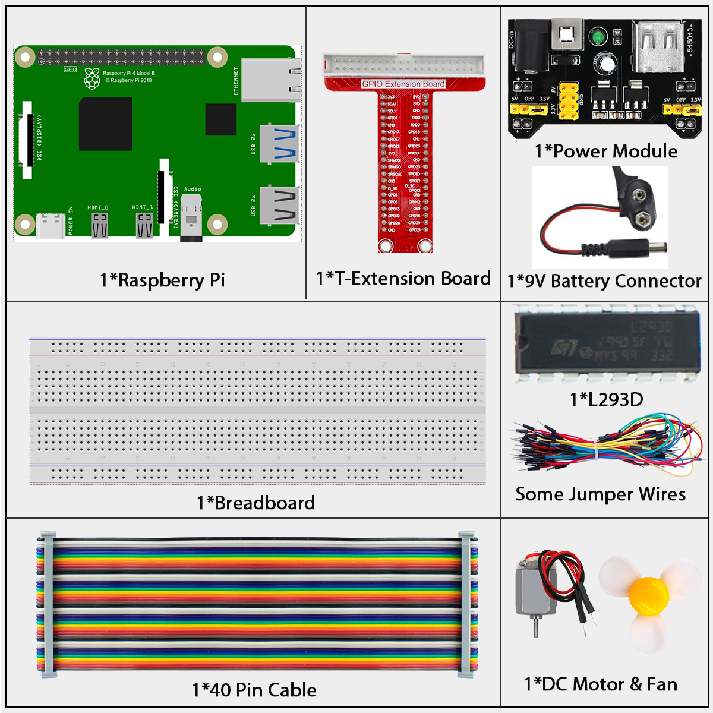
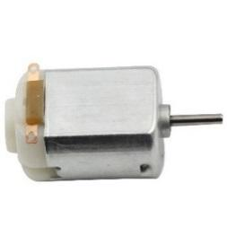
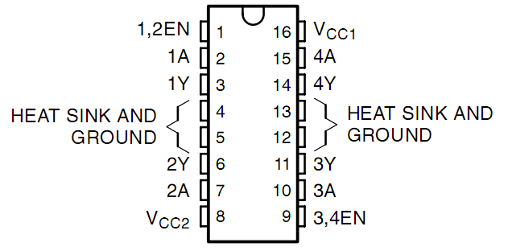
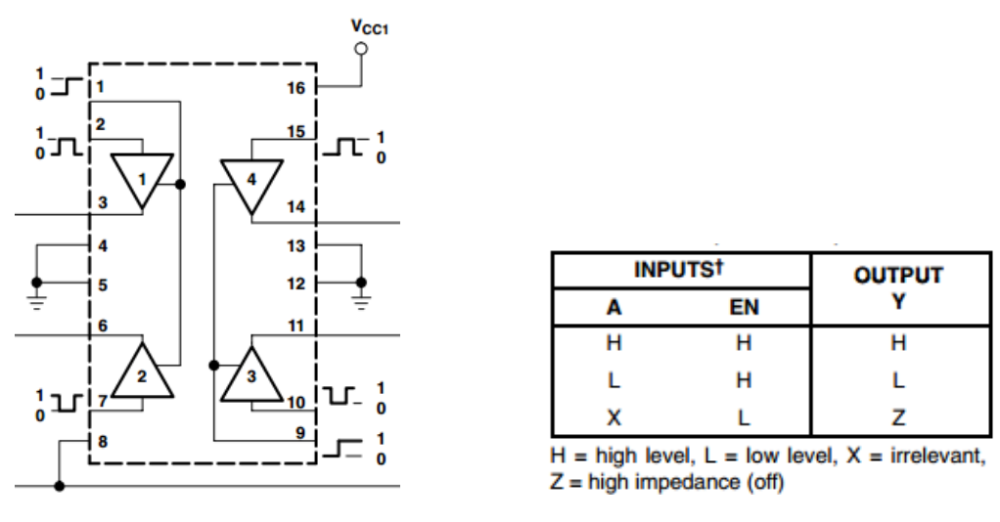
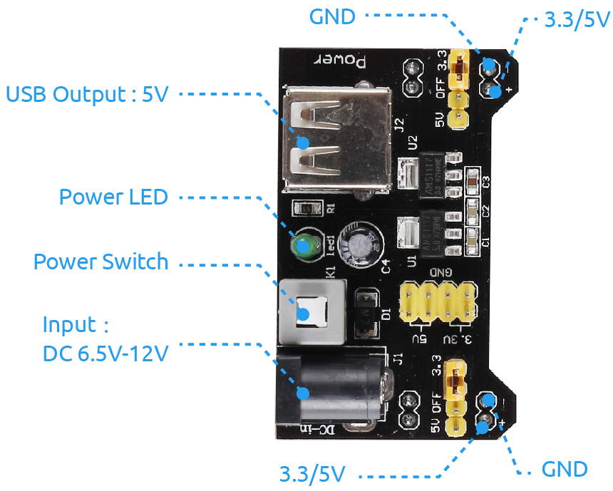
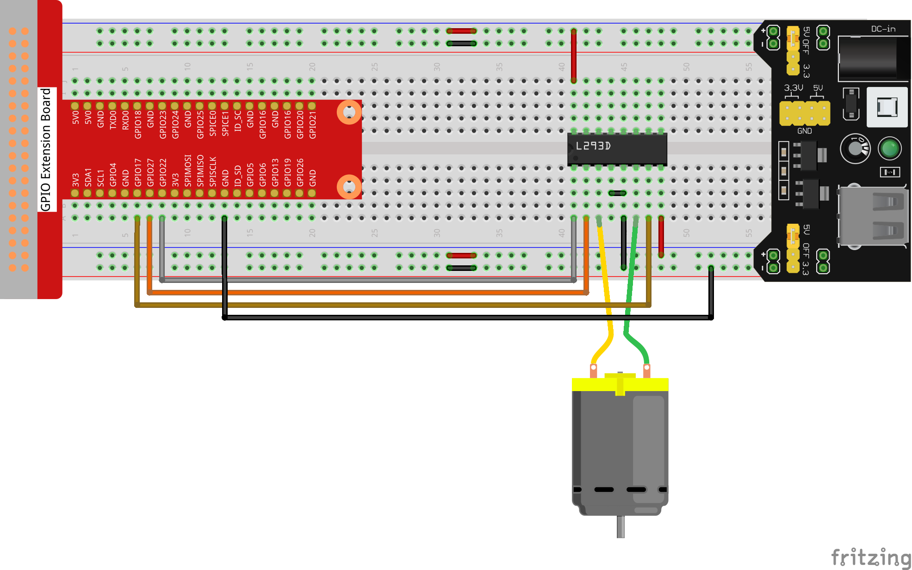

=============
1.3.1 Motor
=============

Introduction
------------

In this project, we'll learn how to control a DC motor with our Raspberry Pi, making it spin in both directions. We'll use a special motor driver chip called L293D and a separate power supply to safely run the motor.

Components
----------

**What is a DC Motor?**

A DC motor is an electric motor that converts electrical energy into mechanical movement (rotation). Unlike LEDs or buzzers we've used before, motors:
- Need more power to operate
- Can spin in either direction (clockwise or counterclockwise)
- Are used in toys, fans, robots, and many other moving devices

**Why We Need a Motor Driver (L293D)**

The Raspberry Pi can't directly power a motor because:
1. Motors need more current than the Pi can safely provide
2. Motors can create electrical "noise" that might damage the Pi
3. The Pi can't reverse a motor's direction on its own

The L293D chip solves these problems by:
- Acting as a bridge between the Pi and the motor
- Handling the higher current needed by the motor
- Allowing us to control the motor's direction

**How the L293D Works**

The L293D has three important types of pins:
- **Enable pins (EN)**: Turn the motor control on/off
- **Input pins (A)**: Control the direction (forward/reverse)
- **Output pins (Y)**: Connect to the motor

When EN is HIGH:
- If input A is HIGH → output Y is HIGH
- If input A is LOW → output Y is LOW

**Power Supply Module**

Motors need extra power, especially when starting and stopping. Using a separate power supply module:
- Protects your Raspberry Pi from power spikes
- Provides steady 5V power to the motor
- Makes the project safer and more reliable

The power module can use a 9V battery and provides both 3.3V and 5V outputs.

Connect
-------
.. list-table::
   :header-rows: 1
   :widths: 25 25 25 25

   * - T-Board Name
     - physical
     - wiringPi
     - BCM
   * - GPIO17
     - Pin 11
     - 0
     - 17
   * - GPIO27
     - Pin 13
     - 2
     - 27
   * - GPIO22
     - Pin 15
     - 3
     - 22

.. note::

    For power, you can connect a 9V battery using the battery connector included in the kit. Make sure to connect the power module's 5V output to the breadboard's power rail.

.. image:: ./img/image118.jpeg

Code
----

For C Language User
~~~~~~~~~~~~~~~~~~~~

Go to the code folder compile and run.

.. code-block:: shell

   cd ~/super-starter-kit-for-raspberry-pi/c/1.3.1/

.. code-block:: shell

   gcc 1.3.1_Motor.c -lwiringPi

.. code-block:: shell

   sudo ./a.out

As the code runs, the motor first rotates clockwise for 5s then stops for 5s, after that, it rotates anticlockwise for 5s; subsequently, the motor stops for 5s. This series of actions will be executed repeatedly.

This is the complete code

.. code-block:: c

    #include <wiringPi.h>
    #include <stdio.h>

    // Motor control pin definitions
    #define MOTOR_PIN1    0    // Motor direction pin 1
    #define MOTOR_PIN2    2    // Motor direction pin 2  
    #define MOTOR_ENABLE  3    // Motor enable pin (speed control)

    // Timing constants
    #define RUN_DURATION   3000  // Motor run time in milliseconds (3 seconds)
    #define STOP_DURATION  3000  // Motor stop time in milliseconds (3 seconds)
    #define SHORT_DELAY    100   // Short delay for state transitions

    // Motor direction definitions
    #define CLOCKWISE      1
    #define ANTI_CLOCKWISE 2
    #define STOP           0

    /**
    * @brief Initializes GPIO pins for motor control
    * @return 0 on success, 1 on failure
    */
    int setupHardware() {
        // Initialize wiringPi library
        if (wiringPiSetup() == -1) {
            printf("Failed to setup wiringPi!\n");
            return 1;
        }
        
        // Configure motor control pins as outputs
        pinMode(MOTOR_PIN1, OUTPUT);
        pinMode(MOTOR_PIN2, OUTPUT);
        pinMode(MOTOR_ENABLE, OUTPUT);
        
        printf("Motor control hardware initialized successfully!\n");
        return 0;
    }

    /**
    * @brief Controls motor direction and enable state
    * @param direction Motor direction (CLOCKWISE, ANTI_CLOCKWISE, or STOP)
    */
    void setMotorDirection(int direction) {
        switch (direction) {
            case CLOCKWISE:
                printf("Motor: Clockwise rotation\n");
                digitalWrite(MOTOR_ENABLE, HIGH);
                digitalWrite(MOTOR_PIN1, HIGH);
                digitalWrite(MOTOR_PIN2, LOW);
                break;
                
            case ANTI_CLOCKWISE:
                printf("Motor: Anti-clockwise rotation\n");
                digitalWrite(MOTOR_ENABLE, HIGH);
                digitalWrite(MOTOR_PIN1, LOW);
                digitalWrite(MOTOR_PIN2, HIGH);
                break;
                
            case STOP:
            default:
                printf("Motor: Stop\n");
                digitalWrite(MOTOR_ENABLE, LOW);
                break;
        }
        delay(SHORT_DELAY);  // Small delay for state transition
    }

    /**
    * @brief Main motor control loop
    */
    void motorControlLoop() {
        while (1) {
            // Run motor clockwise for 3 seconds
            setMotorDirection(CLOCKWISE);
            delay(RUN_DURATION);
            
            // Stop motor for 3 seconds
            setMotorDirection(STOP);
            delay(STOP_DURATION);
            
            // Run motor anti-clockwise for 3 seconds
            setMotorDirection(ANTI_CLOCKWISE);
            delay(RUN_DURATION);
            
            // Stop motor for 3 seconds
            setMotorDirection(STOP);
            delay(STOP_DURATION);
        }
    }

    /**
    * @brief Main function
    * @return 0 on success, 1 on failure
    */
    int main(void) {
        // Initialize hardware
        if (setupHardware() != 0) {
            return 1;  // Exit if setup fails
        }
        
        // Start motor control loop
        motorControlLoop();
        
        return 0;  // This line is unreachable due to infinite loop
    }

For Python Language User
~~~~~~~~~~~~~~~~~~~~~~~~~~~

Go to the code folder and run.

.. code-block:: shell

   cd ~/super-starter-kit-for-raspberry-pi/python

.. code-block:: shell

   python 1.3.1_Motor.py

As the code runs, the motor first rotates clockwise for 5s then stops for 5s, after that, it rotates anticlockwise for 5s; subsequently, the motor stops for 5s. This series of actions will be executed repeatedly.

This is the complete code

.. code-block:: python

   #!/usr/bin/env python3

    import RPi.GPIO as GPIO
    import time

    # Motor control pin definitions (BCM numbering)
    MOTOR_PIN1 = 17    # Motor direction pin 1
    MOTOR_PIN2 = 27    # Motor direction pin 2  
    MOTOR_ENABLE = 22  # Motor enable pin (speed control)

    # Timing constants
    RUN_DURATION = 3.0   # Motor run time in seconds (3 seconds)
    STOP_DURATION = 3.0  # Motor stop time in seconds (3 seconds)
    SHORT_DELAY = 0.1    # Short delay for state transitions

    # Motor direction definitions
    CLOCKWISE = 1
    ANTI_CLOCKWISE = -1
    STOP = 0

    def setupHardware():
        """
        Initializes GPIO pins for motor control.
        Returns: 0 on success, 1 on failure.
        """
        try:
            # Set the GPIO modes to BCM Numbering
            GPIO.setmode(GPIO.BCM)
            GPIO.setwarnings(False)
            
            # Configure motor control pins as outputs
            GPIO.setup(MOTOR_PIN1, GPIO.OUT, initial=GPIO.LOW)
            GPIO.setup(MOTOR_PIN2, GPIO.OUT, initial=GPIO.LOW)
            GPIO.setup(MOTOR_ENABLE, GPIO.OUT, initial=GPIO.LOW)
            
            print("Motor control hardware initialized successfully!")
            return 0
            
        except Exception as e:
            print(f"Failed to setup GPIO: {e}")
            return 1

    def setMotorDirection(direction):
        """
        Controls motor direction and enable state.
        Parameters: direction - Motor direction (CLOCKWISE, ANTI_CLOCKWISE, or STOP)
        """
        if direction == CLOCKWISE:
            print("Motor: Clockwise rotation")
            # Set direction
            GPIO.output(MOTOR_PIN1, GPIO.HIGH)
            GPIO.output(MOTOR_PIN2, GPIO.LOW)
            # Enable the motor
            GPIO.output(MOTOR_ENABLE, GPIO.HIGH)
            
        elif direction == ANTI_CLOCKWISE:
            print("Motor: Anti-clockwise rotation")
            # Set direction
            GPIO.output(MOTOR_PIN1, GPIO.LOW)
            GPIO.output(MOTOR_PIN2, GPIO.HIGH)
            # Enable the motor
            GPIO.output(MOTOR_ENABLE, GPIO.HIGH)
            
        elif direction == STOP:
            print("Motor: Stop")
            # Disable the motor
            GPIO.output(MOTOR_ENABLE, GPIO.LOW)
        
        time.sleep(SHORT_DELAY)  # Small delay for state transition

    def motorControlLoop():
        """
        Main motor control loop.
        """
        # Define a dictionary to make the script more readable
        # CW as clockwise, CCW as counterclockwise, STOP as stop
        directions = {'CW': CLOCKWISE, 'CCW': ANTI_CLOCKWISE, 'STOP': STOP}
        
        while True:
            # Run motor clockwise for 3 seconds
            setMotorDirection(directions['CW'])
            time.sleep(RUN_DURATION)
            
            # Stop motor for 3 seconds
            setMotorDirection(directions['STOP'])
            time.sleep(STOP_DURATION)
            
            # Run motor anti-clockwise for 3 seconds
            setMotorDirection(directions['CCW'])
            time.sleep(RUN_DURATION)
            
            # Stop motor for 3 seconds
            setMotorDirection(directions['STOP'])
            time.sleep(STOP_DURATION)

    def destroy():
        """
        Clean up function for GPIO resources.
        """
        # Stop the motor
        GPIO.output(MOTOR_ENABLE, GPIO.LOW)
        print("Motor stopped")
        
        # Release resource
        GPIO.cleanup()
        print("GPIO cleanup completed")

    def main():
        """
        Main function.
        Returns: Integer status code. 0 for success, 1 for error.
        """
        # Initialize hardware
        if setupHardware() != 0:
            return 1  # Exit if setup fails
        
        try:
            # Start motor control loop
            motorControlLoop()
        except KeyboardInterrupt:
            # When 'Ctrl+C' is pressed, the program destroy() will be executed
            print("\nProgram interrupted by user")
            destroy()
            return 0
        except Exception as e:
            print(f"An error occurred: {e}")
            destroy()
            return 1

    # If run this script directly, do:
    if __name__ == '__main__':
        main()

Phenomenon
----------

.. image:: ./img/phenomenon/131.gif