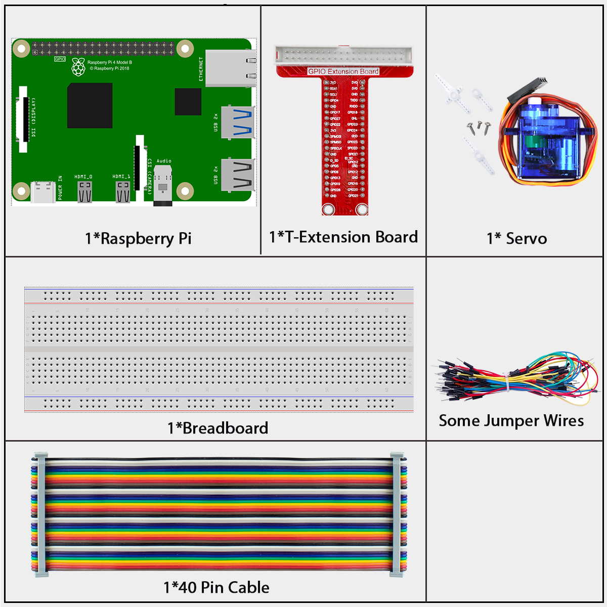
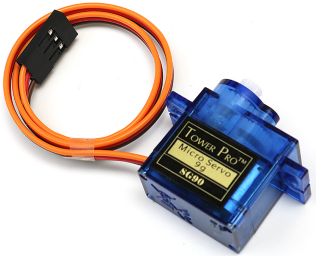
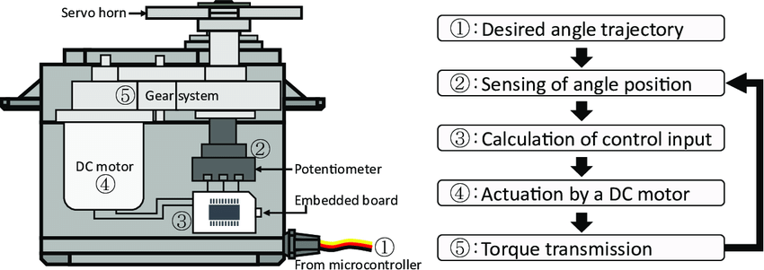
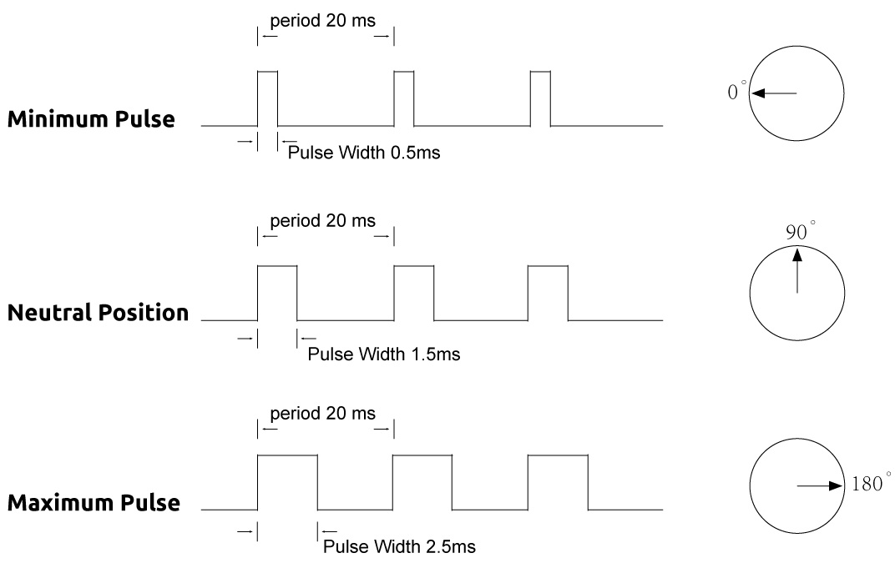
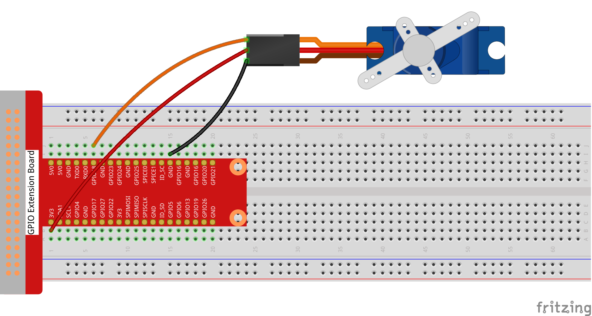

=============
1.3.2 Servo
=============

Introduction
------------

In this lesson, we will learn how to make the servo rotate.

Components
----------

**Servo**

A servo is generally composed of the following parts: case, shaft, gear system, potentiometer, DC motor, and embedded board.

It works like this: The microcontroller sends out PWM signals to the servo, and then the embedded board in the servo receives the signals through the signal pin and controls the motor inside to turn. As a result, the motor drives the gear system and then motivates the shaft after deceleration. The shaft and potentiometer of the servo are connected together. When the shaft rotates, it drives the potentiometer, so the potentiometer outputs a voltage signal to the embedded board. Then the board determines the direction and speed of rotation based on the current position, so it can stop exactly at the right position as defined and hold there.

The angle is determined by the duration of a pulse that is applied to the control wire. This is called Pulse width Modulation. The servo expects to see a pulse every 20 ms. The length of the pulse will determine how far the motor turns. For example, a 1.5ms pulse will make the motor turn to the 90 degree position (neutral position).

When a pulse is sent to a servo that is less than 1.5 ms, the servo rotates to a position and holds its output shaft some number of degrees counterclockwise from the neutral point. When the pulse is wider than 1.5 ms the opposite occurs. The minimal width and the maximum width of pulse that will command the servo to turn to a valid position are functions of each servo. Generally the minimum pulse will be about 0.5 ms wide and the maximum pulse will be 2.5 ms wide.

Connect
-------
.. list-table::
   :header-rows: 1
   :widths: 25 25 25 25

   * - T-Board Name
     - physical
     - wiringPi
     - BCM
   * - GPIO18
     - Pin 12
     - 1
     - 18

Code
----

For C Language User
~~~~~~~~~~~~~~~~~~~~

Go to the code folder compile and run.

.. code-block:: shell

   cd ~/super-starter-kit-for-raspberry-pi/c/1.2.3/

.. code-block:: shell

   gcc 1.3.2_Servo.c -lwiringPi

.. code-block:: shell

   sudo ./a.out

After the program is executed, the servo will rotate from 0 degrees to 180 degrees, and then from 180 degrees to 0 degrees, circularly.

This is the complete code

.. code-block:: c

    #include <wiringPi.h>
    #include <softPwm.h>
    #include <stdio.h>
    #include <stdlib.h> // Required for exit()

    // Define the GPIO pin for the servo motor.
    #define SERVO_PIN 1

    // --- Servo PWM Configuration ---
    // These values are typical for SG90 servos and may need calibration for others.
    // The PWM period is 20ms (50Hz), so the total range is 200 ticks for softPwm.
    #define PWM_PERIOD      200 // 200 * 100us = 20ms period
    #define PWM_MIN_PULSE   5   // Minimum pulse width for 0 degrees (0.5ms)
    #define PWM_MAX_PULSE   25  // Maximum pulse width for 180 degrees (2.5ms)
    #define ANGLE_MIN       0
    #define ANGLE_MAX       180

    /**
    * @brief Converts an angle (0-180) to a corresponding PWM value for the servo.
    * @param angle The desired angle in degrees.
    * @return The calculated PWM value.
    */
    int angle_to_pwm(int angle) {
        // Constrain the angle to the valid range.
        if (angle < ANGLE_MIN) angle = ANGLE_MIN;
        if (angle > ANGLE_MAX) angle = ANGLE_MAX;
        
        // Linearly map the angle (0-180) to the PWM pulse range (5-25).
        return (int)(((double)(angle - ANGLE_MIN) / (ANGLE_MAX - ANGLE_MIN)) * (PWM_MAX_PULSE - PWM_MIN_PULSE) + PWM_MIN_PULSE);
    }

    /**
    * @brief Sets the servo to a specific angle.
    * @param angle The target angle (0 to 180 degrees).
    */
    void set_servo_angle(int angle) {
        int pwm_value = angle_to_pwm(angle);
        softPwmWrite(SERVO_PIN, pwm_value);
    }

    /**
    * @brief Initializes wiringPi and creates a software PWM pin for the servo.
    */
    void setup_servo() {
        if (wiringPiSetup() == -1) {
            printf("Failed to setup wiringPi!\n");
            exit(1);
        }
        // Create a software PWM pin with a 0-200 range (20ms period).
        if (softPwmCreate(SERVO_PIN, 0, PWM_PERIOD) != 0) {
            printf("Failed to create softPwm pin!\n");
            exit(1);
        }
    }

    /**
    * @brief Main application loop to sweep the servo back and forth.
    */
    void servo_sweep_loop() {
        while (1) {
            printf("Sweeping from %d to %d degrees...\n", ANGLE_MIN, ANGLE_MAX);
            for (int angle = ANGLE_MIN; angle <= ANGLE_MAX; angle++) {
                set_servo_angle(angle);
                delay(10); // A small delay to control the speed of the sweep.
            }
            delay(1000); // Pause at the end position.

            printf("Sweeping from %d to %d degrees...\n", ANGLE_MAX, ANGLE_MIN);
            for (int angle = ANGLE_MAX; angle >= ANGLE_MIN; angle--) {
                set_servo_angle(angle);
                delay(10);
            }
            delay(1000); // Pause at the start position.
        }
    }

    /**
    * @brief Main function.
    * @return Integer status code.
    */
    int main(void) {
        setup_servo();
        servo_sweep_loop();
        return 0; // Unreachable code.
    }

For Python Language User
~~~~~~~~~~~~~~~~~~~~~~~~~~

Go to the code folder and run.

.. code-block:: shell

   cd ~/super-starter-kit-for-raspberry-pi/python

.. code-block:: shell

   python 1.3.2_Servo.py

After the program is executed, the servo will rotate from 0 degrees to 180 degrees, and then from 180 degrees to 0 degrees, circularly.

This is the complete code

.. code-block:: python

    #!/usr/bin/env python3
    """
    SG90 Servo Control - Optimized based on least-jitter version

    Key principles from the most stable version:
    1. 5-degree steps (not 1-degree) - reduces calculation frequency
    2. Fast timing: 2ms forward, 1ms reverse - matches servo response
    3. Minimal optimizations - less complexity = more stability
    4. Clean, simple code structure
    """

    import RPi.GPIO as GPIO
    import time

    SERVO_MIN_PULSE = 500
    SERVO_MAX_PULSE = 2500
    ServoPin = 18

    # Sweep configuration - based on most stable version
    SWEEP_START = 0      # Start angle (degrees)
    SWEEP_END = 180      # End angle (degrees)  
    SWEEP_STEP = 5       # 5-degree steps (proven most stable)
    SWEEP_SPEED_FWD = 0.002  # Forward speed: 2ms (from stable version)
    SWEEP_SPEED_REV = 0.001  # Reverse speed: 1ms (from stable version)

    def map(value, inMin, inMax, outMin, outMax):
        """Simple linear mapping function - same as stable version"""
        return (outMax - outMin) * (value - inMin) / (inMax - inMin) + outMin

    def setup():
        """Initialize servo - minimal setup based on stable version"""
        global p
        GPIO.setmode(GPIO.BCM)
        GPIO.setwarnings(False)
        GPIO.setup(ServoPin, GPIO.OUT)
        GPIO.output(ServoPin, GPIO.LOW)
        p = GPIO.PWM(ServoPin, 50)
        p.start(0)
        print("Servo initialized - using proven stable parameters")

    def setAngle(angle):
        """Set servo angle - exact same calculation as stable version"""
        angle = max(0, min(180, angle))
        pulse_width = map(angle, 0, 180, SERVO_MIN_PULSE, SERVO_MAX_PULSE)
        pwm = map(pulse_width, 0, 20000, 0, 100)
        p.ChangeDutyCycle(pwm)
        # No settle time - stable version doesn't use it

    def loop():
        """Main loop - exact timing from most stable version"""
        cycle_count = 0
        
        while True:
            cycle_count += 1
            
            # Forward sweep: 0° to 180° (same as stable version)
            for i in range(SWEEP_START, SWEEP_END + 1, SWEEP_STEP):
                setAngle(i)
                time.sleep(SWEEP_SPEED_FWD)  # 2ms - proven stable timing
            time.sleep(1)  # 1 second pause - same as stable version
            
            # Reverse sweep: 180° to 0° (same as stable version)  
            for i in range(SWEEP_END, SWEEP_START - 1, -SWEEP_STEP):
                setAngle(i)
                time.sleep(SWEEP_SPEED_REV)  # 1ms - proven stable timing
            time.sleep(1)  # 1 second pause - same as stable version
            
            # Minimal output to avoid interfering with PWM
            if cycle_count % 5 == 0:
                print(f"Completed {cycle_count} stable cycles")

    def destroy():
        """Clean shutdown - same as stable version"""
        p.stop()
        GPIO.cleanup()
        print("Servo stopped")

    if __name__ == '__main__':
        setup()
        try:
            loop()
        except KeyboardInterrupt:
            print("\nProgram interrupted")
            destroy()

Phenomenon
----------

.. image:: ./img/phenomenon/132.gif