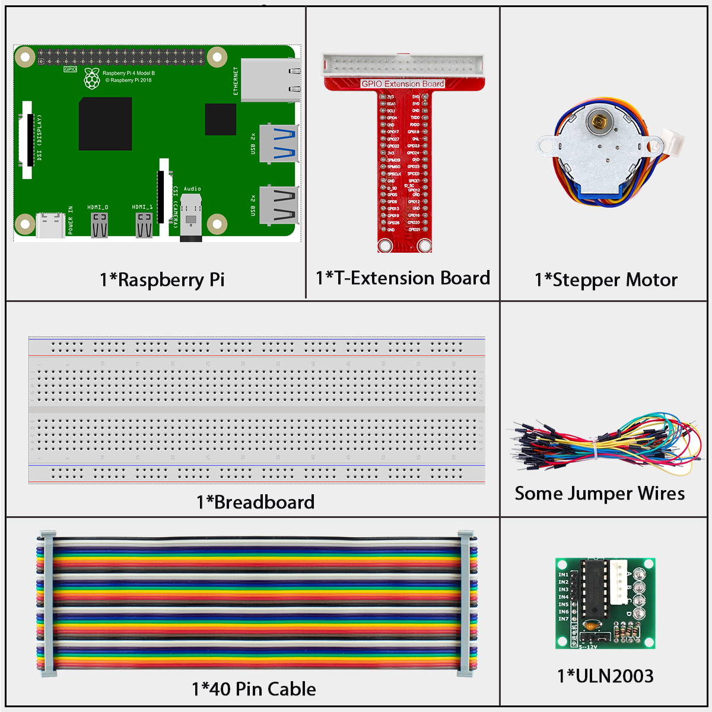
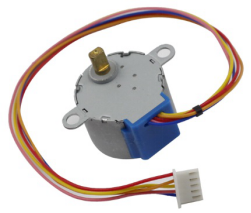
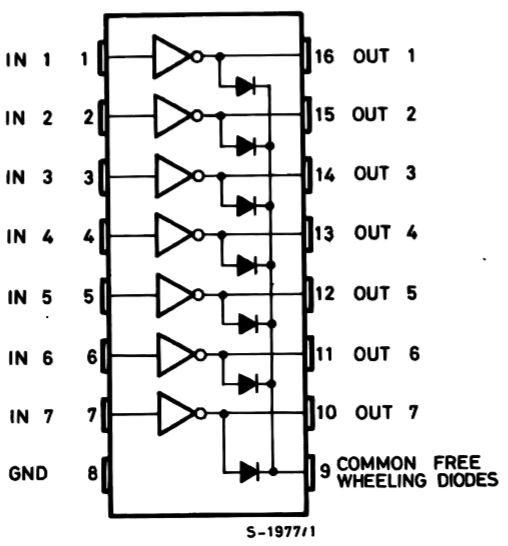
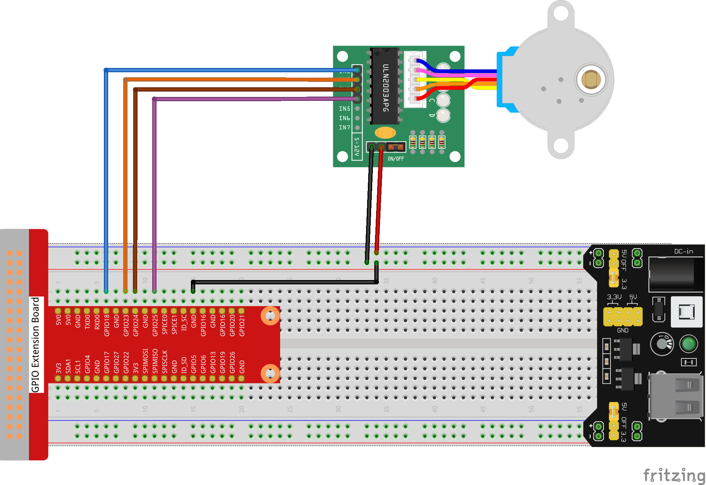

====================
1.3.3 Stepper Motor
====================

Introduction
------------

In this project, we'll learn how to control a stepper motor - a special type of motor that moves in precise "steps" rather than spinning continuously. Stepper motors are perfect for projects that need exact positioning, like 3D printers, robot arms, or camera sliders.

Components
----------

**What is a Stepper Motor?**

A stepper motor is different from regular DC motors because:
- It moves in small, precise steps (like clicks) instead of spinning smoothly
- You can control exactly how far it turns
- It can hold its position firmly when stopped
- It's perfect for projects needing accurate positioning

In this project, we use a unipolar stepper motor with four phases (or coils).

**How Stepper Motors Work - The Simple Version**

Think of a stepper motor like a round magnet (the rotor) surrounded by four electromagnets (the coils):

1. When you turn on one electromagnet, it attracts the rotor and makes it turn slightly
2. Then you turn on the next electromagnet and turn off the first one
3. The rotor turns a little more to align with the new active electromagnet
4. By turning the electromagnets on and off in sequence, the motor rotates step by step

This step-by-step movement gives stepper motors their name and their precision.

.. image:: ./img/image130.png

**Why Stepper Motors Are Special**

Our stepper motor:
- Has 32 magnetic poles inside
- Uses a gear system with a 64:1 ratio
- Needs 2048 steps to make one complete rotation
- Can be positioned with incredible precision (less than 0.2 degrees per step)

This precision makes stepper motors ideal for robots, 3D printers, and other machines that need exact positioning.

**The ULN2003 Driver Board**

The stepper motor needs more power than the Raspberry Pi can provide, so we use a ULN2003 driver board:

- It acts as a power amplifier between the Pi and the motor
- It has 4 input pins (IN1-IN4) that connect to the Raspberry Pi
- It has 4 output pins that connect to the motor's coils
- It includes 4 LEDs that show which coil is active
- It inverts the signals (when input is HIGH, output is LOW)

**How the Driver Works**

The driver board makes controlling the stepper motor simple:
- When you set IN1 to HIGH, the first coil in the motor activates
- When you set IN2 to HIGH, the second coil activates
- By activating the coils in the right sequence, the motor turns step by step
- The LEDs on the board light up to show which coil is currently active

.. image:: ./img/image132.png

Connect
-------
.. list-table::
   :header-rows: 1
   :widths: 25 25 25 25

   * - T-Board Name
     - physical
     - wiringPi
     - BCM
   * - GPIO18
     - Pin 12
     - 1
     - 18
   * - GPIO23
     - Pin 16
     - 4
     - 23
   * - GPIO24
     - Pin 18
     - 5
     - 24
   * - GPIO25
     - Pin 22
     - 6
     - 25

Code
----

For C Language User
~~~~~~~~~~~~~~~~~~~~

Go to the code folder compile and run.

.. code-block:: shell

cd ~/super-starter-kit-for-raspberry-pi/c/1.3.2/

.. code-block:: shell

gcc 1.3.3_StepperMotor.c -lwiringPi

.. code-block:: shell

sudo ./a.out

As the code runs, the stepper motor will rotate clockwise or anticlockwise according to your input 'a' or 'c'.

This is the complete code

.. code-block:: c

    #include <stdio.h>
    #include <stdlib.h> // Required for exit()
    #include <wiringPi.h>
    #include <termios.h> // For non-blocking getchar
    #include <unistd.h>  // For STDIN_FILENO

    // Define the GPIO pins connected to the ULN2003 driver for the stepper motor.
    const int MOTOR_PINS[] = {1, 4, 5, 6};
    const int NUM_MOTOR_PINS = sizeof(MOTOR_PINS) / sizeof(MOTOR_PINS[0]);

    // This 8-step sequence corresponds to half-step mode for a 28BYJ-48 motor,
    // which provides smoother rotation and more steps per revolution.
    const int HALF_STEP_SEQUENCE[8][4] = {
        {1, 0, 0, 0},
        {1, 1, 0, 0},
        {0, 1, 0, 0},
        {0, 1, 1, 0},
        {0, 0, 1, 0},
        {0, 0, 1, 1},
        {0, 0, 0, 1},
        {1, 0, 0, 1}
    };

    /**
    * @brief Sets the motor pins to a specific step in the sequence.
    * @param step The step number (0-7) in the half-step sequence.
    */
    void set_step(int step) {
        for (int i = 0; i < NUM_MOTOR_PINS; i++) {
            digitalWrite(MOTOR_PINS[i], HALF_STEP_SEQUENCE[step][i]);
        }
    }

    /**
    * @brief Rotates the motor by a given number of steps in a specified direction.
    * @param steps The number of steps to rotate.
    * @param clockwise If true, rotate clockwise; otherwise, anti-clockwise.
    * @param step_delay_us The delay in microseconds between each step, controls speed.
    */
    void rotate_steps(int steps, int clockwise, int step_delay_us) {
        static int current_step = 0;
        int step_increment = clockwise ? 1 : -1;

        for (int i = 0; i < steps; i++) {
            current_step = (current_step + step_increment + 8) % 8;
            set_step(current_step);
            delayMicroseconds(step_delay_us);
        }
    }

    /**
    * @brief Initializes GPIO pins for the stepper motor.
    */
    void setup_stepper() {
        if (wiringPiSetup() == -1) {
            printf("Failed to setup wiringPi!\n");
            exit(1);
        }
        for (int i = 0; i < NUM_MOTOR_PINS; i++) {
            pinMode(MOTOR_PINS[i], OUTPUT);
        }
    }

    /**
    * @brief Main function to control the stepper motor.
    * @return Integer status code.
    */
    int main(void) {
        setup_stepper();

        // The 28BYJ-48 motor has a gear ratio of ~64:1 and takes 32 steps per internal
        // revolution in full-step mode. In half-step mode (8 steps per sequence),
        // it's 64 steps. So, one full output revolution is 64 * 64 = 4096 steps.
        const int STEPS_PER_REVOLUTION = 4096;
        
        // Calculate delay for a target RPM (e.g., 15 RPM).
        const int TARGET_RPM = 15;
        const int step_delay_us = 60 * 1000 * 1000 / STEPS_PER_REVOLUTION / TARGET_RPM;

        printf("Stepper motor control initialized.\n");
        printf("Rotating one full revolution clockwise, then one anti-clockwise.\n");

        while (1) {
            // Rotate one full revolution clockwise.
            printf("-> Clockwise rotation...\n");
            rotate_steps(STEPS_PER_REVOLUTION, 1, step_delay_us);
            delay(1000); // Pause for 1 second.

            // Rotate one full revolution anti-clockwise.
            printf("<- Anti-clockwise rotation...\n");
            rotate_steps(STEPS_PER_REVOLUTION, 0, step_delay_us);
            delay(1000); // Pause for 1 second.
        }

        return 0; // Unreachable code.
    }

For Python Language User
~~~~~~~~~~~~~~~~~~~~~~~~~~~

Go to the code folder and run.

.. code-block:: shell

cd ~/super-starter-kit-for-raspberry-pi/python

.. code-block:: shell

python 1.3.3_StepperMotor.py

As the code runs, the stepper motor will rotate clockwise or anticlockwise according to your input 'a' or 'c'.

This is the complete code

.. code-block:: python

    #!/usr/bin/env python3
    """
    28BYJ-48 Stepper Motor Control - Python version matching C implementation

    This implementation replicates the C code's features:
    1. 8-step half-step sequence for smoother rotation
    2. Accurate step calculations (4096 steps per revolution)
    3. Automatic continuous rotation
    4. Precise speed control based on target RPM
    """

    import RPi.GPIO as GPIO
    import time

    # Define the GPIO pins connected to the ULN2003 driver for the stepper motor
    MOTOR_PINS = [18, 23, 24, 25]
    NUM_MOTOR_PINS = len(MOTOR_PINS)

    # 8-step half-step sequence for 28BYJ-48 motor (smoother rotation)
    # This provides smoother rotation and more steps per revolution than 4-step mode
    HALF_STEP_SEQUENCE = [
        [1, 0, 0, 0],
        [1, 1, 0, 0],
        [0, 1, 0, 0],
        [0, 1, 1, 0],
        [0, 0, 1, 0],
        [0, 0, 1, 1],
        [0, 0, 0, 1],
        [1, 0, 0, 1]
    ]

    # Motor specifications
    # The 28BYJ-48 motor has a gear ratio of ~64:1 and takes 64 steps per internal
    # revolution in half-step mode. So, one full output revolution is 64 * 64 = 4096 steps.
    STEPS_PER_REVOLUTION = 4096

    # Speed configuration
    TARGET_RPM = 15
    # Calculate delay for target RPM (converted from microseconds to seconds)
    STEP_DELAY = (60.0 / STEPS_PER_REVOLUTION / TARGET_RPM)

    # Global step tracking
    current_step = 0

    def set_step(step):
        """
        Sets the motor pins to a specific step in the sequence.
        Parameters: step - The step number (0-7) in the half-step sequence.
        """
        for i in range(NUM_MOTOR_PINS):
            GPIO.output(MOTOR_PINS[i], HALF_STEP_SEQUENCE[step][i])

    def rotate_steps(steps, clockwise):
        """
        Rotates the motor by a given number of steps in a specified direction.
        Parameters:
            steps - The number of steps to rotate
            clockwise - True for clockwise, False for anti-clockwise
        """
        global current_step
        step_increment = 1 if clockwise else -1
        
        for i in range(steps):
            current_step = (current_step + step_increment) % 8
            set_step(current_step)
            time.sleep(STEP_DELAY)

    def setup_stepper():
        """
        Initializes GPIO pins for the stepper motor.
        Returns: 0 on success, 1 on failure.
        """
        try:
            GPIO.setwarnings(False)
            GPIO.setmode(GPIO.BCM)
            
            for pin in MOTOR_PINS:
                GPIO.setup(pin, GPIO.OUT)
                GPIO.output(pin, GPIO.LOW)  # Initialize all pins to LOW
            
            print("Stepper motor GPIO setup successful!")
            print(f"Motor pins: {MOTOR_PINS}")
            print(f"Steps per revolution: {STEPS_PER_REVOLUTION}")
            print(f"Target RPM: {TARGET_RPM}")
            print(f"Step delay: {STEP_DELAY:.6f} seconds")
            return 0
            
        except Exception as e:
            print(f"Failed to setup stepper motor: {e}")
            return 1

    def continuous_rotation():
        """
        Main rotation loop - automatically alternates between clockwise and anti-clockwise.
        This function runs indefinitely until interrupted.
        """
        try:
            cycle_count = 0
            
            while True:
                cycle_count += 1
                print(f"\n=== Rotation Cycle {cycle_count} ===")
                
                # Rotate one full revolution clockwise
                print("-> Clockwise rotation...")
                rotate_steps(STEPS_PER_REVOLUTION, True)
                print("Clockwise rotation complete")
                time.sleep(1)  # Pause for 1 second
                
                # Rotate one full revolution anti-clockwise  
                print("<- Anti-clockwise rotation...")
                rotate_steps(STEPS_PER_REVOLUTION, False)
                print("Anti-clockwise rotation complete")
                time.sleep(1)  # Pause for 1 second
                
        except KeyboardInterrupt:
            print("\nStepper motor rotation interrupted by user")
            raise  # Re-raise to be handled by main()

    def destroy():
        """
        Clean up function for GPIO resources.
        Ensures all motor pins are turned off and GPIO is properly cleaned up.
        """
        try:
            # Turn off all motor pins
            for pin in MOTOR_PINS:
                GPIO.output(pin, GPIO.LOW)
            
            GPIO.cleanup()
            print("Stepper motor stopped and GPIO cleaned up")
            
        except Exception as e:
            print(f"Error during cleanup: {e}")

    def main():
        """
        Main function - matches C code structure.
        Returns: Integer status code. 0 for success, 1 for error.
        """
        print("28BYJ-48 Stepper Motor Control")
        print("Rotating one full revolution clockwise, then one anti-clockwise")
        print("Press Ctrl+C to stop...")
        
        # Initialize the stepper motor
        if setup_stepper() != 0:
            return 1  # Exit if setup fails
        
        try:
            # Start continuous rotation
            continuous_rotation()
            
        except KeyboardInterrupt:
            print("\nProgram interrupted by user")
            destroy()
            return 0
            
        except Exception as e:
            print(f"An error occurred: {e}")
            destroy()
            return 1

    if __name__ == '__main__':
        exit_code = main()
        exit(exit_code)

Phenomenon
----------

.. image:: ./img/phenomenon/133.gif