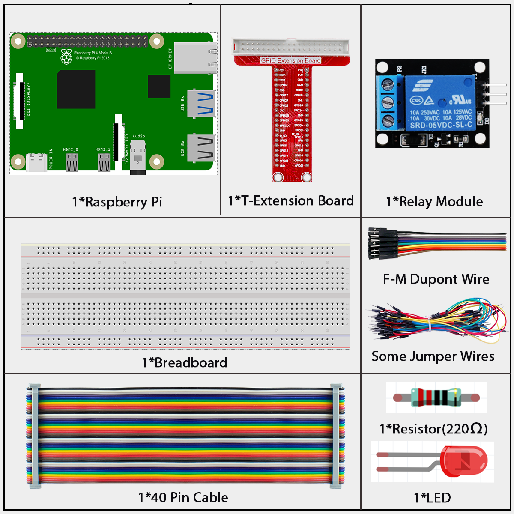
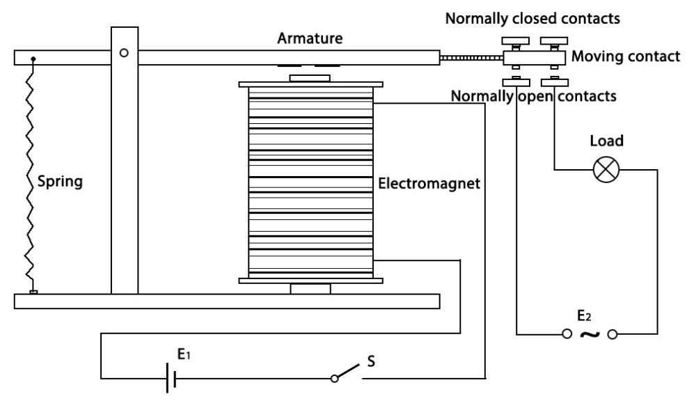
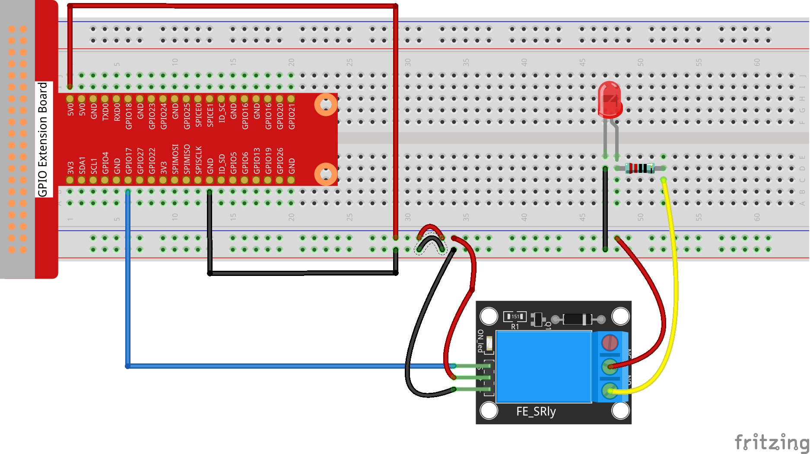

# 1.3.4 Relay

## Introduction

In this lesson, we will learn to use a relay. It is one of the commonly used components in automatic control system. When the voltage, current, temperature, pressure, etc., reaches, exceeds or is lower than the predetermined value, the relay will connect or interrupt the circuit, to control and protect the equipment.

## Components



**Relay**

As we may know, relay is a device which is used to provide connection between two or more points or devices in response to the input signal applied. In other words, relays provide isolation between the controller and the device as devices may work on AC as well as on DC. However, they receive signals from a microcontroller which works on DC hence requiring a relay to bridge the gap. Relay is extremely useful when you need to control a large amount of current or voltage with small electrical signal.

There are 5 parts in every relay:

**Electromagnet** - It consists of an iron core wounded by coil of wires. When electricity is passed through, it becomes magnetic. Therefore, it is called electromagnet.

**Armature** - The movable magnetic strip is known as armature. When current flows through them, the coil is it energized thus producing a magnetic field which is used to make or break the normally open (N/O) or normally close (N/C) points. And the armature can be moved with direct current (DC) as well as alternating current (AC).

**Spring** - When no currents flow through the coil on the electromagnet, the spring pulls the armature away so the circuit cannot be completed.

Set of electrical **contacts** - There are two contact points:

- Normally open - connected when the relay is activated, and disconnected when it is inactive.
- Normally close - not connected when the relay is activated, and connected when it is inactive.

**Molded frame** - Relays are covered with plastic for protection.

**Working of Relay**

The working principle of relay is simple. When power is supplied to the relay, currents start flowing through the control coil; as a result, the electromagnet starts energizing. Then the armature is attracted to the coil, pulling down the moving contact together thus connecting with the normally open contacts. So the circuit with the load is energized. Then breaking the circuit would a similar case, as the moving contact will be pulled up to the normally closed contacts under the force of the spring. In this way, the switching on and off of the relay can control the state of a load circuit.



## connect



## Code

### For  C  Language User

Go to the code folder compile and run.

```sh
cd ~/super-starter-kit-for-raspberry-pie/c/1.3.4
gcc 1.3.4_Relay.c -lwiringPi
sudo ./a.out
```

After the code runs, the LED will light up. In addition, you can hear a ticktock caused by breaking normally close contact and closing normally open contact.

This is the complete code

```c
#include <wiringPi.h>
#include <stdio.h>
#define RelayPin 0

int main(void){
    if(wiringPiSetup() == -1){ //when initialize wiring failed, print message to screen
        printf("setup wiringPi failed !");
        return 1;
    }
    pinMode(RelayPin, OUTPUT);   //set GPIO17(GPIO0) output
    while(1){
        // Tick
        printf("Relay Open......\n");
	printf("Led Off.....\n");
        digitalWrite(RelayPin, LOW);
        delay(1000);
        // Tock
        printf("......Relay Close\n");
	printf("......Led On \n");
        digitalWrite(RelayPin, HIGH);
        delay(1000);
    }

    return 0;
}
```

### For  Python  Language User

Go to the code folder and run.

```sh
cd ~/super-starter-kit-for-raspberry-pi/python
python 1.3.4_Relay.py
```

After the code runs, the LED will light up. In addition, you can hear a ticktock caused by breaking normally close contact and closing normally open contact.

This is the complete code

```python
import RPi.GPIO as GPIO
import time

# Set GPIO17 as control pin
relayPin = 17

# Define a setup function for some setup
def setup():
    # Set the GPIO modes to BCM Numbering
    GPIO.setmode(GPIO.BCM)
    # Set relayPin's mode to output,
    # and initial level to High(3.3v)
    GPIO.setup(relayPin, GPIO.OUT, initial=GPIO.HIGH)

# Define a main function for main process
def main():
    while True:
        print ('Relay open...')
        print ('Led Off...')
        # Tick
        GPIO.output(relayPin, GPIO.LOW)
        time.sleep(1)
        print ('...Relay close')
        print ('...Led On')
        # Tock
        GPIO.output(relayPin, GPIO.HIGH)
        time.sleep(1)

# Define a destroy function for clean up everything after
# the script finished
def destroy():
    # Turn off LED
    GPIO.output(relayPin, GPIO.HIGH)
    # Release resource
    GPIO.cleanup()                    

# If run this script directly, do:
if __name__ == '__main__':
    setup()
    try:
        main()
    # When 'Ctrl+C' is pressed, the child program
    # destroy() will be  executed.
    except KeyboardInterrupt:
        destroy()

```

## Phenomenon


