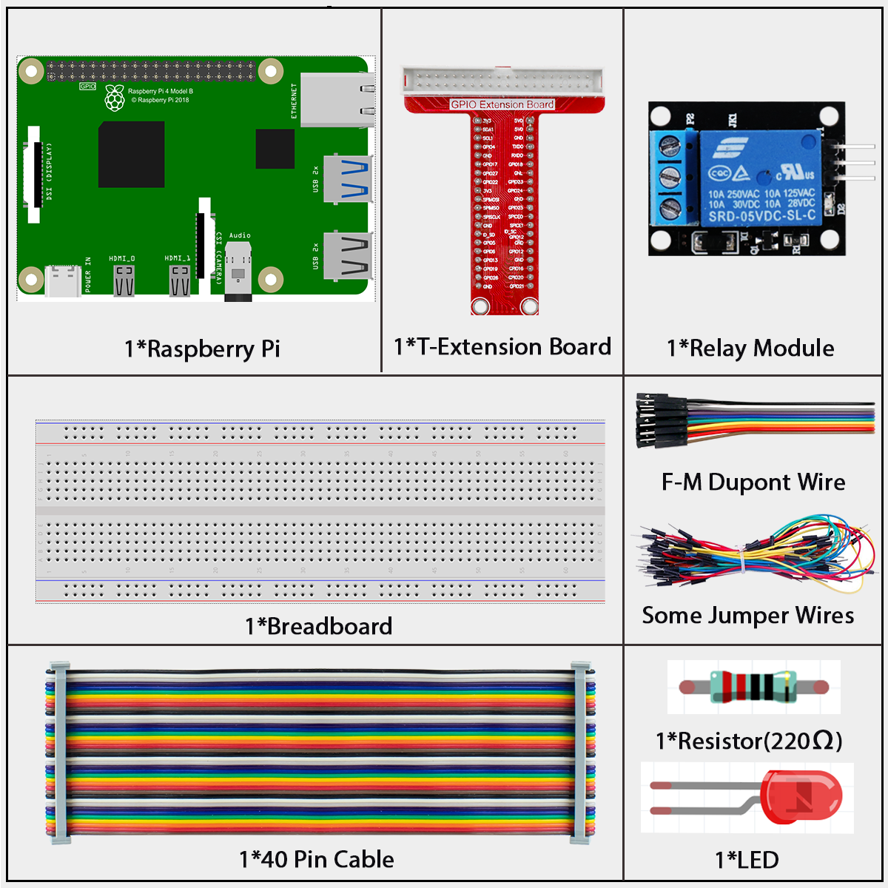
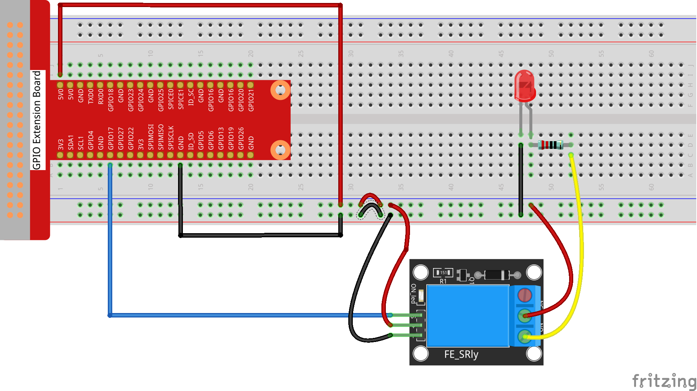

=============
1.3.4 Relay
=============

Introduction
------------

In this project, we'll learn how to use a relay - an electronic switch that lets your Raspberry Pi safely control high-power devices like lamps, fans, or other household appliances.

Components
----------

**What is a Relay?**

A relay is like a switch that's controlled by electricity instead of your finger. It has two separate circuits:
- A low-power control circuit (connected to your Raspberry Pi)
- A high-power load circuit (for the device you want to control)

This separation is important because it keeps your Raspberry Pi safe while letting you control powerful devices.

**Why Use a Relay?**

Relays are perfect when you need to:
- Control high-voltage devices (like 120V/240V home appliances) with your low-voltage Raspberry Pi
- Switch devices that need more current than your Pi can provide
- Isolate your Pi from potentially dangerous voltages
- Turn household devices on and off automatically

**Our Relay Module**

The relay module in this kit is ready to use with your Raspberry Pi:
- It includes all necessary components (resistors, diodes, and transistors)
- It can be connected directly to your Raspberry Pi without extra components
- It has clear markings for all connections
- It includes an indicator LED that shows when the relay is activated

**How a Relay Works - The Simple Version**

Inside every relay is an electromagnet that controls a mechanical switch:

1. When you send a signal from your Raspberry Pi, the electromagnet is activated
2. The electromagnet pulls a metal arm (the armature) toward it
3. This movement connects or disconnects the electrical contacts
4. When the signal stops, a spring pulls the arm back to its original position

**The Relay's Two States**

A relay has two possible contact states:

- **Normally Open (NO)**: The circuit is disconnected when the relay is off (like a light switch in the off position)
- **Normally Closed (NC)**: The circuit is connected when the relay is off

When you activate the relay, these states flip - NO contacts close and NC contacts open.

**Safety First!**

.. warning::
   When working with relays that control household power (120V/240V):
   - NEVER touch the high-voltage terminals when power is connected
   - Make sure all high-voltage wiring is properly insulated
   - If you're not experienced with electrical work, ask for help from someone who is

.. image:: ./img/image142.jpeg

Connect
-------

Code
----

For C Language User
~~~~~~~~~~~~~~~~~~~~

Go to the code folder compile and run.

.. code-block:: shell

   cd ~/super-starter-kit-for-raspberry-pie/c/1.3.4

.. code-block:: shell

   gcc 1.3.4_Relay.c -lwiringPi

.. code-block:: shell

   sudo ./a.out

After the code runs, the LED will light up. In addition, you can hear a ticktock caused by breaking normally close contact and closing normally open contact.

This is the complete code

.. code-block:: c

    #include <wiringPi.h>
    #include <stdio.h>
    #include <stdlib.h> // Required for exit()

    // Define the GPIO pin connected to the relay module.
    #define RELAY_PIN 0

    // Define the interval for switching the relay state in milliseconds.
    #define SWITCH_INTERVAL_MS 1000

    /**
    * @brief Initializes wiringPi and configures the relay pin as an output.
    */
    void setup_relay() {
        if (wiringPiSetup() == -1) {
            printf("Failed to setup wiringPi!\n");
            exit(1);
        }
        pinMode(RELAY_PIN, OUTPUT);
    }

    /**
    * @brief Main application loop to toggle the relay.
    */
    void relay_toggle_loop() {
        while (1) {
            // Close the relay circuit (often by pulling the pin LOW).
            // This might turn an external device (like an LED) ON.
            printf("Relay CLOSED (circuit complete).\n");
            digitalWrite(RELAY_PIN, LOW);
            delay(SWITCH_INTERVAL_MS);

            // Open the relay circuit (by pulling the pin HIGH).
            // This will turn the external device OFF.
            printf("Relay OPEN (circuit broken).\n");
            digitalWrite(RELAY_PIN, HIGH);
            delay(SWITCH_INTERVAL_MS);
        }
    }

    /**
    * @brief Main function.
    * @return Integer status code.
    */
    int main(void) {
        setup_relay();
        relay_toggle_loop();
        return 0; // Unreachable code.
    }

For Python Language User
~~~~~~~~~~~~~~~~~~~~~~~~~~

Go to the code folder and run.

.. code-block:: shell

   cd ~/super-starter-kit-for-raspberry-pi/python

.. code-block:: shell

   python 1.3.4_Relay.py

After the code runs, the LED will light up. In addition, you can hear a ticktock caused by breaking normally close contact and closing normally open contact.

This is the complete code

.. code-block:: python

    #!/usr/bin/env python3
    """
    Relay Module Control - Python version matching C implementation

    This implementation replicates the C code's features:
    1. Professional function separation and naming
    2. Clear relay state descriptions (CLOSED/OPEN)
    3. Proper constant definitions
    4. Enhanced error handling and status codes
    """

    import RPi.GPIO as GPIO
    import time
    import sys

    # Define the GPIO pin connected to the relay module
    RELAY_PIN = 17

    # Define the interval for switching the relay state in seconds
    SWITCH_INTERVAL_MS = 1.0  # 1000ms converted to 1.0 seconds

    def setup_relay():
        """
        Initializes GPIO and configures the relay pin as an output.
        Returns: 0 on success, 1 on failure.
        """
        try:
            GPIO.setmode(GPIO.BCM)
            GPIO.setwarnings(False)
            
            # Configure relay pin as output with initial HIGH state
            # HIGH = relay open (circuit open), LOW = relay closed (circuit closed)
            GPIO.setup(RELAY_PIN, GPIO.OUT, initial=GPIO.HIGH)
            
            print("Relay module GPIO setup successful!")
            print(f"Relay pin: {RELAY_PIN}")
            print(f"Switch interval: {SWITCH_INTERVAL_MS} seconds")
            print("Initial state: Relay OPEN (external device OFF)")
            return 0
            
        except Exception as e:
            print(f"Failed to setup relay module: {e}")
            return 1

    def relay_toggle_loop():
        """
        Main application loop to toggle the relay.
        This function runs indefinitely until interrupted.
        """
        try:
            cycle_count = 0
            
            while True:
                cycle_count += 1
                
                # Close the relay circuit (often by pulling the pin LOW)
                # This might turn an external device (like an LED) ON
                print(f"[Cycle {cycle_count}] Relay CLOSED (LED OFF)")
                GPIO.output(RELAY_PIN, GPIO.LOW)
                time.sleep(SWITCH_INTERVAL_MS)
                
                # Open the relay circuit (by pulling the pin HIGH)  
                # This will turn the external device OFF
                print(f"[Cycle {cycle_count}] Relay OPEN (LED ON)")
                GPIO.output(RELAY_PIN, GPIO.HIGH)
                time.sleep(SWITCH_INTERVAL_MS)
                
        except KeyboardInterrupt:
            print("\nRelay toggle loop interrupted by user")
            raise  # Re-raise to be handled by main()

    def destroy():
        """
        Clean up function for GPIO resources.
        Ensures relay is in safe state (OPEN) and GPIO is properly cleaned up.
        """
        try:
            # Ensure relay is in OPEN state (safe state)
            GPIO.output(RELAY_PIN, GPIO.HIGH)
            GPIO.cleanup()
            print("Relay set to OPEN state and GPIO cleaned up")
            
        except Exception as e:
            print(f"Error during cleanup: {e}")

    def main():
        """
        Main function - matches C code structure.
        Returns: Integer status code. 0 for success, 1 for error.
        """
        print("Relay Module Control")
        print("Toggling relay state every 1 second")
        print("HIGH = Relay OPEN (external device OFF)")
        print("LOW = Relay CLOSED (external device ON)")
        print("Press Ctrl+C to stop...")
        print("-" * 50)
        
        # Initialize the relay module
        if setup_relay() != 0:
            return 1  # Exit if setup fails
        
        try:
            # Start the main relay toggle loop
            relay_toggle_loop()
            
        except KeyboardInterrupt:
            print("\nProgram interrupted by user")
            destroy()
            return 0
            
        except Exception as e:
            print(f"An error occurred: {e}")
            destroy()
            return 1

    if __name__ == '__main__':
        exit_code = main()
        sys.exit(exit_code)

Phenomenon
----------

.. image:: ./img/phenomenon/134.gif