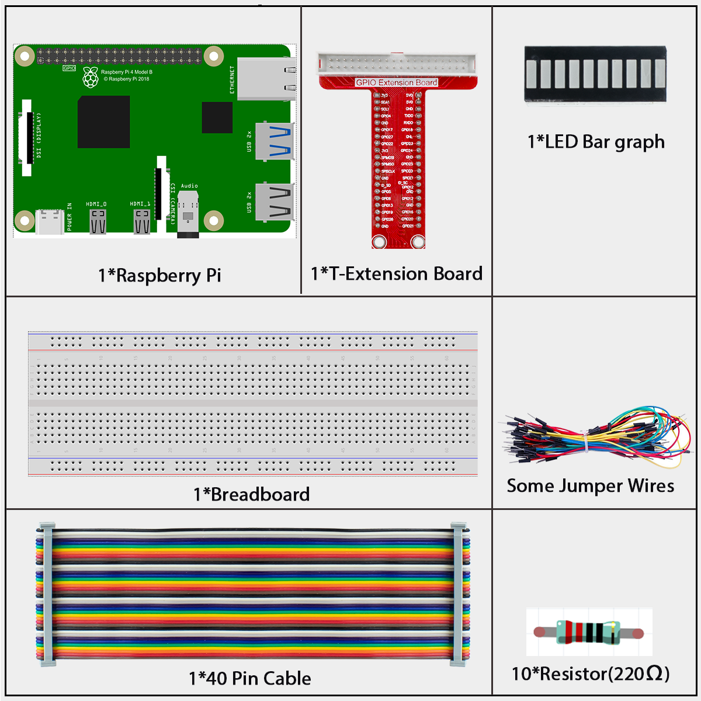
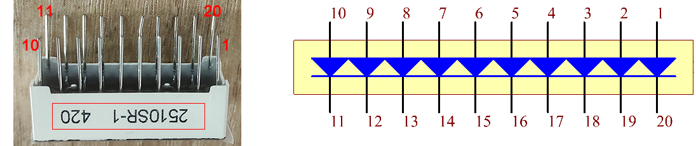
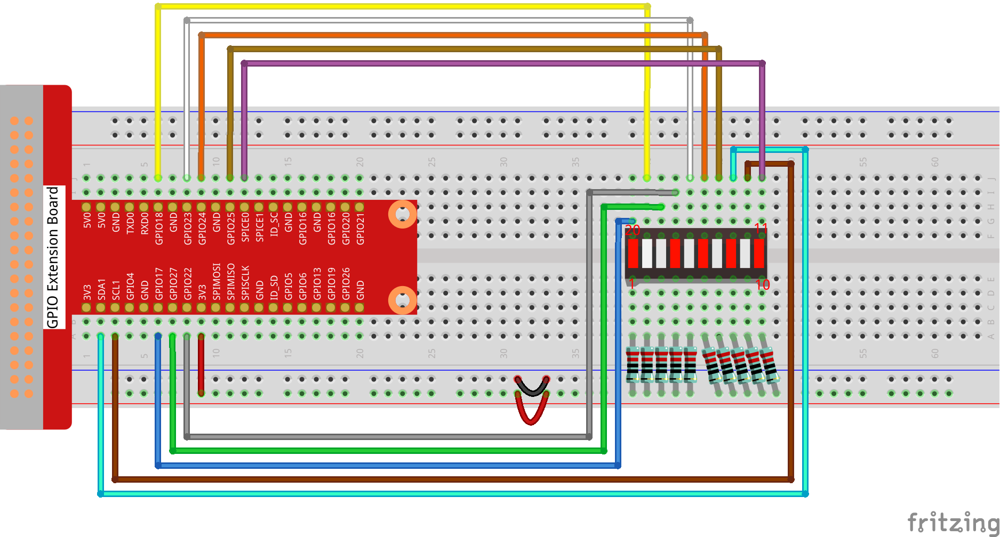

====================
1.3.5 LED Bar Graph
====================

Introduction
------------

In this lesson, we will learn how to make lights turn on one after another on an LED Bar Graph. This is a fun and simple project for beginners!

Components
----------

**LED Bar Graph**

An LED Bar Graph is simply a row of 10 small lights (LEDs) arranged together in one package. Think of it as 10 separate lights that can be controlled individually. It's perfect for showing levels (like a volume meter or battery indicator) or creating simple animations.

In this project, we'll connect the LED Bar Graph to our Raspberry Pi and make the lights turn on in sequence - just like a progress bar or a "loading" animation!

Connect
-------
.. list-table::
   :header-rows: 1
   :widths: 25 25 25 25

   * - T-Board Name
     - physical
     - wiringPi
     - BCM
   * - GPIO17
     - Pin 11
     - 0
     - 17
   * - GPIO18
     - Pin 12
     - 1
     - 18
   * - GPIO27
     - Pin 13
     - 2
     - 27
   * - GPIO22
     - Pin 15
     - 3
     - 22
   * - GPIO23
     - Pin 16
     - 4
     - 23
   * - GPIO24
     - Pin 18
     - 5
     - 24
   * - GPIO25
     - Pin 22
     - 6
     - 25
   * - SDA1
     - Pin 3
     - 8
     - 2
   * - SCL1
     - Pin 5
     - 9
     - 3
   * - SPICE0
     - Pin 24
     - 10
     - 8

Code
----

For C Language User
~~~~~~~~~~~~~~~~~~~~

Go to the folder of the code.

.. code-block:: shell

   cd ~/super-starter-kit-for-raspberry-pi/c/1.3.5/

Compile the code. 

.. code-block:: shell

   gcc 1.3.5_LedBarGraph.c -lwiringPi

.. note::

    When the instruction "gcc" is executed, if "-o" is not called, then the executable file is named "a.out".

Run the executable file.

.. code-block:: shell

   sudo ./a.out

After the code runs, you will see the LEDs on the LED bar turn on and off regularly.

This is the complete code

.. code-block:: c

  /**
  * @file 1.3.5_LedBarGraph.c
  * @brief Simple LED Bar Graph Controller
  * @description Controls 10 LEDs with different animation patterns
  */

  #include <wiringPi.h>
  #include <stdio.h>
  #include <signal.h>
  #include <stdlib.h>

  // --- Pin Configuration ---
  const int led_pins[10] = {0, 1, 2, 3, 4, 5, 6, 8, 9, 10};

  /**
  * @brief Initialize LED pins and turn them off
  */
  void setup_leds() {
      printf("Setting up LED bar graph...\n");
      
      for (int i = 0; i < 10; i++) {
          pinMode(led_pins[i], OUTPUT);
          digitalWrite(led_pins[i], HIGH);  // Turn off LEDs (common anode)
      }
      
      printf("✅ Ready!\n\n");
  }

  /**
  * @brief Light odd LEDs (positions 0,2,4,6,8)
  */
  void light_odd_leds() {
      printf("🔸 Odd pattern\n");
      for (int i = 0; i < 10; i += 2) {
          digitalWrite(led_pins[i], LOW);   // Turn ON
          delay(300);
          digitalWrite(led_pins[i], HIGH);  // Turn OFF
      }
  }

  /**
  * @brief Light even LEDs (positions 1,3,5,7,9)
  */
  void light_even_leds() {
      printf("🔹 Even pattern\n");
      for (int i = 1; i < 10; i += 2) {
          digitalWrite(led_pins[i], LOW);   // Turn ON
          delay(300);
          digitalWrite(led_pins[i], HIGH);  // Turn OFF
      }
  }

  /**
  * @brief Light all LEDs in sequence
  */
  void light_all_leds() {
      printf("🔸 All LEDs\n");
      for (int i = 0; i < 10; i++) {
          digitalWrite(led_pins[i], LOW);   // Turn ON
          delay(300);
          digitalWrite(led_pins[i], HIGH);  // Turn OFF
      }
  }

  /**
  * @brief Clean up and exit when Ctrl+C is pressed
  */
  void cleanup_exit(int sig) {
      printf("\n🧹 Turning off LEDs...\n");
      for (int i = 0; i < 10; i++) {
          digitalWrite(led_pins[i], HIGH);  // Turn OFF all LEDs
      }
      printf("✅ Goodbye!\n");
      exit(0);
  }

  /**
  * @brief Main function
  */
  int main(void) {
      // Handle Ctrl+C
      signal(SIGINT, cleanup_exit);
      
      printf("=== LED Bar Graph Controller ===\n");
      printf("Press Ctrl+C to exit\n\n");
      
      // Initialize wiringPi
      if (wiringPiSetup() == -1) {
          printf("❌ Setup failed!\n");
          return 1;
      }
      
      // Setup LEDs
      setup_leds();
      
      // Main loop
      while (1) {
          light_odd_leds();
          delay(300);
          
          light_even_leds();
          delay(300);
          
          light_all_leds();
          delay(300);
          
          printf("--- Cycle complete ---\n\n");
      }
      
      return 0;
  }

For Python Language User
~~~~~~~~~~~~~~~~~~~~~~~~~~

Go to the code folder and run.

.. code-block:: shell

   cd ~/super-starter-kit-for-raspberry-pi/python

.. code-block:: shell

   python 1.3.5_LedBarGraph.py

After the code runs, you will see the LEDs on the LED bar turn on and off regularly.

This is the complete code

.. code-block:: python

  #!/usr/bin/env python3
  """
  1.3.5_LedBarGraph.py

  Simple LED Bar Graph Controller
  This program controls 10 LEDs with different animation patterns.

  Animation patterns:
  - Odd LEDs: 0, 2, 4, 6, 8
  - Even LEDs: 1, 3, 5, 7, 9  
  - All LEDs sequence
  """

  import RPi.GPIO as GPIO
  import time
  import signal
  import sys

  class LedBarGraph:
      """
      A class to control a 10-LED bar graph with various animation patterns.
      """
      
      def __init__(self):
          """
          Initialize the LED bar graph controller.
          """
          # Pin configuration - these must match your hardware setup
          # Using BCM numbering that corresponds to wiringPi pins 0-10
          self.led_pins = [17, 18, 27, 22, 23, 24, 25, 2, 3, 8]  # BCM pins corresponding to wiringPi 0,1,2,3,4,5,6,8,9,10
          
          # Setup GPIO and LEDs
          self._setup_gpio()
          self._setup_leds()
          
          # Setup signal handler for graceful exit
          signal.signal(signal.SIGINT, self._cleanup_exit)

      def _setup_gpio(self):
          """
          Configure GPIO settings.
          """
          GPIO.setmode(GPIO.BCM)  # Use BCM pin numbering
          GPIO.setwarnings(False)  # Disable GPIO warnings

      def _setup_leds(self):
          """
          Initialize LED pins and turn them all off.
          """
          print("🔧 Setting up LED bar graph...")
          
          for pin in self.led_pins:
              GPIO.setup(pin, GPIO.OUT)
              GPIO.output(pin, GPIO.HIGH)  # Turn off LEDs (assuming common anode setup)
          
          print("✅ LED setup complete! Ready to start animations.")
          print()

      def light_odd_leds(self):
          """
          Light odd-positioned LEDs (positions 0, 2, 4, 6, 8).
          """
          print("🔸 Lighting odd pattern LEDs...")
          
          for i in range(0, 10, 2):  # 0, 2, 4, 6, 8
              GPIO.output(self.led_pins[i], GPIO.LOW)   # Turn ON
              time.sleep(0.3)
              GPIO.output(self.led_pins[i], GPIO.HIGH)  # Turn OFF

      def light_even_leds(self):
          """
          Light even-positioned LEDs (positions 1, 3, 5, 7, 9).
          """
          
          for i in range(1, 10, 2):  # 1, 3, 5, 7, 9
              GPIO.output(self.led_pins[i], GPIO.LOW)   # Turn ON
              time.sleep(0.3)
              GPIO.output(self.led_pins[i], GPIO.HIGH)  # Turn OFF

      def light_all_leds(self):
          """
          Light all LEDs in sequence from 0 to 9.
          """
          print("🔸 Lighting all LEDs in sequence...")
          
          for i in range(10):
              GPIO.output(self.led_pins[i], GPIO.LOW)   # Turn ON
              time.sleep(0.3)
              GPIO.output(self.led_pins[i], GPIO.HIGH)  # Turn OFF

      def run_animation_cycle(self):
          """
          Run one complete animation cycle with all patterns.
          """
          # Execute animation patterns in sequence
          self.light_odd_leds()
          time.sleep(0.3)
          
          self.light_even_leds()
          time.sleep(0.3)
          
          self.light_all_leds()
          time.sleep(0.3)
          
          print("--- Animation cycle complete ---")
          print()

      def run(self):
          """
          Start the main animation loop.
          """
          print("🚀 Starting LED bar graph animations...")
          print("Press Ctrl+C to stop and exit.")
          print()
          
          try:
              while True:
                  self.run_animation_cycle()
                  
          except KeyboardInterrupt:
              # This should be caught by the signal handler, but just in case
              self._cleanup_exit(None)

      def _cleanup_exit(self, signal_num):
          """
          Clean up GPIO resources and exit gracefully.
          
          Args:
              signal_num: The signal number (for signal handler compatibility)
          """
          print("\n🧹 Turning off all LEDs...")
          
          # Turn off all LEDs
          for pin in self.led_pins:
              GPIO.output(pin, GPIO.HIGH)  # Turn OFF
          
          # Clean up GPIO resources
          GPIO.cleanup()
          
          print("✅ Cleanup complete. Goodbye!")
          sys.exit(0)

  def main():
      """
      Main function to initialize and run the LED bar graph controller.
      """
      print("=" * 40)
      print("=" * 40)
      print("This program controls 10 LEDs with animation patterns.")
      print("=" * 40)
      print()
      
      try:
          # Create and run the LED controller
          led_controller = LedBarGraph()
          led_controller.run()
          
      except Exception as e:
          print(f"❌ Error: {e}")
          GPIO.cleanup()
          sys.exit(1)

  if __name__ == '__main__':
      # Execute the main function when the script is run directly
      main()

Phenomenon
-----------------

When you run the program, your LED Bar Graph will create a light show with three different patterns:

1. **Odd Pattern**: LEDs at positions 0, 2, 4, 6, and 8 will light up one after another
2. **Even Pattern**: LEDs at positions 1, 3, 5, 7, and 9 will light up one after another
3. **Sequential Pattern**: All LEDs will light up in order from left to right

The animation below shows what you should see:

.. image:: ./img/phenomenon/135.gif