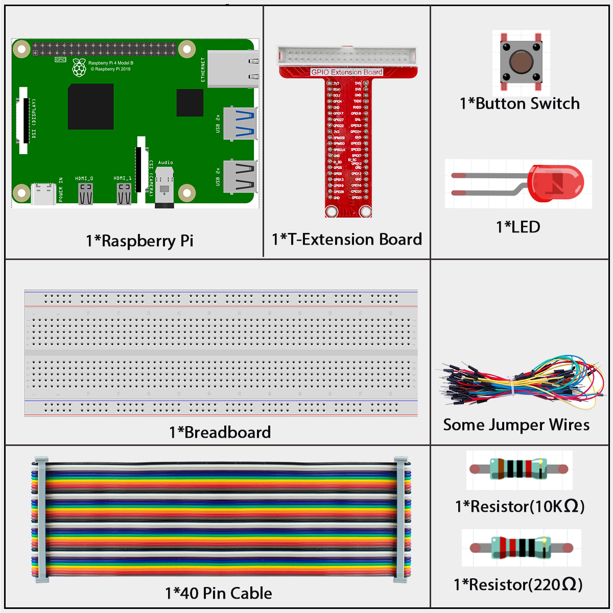
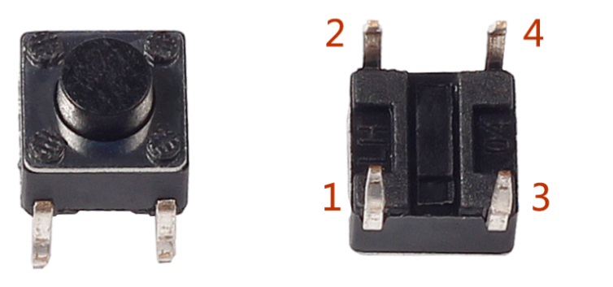
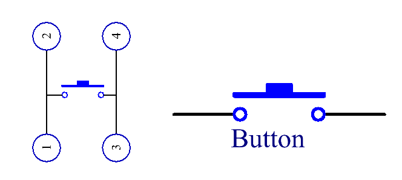
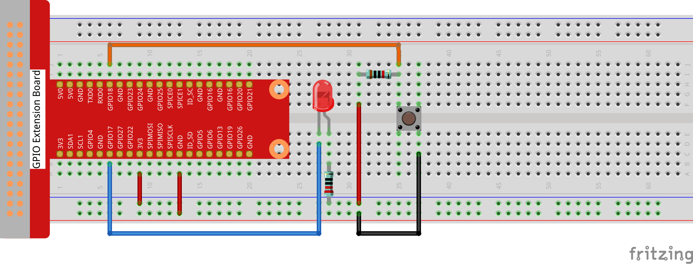

2.1.1 Button
=============

Introduction
------------

In this beginner-friendly lesson, you will learn how to control an LED light using a simple push button. This is a fundamental skill in electronics that teaches you about digital input and output.

Components
----------

**What is a Button?**

A button (also called a push button or tactile switch) is one of the most basic input devices in electronics. Think of it like a doorbell button - when you press it, it completes an electrical connection, and when you release it, the connection is broken.

The button we're using is a small 6mm tactile button. Here's how it works:

Looking at the button from above, you can see it has 4 metal pins. The two pins on the left side are always connected to each other, and the two pins on the right side are always connected to each other. When you press the button down, all 4 pins get connected together.

In circuit diagrams, we represent a button with this symbol:

**How does it work?**

- When the button is **not pressed**: The circuit is open (broken)
- When the button **is pressed**: The circuit is closed (complete), allowing electricity to flow

Connect
-------
.. list-table::
   :header-rows: 1
   :widths: 25 25 25 25

   * - T-Board Name
     - physical
     - wiringPi
     - BCM
   * - GPIO17
     - Pin 11
     - 0
     - 17
   * - GPIO18
     - Pin 12
     - 1
     - 18

Now let's connect our button to the Raspberry Pi. We'll use what's called a "pull-up" circuit configuration. Here's what happens:

- When the button is **not pressed**: GPIO18 reads HIGH (3.3V)
- When the button **is pressed**: GPIO18 reads LOW (0V)

Our program will monitor GPIO18 and detect when it changes from HIGH to LOW, which tells us the button was pressed.

.. note:: 

    **LED Tip for Beginners:** LEDs (Light Emitting Diodes) have two legs of different lengths. The longer leg is the positive side (anode) and the shorter leg is the negative side (cathode). Always connect the longer leg to the positive voltage!

Code
----

For C Language User
~~~~~~~~~~~~~~~~~~~

Go to the code folder compile and run.

.. code-block:: shell

   cd ~/super-starter-kit-for-raspberry-pi/c/2.1.1/

.. code-block:: shell

   gcc 2.1.1_Button.c -lwiringPi

.. code-block:: shell

   sudo ./a.out

After the code runs, press the button, the LED lights up; otherwise, turns off.

This is the complete code

.. code-block:: c

    #include <wiringPi.h>    // Library for GPIO control on Raspberry Pi
    #include <stdio.h>       // Standard input/output library

    // Define GPIO pin numbers (using WiringPi numbering scheme)
    #define LED_PIN         0    // LED connected to WiringPi pin 0
    #define BUTTON_PIN      1    // Button connected to WiringPi pin 1

    // Define logic states for better readability
    #define LED_ON          LOW   // LED turns on when GPIO outputs LOW
    #define LED_OFF         HIGH  // LED turns off when GPIO outputs HIGH
    #define BUTTON_PRESSED  0     // Button reads LOW when pressed (pull-up resistor)
    #define BUTTON_RELEASED 1     // Button reads HIGH when released

    int main(void)
    {
        printf("Starting Button Control LED Demo...\n");
        
        // Initialize WiringPi library
        // This must be called before using any GPIO functions
        if(wiringPiSetup() == -1){
            printf("Error: Failed to initialize WiringPi library!\n");
            printf("Make sure you are running with proper permissions.\n");
            return 1; 
        }
        
        printf("WiringPi initialized successfully.\n");
        
        // Configure GPIO pins
        pinMode(LED_PIN, OUTPUT);       // Set LED pin as output
        pinMode(BUTTON_PIN, INPUT);     // Set button pin as input
        
        // Set initial state: LED off
        digitalWrite(LED_PIN, LED_OFF);
        printf("LED pin configured as OUTPUT, Button pin configured as INPUT.\n");
        printf("Press the button to control the LED. Press Ctrl+C to exit.\n\n");
        
        // Variable to track previous button state for change detection
        int previousButtonState = BUTTON_RELEASED;  // Assume button starts released
        
        // Main control loop - runs continuously
        while(1)
        {
            // Read the current state of the button
            int currentButtonState = digitalRead(BUTTON_PIN);
            
            // Only act when button state changes (avoid continuous printing)
            if(currentButtonState != previousButtonState)
            {
                if(currentButtonState == BUTTON_PRESSED)
                {
                    // Turn on the LED when button is pressed
                    digitalWrite(LED_PIN, LED_ON);
                    printf("Button pressed - LED ON\n");
                }
                else
                {
                    // Turn off the LED when button is released
                    digitalWrite(LED_PIN, LED_OFF);
                    printf("Button released - LED OFF\n");
                }
                
                // Update previous state for next comparison
                previousButtonState = currentButtonState;
            }
            
            // Small delay to prevent excessive CPU usage and debounce button
            delay(50);  // 50ms delay (reduced for better responsiveness)
        }
        
        // This code will never be reached due to infinite loop above
        // But it's good practice to include cleanup code
        return 0;
    }

For Python Language User
~~~~~~~~~~~~~~~~~~~~~~~~

Go to the code folder and run.

.. code-block:: shell

   cd ~/super-starter-kit-for-raspberry-pi/python

.. code-block:: shell

   python 2.1.1_Button.py

After the code runs, press the button, the LED lights up; otherwise, turns off.

This is the complete code

.. code-block:: python

    #!/usr/bin/env python3

    import RPi.GPIO as GPIO  # Library for GPIO control on Raspberry Pi
    import time             # Library for time delays
    import signal           # Library for handling system signals
    import sys              # Library for system operations

    # Define GPIO pin numbers (using BCM numbering scheme)
    # These correspond to the same physical pins as the C version:
    # C version: LedPin 0 (WiringPi) = BCM GPIO 17 (Physical pin 11)
    # C version: ButtonPin 1 (WiringPi) = BCM GPIO 18 (Physical pin 12)
    LED_PIN = 17            # LED connected to GPIO 17 (Physical pin 11, WiringPi pin 0)
    BUTTON_PIN = 18         # Button connected to GPIO 18 (Physical pin 12, WiringPi pin 1)

    # Define logic states for better readability
    LED_ON = GPIO.LOW       # LED turns on when GPIO outputs LOW
    LED_OFF = GPIO.HIGH     # LED turns off when GPIO outputs HIGH
    BUTTON_PRESSED = GPIO.LOW    # Button reads LOW when pressed (pull-up resistor)
    BUTTON_RELEASED = GPIO.HIGH  # Button reads HIGH when released

    def cleanup_and_exit(signal_num, frame):
        """
        Signal handler for graceful shutdown
        This function is called when Ctrl+C is pressed
        """
        print("\nShutting down gracefully...")
        GPIO.cleanup()  # Clean up GPIO settings
        sys.exit(0)

    def setup_gpio():
        """
        Initialize and configure GPIO pins
        Returns True if successful, False otherwise
        """
        try:
            # Set GPIO numbering mode to BCM
            GPIO.setmode(GPIO.BCM)
            
            # Disable GPIO warnings
            GPIO.setwarnings(False)
            
            # Configure GPIO pins
            GPIO.setup(LED_PIN, GPIO.OUT)          # Set LED pin as output
            GPIO.setup(BUTTON_PIN, GPIO.IN, pull_up_down=GPIO.PUD_UP)  # Set button pin as input with pull-up
            
            # Set initial state: LED off
            GPIO.output(LED_PIN, LED_OFF)
            
            return True
            
        except Exception as e:
            print(f"Error: Failed to initialize GPIO! {e}")
            print("Make sure you are running with proper permissions (sudo).")
            return False

    def main():
        """
        Main function - entry point of the program
        """
        print("Starting Button Control LED Demo (Python Version)...")
        
        # Set up signal handler for graceful shutdown
        signal.signal(signal.SIGINT, cleanup_and_exit)
        
        # Initialize GPIO
        if not setup_gpio():
            return 1
        
        print("GPIO initialized successfully.")
        print(f"LED pin (GPIO {LED_PIN}) configured as OUTPUT, Button pin (GPIO {BUTTON_PIN}) configured as INPUT with pull-up.")
        print("Hardware should match C version: LED on Physical pin 11, Button on Physical pin 12")
        print("Press the button to control the LED. Press Ctrl+C to exit.\n")
        
        # Variable to track previous button state for change detection
        previous_button_state = BUTTON_RELEASED  # Assume button starts released
        
        try:
            # Main control loop - runs continuously
            while True:
                # Read the current state of the button
                current_button_state = GPIO.input(BUTTON_PIN)
                
                # Only act when button state changes (avoid continuous printing)
                if current_button_state != previous_button_state:
                    
                    if current_button_state == BUTTON_PRESSED:
                        # Turn on the LED when button is pressed
                        GPIO.output(LED_PIN, LED_ON)
                        print("Button pressed - LED ON")
                    else:
                        # Turn off the LED when button is released
                        GPIO.output(LED_PIN, LED_OFF)
                        print("Button released - LED OFF")
                    
                    # Update previous state for next comparison
                    previous_button_state = current_button_state
                
                # Small delay to prevent excessive CPU usage and debounce button
                time.sleep(0.05)  # 50ms delay (reduced for better responsiveness)
                
        except KeyboardInterrupt:
            # Handle Ctrl+C gracefully
            cleanup_and_exit(None, None)
        
        except Exception as e:
            print(f"Unexpected error: {e}")
            GPIO.cleanup()
            return 1

    if __name__ == "__main__":
        # Run the main function when script is executed directly
        exit_code = main()
        sys.exit(exit_code if exit_code else 0)

Phenomenon
----------

.. image:: ./img/phenomenon/211.gif