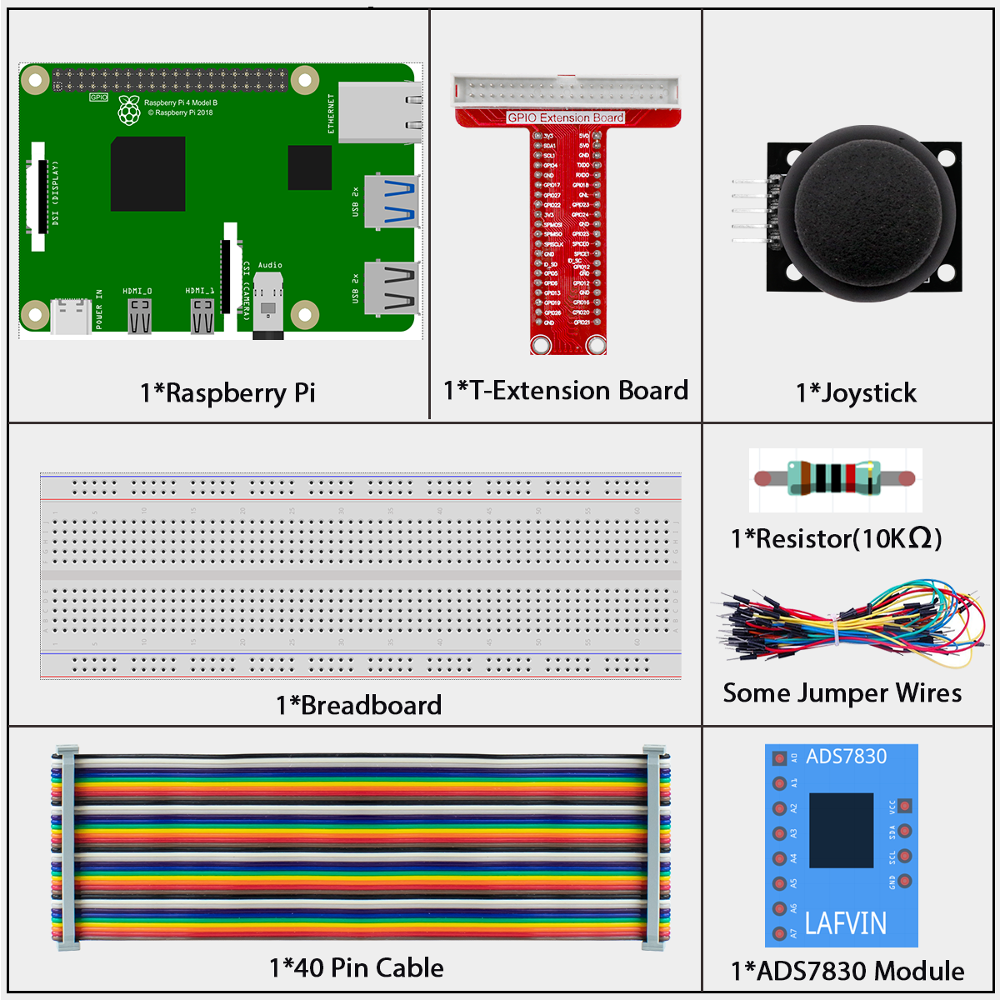
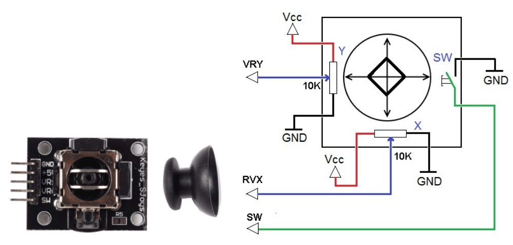
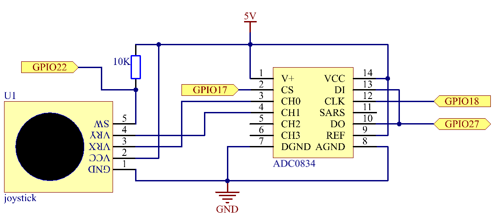

# 2.1.2Joystick

## Introduction

In this project, We’re going to learn how joystick works. We manipulate the Joystick and display the results on the screen.

## Components



**Joystick**

The basic idea of a joystick is to translate the movement of a stick into electronic information that a computer can process.

In order to communicate a full range of motion to the computer, a joystick needs to measure the stick’s position on two axes – the X-axis (left to right) and the Y-axis (up and down). Just as in basic geometry, the X-Y coordinates pinpoint the stick’s position exactly.

To determine the location of the stick, the joystick control system simply monitors the position of each shaft. The conventional analog joystick design does this with two potentiometers, or variable resistors.

The joystick also has a digital input that is actuated when the joystick is pressed down.



When the data of joystick is read, there are some differents between axis: data of X and Y axis is analog, which need to use ADC0834 to convert the analog value to digital value. Data of Z axis is digital, so you can directly use the GPIO to read, or you can also use ADC to read.

## Connect





## Code

### For  C  Language User

Go to the code folder compile and run.

```sh
cd ~/super-starter-kit-for-raspberry-pi/c/2.1.2/
gcc 2.1.2_Joystick.c -lwiringPi
sudo ./a.out
```

After the code runs, turn the Joystick, then the corresponding values of x, y, Btn are displayed on screen.

This is the complete code

```c
#include <wiringPi.h>
#include <stdio.h>
#include <softPwm.h>
#include <ADCDevice.hpp>

#define Z_Pin 1     //define pin for axis Z

ADCDevice *adc;  // Define an ADC Device class object

int main(void){
    adc = new ADCDevice();
    printf("Program is starting ... \n");
    

    if(adc->detectI2C(0x48)){// Detect the ads7830
        delete adc;               // Free previously pointed memory
        adc = new ADS7830();      // If detected, create an instance of ADS7830.
    }
    else{
        printf("No correct I2C address found, \n"
        "Please use command 'i2cdetect -y 1' to check the I2C address! \n"
        "Program Exit. \n");
        return -1;
    }    
    wiringPiSetup();    
    pinMode(Z_Pin,INPUT);       //set Z_Pin as input pin and pull-up mode
    pullUpDnControl(Z_Pin,PUD_UP);    
    while(1){
        int val_Z = digitalRead(Z_Pin);  //read digital value of axis Z
        int val_Y = adc->analogRead(0);      //read analog value of axis X and Y
        int val_X = adc->analogRead(1);
        printf("val_X: %d  ,\tval_Y: %d  ,\tval_Z: %d \n",val_X,val_Y,val_Z);
        delay(100);
    }
    return 0;
}
```

### For  Python  Language User

Go to the code folder and run.

```sh
cd ~/super-starter-kit-for-raspberry-pi/python
python 2.1.2_Joystick.py
```

After the code runs, turn the Joystick, then the corresponding values of x, y, Btn are displayed on screen.

This is the complete code

```python
import RPi.GPIO as GPIO
import time
from ADCDevice import *

Z_Pin = 12      # define Z_Pin
adc = ADCDevice() # Define an ADCDevice class object

def setup():
    global adc
    if(adc.detectI2C(0x48)): # Detect the ads7830
        adc = ADS7830()
    else:
        print("No correct I2C address found, \n"
        "Please use command 'i2cdetect -y 1' to check the I2C address! \n"
        "Program Exit. \n");
        exit(-1)
    GPIO.setmode(GPIO.BOARD)        
    GPIO.setup(Z_Pin,GPIO.IN,GPIO.PUD_UP)   # set Z_Pin to pull-up mode
def loop():
    while True:     
        val_Z = GPIO.input(Z_Pin)       # read digital value of axis Z
        val_Y = adc.analogRead(0)           # read analog value of axis X and Y
        val_X = adc.analogRead(1)
        print ('value_X: %d ,\tvlue_Y: %d ,\tvalue_Z: %d'%(val_X,val_Y,val_Z))
        time.sleep(0.01)

def destroy():
    adc.close()
    GPIO.cleanup()
    
if __name__ == '__main__':
    print ('Program is starting ... ') # Program entrance
    setup()
    try:
        loop()
    except KeyboardInterrupt: # Press ctrl-c to end the program.
        destroy()
```

## Phenomenon

