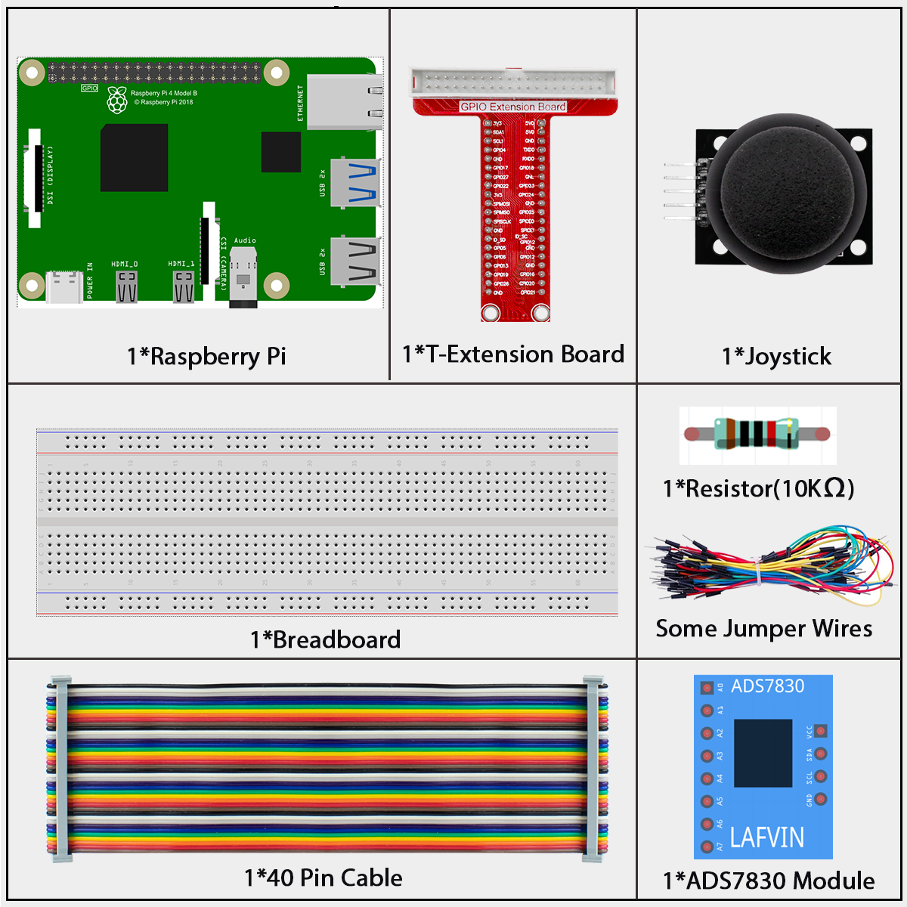
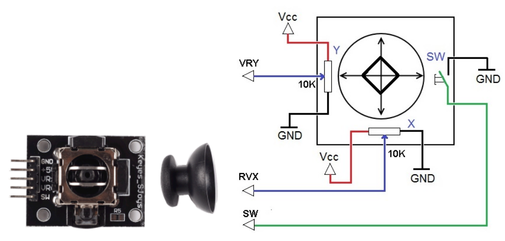
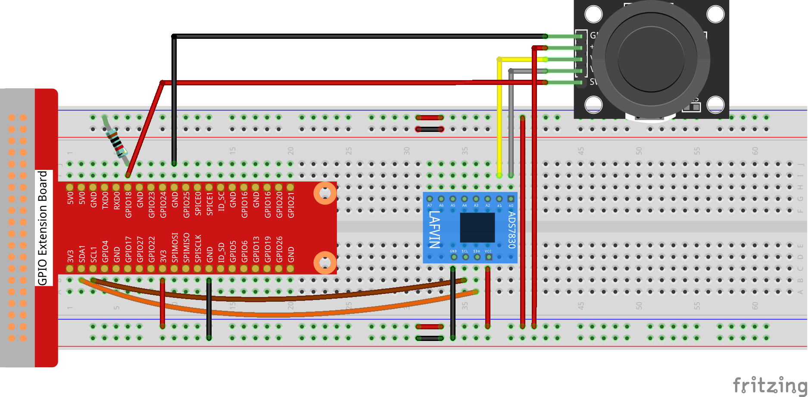
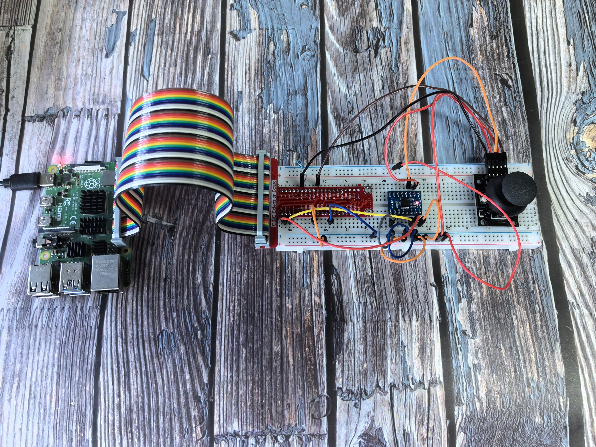

=================
2.1.2 Joystick
=================

Introduction
------------

In this beginner-friendly project, you'll learn how a joystick works by moving it around and seeing the results displayed on your screen. This will teach you about analog inputs and how to read position data.

Components
----------

**What is ADS7830?**

The ADS7830 is a special chip that helps your Raspberry Pi read analog signals. Think of it as a translator - it converts the continuous voltage signals from the joystick into digital numbers that your computer can understand.

Key features for beginners:
- It can read 8 different analog inputs
- It uses I2C communication (a simple 2-wire protocol)
- It provides 8-bit resolution (values from 0 to 255)

.. image:: ./img/ADS7830_Module.png

**Understanding ADC (Analog-to-Digital Converter)**

**What does ADC do?**
An ADC converts analog signals (like the smooth movement of a joystick) into digital numbers that computers can work with.

**How does it work?**
Our ADC has 8-bit resolution, which means it can produce 256 different values (2^8 = 256). It takes the 3.3V input range and divides it into 256 equal parts:

.. image:: ./img/ADC_S.png

**Simple breakdown:**
- **Range 1:** 0V to 3.3/256V = Digital value 0
- **Range 2:** 3.3/256V to 2×3.3/256V = Digital value 1
- **Range 3:** 2×3.3/256V to 3×3.3/256V = Digital value 2
- And so on...

**Why does this matter?**
The more bits an ADC has, the more precise it becomes. With 8 bits, we get 256 different positions - that's pretty good for detecting joystick movement!

**What is a Joystick?**

A joystick is like a mini steering wheel that can move in all directions. It translates the physical movement of a stick into electrical signals that your computer can read.

**How does it work?**
- **X-axis:** Measures left-to-right movement
- **Y-axis:** Measures up-and-down movement  
- **Z-axis:** Detects when you press the joystick down like a button

Think of it like a coordinate system in math class - any position can be described using X and Y coordinates!

**The magic inside:**
The joystick uses two potentiometers (variable resistors) - one for each axis. As you move the stick, these potentiometers change their resistance, which changes the voltage output.

**Reading Joystick Data - The Three Types:**

1. **X and Y-axis data:** These are analog signals (smooth, continuous values) that need the ADS7830 to convert them to digital numbers
2. **Z-axis data:** This is a simple digital signal (pressed = 0, not pressed = 1) that can be read directly by a GPIO pin

**Beginner tip:** The joystick essentially gives you three pieces of information - where it's pointing horizontally (X), where it's pointing vertically (Y), and whether it's being pressed down (Z)!

Connect
-------
.. list-table::
   :header-rows: 1
   :widths: 25 25 25 25

   * - T-Board Name
     - physical
     - wiringPi
     - BCM
   * - GPIO17
     - Pin 11
     - 0
     - 17
   * - GPIO28
     - Pin 12
     - 1
     - 18
   * - GPIO27
     - Pin 13
     - 2
     - 27
   * - GPIO22
     - Pin 15
     - 3
     - 22

Code
----

For C Language User
~~~~~~~~~~~~~~~~~~~~~~

Go to the code folder compile and run.

.. code-block:: shell

   cd ~/super-starter-kit-for-raspberry-pi/c/2.1.2/

.. code-block:: shell

   g++ 2.1.2_Joystick.cpp -I ../Lib/ADCDevice -L ../Lib/ADCDevice -lADCDevice -lwiringPi

.. code-block:: shell

   sudo ./a.out

After the code runs, turn the Joystick, then the corresponding values of x, y, Btn are displayed on screen.

This is the complete code

.. code-block:: c

    #include <wiringPi.h>
    #include <stdio.h>
    #include <softPwm.h>
    #include <ADCDevice.hpp>

    #define Z_Pin 1     //define pin for axis Z

    ADCDevice *adc;  // Define an ADC Device class object

    int main(void){
        adc = new ADCDevice();
        printf("Program is starting ... \n");
        
        if(adc->detectI2C(0x48)){// Detect the ads7830
            delete adc;               // Free previously pointed memory
            adc = new ADS7830();      // If detected, create an instance of ADS7830.
        }
        else{
            printf("No correct I2C address found, \n"
            "Please use command 'i2cdetect -y 1' to check the I2C address! \n"
            "Program Exit. \n");
            return -1;
        }    
        wiringPiSetup();    
        pinMode(Z_Pin,INPUT);       //set Z_Pin as input pin and pull-up mode
        pullUpDnControl(Z_Pin,PUD_UP);    
        while(1){
            int val_Z = digitalRead(Z_Pin);  //read digital value of axis Z
            int val_Y = adc->analogRead(0);      //read analog value of axis X and Y
            int val_X = adc->analogRead(1);
            printf("val_X: %d  ,\tval_Y: %d  ,\tval_Z: %d \n",val_X,val_Y,val_Z);
            delay(100);
        }
        return 0;
    }

For Python Language User
~~~~~~~~~~~~~~~~~~~~~~~~~

Go to the code folder and run.

.. code-block:: shell

   cd ~/super-starter-kit-for-raspberry-pi/python

.. code-block:: shell

   python 2.1.2_Joystick.py

After the code runs, turn the Joystick, then the corresponding values of x, y, Btn are displayed on screen.

This is the complete code

.. code-block:: python

    #!/usr/bin/env python3

    import RPi.GPIO as GPIO
    import time
    from ADCDevice import *

    Z_Pin = 12      # define Z_Pin
    adc = ADCDevice() # Define an ADCDevice class object

    def setup():
        global adc
        if(adc.detectI2C(0x48)): # Detect the ads7830
            adc = ADS7830()
        else:
            print("No correct I2C address found, \n"
            "Please use command 'i2cdetect -y 1' to check the I2C address! \n"
            "Program Exit. \n");
            exit(-1)
        GPIO.setmode(GPIO.BOARD)        
        GPIO.setup(Z_Pin,GPIO.IN,GPIO.PUD_UP)   # set Z_Pin to pull-up mode
    def loop():
        while True:     
            val_Z = GPIO.input(Z_Pin)       # read digital value of axis Z
            val_Y = adc.analogRead(0)           # read analog value of axis X and Y
            val_X = adc.analogRead(1)
            print ('value_X: %d ,\tvlue_Y: %d ,\tvalue_Z: %d'%(val_X,val_Y,val_Z))
            time.sleep(0.01)

    def destroy():
        adc.close()
        GPIO.cleanup()
        
    if __name__ == '__main__':
        print ('Program is starting ... ') # Program entrance
        setup()
        try:
            loop()
        except KeyboardInterrupt: # Press ctrl-c to end the program.
            destroy()

Phenomenon
----------

