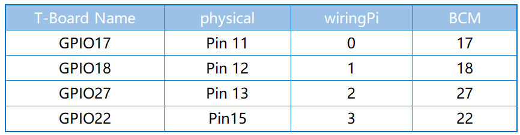

=================
2.1.2 Joystick
=================

Introduction
------------

In this project, We're going to learn how joystick works. We manipulate the Joystick and display the results on the screen.

Components
----------

.. image:: ./img/list/list_2.1.2.png

**ADS7830**

The ADS7830 is a single-supply, low-power, 8-bit data acquisition device that features a serial I2C interface and an 8-channel multiplexer. The following table is the pin definition diagram of ADS7830.

.. image:: ./img/ADS7830_Module.png

**ADC**

An ADC is an electronic integrated circuit used to convert analog signals such as voltages to digital or
binary form consisting of 1s and 0s. The range of our ADC module is 8 bits, that means the resolution is
2^8=256, so that its range (at 3.3V) will be divided equally to 256 parts.
Any analog value can be mapped to one digital value using the resolution of the converter. So the more bits
the ADC has, the denser the partition of analog will be and the greater the precision of the resulting conversion.

.. image:: ./img/ADC_S.png

Subsection 1: the analog in range of 0V-3.3/256 V corresponds to digital 0;

Subsection 2: the analog in range of 3.3 /256 V-2*3.3 /256V corresponds to digital 1;

...

The resultant analog signal will be divided accordingly.

**Joystick**

The basic idea of a joystick is to translate the movement of a stick into electronic information that a computer can process.

In order to communicate a full range of motion to the computer, a joystick needs to measure the stick's position on two axes – the X-axis (left to right) and the Y-axis (up and down). Just as in basic geometry, the X-Y coordinates pinpoint the stick's position exactly.

To determine the location of the stick, the joystick control system simply monitors the position of each shaft. The conventional analog joystick design does this with two potentiometers, or variable resistors.

The joystick also has a digital input that is actuated when the joystick is pressed down.

.. image:: ./img/image318.png

When the data of joystick is read, there are some differents between axis: data of X and Y axis is analog, which need to use ADC0834 to convert the analog value to digital value. Data of Z axis is digital, so you can directly use the GPIO to read, or you can also use ADC to read.

Connect
-------

.. image:: ./img/connect/2.1.2.png

Code
----

For C Language User
~~~~~~~~~~~~~~~~~~~~~~

Go to the code folder compile and run.

.. code-block:: shell

   cd ~/super-starter-kit-for-raspberry-pi/c/2.1.2/
   gcc 2.1.2_Joystick.c -lwiringPi
   sudo ./a.out

After the code runs, turn the Joystick, then the corresponding values of x, y, Btn are displayed on screen.

This is the complete code

.. code-block:: c

    xxxx

For Python Language User
~~~~~~~~~~~~~~~~~~~~~~~~~

Go to the code folder and run.

.. code-block:: shell

   cd ~/super-starter-kit-for-raspberry-pi/python
   python 2.1.2_Joystick.py

After the code runs, turn the Joystick, then the corresponding values of x, y, Btn are displayed on screen.

This is the complete code

.. code-block:: python

    xxxx

Phenomenon
----------

.. image:: ./img/phenomenon/212.jpg