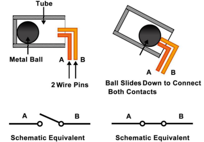
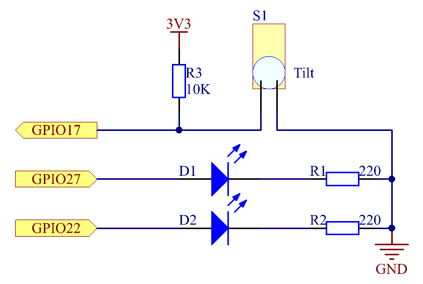

=================
2.1.3 Tilt Switch
=================

Introduction
------------

This is a ball tilt-switch with a metal ball inside. It is used to detect inclinations of a small angle.

Components
----------

.. image:: ./img/list/list_2.1.3_tilt_switch.png

**Tilt**

The principle is very simple. When the switch is tilted in a certain angle, the ball inside rolls down and touches the two contacts connected to the pins outside, thus triggering circuits. Otherwise the ball will stay away from the contacts, thus breaking the circuits.

Connect
-------

.. image:: ./img/connect/2.1.3.png

Code
----

For C Language User
~~~~~~~~~~~~~~~~~~~~~~

Go to the code folder compile and run.

.. code-block:: shell

   cd ~/super-starter-kit-for-raspberry-pi/c/2.1.3/
   gcc 2.1.3_Tilt.c -lwiringPi
   sudo ./a.out

Place the tilt horizontally, and the green LED will turns on. If you tilt it, "Tilt!" will be printed on the screen and the red LED will lights on. Place it horizontally again, and the green LED will turns on again.

This is the complete code

.. code-block:: c

    xxxx

For Python Language User
~~~~~~~~~~~~~~~~~~~~~~~~~~~

Go to the code folder and run.

.. code-block:: shell

   cd ~/super-starter-kit-for-raspberry-pi/python
   python 2.1.3_Tilt.py

Place the tilt horizontally, and the green LED will turns on. If you tilt it, "Tilt!" will be printed on the screen and the red LED will lights on. Place it horizontally again, and the green LED will turns on again.

This is the complete code

.. code-block:: python

    xxxx

Phenomenon
----------

.. image:: ./img/phenomenon/213.jpg