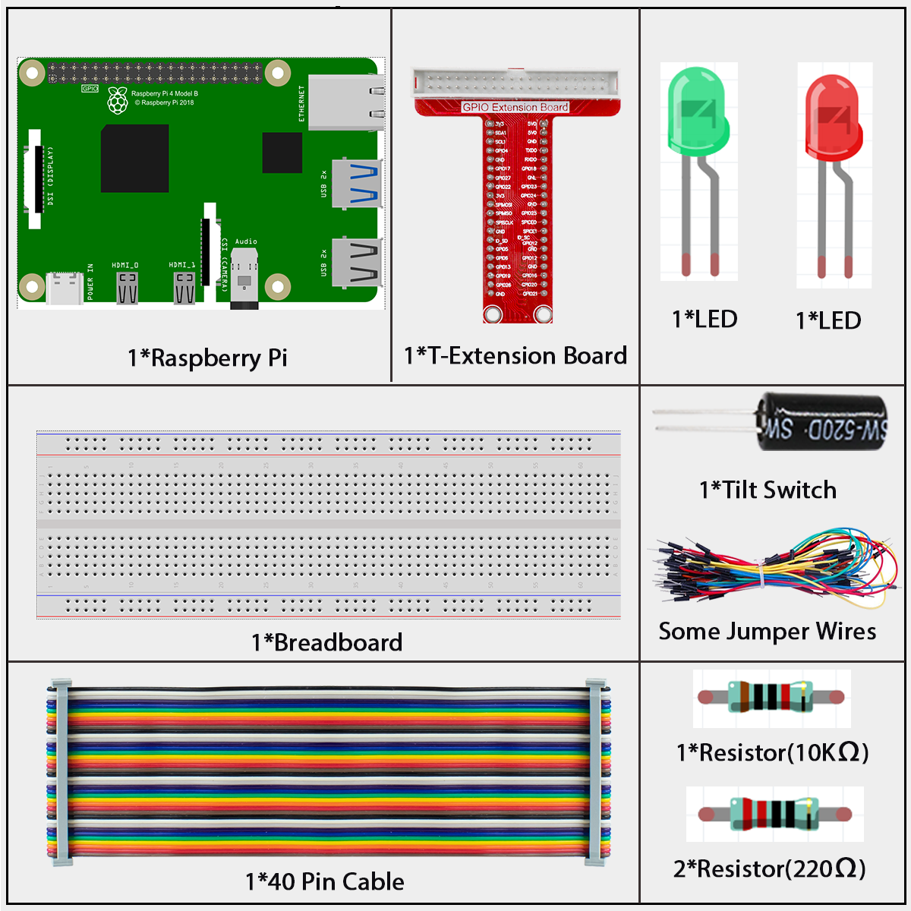
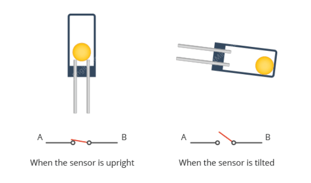
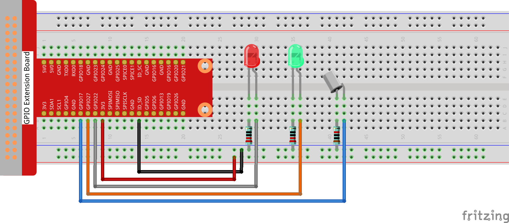
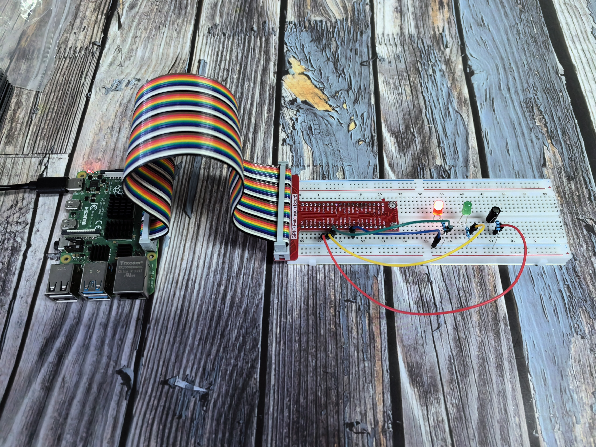

=================
2.1.3 Tilt Switch
=================

Introduction
------------

In this beginner-friendly project, you'll learn how to detect when something is tilted or moved using a simple tilt switch sensor. This is commonly used in projects like burglar alarms, motion detectors, or automatic screen rotation on phones!

Components
----------

**What is a Tilt Switch?**

A tilt switch is a simple but clever sensor that can detect when it's been tilted or moved. Think of it like a digital spirit level that gives you a simple "tilted" or "not tilted" signal.

**How does it work?**

Inside the small cylindrical case, there's a tiny metal ball that acts as the "switch". Here's the simple principle:

**The Magic Inside:**

1. **When upright:** The metal ball sits at the bottom, touching both metal contacts inside. This completes the electrical circuit (like a closed switch).

2. **When tilted:** The ball rolls away from the contacts, breaking the electrical connection (like an open switch).

**Real-world analogy:** 
Imagine a marble in a small tube. When you hold the tube straight up, the marble sits at the bottom touching both ends. When you tilt the tube, the marble rolls to one side and only touches one end (or neither).

**Why is this useful?**
- **Simple detection:** You get a clear ON/OFF signal
- **No complex programming:** Just check if the circuit is complete or broken
- **Very reliable:** No moving parts to wear out (except the ball rolling)
- **Low power:** Only uses power when you check its state

Connect
-------
.. list-table::
   :header-rows: 1
   :widths: 25 25 25 25

   * - T-Board Name
     - physical
     - wiringPi
     - BCM
   * - GPIO17
     - Pin 27
     - 0
     - 17
   * - GPIO27
     - Pin 13
     - 2
     - 27
   * - GPIO22
     - Pin 15
     - 3
     - 22

Code
----

For C Language User
~~~~~~~~~~~~~~~~~~~~~~

Go to the code folder compile and run.

.. code-block:: shell

   cd ~/super-starter-kit-for-raspberry-pi/c/2.1.3/

.. code-block:: shell

   gcc 2.1.3_Tilt.c -lwiringPi

.. code-block:: shell

   sudo ./a.out

Place the tilt horizontally, and the green LED will turns on. If you tilt it, "Tilt!" will be printed on the screen and the red LED will lights on. Place it horizontally again, and the green LED will turns on again.

This is the complete code

.. code-block:: c

    #include <wiringPi.h>
    #include <stdio.h>
    #include <stdlib.h>
    #include <signal.h>

    // Define GPIO pins.
    #define TILT_SWITCH_PIN 0
    #define LED_GREEN_PIN   2
    #define LED_RED_PIN     3

    // Define an enumeration for LED colors for type-safe control.
    typedef enum {
        OFF,
        GREEN,
        RED
    } LedColor;

    volatile int running = 1;

    void signal_handler(int sig) {
        running = 0;
    }

    /**
    * @brief Controls the state of the dual-color LED.
    * @param color The desired color (OFF, GREEN, or RED).
    */
    void set_led_color(LedColor color) {
        switch (color) {
            case GREEN:
                digitalWrite(LED_GREEN_PIN, HIGH);
                digitalWrite(LED_RED_PIN, LOW);
                break;
            case RED:
                digitalWrite(LED_GREEN_PIN, LOW);
                digitalWrite(LED_RED_PIN, HIGH);
                break;
            case OFF:
            default:
                digitalWrite(LED_GREEN_PIN, LOW);
                digitalWrite(LED_RED_PIN, LOW);
                break;
        }
    }

    /**
    * @brief Initializes wiringPi and configures GPIO pins.
    */
    void setup_hardware() {
        if (wiringPiSetup() == -1) {
            printf("Failed to setup wiringPi!\n");
            exit(1);
        }
        
        // Set up the tilt switch pin as an input with pull-up resistor
        pinMode(TILT_SWITCH_PIN, INPUT);
        pullUpDnControl(TILT_SWITCH_PIN, PUD_UP);  // 🔑 关键修复！
        
        // Set up LED pins as outputs.
        pinMode(LED_GREEN_PIN, OUTPUT);
        pinMode(LED_RED_PIN, OUTPUT);

        // Start with the green LED on to indicate normal state.
        set_led_color(GREEN);
        
        printf("Tilt switch hardware setup successful!\n");
        printf("Press Ctrl+C to stop...\n");
    }

    /**
    * @brief Main loop to poll the tilt switch and update the LED.
    */
    void poll_tilt_loop() {
        int last_tilt_state = -1; // Use -1 to force an initial update.

        while (running) {
            int current_tilt_state = digitalRead(TILT_SWITCH_PIN);
            
            // Simple debounce: check the pin state twice with a small delay
            delay(10);
            if (digitalRead(TILT_SWITCH_PIN) != current_tilt_state) {
                continue; // State changed during delay, skip this reading.
            }

            // Only update the LED and print a message if the state has changed.
            if (current_tilt_state != last_tilt_state) {
                if (current_tilt_state == LOW) {
                    printf("Device is TILTED!\n");
                    set_led_color(RED);
                } else {
                    printf("Device is UPRIGHT.\n");
                    set_led_color(GREEN);
                }
                last_tilt_state = current_tilt_state;
            }
            
            delay(50);
        }
    }

    /**
    * @brief Clean up function
    */
    void cleanup() {
        printf("\nCleaning up...\n");
        set_led_color(OFF);
        printf("LEDs turned off\n");
    }

    /**
    * @brief Main function.
    * @return Integer status code.
    */
    int main(void) {
        signal(SIGINT, signal_handler);
        signal(SIGTERM, signal_handler);
        
        setup_hardware();
        poll_tilt_loop();
        cleanup();
        
        return 0;
    }

For Python Language User
~~~~~~~~~~~~~~~~~~~~~~~~~~~

Go to the code folder and run.

.. code-block:: shell

   cd ~/super-starter-kit-for-raspberry-pi/python

.. code-block:: shell

   python 2.1.3_Tilt.py

Place the tilt horizontally, and the green LED will turns on. If you tilt it, "Tilt!" will be printed on the screen and the red LED will lights on. Place it horizontally again, and the green LED will turns on again.

This is the complete code

.. code-block:: python

    #!/usr/bin/env python3
    """
    Tilt Switch Sensor Control - Python version matching C implementation

    This implementation replicates the C code's features:
    1. Polling method instead of interrupt for better control
    2. LED color enumeration for type-safe control
    3. Debounce mechanism to prevent false triggers
    4. State change detection to reduce unnecessary updates
    5. Professional function naming and structure
    """

    import RPi.GPIO as GPIO
    import time
    import sys
    from enum import Enum

    # Define GPIO pins (C wiringPi pins mapped to BOARD pins)
    # C: TILT_SWITCH_PIN 0 -> BOARD pin 11 (BCM GPIO 17)
    # C: LED_GREEN_PIN   2 -> BOARD pin 13 (BCM GPIO 27) 
    # C: LED_RED_PIN     3 -> BOARD pin 15 (BCM GPIO 22)
    TILT_SWITCH_PIN = 11
    LED_GREEN_PIN = 13
    LED_RED_PIN = 15

    # Define an enumeration for LED colors for type-safe control (matching C code)
    class LedColor(Enum):
        OFF = 0
        GREEN = 1
        RED = 2

    def set_led_color(color):
        """
        Controls the state of the dual-color LED.
        Parameters: color - The desired color (LedColor.OFF, GREEN, or RED)
        """
        if color == LedColor.GREEN:
            GPIO.output(LED_GREEN_PIN, GPIO.HIGH)
            GPIO.output(LED_RED_PIN, GPIO.LOW)
        elif color == LedColor.RED:
            GPIO.output(LED_GREEN_PIN, GPIO.LOW) 
            GPIO.output(LED_RED_PIN, GPIO.HIGH)
        else:  # LedColor.OFF or default
            GPIO.output(LED_GREEN_PIN, GPIO.LOW)
            GPIO.output(LED_RED_PIN, GPIO.LOW)

    def setup_hardware():
        """
        Initializes GPIO and configures pins.
        Returns: 0 on success, 1 on failure.
        """
        try:
            GPIO.setmode(GPIO.BOARD)
            GPIO.setwarnings(False)
            
            # Set up the tilt switch pin as an input
            # Assumes an external pull-up or pull-down resistor is part of the module
            GPIO.setup(TILT_SWITCH_PIN, GPIO.IN, pull_up_down=GPIO.PUD_UP)
            
            # Set up LED pins as outputs
            GPIO.setup(LED_GREEN_PIN, GPIO.OUT)
            GPIO.setup(LED_RED_PIN, GPIO.OUT)
            
            # Start with the green LED on to indicate normal state
            set_led_color(LedColor.GREEN)
            
            print("Tilt switch hardware setup successful!")
            print(f"Tilt switch pin: {TILT_SWITCH_PIN}")
            print(f"Green LED pin: {LED_GREEN_PIN}")
            print(f"Red LED pin: {LED_RED_PIN}")
            print("Initial state: GREEN (Device upright)")
            print("-" * 50)
            return 0
            
        except Exception as e:
            print(f"Failed to setup hardware: {e}")
            return 1

    def poll_tilt_loop():
        """
        Main loop to poll the tilt switch and update the LED.
        This function runs indefinitely until interrupted.
        """
        try:
            last_tilt_state = -1  # Use -1 to force an initial update
            
            while True:
                current_tilt_state = GPIO.input(TILT_SWITCH_PIN)
                
                # Simple debounce: check the pin state twice with a small delay
                # to ensure it wasn't a momentary flicker (matching C code)
                time.sleep(0.01)  # 10ms delay
                if GPIO.input(TILT_SWITCH_PIN) != current_tilt_state:
                    continue  # State changed during delay, skip this reading
                
                # Only update the LED and print message if the state has changed
                if current_tilt_state != last_tilt_state:
                    if current_tilt_state == GPIO.LOW:
                        # A LOW signal typically indicates the sensor is tilted
                        print("Device is TILTED!")
                        set_led_color(LedColor.RED)
                    else:
                        # A HIGH signal indicates the sensor is upright
                        print("Device is UPRIGHT.")
                        set_led_color(LedColor.GREEN)
                        
                    last_tilt_state = current_tilt_state
                
                # A longer delay to prevent busy-waiting (matching C code)
                time.sleep(0.05)  # 50ms delay
                
        except KeyboardInterrupt:
            print("\nTilt switch polling interrupted by user")
            raise  # Re-raise to be handled by main()

    def destroy():
        """
        Clean up function for GPIO resources.
        Ensures LEDs are turned off and GPIO is properly cleaned up.
        """
        try:
            # Turn off both LEDs
            set_led_color(LedColor.OFF)
            GPIO.cleanup()
            print("LEDs turned off and GPIO cleaned up")
            
        except Exception as e:
            print(f"Error during cleanup: {e}")

    def main():
        """
        Main function - matches C code structure.
        Returns: Integer status code. 0 for success, 1 for error.
        """
        print("Tilt Switch Sensor Control")
        print("Monitoring tilt state with dual-color LED indicator")
        print("GREEN = Device upright, RED = Device tilted")
        print("Press Ctrl+C to stop...")
        print("=" * 50)
        
        # Initialize the hardware
        if setup_hardware() != 0:
            return 1  # Exit if setup fails
        
        try:
            # Start the main polling loop
            poll_tilt_loop()
            
        except KeyboardInterrupt:
            print("\nProgram interrupted by user")
            destroy()
            return 0
            
        except Exception as e:
            print(f"An error occurred: {e}")
            destroy()
            return 1

    if __name__ == '__main__':
        exit_code = main()
        sys.exit(exit_code)

Phenomenon
----------

