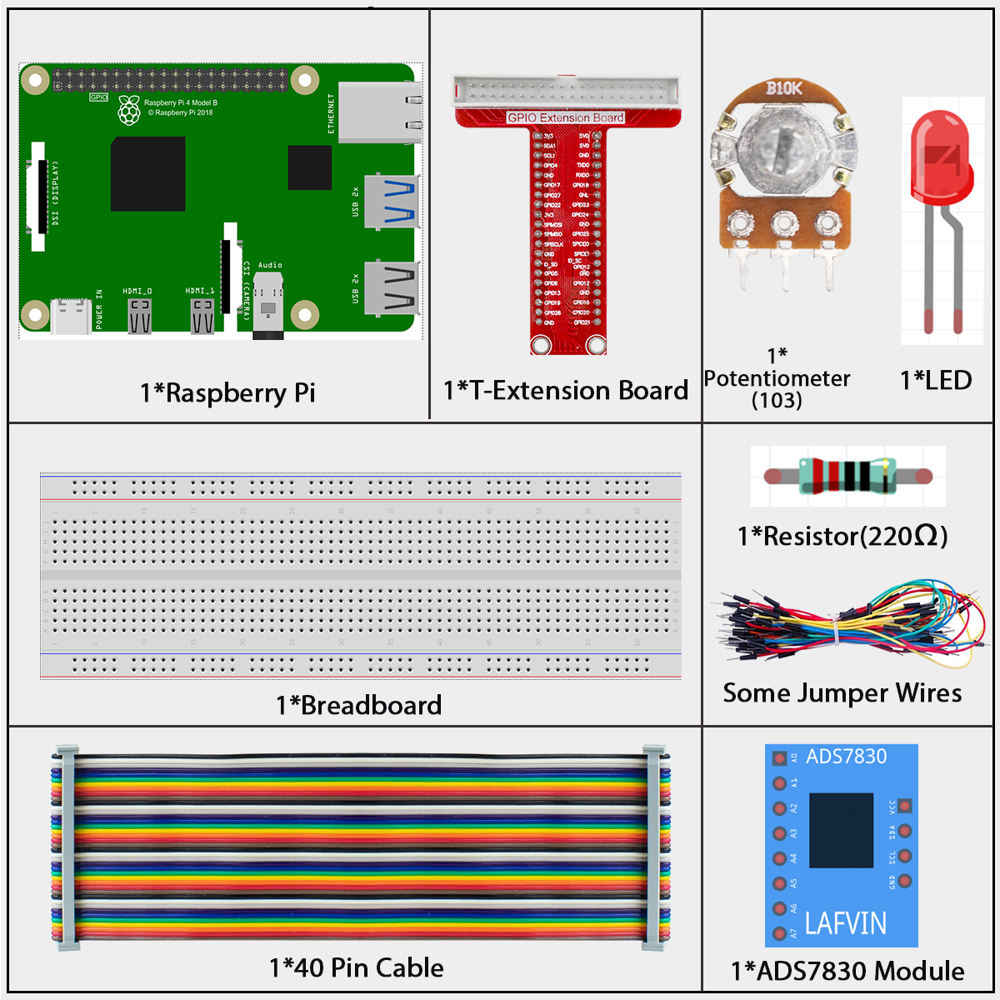
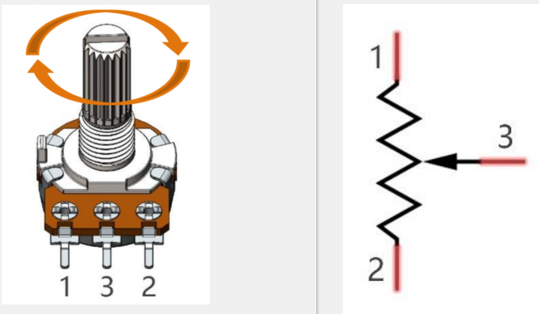
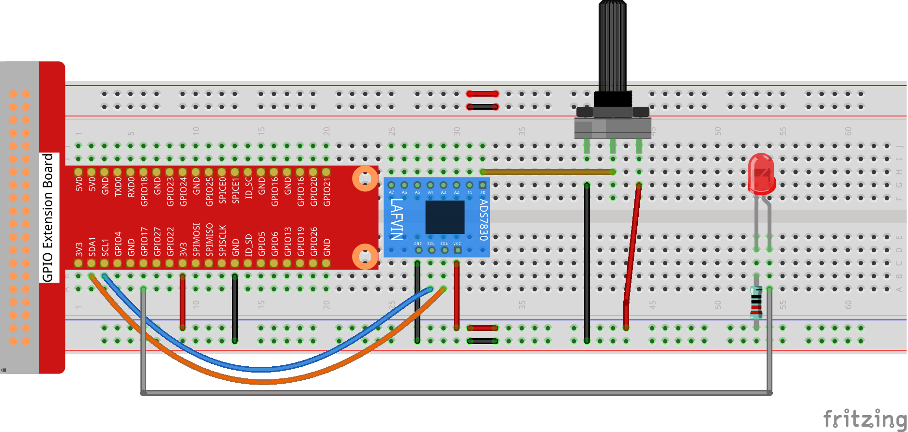
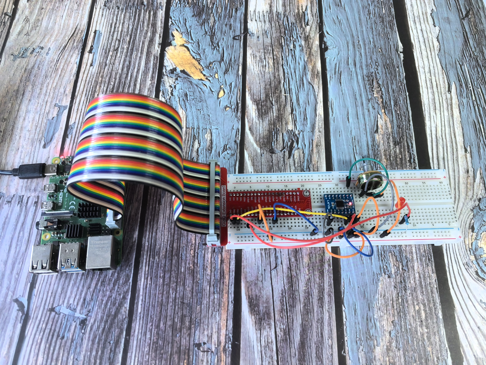

=====================
2.1.4 Potentiometer
=====================

Introduction
------------

In this beginner-friendly project, you'll learn how to read analog signals using an ADC (Analog-to-Digital Converter). We'll use a potentiometer as our analog input device - think of it like a volume knob that you can turn to create different voltage levels. The ADC0834 chip will then convert these analog voltage changes into digital numbers that your Raspberry Pi can understand and work with.

Components
----------

**What is ADS7830?**

The ADS7830 is a special chip that helps your Raspberry Pi read analog signals. Think of it as a translator - it converts the continuous voltage signals from the joystick into digital numbers that your computer can understand.

Key features for beginners:
- It can read 8 different analog inputs
- It uses I2C communication (a simple 2-wire protocol)
- It provides 8-bit resolution (values from 0 to 255)
  
.. image:: ./img/ADS7830_Module.png

**Understanding ADC (Analog-to-Digital Converter)**

**What does ADC do?**
An ADC converts analog signals (like the smooth movement of a joystick) into digital numbers that computers can work with.

**How does it work?**
Our ADC has 8-bit resolution, which means it can produce 256 different values (2^8 = 256). It takes the 3.3V input range and divides it into 256 equal parts:

.. image:: ./img/ADC_S.png

**Simple breakdown:**
- **Range 1:** 0V to 3.3/256V = Digital value 0
- **Range 2:** 3.3/256V to 2×3.3/256V = Digital value 1
- **Range 3:** 2×3.3/256V to 3×3.3/256V = Digital value 2
- And so on...

**Why does this matter?**
The more bits an ADC has, the more precise it becomes. With 8 bits, we get 256 different positions - that's pretty good for detecting joystick movement!

**What is a Potentiometer?**

A potentiometer (often called a "pot") is like a variable resistor that you can adjust by turning a knob or sliding a lever. Think of it as the volume control on your radio or the brightness control on a lamp - you turn it to get different levels of output.

**How does it work?**

The potentiometer has 3 terminals (connection points) and works like a voltage divider:

**Simple explanation:**
- **Terminal 1 & 3:** Connected to the full resistor (10kΩ in our case)
- **Terminal 2 (middle):** Connected to a movable contact that slides along the resistor
- **The magic:** As you turn the knob, the middle contact moves, changing how much voltage appears at terminal 2

**Real-world analogy:**
Imagine a garden hose with a adjustable nozzle. The water pressure at the nozzle depends on how much you've opened or closed it. Similarly, the voltage at the middle terminal depends on where you've positioned the knob.

**Key features for beginners:**
- **3 terminals:** Two ends + one adjustable middle
- **10kΩ total resistance:** This means maximum resistance between the two end terminals
- **Continuous adjustment:** Smooth changes as you turn the knob
- **Voltage divider:** Creates a variable voltage output between 0V and the input voltage

**How we use it in circuits:**
When you connect power (like 3.3V) across the outer terminals and read the voltage from the middle terminal, you get a voltage that varies smoothly from 0V to 3.3V as you turn the knob. This analog voltage signal is perfect for the ADC to convert into digital values!

Connect
-------

.. note::
    Please place the chip by referring to the corresponding position depicted in the picture. Note that the grooves on the chip should be on the left when it is placed.

Code
----

For C Language User
~~~~~~~~~~~~~~~~~~~~~

Go to the code folder compile and run.

.. code-block:: shell

   cd ~/super-starter-kit-for-raspberry-pi/c/2.1.4/

.. code-block:: shell

   g++ 2.1.4_Potentiometer.cpp -lwiringPi -lADCDevice

.. code-block:: shell

   sudo ./a.out

After the code runs, rotate the knob on the potentiometer, the intensity of LED will change accordingly.

This is the complete code

.. code-block:: c

    #include <wiringPi.h>
    #include <stdio.h>
    #include <softPwm.h>
    #include <ADCDevice.hpp>

    #define ledPin 0

    ADCDevice *adc;  // Define an ADC Device class object

    int main(void){
        adc = new ADCDevice();
        printf("Program is starting ... \n");
        
        if(adc->detectI2C(0x48)){// Detect the ads7830
            delete adc;               // Free previously pointed memory
            adc = new ADS7830();      // If detected, create an instance of ADS7830.
        }
        else{
            printf("No correct I2C address found, \n"
            "Please use command 'i2cdetect -y 1' to check the I2C address! \n"
            "Program Exit. \n");
            return -1;
        }
        wiringPiSetup();
        softPwmCreate(ledPin,0,100);
        while(1){
            int adcValue = adc->analogRead(0);    //read analog value of A0 pin
            softPwmWrite(ledPin,adcValue*100/255);    // Mapping to PWM duty cycle
            float voltage = (float)adcValue / 255.0 * 3.3;  // Calculate voltage
            printf("ADC value : %d  ,\tVoltage : %.2fV\n",adcValue,voltage);
            delay(30);
        }
        return 0;
    }

For Python Language User
~~~~~~~~~~~~~~~~~~~~~~~~~~

Go to the code folder and run.

.. code-block:: shell

   cd ~/super-starter-kit-for-raspberry-pi/python

.. code-block:: shell

   python 2.1.4_Potentiometer.py

After the code runs, rotate the knob on the potentiometer, the intensity of LED will change accordingly.

This is the complete code

.. code-block:: python

    #!/usr/bin/env python3

    import RPi.GPIO as GPIO
    import time
    from ADCDevice import *

    ledPin = 11
    adc = ADCDevice() # Define an ADCDevice class object

    def setup():
        global adc
        if(adc.detectI2C(0x48)): # Detect the ads7830
            adc = ADS7830()
        else:
            print("No correct I2C address found, \n"
            "Please use command 'i2cdetect -y 1' to check the I2C address! \n"
            "Program Exit. \n");
            exit(-1)
        global p
        GPIO.setmode(GPIO.BOARD)
        GPIO.setup(ledPin,GPIO.OUT)
        p = GPIO.PWM(ledPin,1000)
        p.start(0)
            
    def loop():
        while True:
            value = adc.analogRead(0)    # read the ADC value of channel 0
            p.ChangeDutyCycle(value*100/255)        # Mapping to PWM duty cycle
            voltage = value / 255.0 * 3.3  # calculate the voltage value
            print ('ADC Value : %d, Voltage : %.2f'%(value,voltage))
            time.sleep(0.03)

    def destroy():
        p.stop()  # stop PWM
        GPIO.cleanup()
        adc.close()
        
    if __name__ == '__main__':   # Program entrance
        print ('Program is starting ... ')
        try:
            setup()
            loop()
        except KeyboardInterrupt: # Press ctrl-c to end the program.
            destroy()
            
Phenomenon
----------

