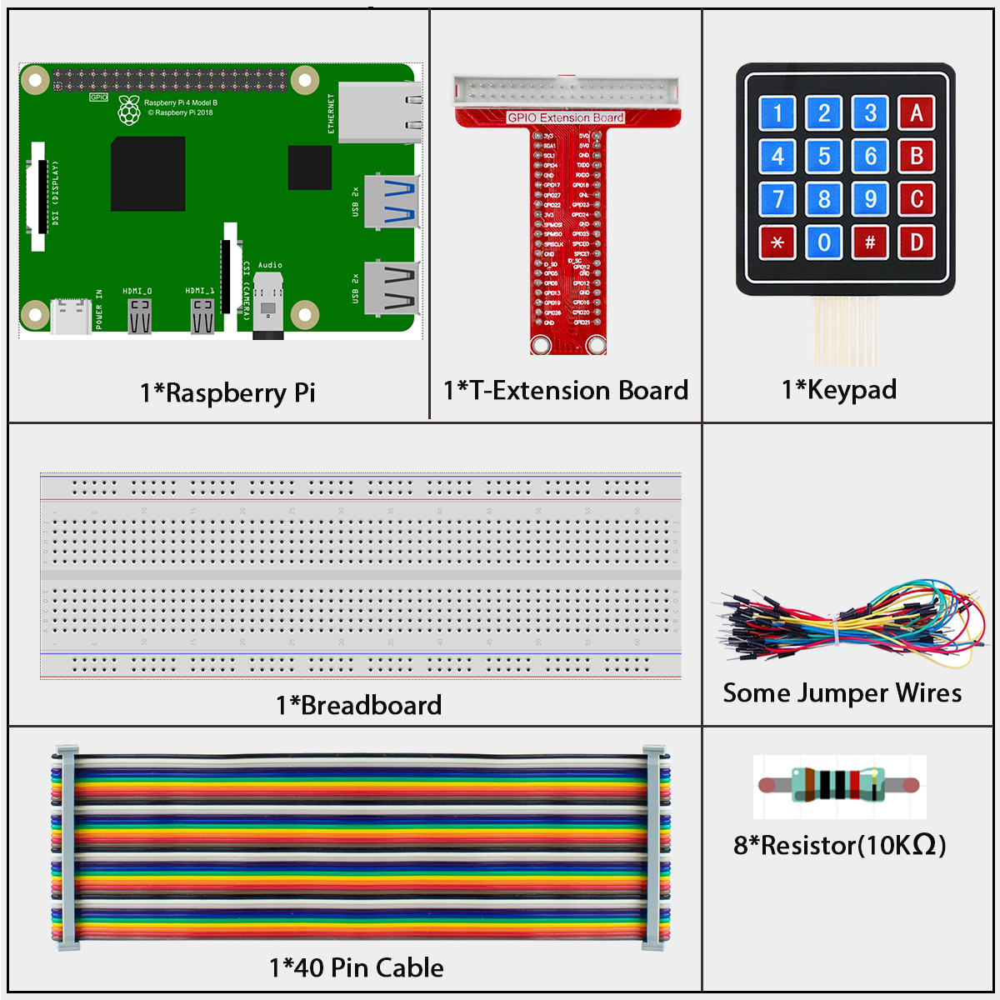
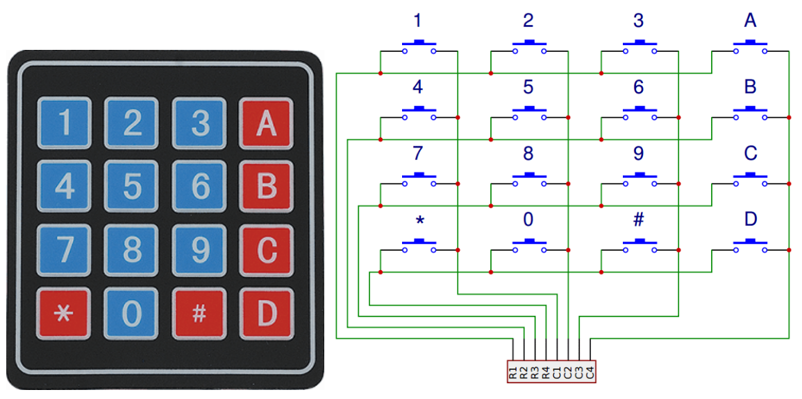
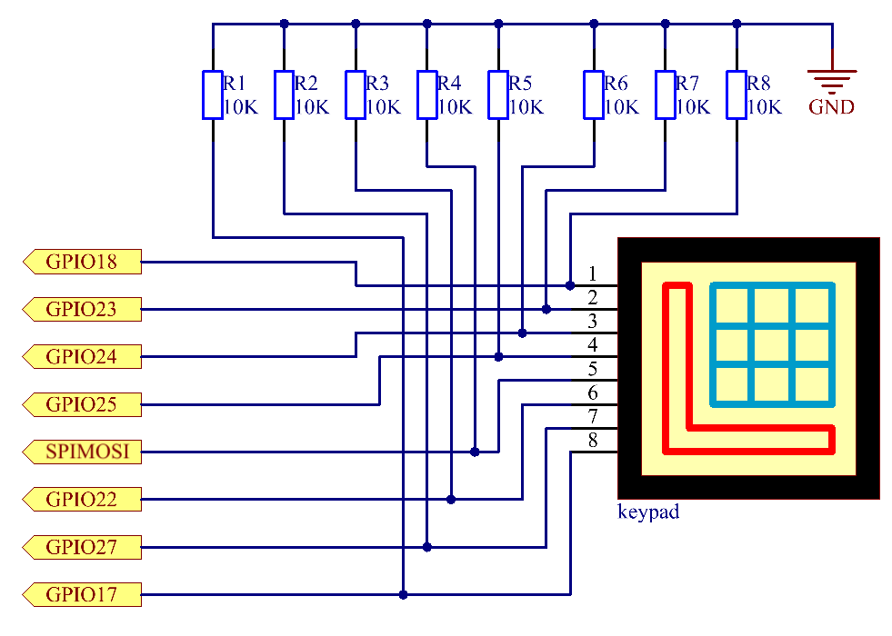

# 2.1.5 Keypad

## Introduction

A keypad is a rectangular array of buttons. In this project, We will use it input characters.

## Components



**Keypad**

A keypad is a rectangular array of 12 or 16 OFF-(ON) buttons. Their contacts are accessed via a header suitable for connection with a ribbon cable or insertion into a printed circuit board. In some keypads, each button connects with a separate contact in the header, while all the buttons share a common ground.



More often, the buttons are matrix encoded, meaning that each of them bridges a unique pair of conductors in a matrix. This configuration is suitable for polling by a microcontroller, which can be programmed to send an output pulse to each of the four horizontal wires in turn. During each pulse, it checks the remaining four vertical wires in sequence, to determine which one, if any, is carrying a signal. Pullup or pulldown resistors should be added to the input wires to prevent the inputs of the microcontroller from behaving unpredictably when no signal is present.

## Connect




## Code

### For  C  Language User

Go to the code folder compile and run.

```sh
cd ~/super-starter-kit-for-raspberry-pi/c/2.1.5/
gcc 2.1.5_Keypad.cpp -lwiringPi
sudo ./a.out
```

After the code runs, the values of pressed buttons on keypad (button Value) will be printed on the screen.

This is the complete code

```c
#include <wiringPi.h>
#include <stdio.h>

#define ROWS  4
#define COLS  4
#define BUTTON_NUM (ROWS * COLS)

unsigned char KEYS[BUTTON_NUM] {
'1','2','3','A',
'4','5','6','B',
'7','8','9','C',
'*','0','#','D'};

unsigned char rowPins[ROWS] = {1, 4, 5, 6};
unsigned char colPins[COLS] = {12, 3, 2, 0};

void keyRead(unsigned char* result);
bool keyCompare(unsigned char* a, unsigned char* b);
void keyCopy(unsigned char* a, unsigned char* b);
void keyPrint(unsigned char* a);
void keyClear(unsigned char* a);
int keyIndexOf(const char value);

void init(void) {
    for(int i=0 ; i<4 ; i++) {
        pinMode(rowPins[i], OUTPUT);
        pinMode(colPins[i], INPUT);
    }
}

int main(void){
    unsigned char pressed_keys[BUTTON_NUM];
    unsigned char last_key_pressed[BUTTON_NUM];

    if(wiringPiSetup() == -1){ //when initialize wiring failed,print message to screen
        printf("setup wiringPi failed !");
        return 1;
    }
    init();
    while(1){
        keyRead(pressed_keys);
        bool comp = keyCompare(pressed_keys, last_key_pressed);
        if (!comp){
            keyPrint(pressed_keys);
            keyCopy(last_key_pressed, pressed_keys);
        }
        delay(100);
    }
    return 0;
}

void keyRead(unsigned char* result){
    int index;
    int count = 0;
    keyClear(result);
    for(int i=0 ; i<ROWS ; i++ ){
        digitalWrite(rowPins[i], HIGH);
        for(int j =0 ; j < COLS ; j++){
            index = i * ROWS + j;
            if(digitalRead(colPins[j]) == 1){
                result[count]=KEYS[index];
                count += 1;
            }
        }
        delay(1);
        digitalWrite(rowPins[i], LOW);
    }
}

bool keyCompare(unsigned char* a, unsigned char* b){
    for (int i=0; i<BUTTON_NUM; i++){
        if (a[i] != b[i]){
            return false;
        }
    }
    return true;
}

void keyCopy(unsigned char* a, unsigned char* b){
    for (int i=0; i<BUTTON_NUM; i++){
        a[i] = b[i];
    }
}

void keyPrint(unsigned char* a){
    if (a[0] != 0){
        printf("%c",a[0]);
    }
    for (int i=1; i<BUTTON_NUM; i++){
        if (a[i] != 0){
            printf(", %c",a[i]);
        }
    }
    printf("\n");
}

void keyClear(unsigned char* a){
    for (int i=0; i<BUTTON_NUM; i++){
        a[i] = 0;
    }
}

int keyIndexOf(const char value){
    for (int i=0; i<BUTTON_NUM; i++){
        if ((const char)KEYS[i] == value){
            return i;
        }
    }
    return -1;
}
```

### For  Python  Language User

Go to the code folder and run.

```sh
cd ~/super-starter-kit-for-raspberry-pi/python
python 2.1.5_Keypad.py
```

After the code runs, the values of pressed buttons on keypad (button Value) will be printed on the screen.

This is the complete code

```python
import RPi.GPIO as GPIO
import time

class Keypad():

    def __init__(self, rowsPins, colsPins, keys):
        self.rowsPins = rowsPins
        self.colsPins = colsPins
        self.keys = keys
        GPIO.setwarnings(False)
        GPIO.setmode(GPIO.BCM)
        GPIO.setup(self.rowsPins, GPIO.OUT, initial=GPIO.LOW)
        GPIO.setup(self.colsPins, GPIO.IN, pull_up_down=GPIO.PUD_DOWN)

    def read(self):
        pressed_keys = []
        for i, row in enumerate(self.rowsPins):
            GPIO.output(row, GPIO.HIGH)
            for j, col in enumerate(self.colsPins):
                index = i * len(self.colsPins) + j
                if (GPIO.input(col) == 1):
                    pressed_keys.append(self.keys[index])
            GPIO.output(row, GPIO.LOW)
        return pressed_keys

def setup():
    global keypad, last_key_pressed
    rowsPins = [18,23,24,25]
    colsPins = [10,22,27,17]
    keys = ["1","2","3","A",
            "4","5","6","B",
            "7","8","9","C",
            "*","0","#","D"]
    keypad = Keypad(rowsPins, colsPins, keys)
    last_key_pressed = []

def loop():
    global keypad, last_key_pressed
    pressed_keys = keypad.read()
    if len(pressed_keys) != 0 and last_key_pressed != pressed_keys:
        print(pressed_keys)
    last_key_pressed = pressed_keys
    time.sleep(0.1)

# Define a destroy function for clean up everything after the script finished
def destroy():
    # Release resource
    GPIO.cleanup() 

if __name__ == '__main__':     # Program start from here
    try:
        setup()
        while True:
            loop()
    except KeyboardInterrupt:   # When 'Ctrl+C' is pressed, the program destroy() will be executed.
        destroy()
```

## Phenomenon

