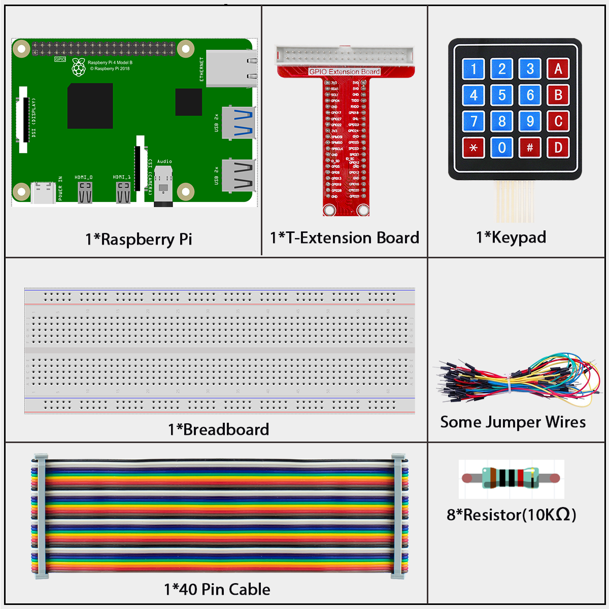
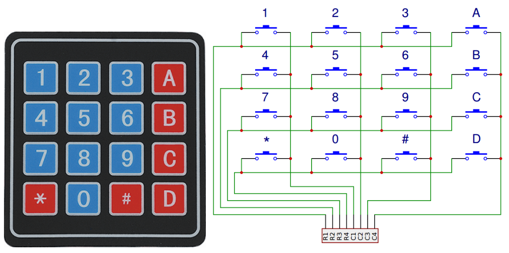
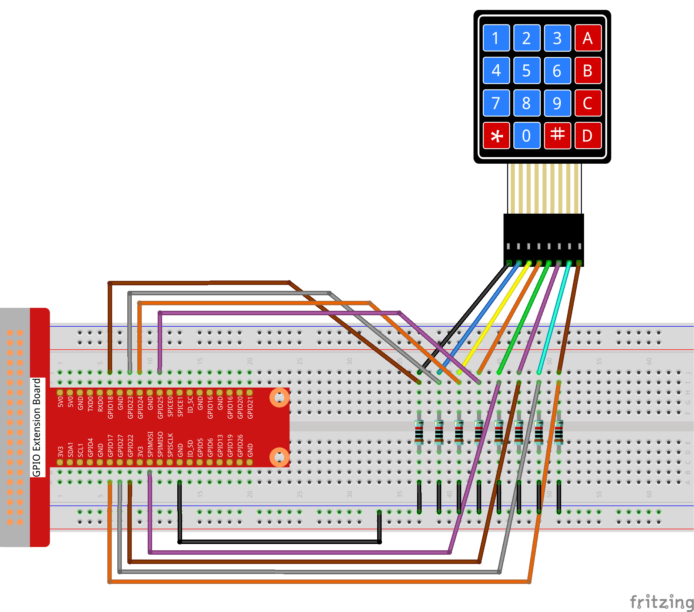
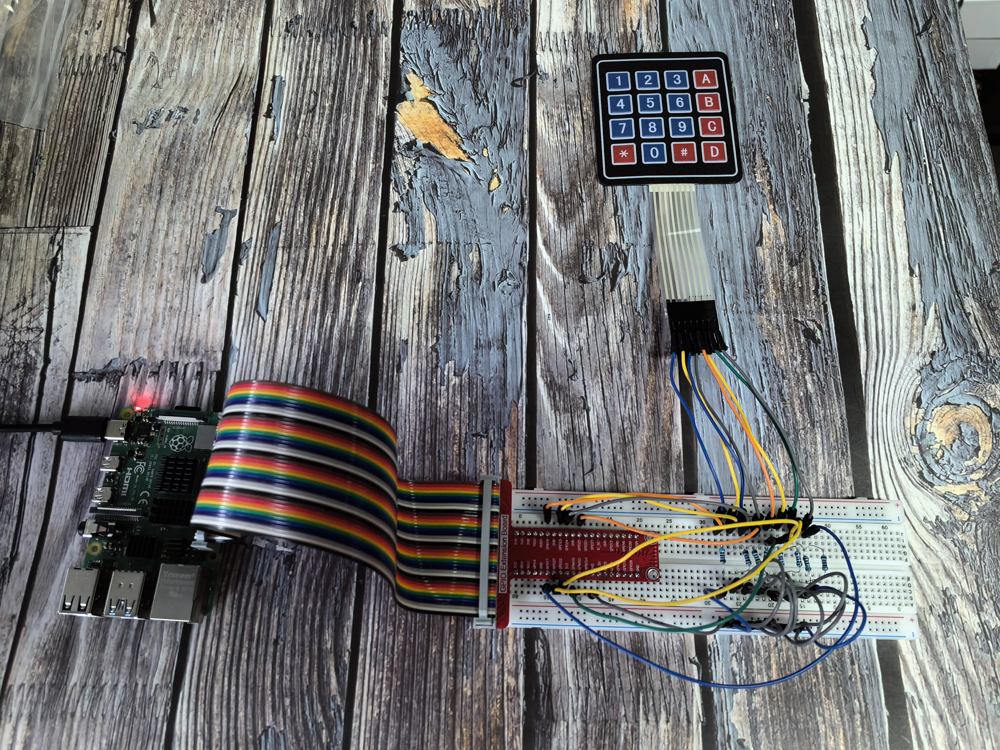

=============
2.1.5 Keypad
=============

Introduction
------------

In this beginner-friendly project, you'll learn how to use a keypad to input numbers and characters into your Raspberry Pi. Think of it like a mini keyboard or the number pad on a phone - press a button and your program knows which one you pressed!

Components
----------

**What is a Keypad?**

A keypad is like a mini keyboard with buttons arranged in a rectangular grid. Most keypads have either 12 buttons (like a phone) or 16 buttons (4x4 grid). Each button is a simple switch that can be pressed to send a signal.

**How does a keypad work?**

Instead of having separate wires for each button (which would need 12 or 16 wires!), keypads use a clever trick called "matrix scanning":

**The Smart Design:**
- **Rows and Columns:** The buttons are arranged in a grid with 4 horizontal wires (rows) and 4 vertical wires (columns)
- **Only 8 wires needed:** Instead of 16 separate wires, we only need 8 wires total (4 + 4)
- **Unique combinations:** Each button connects a specific row wire to a specific column wire

**How we detect button presses:**

1. **Send signals:** The Raspberry Pi sends a signal to one row at a time
2. **Listen for response:** While sending to that row, it checks all the column wires
3. **Find the match:** If a button is pressed, the signal travels from the row wire to the column wire
4. **Identify the button:** The combination of row and column tells us exactly which button was pressed

**Why this matters for beginners:**
- **Fewer wires:** Much simpler wiring than individual buttons
- **Easy programming:** Your code just needs to scan rows and check columns
- **Reliable detection:** Each button has a unique "address" in the grid
- **Cost effective:** One keypad replaces many individual buttons

Connect
-------

Code
----

For C Language User
~~~~~~~~~~~~~~~~~~~~~

Go to the code folder compile and run.

.. code-block:: shell

   cd ~/super-starter-kit-for-raspberry-pi/c/2.1.5/

.. code-block:: shell

   g++ 2.1.5_Keypad.cpp -lwiringPi

.. code-block:: shell

   sudo ./a.out

After the code runs, the values of pressed buttons on keypad (button Value) will be printed on the screen.

This is the complete code

.. code-block:: c++

   #include <wiringPi.h>
   #include <stdio.h>
   #include <vector>
   #include <string>
   #include <iostream>
   #include <stdlib.h> // Required for exit()

   // Define the layout of the keypad.
   const int NUM_ROWS = 4;
   const int NUM_COLS = 4;

   // Define a class to encapsulate all keypad functionality.
   class Keypad {
   public:
      // Constructor: Initializes the keypad with specified pins and key map.
      Keypad(const int* rowPins, const int* colPins, const char* keyMap);

      // Scans the keypad and returns a vector of currently pressed keys.
      std::vector<char> getPressedKeys();

   private:
      // Initializes GPIO pins.
      void initialize_pins();
      
      const int* row_pins;
      const int* col_pins;
      const char* key_map;
      std::vector<char> last_pressed_keys;
   };

   Keypad::Keypad(const int* rowPins, const int* colPins, const char* keyMap)
      : row_pins(rowPins), col_pins(colPins), key_map(keyMap) {
      if (wiringPiSetup() == -1) {
         printf("Failed to setup wiringPi!\n");
         exit(1);
      }
      initialize_pins();
   }

   void Keypad::initialize_pins() {
      for (int i = 0; i < NUM_ROWS; ++i) {
         pinMode(row_pins[i], OUTPUT);
         digitalWrite(row_pins[i], LOW); // Set rows low initially.
      }
      for (int i = 0; i < NUM_COLS; ++i) {
         pinMode(col_pins[i], INPUT);
         pullUpDnControl(col_pins[i], PUD_DOWN); // Use internal pull-down resistors.
      }
   }

   std::vector<char> Keypad::getPressedKeys() {
      std::vector<char> pressed_keys;
      for (int r = 0; r < NUM_ROWS; ++r) {
         // Activate one row at a time.
         digitalWrite(row_pins[r], HIGH);

         // Scan all columns for this active row.
         for (int c = 0; c < NUM_COLS; ++c) {
               if (digitalRead(col_pins[c]) == HIGH) {
                  pressed_keys.push_back(key_map[r * NUM_COLS + c]);
               }
         }
         
         // Deactivate the row before moving to the next one.
         digitalWrite(row_pins[r], LOW);
      }
      return pressed_keys;
   }

   // --- Main Application ---

   // Define the physical pin connections.
   const int ROW_PINS[NUM_ROWS] = {1, 4, 5, 6};
   const int COL_PINS[NUM_COLS] = {12, 3, 2, 0};

   // Define the character map for the keys.
   const char KEY_MAP[NUM_ROWS * NUM_COLS] = {
      '1', '2', '3', 'A',
      '4', '5', '6', 'B',
      '7', '8', '9', 'C',
      '*', '0', '#', 'D'
   };

   /**
   * @brief Prints the currently pressed keys to the console.
   * @param keys A vector of characters representing the pressed keys.
   */
   void print_keys(const std::vector<char>& keys) {
      if (keys.empty()) {
         std::cout << "No key pressed" << std::endl;
      } else {
         std::cout << "Pressed: ";
         for (size_t i = 0; i < keys.size(); ++i) {
               std::cout << keys[i] << (i == keys.size() - 1 ? "" : ", ");
         }
         std::cout << std::endl;
      }
   }

   /**
   * @brief Main function.
   * @return Integer status code.
   */
   int main(void) {
      Keypad keypad(ROW_PINS, COL_PINS, KEY_MAP);
      std::vector<char> last_pressed;

      printf("Keypad scanner initialized. Press any key.\n");

      while (1) {
         std::vector<char> currently_pressed = keypad.getPressedKeys();
         
         // Only print if the state has changed.
         if (currently_pressed != last_pressed) {
               print_keys(currently_pressed);
               last_pressed = currently_pressed;
         }
         
         delay(100); // Poll every 100ms.
      }

      return 0; // Unreachable.
   }

For Python Language User
~~~~~~~~~~~~~~~~~~~~~~~~~~

Go to the code folder and run.

.. code-block:: shell

   cd ~/super-starter-kit-for-raspberry-pi/python

.. code-block:: shell
   
   python 2.1.5_Keypad.py

After the code runs, the values of pressed buttons on keypad (button Value) will be printed on the screen.

This is the complete code

.. code-block:: python

   #!/usr/bin/env python3
   """
   4x4 Keypad Scanner - Python version matching C++ implementation

   This implementation replicates the C++ code's features:
   1. Professional class-based design with encapsulation
   2. Clear constant definitions and initialization
   3. State change detection to reduce output noise
   4. Professional function naming and structure
   5. Enhanced error handling and resource management
   """

   import RPi.GPIO as GPIO
   import time
   import sys

   # Define the layout of the keypad (matching C++ constants)
   NUM_ROWS = 4
   NUM_COLS = 4

   class Keypad:
      """
      Encapsulates all keypad functionality with professional design.
      """
      
      def __init__(self, row_pins, col_pins, key_map):
         """
         Constructor: Initializes the keypad with specified pins and key map.
         Parameters:
               row_pins: List of GPIO pins connected to keypad rows
               col_pins: List of GPIO pins connected to keypad columns  
               key_map: List of characters representing the keypad layout
         """
         self.row_pins = row_pins
         self.col_pins = col_pins
         self.key_map = key_map
         self.last_pressed_keys = []
         
         try:
               GPIO.setwarnings(False)
               GPIO.setmode(GPIO.BCM)
               self._initialize_pins()
               print("Keypad GPIO initialization successful!")
               
         except Exception as e:
               print(f"Failed to initialize keypad: {e}")
               raise

      def _initialize_pins(self):
         """
         Private method: Initializes GPIO pins for keypad scanning.
         """
         # Setup row pins as outputs, initially LOW
         for pin in self.row_pins:
               GPIO.setup(pin, GPIO.OUT, initial=GPIO.LOW)
               
         # Setup column pins as inputs with pull-down resistors
         for pin in self.col_pins:
               GPIO.setup(pin, GPIO.IN, pull_up_down=GPIO.PUD_DOWN)

      def get_pressed_keys(self):
         """
         Scans the keypad and returns a list of currently pressed keys.
         Returns: List of characters representing pressed keys
         """
         pressed_keys = []
         
         try:
               for r in range(NUM_ROWS):
                  # Activate one row at a time
                  GPIO.output(self.row_pins[r], GPIO.HIGH)
                  
                  # Small delay to ensure signal stabilization
                  time.sleep(0.001)
                  
                  # Scan all columns for this active row
                  for c in range(NUM_COLS):
                     if GPIO.input(self.col_pins[c]) == GPIO.HIGH:
                           key_index = r * NUM_COLS + c
                           pressed_keys.append(self.key_map[key_index])
                  
                  # Deactivate the row before moving to the next one
                  GPIO.output(self.row_pins[r], GPIO.LOW)
                  
         except Exception as e:
               print(f"Error reading keypad: {e}")
               
         return pressed_keys

   def print_keys(keys):
      """
      Prints the currently pressed keys to the console.
      Parameters: keys - List of characters representing the pressed keys
      """
      if not keys:
         print("No key pressed")
      else:
         key_str = ", ".join(keys)
         print(f"Pressed: {key_str}")

   def setup_keypad():
      """
      Initializes the keypad hardware and configuration.
      Returns: Keypad object on success, None on failure
      """
      try:
         # Define the physical pin connections (C++ wiringPi pins mapped to BCM)
         # C++: ROW_PINS[4] = {1, 4, 5, 6} -> BCM equivalents
         # C++: COL_PINS[4] = {12, 3, 2, 0} -> BCM equivalents
         # Using original working BCM pins from Python code
         row_pins = [18, 23, 24, 25]  # Original working row pins
         col_pins = [10, 22, 27, 17]  # Original working column pins
         
         # Define the character map for the keys (matching C++)
         key_map = [
               '1', '2', '3', 'A',
               '4', '5', '6', 'B', 
               '7', '8', '9', 'C',
               '*', '0', '#', 'D'
         ]
         
         keypad = Keypad(row_pins, col_pins, key_map)
         
         print("4x4 Keypad Scanner initialized")
         print(f"Row pins: {row_pins}")
         print(f"Column pins: {col_pins}")
         print("Keypad layout:")
         print("  1 2 3 A")
         print("  4 5 6 B")
         print("  7 8 9 C")
         print("  * 0 # D")
         print("-" * 30)
         
         return keypad
         
      except Exception as e:
         print(f"Failed to setup keypad: {e}")
         return None

   def keypad_scan_loop(keypad):
      """
      Main keypad scanning loop - matches C++ main loop logic.
      This function runs indefinitely until interrupted.
      """
      try:
         last_pressed = []
         
         print("Keypad scanner ready. Press any key...")
         
         while True:
               currently_pressed = keypad.get_pressed_keys()
               
               # Only print if the state has changed (matching C++ logic)
               if currently_pressed != last_pressed:
                  print_keys(currently_pressed)
                  last_pressed = currently_pressed[:]  # Make a copy
               
               # Poll every 100ms (matching C++ delay)
               time.sleep(0.1)
               
      except KeyboardInterrupt:
         print("\nKeypad scanning interrupted by user")
         raise  # Re-raise to be handled by main()

   def destroy():
      """
      Clean up function for GPIO resources.
      Ensures all pins are properly released.
      """
      try:
         GPIO.cleanup()
         print("Keypad GPIO resources cleaned up")
         
      except Exception as e:
         print(f"Error during cleanup: {e}")

   def main():
      """
      Main function - matches C++ code structure.
      Returns: Integer status code. 0 for success, 1 for error.
      """
      print("4x4 Matrix Keypad Scanner")
      print("Professional scanning with state change detection")
      print("Press Ctrl+C to stop...")
      print("=" * 50)
      
      # Initialize the keypad
      keypad = setup_keypad()
      if keypad is None:
         return 1  # Exit if setup fails
      
      try:
         # Start the main scanning loop
         keypad_scan_loop(keypad)
         
      except KeyboardInterrupt:
         print("\nProgram interrupted by user")
         destroy()
         return 0
         
      except Exception as e:
         print(f"An error occurred: {e}")
         destroy()
         return 1

   if __name__ == '__main__':
      exit_code = main()
      sys.exit(exit_code)

Phenomenon
----------

