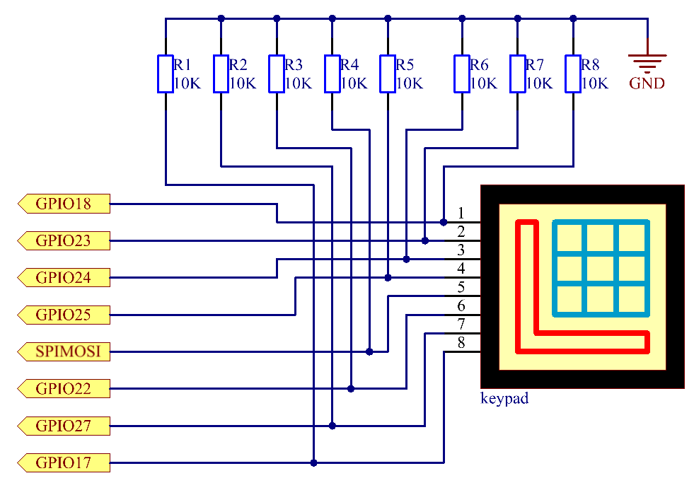

=============
2.1.5 Keypad
=============

Introduction
------------

A keypad is a rectangular array of buttons. In this project, We will use it input characters.

Components
----------

.. image:: ./img/list/list_2.1.5_keypad.png

**Keypad**

A keypad is a rectangular array of 12 or 16 OFF-(ON) buttons. Their contacts are accessed via a header suitable for connection with a ribbon cable or insertion into a printed circuit board. In some keypads, each button connects with a separate contact in the header, while all the buttons share a common ground.

.. image:: ./img/image314.png

More often, the buttons are matrix encoded, meaning that each of them bridges a unique pair of conductors in a matrix. This configuration is suitable for polling by a microcontroller, which can be programmed to send an output pulse to each of the four horizontal wires in turn. During each pulse, it checks the remaining four vertical wires in sequence, to determine which one, if any, is carrying a signal. Pullup or pulldown resistors should be added to the input wires to prevent the inputs of the microcontroller from behaving unpredictably when no signal is present.

Connect
-------

.. image:: ./img/connect/2.1.5.png

Code
----

For C Language User
~~~~~~~~~~~~~~~~~~~~~

Go to the code folder compile and run.

.. code-block:: shell

   cd ~/super-starter-kit-for-raspberry-pi/c/2.1.5/
   gcc 2.1.5_Keypad.cpp -lwiringPi
   sudo ./a.out

After the code runs, the values of pressed buttons on keypad (button Value) will be printed on the screen.

This is the complete code

.. code-block:: c

    xxxx

For Python Language User
~~~~~~~~~~~~~~~~~~~~~~~~~~

Go to the code folder and run.

.. code-block:: shell

   cd ~/super-starter-kit-for-raspberry-pi/python
   python 2.1.5_Keypad.py

After the code runs, the values of pressed buttons on keypad (button Value) will be printed on the screen.

This is the complete code

.. code-block:: python

     xxxx

Phenomenon
----------

.. image:: ./img/phenomenon/215.jpg