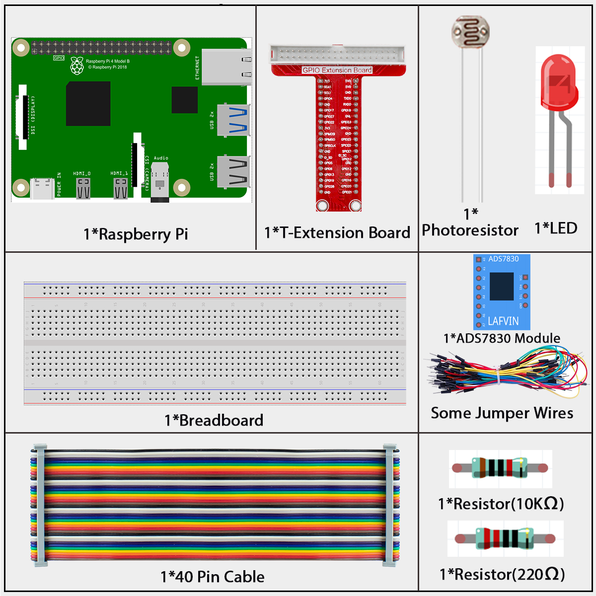
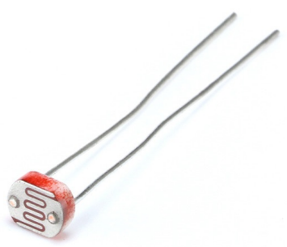
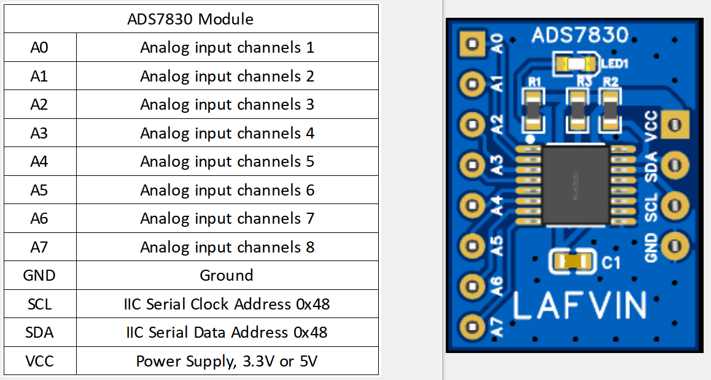
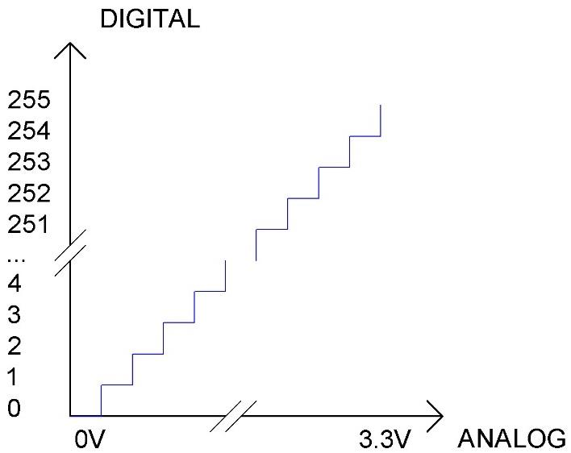
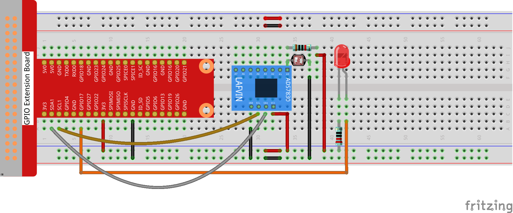
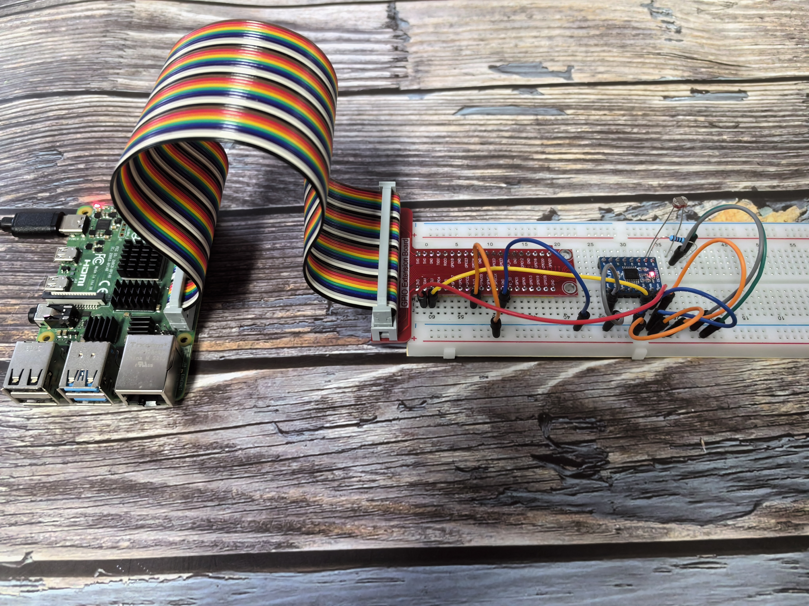

===================
2.2.1 Photoresistor
===================

Introduction
------------

Photoresistor is a commonly used component of ambient light intensity in life. It helps the controller to recognize day and night and realize light control functions such as night lamp. This project is very similar to potentiometer, and you might think it changing the voltage to sensing light.

Components
----------

A photoresistor or photocell is a light-controlled variable resistor. The resistance of a photoresistor decreases with increasing incident light intensity; in other words, it exhibits photo conductivity. A photoresistor can be applied in light-sensitive detector circuits, and light- and darkness-activated switching circuits.

**What is ADS7830?**

The ADS7830 is a special chip that helps your Raspberry Pi read analog signals. Think of it as a translator - it converts the continuous voltage signals from the joystick into digital numbers that your computer can understand.

Key features for beginners:
- It can read 8 different analog inputs
- It uses I2C communication (a simple 2-wire protocol)
- It provides 8-bit resolution (values from 0 to 255)

**Understanding ADC (Analog-to-Digital Converter)**

**What does ADC do?**
An ADC converts analog signals (like the smooth movement of a joystick) into digital numbers that computers can work with.

**How does it work?**
Our ADC has 8-bit resolution, which means it can produce 256 different values (2^8 = 256). It takes the 3.3V input range and divides it into 256 equal parts:

**Simple breakdown:**
- **Range 1:** 0V to 3.3/256V = Digital value 0
- **Range 2:** 3.3/256V to 2×3.3/256V = Digital value 1
- **Range 3:** 2×3.3/256V to 3×3.3/256V = Digital value 2
- And so on...

**Why does this matter?**
The more bits an ADC has, the more precise it becomes. With 8 bits, we get 256 different positions - that's pretty good for detecting joystick movement!

Connect
-------

Code
----

For C Language User
~~~~~~~~~~~~~~~~~~~~~

Go to the code folder compile and run.

.. code-block:: shell

   cd ~/super-starter-kit-for-raspberry-pi/c/2.2.1/

.. code-block:: shell

   g++ 2.2.1_Photoresistor.cpp -lwiringPi -lADCDevice

.. code-block:: shell

   sudo ./a.out

The code run, the brightness of LED will vary depending on the intensity of light that the photoresistor senses.

This is the complete code

.. code-block:: cpp

   #include <wiringPi.h>
   #include <stdio.h>
   #include <softPwm.h>
   #include <ADCDevice.hpp>

   #define ledPin 0

   ADCDevice *adc;  // Define an ADC Device class object

   int main(void){
      adc = new ADCDevice();
      printf("Program is starting ... \n");
      
      if(adc->detectI2C(0x48)){// Detect the ads7830
         delete adc;               // Free previously pointed memory
         adc = new ADS7830();      // If detected, create an instance of ADS7830.
      }
      else{
         printf("No correct I2C address found, \n"
         "Please use command 'i2cdetect -y 1' to check the I2C address! \n"
         "Program Exit. \n");
         return -1;
      } 
      wiringPiSetup();    
      softPwmCreate(ledPin,0,100);    
      while(1){
         int value = adc->analogRead(0);  //read analog value of A0 pin
         softPwmWrite(ledPin,value*100/255);
         float voltage = (float)value / 255.0 * 3.3;  // calculate voltage
         printf("ADC value : %d  ,\tVoltage : %.2fV\n",value,voltage);
         delay(100);
      }
      return 0;
   }

For Python Language User
~~~~~~~~~~~~~~~~~~~~~~~~~~

Go to the code folder and run.

.. code-block:: shell

   cd ~/super-starter-kit-for-raspberry-pi/python

.. code-block:: shell

   python 2.2.1_Photoresistor.py

The code run, the brightness of LED will vary depending on the intensity of light that the photoresistor senses.

This is the complete code

.. code-block:: python

   #!/usr/bin/env python3
   import RPi.GPIO as GPIO
   import time
   from ADCDevice import *

   ledPin = 11 # define ledPin
   adc = ADCDevice() # Define an ADCDevice class object

   def setup():
      global adc
      if(adc.detectI2C(0x48)): # Detect the ads7830
         adc = ADS7830()
      else:
         print("No correct I2C address found, \n"
         "Please use command 'i2cdetect -y 1' to check the I2C address! \n"
         "Program Exit. \n");
         exit(-1)
      global p
      GPIO.setmode(GPIO.BOARD)
      GPIO.setup(ledPin,GPIO.OUT)   # set ledPin to OUTPUT mode
      GPIO.output(ledPin,GPIO.LOW)
      
      p = GPIO.PWM(ledPin,1000) # set PWM Frequence to 1kHz
      p.start(0)
      
   def loop():
      while True:
         value = adc.analogRead(0)    # read the ADC value of channel 0
         p.ChangeDutyCycle(value*100/255)
         voltage = value / 255.0 * 3.3
         print ('ADC Value : %d, Voltage : %.2f'%(value,voltage))
         time.sleep(0.01)

   def destroy():
      adc.close()
      p.stop()  # stop PWM
      GPIO.cleanup()
      
   if __name__ == '__main__':   # Program entrance
      print ('Program is starting ... ')
      setup()
      try:
         loop()
      except KeyboardInterrupt:  # Press ctrl-c to end the program.
         destroy()
         
Phenomenon
------------

