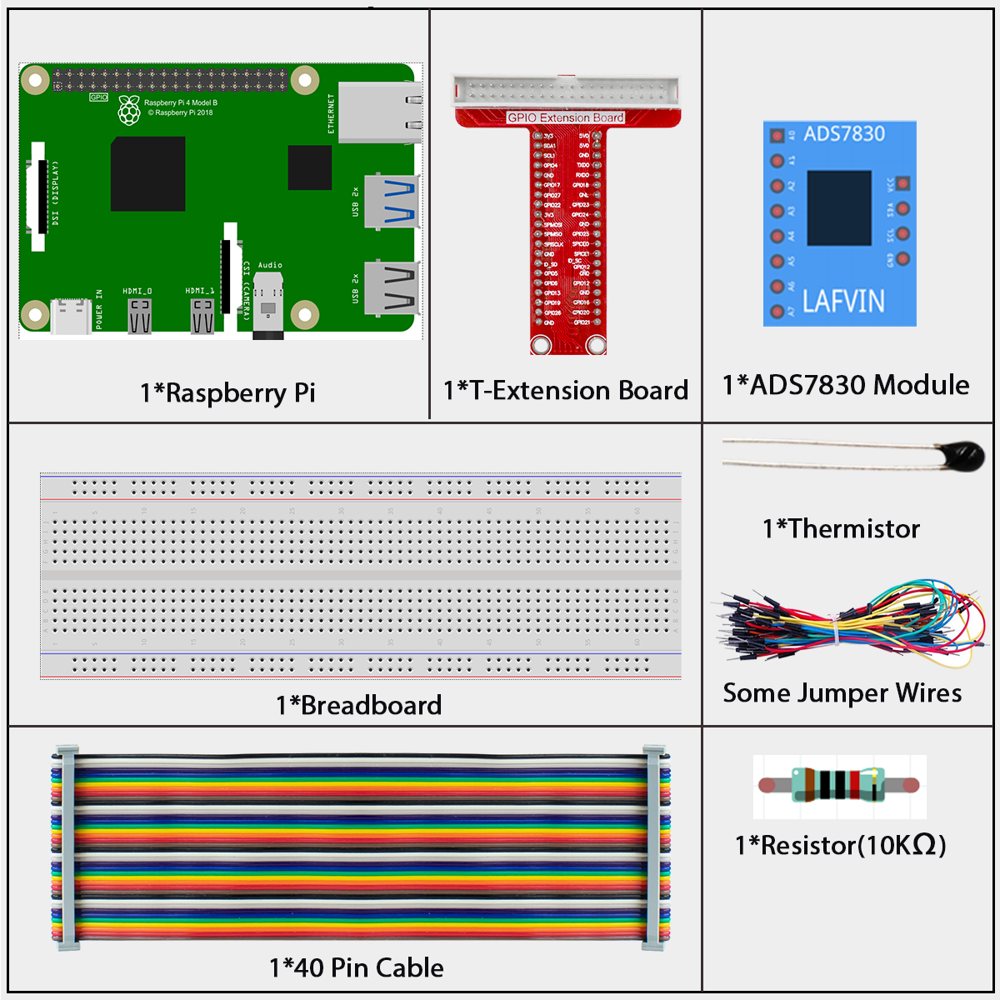
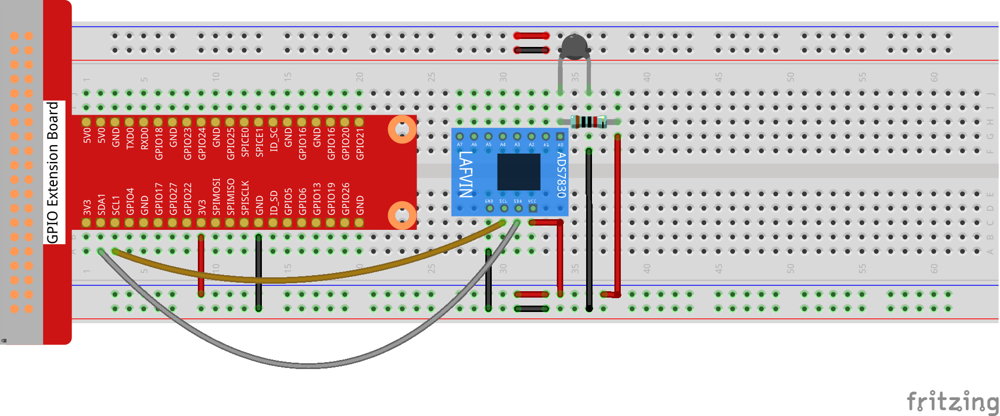
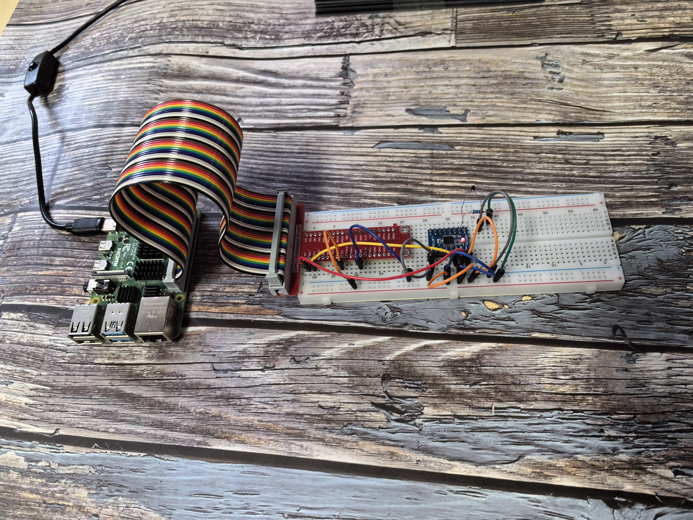

================
2.2.2 Thermistor
================

Introduction
------------

In this beginner-friendly project, you'll learn how to measure temperature using a thermistor - a special resistor that changes its resistance based on temperature. Think of it like a temperature-sensitive switch that helps you build projects like heat alarms, temperature monitors, or automatic cooling systems!

Components
----------

**What is a Thermistor?**

A thermistor is a temperature sensor that works like a variable resistor controlled by heat. Just like a photoresistor changes resistance with light, a thermistor changes resistance with temperature.

**Real-world analogy:** 
Think of it like a mood ring that changes color with temperature, but instead of changing color, our thermistor changes its electrical resistance!

**Two Types of Thermistors:**

1. **NTC (Negative Temperature Coefficient):** 
   - As temperature goes UP, resistance goes DOWN
   - This is the type we're using in our project

2. **PTC (Positive Temperature Coefficient):**
   - As temperature goes UP, resistance goes UP
   - Less common in basic projects

**How does our NTC thermistor work?**

**Simple explanation:**
- **Hot environment** → **Lower resistance** → **Higher voltage reading**
- **Cold environment** → **Higher resistance** → **Lower voltage reading**

**The measurement process:**
1. **Temperature changes** → Thermistor resistance changes
2. **Resistance changes** → Voltage in the circuit changes  
3. **ADC reads voltage** → Converts to digital number
4. **Your program calculates** → Converts to actual temperature (°C or °F)

**Our Setup:**
- **Thermistor:** 10kΩ resistance at room temperature (25°C)
- **Pull-up resistor:** 10kΩ (creates a voltage divider circuit)
- **Result:** Voltage changes we can measure and convert to temperature

**The Math Behind It (Don't Worry, We'll Handle This!):**

For those curious about the formula:

**RT = RN × e^(B×(1/TK - 1/TN))**

**What each part means:**
- **RT:** Current resistance at temperature TK
- **RN:** Known resistance (10kΩ at 25°C)  
- **TK:** Current temperature in Kelvin (°C + 273.15)
- **TN:** Reference temperature in Kelvin (25°C + 273.15 = 298.15K)
- **B:** Material constant (3950 for our thermistor)
- **e:** Mathematical constant (≈2.718)

**For beginners:** Don't worry about memorizing this formula! Your code will handle all the calculations. Just understand that there's a predictable relationship between temperature and resistance that we can use to measure temperature accurately.

**Key takeaway:** The thermistor gives us a way to "feel" the temperature electronically and turn that feeling into numbers your Raspberry Pi can work with!

Connect
-------

Code
----

For C Language User
~~~~~~~~~~~~~~~~~~~~~

Go to the code folder compile and run.

.. code-block:: shell

   cd ~/super-starter-kit-for-raspberry-pi/c/2.2.2/

.. code-block:: shell

   g++ 2.2.2_Thermistor.cpp -lwiringPi -lADCDevice

.. code-block:: shell

   sudo ./a.out

With the code run, the thermistor detects ambient temperature which will be printed on the screen once it finishes the program calculation.

This is the complete code

.. code-block:: cpp

   #include <wiringPi.h>
   #include <stdio.h>
   #include <math.h>
   #include <ADCDevice.hpp>

   ADCDevice *adc;  // Define an ADC Device class object

   int main(void){
      adc = new ADCDevice();
      printf("Program is starting ... \n");
      
      if(adc->detectI2C(0x48)){// Detect the ads7830
         delete adc;               // Free previously pointed memory
         adc = new ADS7830();      // If detected, create an instance of ADS7830.
      }
      else{
         printf("No correct I2C address found, \n"
         "Please use command 'i2cdetect -y 1' to check the I2C address! \n"
         "Program Exit. \n");
         return -1;
      }
      printf("Program is starting ... \n");
      while(1){
         int adcValue = adc->analogRead(0);  //read analog value A0 pin    
         float voltage = (float)adcValue / 255.0 * 3.3;    // calculate voltage    
         float Rt = 10 * voltage / (3.3 - voltage);        //calculate resistance value of thermistor
         float tempK = 1/(1/(273.15 + 25) + log(Rt/10)/3950.0); //calculate temperature (Kelvin)
         float tempC = tempK -273.15;        //calculate temperature (Celsius)
         printf("ADC value : %d  ,\tVoltage : %.2fV, \tTemperature : %.2fC\n",adcValue,voltage,tempC);
         delay(100);
      }
      return 0;
   }

For Python Language User
~~~~~~~~~~~~~~~~~~~~~~~~~~

Go to the code folder and run.

.. code-block:: shell

   cd ~/super-starter-kit-for-raspberry-pi/python

.. code-block:: shell

   python 2.2.2_Thermistor.py

This is the complete code

.. code-block:: python

   #!/usr/bin/env python3

   import RPi.GPIO as GPIO
   import time
   import math
   from ADCDevice import *

   adc = ADCDevice() # Define an ADCDevice class object

   def setup():
      global adc
      if(adc.detectI2C(0x48)): # Detect the ads7830
         adc = ADS7830()
      else:
         print("No correct I2C address found, \n"
         "Please use command 'i2cdetect -y 1' to check the I2C address! \n"
         "Program Exit. \n");
         exit(-1)
         
   def loop():
      while True:
         value = adc.analogRead(0)        # read ADC value A0 pin
         voltage = value / 255.0 * 3.3        # calculate voltage
         Rt = 10 * voltage / (3.3 - voltage)    # calculate resistance value of thermistor
         tempK = 1/(1/(273.15 + 25) + math.log(Rt/10)/3950.0) # calculate temperature (Kelvin)
         tempC = tempK -273.15        # calculate temperature (Celsius)
         print ('ADC Value : %d, Voltage : %.2f, Temperature : %.2f'%(value,voltage,tempC))
         time.sleep(0.01)

   def destroy():
      adc.close()
      GPIO.cleanup()
      
   if __name__ == '__main__':  # Program entrance
      print ('Program is starting ... ')
      setup()
      try:
         loop()
      except KeyboardInterrupt: # Press ctrl-c to end the program.
         destroy()
         

Phenomenon
----------

