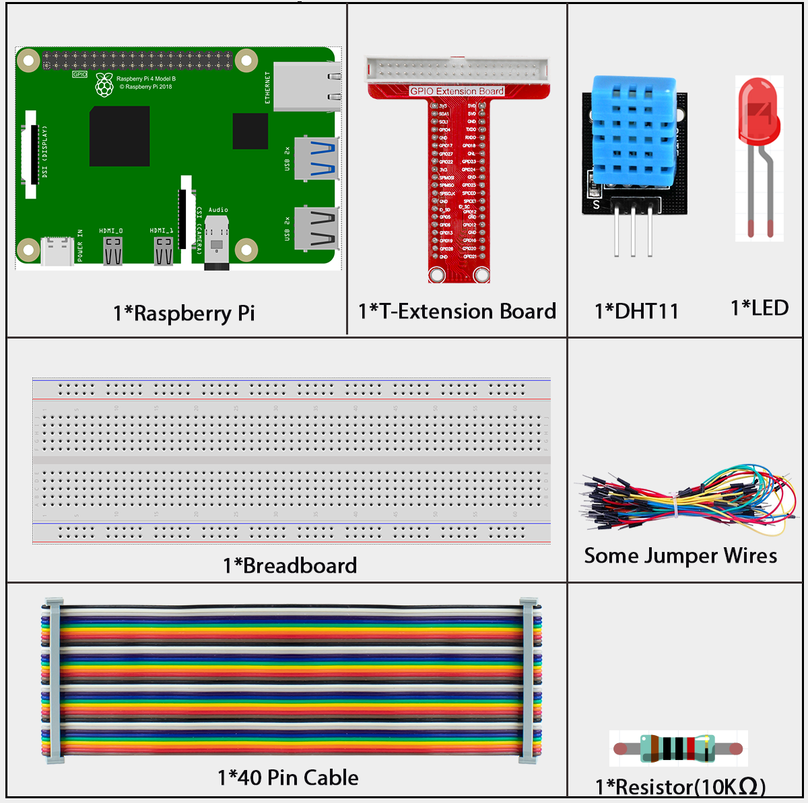
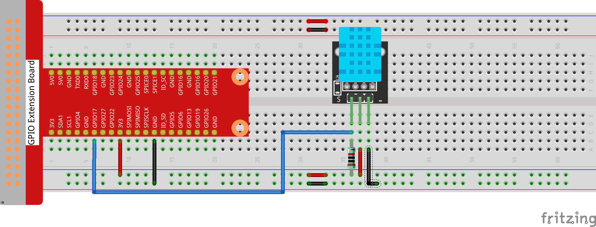
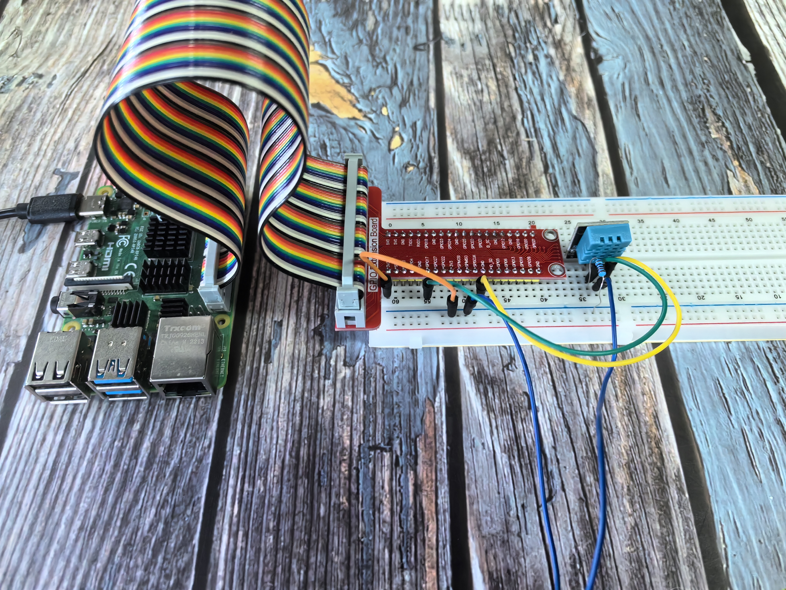

=============
2.2.3 DHT-11
=============

Introduction
------------

In this beginner-friendly project, you'll learn how to measure both temperature AND humidity using a single smart sensor called the DHT11. Think of it like a weather station in a tiny package - it can tell you how hot it is AND how humid the air feels, just like the weather app on your phone!

Components
----------

**What is a DHT11?**

The DHT11 is a digital sensor that measures two things at once:
1. **Temperature** - How hot or cold the air is
2. **Humidity** - How much moisture (water vapor) is in the air

**Why is this special?**
Unlike the thermistor we used before (which only measures temperature), the DHT11 gives us both measurements in one small, affordable package!

**What's inside the DHT11?**
- **Humidity sensor:** Uses a special material that changes properties when moisture is present
- **Temperature sensor:** Similar to the thermistor we learned about earlier  
- **Smart chip:** A tiny computer that processes the readings and sends clean digital data

**Key advantages for beginners:**
- **All-in-one:** Temperature + humidity in one sensor
- **Digital output:** No complex analog-to-digital conversion needed
- **Pre-calibrated:** Ready to use, no complex setup required
- **Affordable:** Great for learning projects
- **Simple wiring:** Only 3 connections needed

**The 3 pins you need:**
- **VCC:** Power (connect to 3.3V or 5V)
- **GND:** Ground (connect to ground)
- **DATA:** Communication line (connect to a GPIO pin)

**What data do you get?**
The DHT11 sends you a complete weather report in digital format:
- Humidity reading (0-100%)
- Temperature reading (0-50°C)
- Built-in error checking to make sure the data is accurate

**Perfect for projects like:**
- Home weather station
- Plant watering system (plants need specific humidity!)
- Comfort monitoring (too dry? too humid?)
- Automatic ventilation control

Connect
-------

Code
----

For C Language User
~~~~~~~~~~~~~~~~~~~~~

Go to the code folder compile and run.

.. code-block:: shell

   cd ~/super-starter-kit-for-raspberry-pi/c/2.2.3/

.. code-block:: shell

   gcc DHT11.c DHT.c -lwiringPi

.. code-block:: shell

   sudo ./a.out

After the code runs, the program will print the temperature and humidity detected by DHT11 on the computer screen.

This is the complete code

.. code-block:: c

   #include <wiringPi.h>
   #include <stdio.h>
   #include <stdlib.h>
   #include <stdint.h>

   #define maxTim 85

   #define dhtPin 0

   int dht11_dat[5] = {0,0,0,0,0};

   void readDht11()
   {
      uint8_t laststate = HIGH;
      uint8_t counter = 0;
      uint8_t j = 0, i;
      float Fah; // fahrenheit

      dht11_dat[0] = dht11_dat[1] = dht11_dat[2] = dht11_dat[3] = dht11_dat[4] = 0;

      // pull pin down for 18 milliseconds
      pinMode(dhtPin, OUTPUT);
      digitalWrite(dhtPin, LOW);
      delay(18);
      // then pull it up for 40 microseconds
      digitalWrite(dhtPin, HIGH);
      delayMicroseconds(40); 
      // prepare to read the pin
      pinMode(dhtPin, INPUT);

      // detect change and read data
      for ( i=0; i< maxTim; i++) {
         counter = 0;
         while (digitalRead(dhtPin) == laststate) {
            counter++;
            delayMicroseconds(1);
            if (counter == 255) {
               break;
            }
         }
         laststate = digitalRead(dhtPin);

         if (counter == 255) break;

         // ignore first 3 transitions
         if ((i >= 4) && (i%2 == 0)) {
            // shove each bit into the storage bytes
            dht11_dat[j/8] <<= 1;
            if (counter > 50)
               dht11_dat[j/8] |= 1;
            j++;
         }
      }

      // check we read 40 bits (8bit x 5 ) + verify checksum in the last byte
      // print it out if data is good
      if ((j >= 40) && 
            (dht11_dat[4] == ((dht11_dat[0] + dht11_dat[1] + dht11_dat[2] + dht11_dat[3]) & 0xFF)) ) {
         Fah = dht11_dat[2] * 9. / 5. + 32;
         printf("Humidity = %d.%d %% Temperature = %d.%d *C (%.1f *F)\n", 
               dht11_dat[0], dht11_dat[1], dht11_dat[2], dht11_dat[3], Fah);
      }
      //else
      //	{
      //	printf("Data not good, skip\n");
      //	}
   }

   int main (void)
   {

      if(wiringPiSetup() == -1){ //when initialize wiring failed, print messageto screen
         printf("setup wiringPi failed !");
         return 1; 
      }

      while (1) 
      {
         readDht11();
         delay(500); // wait 1sec to refresh
      }

      return 0 ;
   }

For Python Language User
~~~~~~~~~~~~~~~~~~~~~~~~~~

Go to the code folder and run.

.. code-block:: shell

   cd ~/super-starter-kit-for-raspberry-pi/python

.. code-block:: shell
   
   python 2.2.3_DHT.py

After the code runs, the program will print the temperature and humidity detected by DHT11 on the computer screen.

.. code-block:: python

   #!/usr/bin/env python3
   # -*- coding: utf-8 -*-

   """
   DHT11 Temperature and Humidity Sensor Demo

   This is a robust Python demo for reading the DHT11 sensor using a hybrid
   Python + C library approach. The program features an intelligent retry
   mechanism and clean output formatting.

   Features:
   - Hybrid Python + C architecture for optimal performance
   - Silent retry mechanism with up to 15 attempts per cycle
   - Clean, formatted output with cycle counting
   - Robust error handling and user-friendly interface

   Hardware Setup:
   - Connect DHT11 data pin to BCM GPIO 17 (wiringPi pin 0)

   Dependencies:
   - dht_driver.py (Python wrapper for C library)
   - dht_c_driver.so (Compiled C shared library)
   - wiringPi library

   Author: LAFVIN
   Date: 2025/08/01
   """

   import time
   from dht_driver import DHT

   # --- Configuration ---
   DHT11_DATA_PIN = 0  # wiringPi pin number (corresponds to BCM GPIO 17)

   def main():
      """The main function of the program."""
      print("Starting DHT11 sensor reading program (Python + C Library)...")
      print("--------------------------------------------------------------")
      print("Press Ctrl+C to exit.")
      print()

      # Initialize the DHT sensor driver
      try:
         dht = DHT()  # This will automatically load the C library and initialize wiringPi
         print("DHT11 driver initialized successfully.")
      except Exception as e:
         print(f"Error initializing DHT11 driver: {e}")
         return

      measurement_cycle = 0

      # --- Main Measurement Loop ---
      while True:
         measurement_cycle += 1
         max_retries = 15
         
         # --- Silent Retry Loop ---
         # This loop attempts to read the sensor up to 'max_retries' times.
         # It does so silently to provide a clean user experience.
         humidity = None
         temperature = None
         
         for attempt in range(max_retries):
               humidity, temperature = dht.read(DHT11_DATA_PIN)
               
               if humidity is not None and temperature is not None:
                  break  # Exit loop on first successful read
               
               # If it failed, wait briefly before retrying.
               time.sleep(0.3)
         
         # --- Final, Clean Output ---
         # Print the result for this measurement cycle in a clean format.
         print(f"Cycle #{measurement_cycle}: ", end="")
         if humidity is not None and temperature is not None:
               print(f"Humidity = {humidity:.1f}%, Temperature = {temperature:.1f} C")
         else:
               # This message only appears if all retries fail.
               print("Failed to get a valid reading from the sensor.")

         # Wait for 2 seconds before the next major cycle.
         time.sleep(2)

   if __name__ == '__main__':
      try:
         main()
      except KeyboardInterrupt:
         print("\nProgram stopped by user.")
      except Exception as e:
         print(f"\nAn unexpected error occurred: {e}")

Phenomenon
----------

