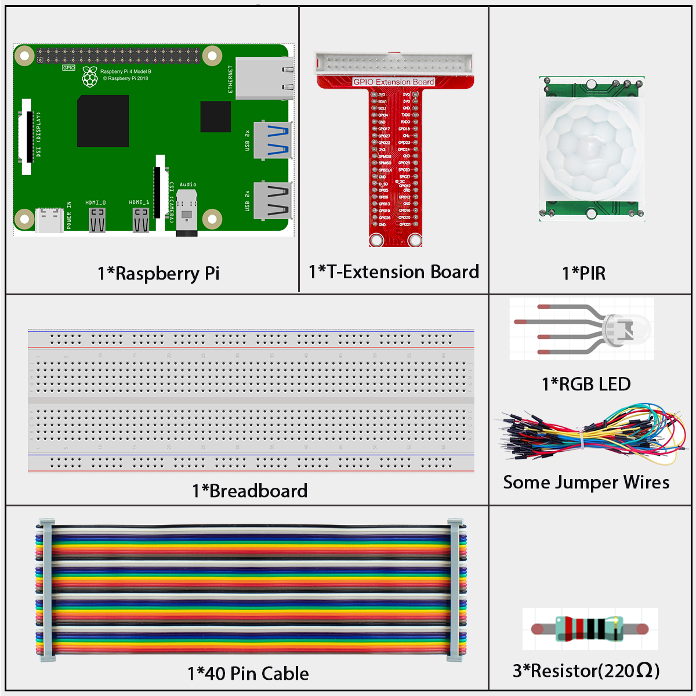
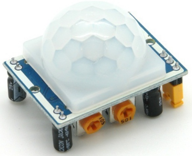
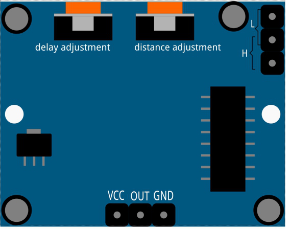
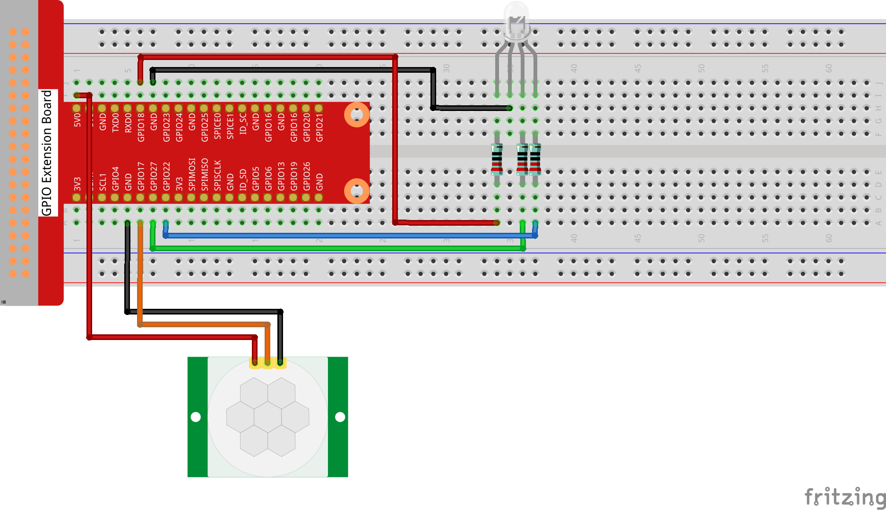
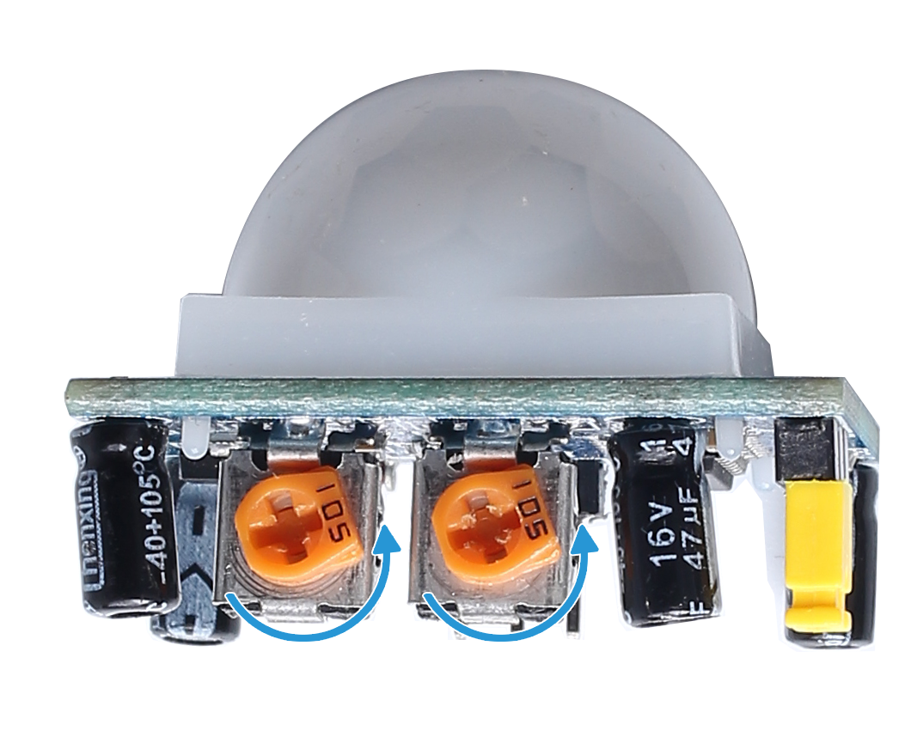
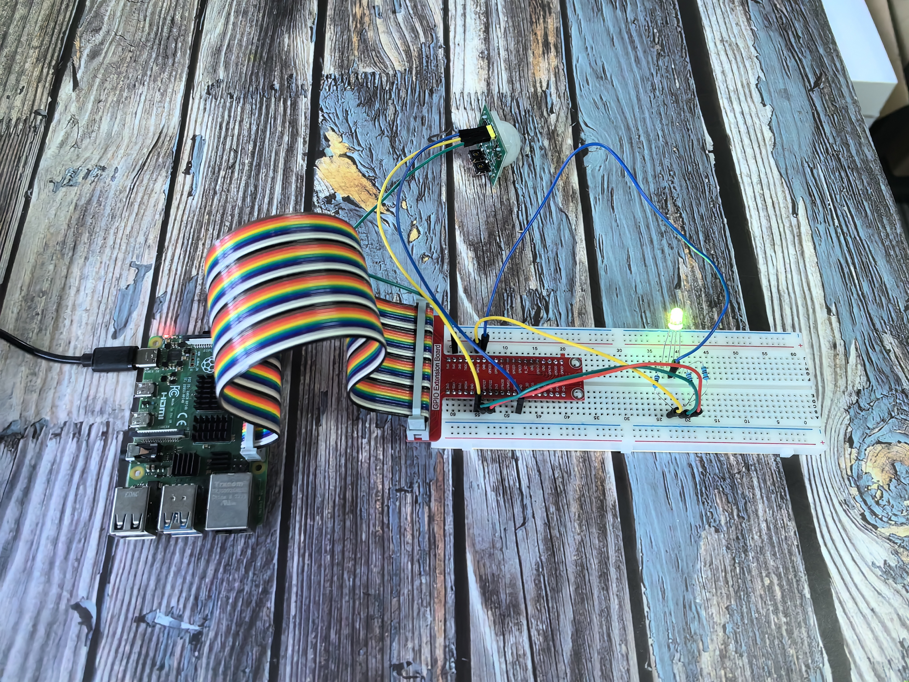

==========
2.2.4 PIR
==========

Introduction
------------

In this beginner-friendly project, you'll learn how to create an automatic motion-activated light using a PIR (Passive Infrared) sensor. Think of it like the automatic lights in hallways or bathrooms - when someone walks by, the light turns on by itself! This is perfect for building security systems, automatic lighting, or energy-saving projects.

Components
----------

**What is a PIR Sensor?**

PIR stands for "Passive Infrared" sensor, but think of it as a "motion detector" that can sense when people or animals move nearby. It's like having electronic eyes that can "see" the heat from living things!

**How does it work?**

**Simple explanation:**
All living things (including you!) give off invisible heat energy called infrared radiation. The PIR sensor can detect this heat and notices when it changes.

**The clever design:**
The PIR sensor has two "eyes" (sensing areas) that work together:
- **When nothing moves:** Both eyes see the same amount of heat → No signal
- **When something moves:** One eye sees more heat than the other → Motion detected!

**Getting Started - Important Setup Info:**

**Initial Setup (Be Patient!):**
When you first power on the PIR sensor, it needs about 1 minute to "warm up" and calibrate itself. During this time, it might trigger a few times randomly - this is normal! After the warm-up period, it will work reliably.

**Environmental Tips for Beginners:**
- **Avoid bright lights:** Direct sunlight or bright lamps can interfere
- **Keep it still:** Too much wind or vibration can cause false triggers
- **Stable mounting:** Mount it firmly so it doesn't move on its own

**Adjustable Settings (The Two Knobs):**

**Distance Adjustment Knob:**
- **Turn clockwise:** Increase detection range (up to 7 meters)
- **Turn counterclockwise:** Decrease detection range (down to 3 meters)
- **Beginner tip:** Start with medium range and adjust as needed

**Delay Adjustment Knob:**
- **Turn clockwise:** Light stays on longer after motion stops (up to 5 minutes)
- **Turn counterclockwise:** Light turns off quickly after motion stops (as fast as 5 seconds)
- **Beginner tip:** Start with short delays for testing, then increase for real use

**Two Operating Modes (Choose with the Jumper):**

**Mode H - Repeatable Trigger (Recommended for beginners):**
- **What it does:** If someone keeps moving in the detection area, the light stays on
- **Perfect for:** Hallways, rooms where people spend time
- **Example:** You walk into a room, light turns on and stays on while you're there

**Mode L - Single Trigger:**
- **What it does:** Detects motion once, then waits for the delay period before detecting again
- **Perfect for:** Security applications, counting people
- **Example:** Someone walks by, light turns on for the set time, then turns off regardless of continued motion

Connect
-------
.. list-table::
   :header-rows: 1
   :widths: 25 25 25 25

   * - T-Board Name
     - physical
     - wiringPi
     - BCM
   * - GPIO17
     - Pin 11
     - 0
     - 17
   * - GPIO18
     - Pin 12
     - 1
     - 18
   * - GPIO27
     - Pin 13
     - 2
     - 27
   * - GPIO22
     - Pin 15
     - 3
     - 22

.. note::
    The PIR sensor will have a one-minute initialization time after powering on. During this period, infrared signals should be avoided, otherwise the measurement may be inaccurate.

Code
----

For C Language User
~~~~~~~~~~~~~~~~~~~~~

Go to the code folder compile and run.

.. code-block:: shell

   cd ~/super-starter-kit-for-raspberry-pi/c/2.2.4/

.. code-block:: shell

   gcc 2.2.4_PIR.c -lwiringPi

.. code-block:: shell

   sudo ./a.out

After the code runs, PIR detects surroundings and let RGB LED glow yellow if it senses someone walking by. There are two potentiometers on the PIR module: one is to adjust sensitivity and the other is to adjust the detection distance. To make the PIR module work better, you You need to turn both of them counterclockwise to the end.

This is the complete code

.. code-block:: c

   #include <wiringPi.h>
   #include <softPwm.h>
   #include <stdio.h>
   #include <stdlib.h> // Required for exit()

   // --- Pin Definitions ---
   #define PIR_SENSOR_PIN  0 // GPIO pin for the PIR motion sensor.
   #define LED_RED_PIN     1
   #define LED_GREEN_PIN   2
   #define LED_BLUE_PIN    3

   // PWM range for the LED (0-255 is a common choice).
   #define PWM_RANGE 255

   /**
   * @brief Sets the color of the RGB LED using software PWM.
   * @param red   Red intensity (0-255).
   * @param green Green intensity (0-255).
   * @param blue  Blue intensity (0-255).
   */
   void set_led_color(int red, int green, int blue) {
      softPwmWrite(LED_RED_PIN, red);
      softPwmWrite(LED_GREEN_PIN, green);
      softPwmWrite(LED_BLUE_PIN, blue);
   }

   /**
   * @brief Initializes wiringPi, sensor pin, and software PWM for the LED.
   */
   void setup_hardware() {
      if (wiringPiSetup() == -1) {
         printf("Failed to setup wiringPi!\n");
         exit(1);
      }
      
      // Set up PIR sensor pin as input.
      pinMode(PIR_SENSOR_PIN, INPUT);
      
      // Create software PWM pins for the RGB LED.
      softPwmCreate(LED_RED_PIN,   0, PWM_RANGE);
      softPwmCreate(LED_GREEN_PIN, 0, PWM_RANGE);
      softPwmCreate(LED_BLUE_PIN,  0, PWM_RANGE);
   }

   /**
   * @brief Main loop to check for motion and update the LED accordingly.
   */
   void motion_detection_loop() {
      int motion_detected_state = 0; // 0 for no motion, 1 for motion.
      
      printf("PIR motion sensor ready. Waiting for motion...\n");
      // Initially set the LED to blue (no motion).
      set_led_color(0, 0, 255); 

      while (1) {
         int current_pir_state = digitalRead(PIR_SENSOR_PIN);
         
         // Check if the state has changed.
         if (current_pir_state != motion_detected_state) {
               motion_detected_state = current_pir_state;
               
               if (motion_detected_state == HIGH) {
                  // Motion detected.
                  printf("Motion DETECTED! LED is now yellow.\n");
                  set_led_color(255, 255, 0); // Yellow
               } else {
                  // Motion has stopped.
                  printf("No motion. LED is now blue.\n");
                  set_led_color(0, 0, 255); // Blue
               }
         }
         
         delay(100); // Poll every 100ms.
      }
   }

   /**
   * @brief Main function.
   * @return Integer status code.
   */
   int main(void) {
      setup_hardware();
      motion_detection_loop();
      return 0; // Unreachable.
   }

For Python Language User
~~~~~~~~~~~~~~~~~~~~~~~~~~

.. code-block:: shell

   cd ~/super-starter-kit-for-raspberry-pi/python

.. code-block:: shell
   
   python 2.2.4_PIR.py

After the code runs, PIR detects surroundings and let RGB LED glow yellow if it senses someone walking by. There are two potentiometers on the PIR module: one is to adjust sensitivity and the other is to adjust the detection distance. To make the PIR module work better, you You need to turn both of them counterclockwise to the end.

.. code-block:: python

   #!/usr/bin/env python3

   """
   2.2.4_PIR.py

   This script provides a refactored, object-oriented version of a program that
   uses a PIR (Passive Infrared) motion sensor to control the color of an RGB LED.

   - When motion is detected, the LED turns yellow.
   - When there is no motion, the LED is blue.

   This version maintains the exact same functionality and pin configuration as the
   original but features a cleaner, more modular structure and detailed comments.
   """

   import RPi.GPIO as GPIO
   import time

   class MotionActivatedLight:
      """
      A class to manage a PIR motion sensor and a connected RGB LED.

      This class encapsulates the hardware setup, motion detection loop,
      color control, and cleanup operations.
      """
      
      # Define colors for different states (as 24-bit hex values)
      MOTION_DETECTED_COLOR = 0xFFFF00  # Yellow
      IDLE_COLOR = 0x0000FF              # Blue

      def __init__(self, pir_pin, red_pin, green_pin, blue_pin):
         """
         Initializes the motion sensor and RGB LED.
         
         Args:
               pir_pin (int): The BCM pin number for the PIR sensor.
               red_pin (int): The BCM pin number for the red channel of the LED.
               green_pin (int): The BCM pin number for the green channel of the LED.
               blue_pin (int): The BCM pin number for the blue channel of the LED.
         """
         self.pir_pin = pir_pin
         self.rgb_pins = {'red': red_pin, 'green': green_pin, 'blue': blue_pin}
         
         # PWM objects for each color channel
         self.pwm_channels = {}

         self._setup_gpio()

      def _setup_gpio(self):
         """Sets up the GPIO mode and configures the pins."""
         GPIO.setmode(GPIO.BCM)  # Use Broadcom SOC channel numbering
         
         # Setup PIR sensor pin as input
         GPIO.setup(self.pir_pin, GPIO.IN)
         
         # Setup RGB LED pins as outputs and initialize PWM
         for color, pin in self.rgb_pins.items():
               GPIO.setup(pin, GPIO.OUT, initial=GPIO.LOW)
               # Create a PWM instance for the pin with a frequency of 2000 Hz
               self.pwm_channels[color] = GPIO.PWM(pin, 2000)
               self.pwm_channels[color].start(0)  # Start with 0% duty cycle (off)

      def _map_value(self, value, from_min, from_max, to_min, to_max):
         """Maps a value from one range to another."""
         return (value - from_min) * (to_max - to_min) / (from_max - from_min) + to_min

      def set_color(self, color_hex):
         """
         Sets the RGB LED to a specific color.
         
         Args:
               color_hex (int): A 24-bit integer representing the color (e.g., 0xFF0000 for red).
         """
         # Extract the 8-bit R, G, B values from the 24-bit color hex
         r_val = (color_hex & 0xFF0000) >> 16
         g_val = (color_hex & 0x00FF00) >> 8
         b_val = (color_hex & 0x0000FF)
         
         # Map the 0-255 color values to 0-100 PWM duty cycle
         r_duty = self._map_value(r_val, 0, 255, 0, 100)
         g_duty = self._map_value(g_val, 0, 255, 0, 100)
         b_duty = self._map_value(b_val, 0, 255, 0, 100)
         
         # Change the duty cycle for each color channel
         self.pwm_channels['red'].ChangeDutyCycle(r_duty)
         self.pwm_channels['green'].ChangeDutyCycle(g_duty)
         self.pwm_channels['blue'].ChangeDutyCycle(b_duty)

      def run(self):
         """Starts the main loop to detect motion and control the light."""
         print("Motion detection active. Press Ctrl+C to exit.")
         last_pir_state = None # To avoid unnecessary color changes
         
         while True:
               pir_state = GPIO.input(self.pir_pin)
               
               # Only update the color if the state has changed
               if pir_state != last_pir_state:
                  if pir_state == GPIO.HIGH:
                     print("Motion Detected! -> LED Yellow")
                     self.set_color(self.MOTION_DETECTED_COLOR)
                  else:
                     print("No Motion.       -> LED Blue")
                     self.set_color(self.IDLE_COLOR)
                  last_pir_state = pir_state
               
               # A short delay to reduce CPU usage
               time.sleep(0.1)

      def cleanup(self):
         """Stops the PWM channels and cleans up GPIO resources."""
         print("\nCleaning up resources.")
         # The explicit pwm.stop() calls are redundant because GPIO.cleanup()
         # handles shutting down all channels used by the script.
         # Removing them prevents a race condition during script termination.
         GPIO.cleanup()

   def main():
      """
      The main function to set up and run the motion-activated light.
      """
      # Pin numbers must be kept the same to match the hardware.
      # Using BCM numbering as in the original script.
      PIR_PIN = 17
      RED_PIN = 18
      GREEN_PIN = 27
      BLUE_PIN = 22

      # Create an instance of the motion light system.
      motion_light = MotionActivatedLight(
         pir_pin=PIR_PIN,
         red_pin=RED_PIN,
         green_pin=GREEN_PIN,
         blue_pin=BLUE_PIN
      )

      try:
         # Start the continuous operation.
         motion_light.run()
      except KeyboardInterrupt:
         # Gracefully handle Ctrl+C to exit.
         print("\nProgram terminated by user.")
      finally:
         # This block ensures that cleanup is always called, even if an error occurs.
         motion_light.cleanup()

   if __name__ == '__main__':
      # This ensures the main() function is called only when the script is executed directly.
      main()

Phenomenon
----------

