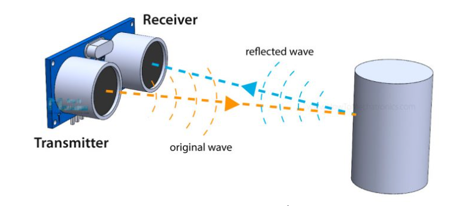
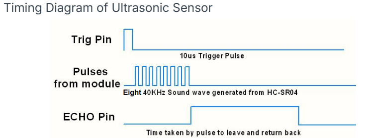

===============================
2.2.5 Ultrasonic Sensor Module
===============================

Introduction
------------

In this beginner-friendly project, you'll learn how to measure distances without touching anything using an ultrasonic sensor! Think of it like a bat's echolocation or a submarine's sonar - it "sees" by sound. This is perfect for building parking sensors, robot obstacle avoidance, automatic doors, or liquid level monitors.

Components
----------

.. image:: ./img/list/list_2.2.5.png

**What is an Ultrasonic Sensor?**

An ultrasonic sensor is like having super-hearing that can measure distances. It works by sending out sound waves that are too high-pitched for humans to hear (ultrasonic = beyond human hearing), then listening for the echo when those waves bounce back.

**Key specifications for beginners:**
- **Measurement range:** 2cm to 400cm (about 0.8 inches to 13 feet)
- **Accuracy:** Within 3mm (about 1/8 inch) - very precise!
- **Best performance:** Most reliable within 5 meters (16 feet)
- **No contact needed:** Measures distance through air

**How does it work? (The Echo Principle)**

.. image:: ./img/image217.png

**The process step by step:**

1. **Send trigger signal:** Your Raspberry Pi tells the sensor "start measuring!"
2. **Emit ultrasound:** The sensor sends out 8 quick sound pulses (40,000 times per second - way too fast to hear!)
3. **Wait for echo:** The sound waves travel to the object and bounce back
4. **Receive echo:** The sensor catches the returning sound waves
5. **Calculate distance:** Measure the time difference and convert to distance

**The Math Made Simple:**

The sensor does most of the work for you, but here's what's happening behind the scenes:

**Basic principle:** Distance = (Time × Speed of Sound) ÷ 2

**Why divide by 2?** Because the sound has to travel TO the object AND back FROM the object - that's twice the actual distance!

**Speed of sound:** About 340 meters per second (or 1,125 feet per second) at room temperature

**Timing Diagram Explained:**

**What this diagram shows:**
- **Trigger pulse:** You send a brief 10-microsecond "start" signal
- **Ultrasonic burst:** Sensor automatically sends 8 sound pulses
- **Echo pulse:** Sensor receives the returning echo and sends you a signal
- **Measurement:** The length of the echo pulse tells you the distance

**Easy conversion formulas for beginners:**
- **For centimeters:** Divide the time (in microseconds) by 58
- **For inches:** Divide the time (in microseconds) by 148
- **Why these numbers?** They include the speed of sound and the "divide by 2" calculation

**Beginner tips for accurate measurements:**
- **Wait between measurements:** Allow at least 60 milliseconds between readings to avoid interference
- **Avoid small objects:** Works best with objects larger than a coin
- **Flat surfaces work better:** Angled or soft surfaces may not reflect sound well
- **Temperature affects accuracy:** Sound travels faster in warm air, slower in cold air

Connect
-------
.. list-table::
   :header-rows: 1
   :widths: 25 25 25 25

   * - T-Board Name
     - physical
     - wiringPi
     - BCM
   * - GPIO23
     - Pin 16
     - 4
     - 23
   * - GPIO24
     - Pin 18
     - 5
     - 24

.. image:: ./img/connect/2.2.5.png

Code
----

For C Language User
~~~~~~~~~~~~~~~~~~~~~

Go to the code folder compile and run.

.. code-block:: shell

   cd ~/davinci-kit-for-raspberry-pi/c/2.2.5/

.. code-block:: shell

   gcc 2.2.5_Ultrasonic.c -lwiringPi

.. code-block:: shell

   sudo ./a.out

With the code run, the ultrasonic sensor module detects the distance between the obstacle ahead and the module itself, then the distance value will be printed on the screen.

This is the complete code

.. code-block:: c

   #include <wiringPi.h>
   #include <stdio.h>
   #include <stdlib.h> // Required for exit()
   #include <sys/time.h>

   // --- Pin Definitions ---
   #define TRIGGER_PIN 4
   #define ECHO_PIN    5

   // --- Constants ---
   // Speed of sound in cm/s (approx. 343 m/s).
   const float SOUND_SPEED_CM_PER_S = 34300.0;
   // Timeout for waiting for echo pin response in microseconds.
   const int ECHO_TIMEOUT_US = 25000; // Corresponds to a max distance of ~4m.

   /**
   * @brief Initializes GPIO pins for the ultrasonic sensor.
   */
   void setup_ultrasonic() {
      if (wiringPiSetup() == -1) {
         printf("Failed to setup wiringPi!\n");
         exit(1);
      }
      pinMode(ECHO_PIN, INPUT);
      pinMode(TRIGGER_PIN, OUTPUT);
      digitalWrite(TRIGGER_PIN, LOW); // Ensure trigger is low initially.
   }

   /**
   * @brief Measures distance using the ultrasonic sensor.
   * @return The measured distance in centimeters. Returns -1.0 on timeout.
   */
   float get_distance_cm() {
      // Send a 10us pulse on the trigger pin to start the measurement.
      digitalWrite(TRIGGER_PIN, HIGH);
      delayMicroseconds(10);
      digitalWrite(TRIGGER_PIN, LOW);

      long start_time, end_time;
      struct timeval tv_start, tv_end;
      long timeout_start = micros();

      // Wait for the echo pin to go HIGH (start of the echo pulse).
      while (digitalRead(ECHO_PIN) == LOW) {
         if ((micros() - timeout_start) > ECHO_TIMEOUT_US) {
               return -1.0; // Timeout waiting for echo start
         }
      }
      gettimeofday(&tv_start, NULL);

      // Wait for the echo pin to go LOW (end of the echo pulse).
      while (digitalRead(ECHO_PIN) == HIGH) {
         if ((micros() - timeout_start) > ECHO_TIMEOUT_US * 2) { // Allow longer time for return
               return -1.0; // Timeout waiting for echo end
         }
      }
      gettimeofday(&tv_end, NULL);

      // Calculate the duration of the echo pulse in microseconds.
      start_time = tv_start.tv_sec * 1000000 + tv_start.tv_usec;
      end_time = tv_end.tv_sec * 1000000 + tv_end.tv_usec;
      long pulse_duration_us = end_time - start_time;

      // Calculate the distance. The sound travels to the object and back,
      // so we divide the total travel time by 2.
      // Distance = (Travel_Time / 2) * Speed_of_Sound
      float distance = (pulse_duration_us / 1000000.0) * SOUND_SPEED_CM_PER_S / 2.0;
      
      return distance;
   }

   /**
   * @brief Main loop to continuously measure and print the distance.
   */
   void measurement_loop() {
      while (1) {
         float distance = get_distance_cm();
         if (distance > 0) {
               printf("Distance: %.2f cm\n", distance);
         } else {
               printf("Measurement failed (Timeout).\n");
         }
         delay(500); // Wait before the next measurement.
      }
   }

   /**
   * @brief Main function.
   * @return Integer status code.
   */
   int main(void) {
      setup_ultrasonic();
      printf("Ultrasonic distance sensor ready.\n");
      measurement_loop();
      return 0; // Unreachable.
   }

For Python Language User
~~~~~~~~~~~~~~~~~~~~~~~~~~

Go to the code folder and run.

.. code-block:: shell

   cd ~/super-starter-kit-for-raspberry-pi/python

.. code-block:: shell

   python 2.2.5_Ultrasonic.py

.. code-block:: python

   #!/usr/bin/env python3

   """
   2.2.5_Ultrasonic.py

   This script provides a refactored, object-oriented version for measuring distance
   using an HC-SR04 ultrasonic sensor with a Raspberry Pi.

   It maintains the exact same functionality as the original script but with
   a cleaner structure, improved readability, and extensive comments.
   """

   import RPi.GPIO as GPIO
   import time

   class UltrasonicSensor:
      """
      A class to represent and interact with an HC-SR04 ultrasonic sensor.
      
      This class encapsulates the GPIO setup, distance measurement logic,
      and cleanup operations for the sensor.
      """

      def __init__(self, trigger_pin, echo_pin):
         """
         Initializes the UltrasonicSensor.
         
         Args:
               trigger_pin (int): The GPIO pin number (using BOARD numbering) for the TRIG pin.
               echo_pin (int): The GPIO pin number (using BOARD numbering) for the ECHO pin.
         """
         self.trigger_pin = trigger_pin
         self.echo_pin = echo_pin
         # Speed of sound in cm/s. The original script uses 340 m/s.
         # (340 m/s * 100 cm/m = 34000 cm/s)
         self.speed_of_sound_cm = 34000
         
         # Set up the GPIO pins
         self._setup_gpio()

      def _setup_gpio(self):
         """Sets up the GPIO mode and pin configurations."""
         GPIO.setmode(GPIO.BOARD)  # Use physical pin numbering
         GPIO.setup(self.trigger_pin, GPIO.OUT)
         GPIO.setup(self.echo_pin, GPIO.IN)
         
         # Ensure the trigger pin is low to start
         GPIO.output(self.trigger_pin, False)
         
         # Allow the sensor to settle for a moment
         print("Sensor warming up...")
         time.sleep(2)

      def measure_distance(self):
         """
         Measures the distance to an object and returns it in centimeters.
         
         Returns:
               float: The measured distance in cm. Returns -1 if the measurement times out.
         """
         # Send a 10 microsecond pulse to the trigger pin to start the measurement.
         GPIO.output(self.trigger_pin, True)
         time.sleep(0.00001)
         GPIO.output(self.trigger_pin, False)

         pulse_start_time = time.time()
         
         # The measurement loop can get stuck if no echo is received (e.g., object is
         # too far or sensor is disconnected). A timeout prevents this.
         # Max sensor range is ~400-500cm, which takes ~0.025s round trip.
         # A timeout of 0.1s is safe.
         timeout_start = time.time()

         # Wait for the echo pin to go high, marking the start of the echo pulse.
         while GPIO.input(self.echo_pin) == 0:
               pulse_start_time = time.time()
               if pulse_start_time > timeout_start + 0.1:
                  return -1 # Timeout error

         pulse_end_time = pulse_start_time
         # Wait for the echo pin to go low, marking the end of the echo pulse.
         while GPIO.input(self.echo_pin) == 1:
               pulse_end_time = time.time()
               if pulse_end_time > timeout_start + 0.1:
                  return -1 # Timeout error

         # Calculate the duration of the echo pulse.
         pulse_duration = pulse_end_time - pulse_start_time
         
         # Calculate the distance.
         # Distance = (Pulse Duration * Speed of Sound) / 2
         # We divide by 2 because the sound wave travels to the object and back.
         distance = (pulse_duration * self.speed_of_sound_cm) / 2
         
         return distance

      def cleanup(self):
         """Resets the GPIO pins to their default state."""
         print("Cleaning up GPIO.")
         GPIO.cleanup()

   def main():
      """
      Main function to run the distance measurement loop.
      """
      # Define the GPIO pins connected to the sensor.
      # These pin numbers MUST NOT be changed to match the hardware setup.
      TRIGGER_PIN = 16
      ECHO_PIN = 18

      # Create an instance of the sensor.
      sensor = UltrasonicSensor(trigger_pin=TRIGGER_PIN, echo_pin=ECHO_PIN)

      try:
         print("Starting measurements. Press Ctrl+C to exit.")
         while True:
               # Get the distance from the sensor.
               distance = sensor.measure_distance()
               
               # Check for a valid measurement.
               if distance != -1:
                  # Print the distance, formatted to two decimal places.
                  print(f"Distance: {distance:.2f} cm")
               else:
                  # Inform the user that the measurement failed.
                  print("Measurement failed (timeout). Please check sensor connections.")
               
               # Wait for a short period before the next measurement.
               time.sleep(0.3)

      except KeyboardInterrupt:
         # This block is executed when the user presses Ctrl+C.
         print("\nMeasurement stopped by user.")
      finally:
         # This block is always executed, ensuring GPIO cleanup happens.
         sensor.cleanup()

   if __name__ == '__main__':
      # This ensures the main() function is called only when the script is executed directly.
      main()

Phenomenon
----------

.. image:: ./img/phenomenon/225.jpg