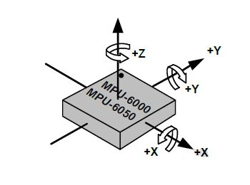
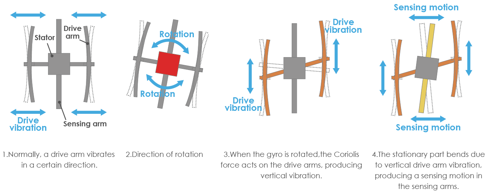

# 2.2.6 GY521 Module

## Introduction

The GY-521 module is an integrated six-axis motion tracking sensor that includes a 3-axis gyroscope and a 3-axis accelerometer. It is based on the MPU-6050 chip, which is a sensor specifically designed for mobile devices such as smartphones, tablets, and wearables. The GY-521 inherits the low power consumption, low cost, and high performance characteristics of the MPU-6050, meeting the stringent demands of these devices for dynamic capture and motion analysis. It is widely used in robots, game controllers, motion tracking systems, and any applications requiring precise measurement and analysis of movement data. With its I²C interface, the GY-521 can easily connect to various microcontrollers and processors, providing developers with a flexible and powerful solution.

In this experiment, use  I²C to obtain the values of the three-axis acceleration sensor and three-axis gyroscope for GY-521 and display them on the screen.

## Components


**MPU6050**

The MPU-6050 is a 6-axis(combines 3-axis Gyroscope, 3-axis Accelerometer) motion tracking devices.

Its three coordinate systems are defined as follows:

Put MPU6050 flat on the table, assure that the face with label is upward and a dot on this surface is on the top left corner. Then the upright direction upward is the z-axis of the chip. The direction from left to right is regarded as the X-axis. Accordingly the direction from back to front is defined as the Y-axis.



**3-axis Accelerometer**

The accelerometer works on the principle of piezo electric effect, the ability of certain materials to generate an electric charge in response to applied mechanical stress.

Here, imagine a cuboidal box, having a small ball inside it, like in the picture above. The walls of this box are made with piezo electric crystals. Whenever you tilt the box, the ball is forced to move in the direction of the inclination, due to gravity. The wall with which the ball collides, creates tiny piezo electric currents. There are totally, three pairs of opposite walls in a cuboid. Each pair corresponds to an axis in 3D space: X, Y and Z axes. Depending on the current produced from the piezo electric walls, we can determine the direction of inclination and its magnitude.


We can use the MPU6050 to detect its acceleration on each coordinate axis (in the stationary desktop state, the Z-axis acceleration is 1 gravity unit, and the X and Y axes are 0). If it is tilted or in a weightless/overweight condition, the corresponding reading will change.

There are four kinds of measuring ranges that can be selected programmatically: +/-2g, +/-4g, +/-8g, and +/-16g (2g by default) corresponding to each precision. Values range from -32768 to 32767.

The reading of accelerometer is converted to an acceleration value by mapping the reading from the reading range to the measuring range.

Acceleration = (Accelerometer axis raw data / 65536 * full scale Acceleration range) g

Take the X-axis as an example, when Accelerometer X axis raw data is 16384 and the range is selected as +/-2g:

**Acceleration along the X axis = (16384 / 65536 \* 4) g** **=1g**

**3-axis Gyroscope**

Gyroscopes work on the principle of Coriolis acceleration. Imagine that there is a fork like structure, that is in constant back and forth motion. It is held in place using piezo electric crystals. Whenever, you try to tilt this arrangement, the crystals experience a force in the direction of inclination. This is caused as a result of the inertia of the moving fork. The crystals thus produce a current in consensus with the piezo electric effect, and this current is amplified.



The Gyroscope also has four kinds of measuring ranges: +/- 250, +/- 500, +/- 1000, +/- 2000. The calculation method and Acceleration are basically consistent.

The formula for converting the reading into angular velocity is as follows:

Angular velocity = (Gyroscope axis raw data / 65536 * full scale Gyroscope range) °/s

The X axis, for example, the Accelerometer X axis raw data is 16384 and ranges + / - 250°/ s:

**Angular velocity along the X axis = (16384 / 65536 \* 500)°/s** **=125°/s**

## Connect

MPU6050 communicates with the microcontroller through the I2C bus interface. The SDA1 and SCL1 need to be connected to the corresponding pin.


## Code

### For  C  Language User

Go to the code folder compile and run.

```sh
cd ~/super-starter-kit-for-raspberry-pi/c/2.2.6/
gcc 2.2.6_mpu6050.c -lwiringPi -lm
sudo ./a.out
```

With the code run, deflection angle of x axis, y axis and the acceleration, angular velocity on each axis read by MPU6050 will be printed on the screen after being calculating.

This is the complete code

```c
#include  <wiringPiI2C.h>
#include <wiringPi.h>
#include  <stdio.h>
#include  <math.h>
int fd;
int acclX, acclY, acclZ;
int gyroX, gyroY, gyroZ;
double acclX_scaled, acclY_scaled, acclZ_scaled;
double gyroX_scaled, gyroY_scaled, gyroZ_scaled;

int read_word_2c(int addr)
{
int val;
val = wiringPiI2CReadReg8(fd, addr);
val = val << 8;
val += wiringPiI2CReadReg8(fd, addr+1);
if (val >= 0x8000)
    val = -(65536 - val);
return val;
}

double dist(double a, double b)
{
return sqrt((a*a) + (b*b));
}

double get_y_rotation(double x, double y, double z)
{
double radians;
radians = atan2(x, dist(y, z));
return -(radians * (180.0 / M_PI));
}

double get_x_rotation(double x, double y, double z)
{
double radians;
radians = atan2(y, dist(x, z));
return (radians * (180.0 / M_PI));
}

int main()
{
fd = wiringPiI2CSetup (0x68);
wiringPiI2CWriteReg8 (fd,0x6B,0x00);//disable sleep mode
printf("set 0x6B=%X\n",wiringPiI2CReadReg8 (fd,0x6B));

while(1) {

    gyroX = read_word_2c(0x43);
    gyroY = read_word_2c(0x45);
    gyroZ = read_word_2c(0x47);

    gyroX_scaled = gyroX / 131.0;
    gyroY_scaled = gyroY / 131.0;
    gyroZ_scaled = gyroZ / 131.0;

    //Print values for the X, Y, and Z axes of the gyroscope sensor.
    printf("My gyroX_scaled: %f\n", gyroY X_scaled);
    delay(100);
    printf("My gyroY_scaled: %f\n", gyroY Y_scaled);
    delay(100);
    printf("My gyroZ_scaled: %f\n", gyroY Z_scaled);
    delay(100);

    acclX = read_word_2c(0x3B);
    acclY = read_word_2c(0x3D);
    acclZ = read_word_2c(0x3F);

    acclX_scaled = acclX / 16384.0;
    acclY_scaled = acclY / 16384.0;
    acclZ_scaled = acclZ / 16384.0;

    //Print the X, Y, and Z values of the acceleration sensor.
    printf("My acclX_scaled: %f\n", acclX_scaled);
    delay(100);
    printf("My acclY_scaled: %f\n", acclY_scaled);
    delay(100);
    printf("My acclZ_scaled: %f\n", acclZ_scaled);
    delay(100);

    printf("My X rotation: %f\n", get_x_rotation(acclX_scaled, acclY_scaled, acclZ_scaled));
    delay(100);
    printf("My Y rotation: %f\n", get_y_rotation(acclX_scaled, acclY_scaled, acclZ_scaled));
    delay(100);

    delay(100);
}
return 0;
}
```

### For  Python  Language User

Go to the code folder and run.

```sh
cd ~/super-starter-kit-for-raspberry-pi/python
python 2.2.6_mpu6050.py
```

With the code run, deflection angle of x axis, y axis and the acceleration, angular velocity on each axis read by MPU6050 will be printed on the screen after being calculating.

```python
import smbus
import math
import time

# Power management registers
power_mgmt_1 = 0x6b
power_mgmt_2 = 0x6c

def read_byte(adr):
    return bus.read_byte_data(address, adr)

def read_word(adr):
    high = bus.read_byte_data(address, adr)
    low = bus.read_byte_data(address, adr+1)
    val = (high << 8) + low
    return val

def read_word_2c(adr):
    val = read_word(adr)
    if (val >= 0x8000):
        return -((65535 - val) + 1)
    else:
        return val

def dist(a,b):
    return math.sqrt((a*a)+(b*b))

def get_y_rotation(x,y,z):
    radians = math.atan2(x, dist(y,z))
    return -math.degrees(radians)

def get_x_rotation(x,y,z):
    radians = math.atan2(y, dist(x,z))
    return math.degrees(radians)


bus = smbus.SMBus(1) # or bus = smbus.SMBus(1) for Revision 2 boards
address = 0x68       # This is the address value read via the i2cdetect command

# Now wake the 6050 up as it starts in sleep mode
bus.write_byte_data(address, power_mgmt_1, 0)

while True:
    time.sleep(0.1)
    gyro_xout = read_word_2c(0x43)
    gyro_yout = read_word_2c(0x45)
    gyro_zout = read_word_2c(0x47)

    print ("gyro_xout : ", gyro_xout, " scaled: ", (gyro_xout / 131))
    print ("gyro_yout : ", gyro_yout, " scaled: ", (gyro_yout / 131))
    print ("gyro_zout : ", gyro_zout, " scaled: ", (gyro_zout / 131))

    accel_xout = read_word_2c(0x3b)
    accel_yout = read_word_2c(0x3d)
    accel_zout = read_word_2c(0x3f)

    accel_xout_scaled = accel_xout / 16384.0
    accel_yout_scaled = accel_yout / 16384.0
    accel_zout_scaled = accel_zout / 16384.0

    print ("accel_xout: ", accel_xout, " scaled: ", accel_xout_scaled)
    print ("accel_yout: ", accel_yout, " scaled: ", accel_yout_scaled)
    print ("accel_zout: ", accel_zout, " scaled: ", accel_zout_scaled)

    print ("x rotation: " , get_x_rotation(accel_xout_scaled, accel_yout_scaled, accel_zout_scaled))
    print ("y rotation: " , get_y_rotation(accel_xout_scaled, accel_yout_scaled, accel_zout_scaled))

    time.sleep(0.5)
```

## Phenomenon

