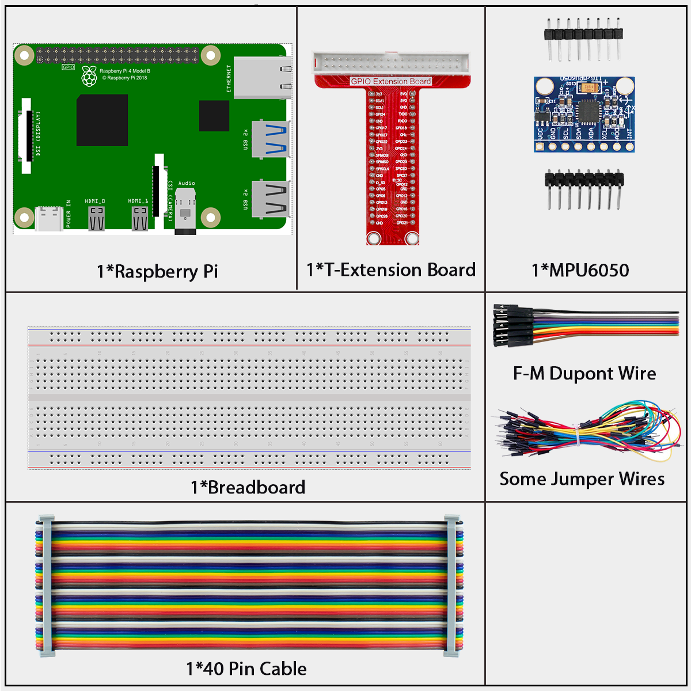
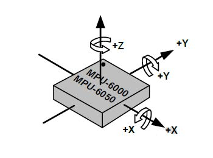
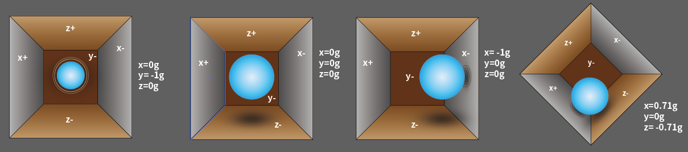
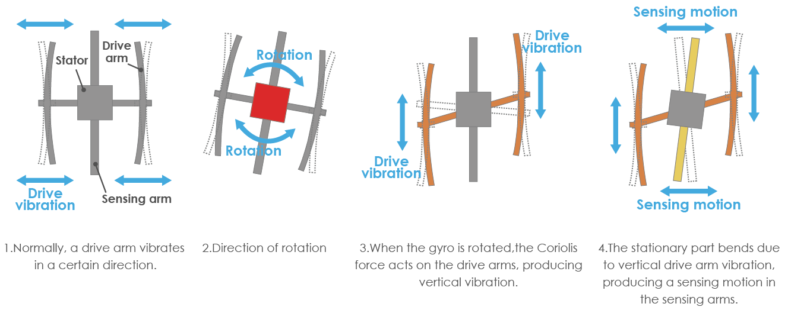
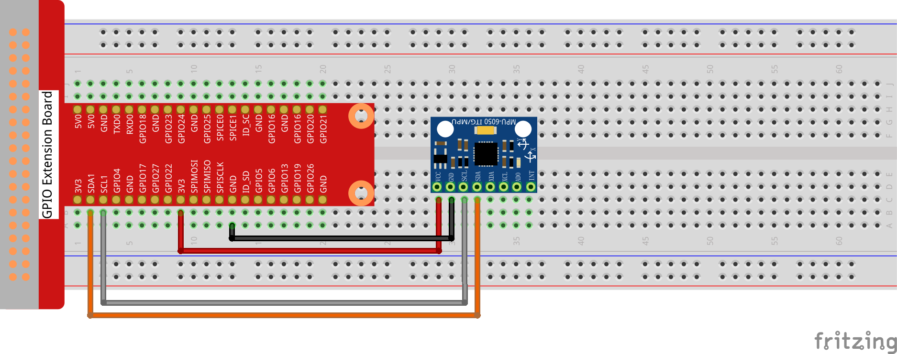
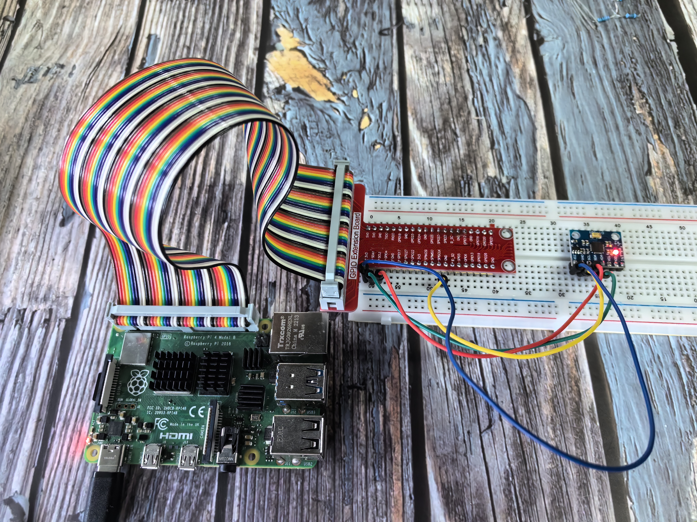

==================
2.2.6 GY521 Module
==================

Introduction
------------

In this beginner-friendly project, you'll learn how to detect motion and orientation using the GY-521 module - a smart sensor that can tell you how fast something is moving AND which way it's tilted! Think of it like the sensor inside your smartphone that knows when you rotate your phone or when you're walking. This is perfect for building motion-controlled games, self-balancing robots, or activity trackers.

In this experiment, we'll read data from both the accelerometer (detects movement) and gyroscope (detects rotation) and display the values on your screen.

Components
----------

**What is the GY-521 Module?**

The GY-521 is like having two sensors in one tiny package:
1. **3-axis Accelerometer** - Detects movement and tilt (like a digital level)
2. **3-axis Gyroscope** - Detects rotation and spinning (like a digital compass for rotation)

**Why is this amazing?**
Your smartphone uses the exact same type of sensor (MPU-6050 chip) to:
- Auto-rotate the screen when you turn your phone
- Count your steps when walking
- Control games by tilting the phone
- Stabilize camera videos

**Understanding the 3D Coordinate System:**

**Simple orientation guide:**
Place the GY-521 flat on a table with the label facing up and the dot in the top-left corner:
- **X-axis:** Left to right movement (like shaking your head "no")
- **Y-axis:** Forward and backward movement (like nodding "yes") 
- **Z-axis:** Up and down movement (like jumping)

**What is a 3-Axis Accelerometer?**

**Simple explanation:**
An accelerometer detects when something speeds up, slows down, or tilts. Think of it like a tiny ball rolling around inside a box!

**Real-world analogy:**
Imagine a small ball inside a cube-shaped box. When you:
- **Tilt the box left:** Ball rolls left and hits the left wall
- **Tilt the box forward:** Ball rolls forward and hits the front wall  
- **Shake the box:** Ball bounces around hitting different walls

The walls are made of special material that creates tiny electrical signals when the ball hits them. By measuring these signals, we know which direction the box is tilted and how much!

**What do the readings mean?**
- **At rest on a table:** Z-axis reads 1g (gravity pulling down), X and Y read 0g
- **Tilted left:** X-axis reading changes
- **Tilted forward:** Y-axis reading changes
- **In free fall:** All axes read close to 0g (weightless!)

**Measurement ranges (you can choose):**
- **±2g:** Most sensitive, good for detecting small tilts
- **±4g, ±8g, ±16g:** Less sensitive, good for detecting strong movements

**The math (don't worry, your code handles this!):**
The sensor gives you numbers from -32,768 to 32,767. Your program converts these to actual g-forces using:

**Acceleration = (Raw reading ÷ 65,536 × Full range) g**

**Example:** If you get a raw reading of 16,384 on the X-axis with ±2g range:
**X acceleration = (16,384 ÷ 65,536 × 4) g = 1g**

**What is a 3-Axis Gyroscope?**

**Simple explanation:**
A gyroscope detects rotation - how fast something is spinning around each axis. Think of it like a digital version of a spinning top that can tell you rotation speed!

**What do the readings mean?**
- **Not rotating:** All axes read 0°/s (degrees per second)
- **Rotating left/right:** Z-axis reading changes
- **Tilting forward/back:** Y-axis reading changes  
- **Rolling left/right:** X-axis reading changes

**Measurement ranges (you can choose):**
- **±250°/s:** Most sensitive, detects slow rotations
- **±500°/s, ±1000°/s, ±2000°/s:** Less sensitive, detects faster spins

**The math (again, your code handles this!):**
**Angular velocity = (Raw reading ÷ 65,536 × Full range) °/s**

**Beginner-friendly applications:**
- **Self-balancing robot:** Use accelerometer to detect tilt, gyroscope to detect falling
- **Motion-controlled game:** Tilt to steer, rotate to aim
- **Activity tracker:** Count steps and detect different activities
- **Camera stabilizer:** Detect unwanted movement and compensate
- **Virtual reality controller:** Track head or hand movements

Connect
-------

MPU6050 communicates with the microcontroller through the I2C bus interface. The SDA1 and SCL1 need to be connected to the corresponding pin.

.. list-table::
   :header-rows: 1
   :widths: 25 25

   * - T-Board Name
     - physical
   * - SDA
     - Pin 3
   * - SCL
     - Pin 5

Code
----

For C Language User
~~~~~~~~~~~~~~~~~~~~~

Go to the code folder compile and run.

.. code-block:: shell

   cd ~/super-starter-kit-for-raspberry-pi/c/2.2.6/

.. code-block:: shell

   gcc 2.2.6_mpu6050.c -lwiringPi -lm

.. code-block:: shell

   sudo ./a.out

With the code run, deflection angle of x axis, y axis and the acceleration, angular velocity on each axis read by MPU6050 will be printed on the screen after being calculating.

This is the complete code

.. code-block:: c

   #include <wiringPiI2C.h>
   #include <wiringPi.h>
   #include <stdio.h>
   #include <stdlib.h> // Required for exit()
   #include <math.h>

   // --- MPU6050 Constants ---
   #define MPU6050_I2C_ADDR 0x68

   // Register Addresses
   #define REG_PWR_MGMT_1   0x6B
   #define REG_ACCEL_X_OUT  0x3B
   #define REG_ACCEL_Y_OUT  0x3D
   #define REG_ACCEL_Z_OUT  0x3F
   #define REG_GYRO_X_OUT   0x43
   #define REG_GYRO_Y_OUT   0x45
   #define REG_GYRO_Z_OUT   0x47

   // Sensitivity Scale Factors from datasheet
   // Gyroscope: ±250 °/s => 131 LSB/°/s
   // Accelerometer: ±2g => 16384 LSB/g
   const double GYRO_SCALE_FACTOR = 131.0;
   const double ACCEL_SCALE_FACTOR = 16384.0;

   // Struct to hold 3D vector data (raw and scaled)
   typedef struct {
      int x_raw, y_raw, z_raw;
      double x_scaled, y_scaled, z_scaled;
   } Vector3D;

   /**
   * @brief Reads a 16-bit word (two 8-bit registers) from the I2C device.
   * MPU6050 stores values in two's complement format.
   * @param fd The file descriptor for the I2C device.
   * @param addr The starting register address.
   * @return The signed 16-bit integer value.
   */
   int read_sensor_word(int fd, int addr) {
      int high = wiringPiI2CReadReg8(fd, addr);
      int low = wiringPiI2CReadReg8(fd, addr + 1);
      int value = (high << 8) | low;
      
      // Convert from two's complement
      if (value >= 0x8000) {
         value = -(65536 - value);
      }
      return value;
   }

   /**
   * @brief Initializes the MPU6050 sensor.
   * @return The file descriptor for the I2C device.
   */
   int setup_mpu6050() {
      int fd = wiringPiI2CSetup(MPU6050_I2C_ADDR);
      if (fd == -1) {
         printf("Failed to setup I2C device at address 0x%X.\n", MPU6050_I2C_ADDR);
         exit(1);
      }
      // Wake up the MPU6050 by writing 0x00 to the power management register.
      wiringPiI2CWriteReg8(fd, REG_PWR_MGMT_1, 0x00);
      return fd;
   }

   /**
   * @brief Reads all raw data from the gyroscope and populates the Vector3D struct.
   * @param fd File descriptor for the I2C device.
   * @param gyro A pointer to the Vector3D struct to fill.
   */
   void read_gyro_data(int fd, Vector3D* gyro) {
      gyro->x_raw = read_sensor_word(fd, REG_GYRO_X_OUT);
      gyro->y_raw = read_sensor_word(fd, REG_GYRO_Y_OUT);
      gyro->z_raw = read_sensor_word(fd, REG_GYRO_Z_OUT);
      gyro->x_scaled = gyro->x_raw / GYRO_SCALE_FACTOR;
      gyro->y_scaled = gyro->y_raw / GYRO_SCALE_FACTOR;
      gyro->z_scaled = gyro->z_raw / GYRO_SCALE_FACTOR;
   }

   /**
   * @brief Reads all raw data from the accelerometer and populates the Vector3D struct.
   * @param fd File descriptor for the I2C device.
   * @param accel A pointer to the Vector3D struct to fill.
   */
   void read_accel_data(int fd, Vector3D* accel) {
      accel->x_raw = read_sensor_word(fd, REG_ACCEL_X_OUT);
      accel->y_raw = read_sensor_word(fd, REG_ACCEL_Y_OUT);
      accel->z_raw = read_sensor_word(fd, REG_ACCEL_Z_OUT);
      accel->x_scaled = accel->x_raw / ACCEL_SCALE_FACTOR;
      accel->y_scaled = accel->y_raw / ACCEL_SCALE_FACTOR;
      accel->z_scaled = accel->z_raw / ACCEL_SCALE_FACTOR;
   }

   /**
   * @brief Calculates the distance between two points in 2D space.
   */
   double dist(double a, double b) {
      return sqrt(a * a + b * b);
   }

   /**
   * @brief Calculates rotation around the X and Y axes based on accelerometer data.
   * @param accel A pointer to the accelerometer data.
   * @param x_rotation A pointer to store the calculated X-axis rotation.
   * @param y_rotation A pointer to store the calculated Y-axis rotation.
   */
   void calculate_rotation(const Vector3D* accel, double* x_rotation, double* y_rotation) {
      *x_rotation = atan2(accel->y_scaled, dist(accel->x_scaled, accel->z_scaled)) * 180.0 / M_PI;
      *y_rotation = -atan2(accel->x_scaled, dist(accel->y_scaled, accel->z_scaled)) * 180.0 / M_PI;
   }

   /**
   * @brief Main function.
   */
   int main() {
      int fd = setup_mpu6050();
      Vector3D gyroscope, accelerometer;
      double x_rot, y_rot;

      printf("MPU6050 sensor reading started.\n\n");

      while (1) {
         read_gyro_data(fd, &gyroscope);
         read_accel_data(fd, &accelerometer);
         calculate_rotation(&accelerometer, &x_rot, &y_rot);
         
         printf("--- Gyroscope (°/s) ---\n");
         printf("X: %8.2f | Y: %8.2f | Z: %8.2f\n", gyroscope.x_scaled, gyroscope.y_scaled, gyroscope.z_scaled);
         
         printf("--- Accelerometer (g) ---\n");
         printf("X: %8.2f | Y: %8.2f | Z: %8.2f\n", accelerometer.x_scaled, accelerometer.y_scaled, accelerometer.z_scaled);
         
         printf("--- Calculated Rotation (°) ---\n");
         printf("X-Rotation: %6.1f | Y-Rotation: %6.1f\n", x_rot, y_rot);

         printf("\n----------------------------------\n\n");
         delay(500);
      }

      return 0; // Unreachable
   }

For Python Language User
~~~~~~~~~~~~~~~~~~~~~~~~~~

Go to the code folder and run.

.. code-block:: shell

   cd ~/super-starter-kit-for-raspberry-pi/python

.. code-block:: shell

   python 2.2.6_mpu6050.py

With the code run, deflection angle of x axis, y axis and the acceleration, angular velocity on each axis read by MPU6050 will be printed on the screen after being calculating.

.. code-block:: python

   #!/usr/bin/env python3

   """
   2.2.6_mpu6050.py

   This script provides a refactored, object-oriented version for reading data
   from an MPU-6050 accelerometer and gyroscope sensor.

   It is structured to be similar in clarity and organization to a well-written C
   program, using a class to manage the sensor, a data structure to hold vector
   information, and clear constants for configuration.
   """

   import smbus
   import math
   import time

   class MPU6050:
      """
      A class to interact with the MPU-6050 sensor, providing methods to
      read accelerometer, gyroscope, and rotation data.
      """

      # --- I2C and Register Constants ---
      I2C_ADDR = 0x68

      # Power Management Register
      REG_PWR_MGMT_1 = 0x6B

      # Accelerometer Registers
      REG_ACCEL_X_OUT = 0x3B
      REG_ACCEL_Y_OUT = 0x3D
      REG_ACCEL_Z_OUT = 0x3F

      # Gyroscope Registers
      REG_GYRO_X_OUT = 0x43
      REG_GYRO_Y_OUT = 0x45
      REG_GYRO_Z_OUT = 0x47

      # --- Scale Factors ---
      # From the MPU-6050 datasheet for default settings:
      # Gyroscope: FS_SEL=0 -> ±250 °/s -> Sensitivity: 131 LSB/°/s
      # Accelerometer: AFS_SEL=0 -> ±2g -> Sensitivity: 16384 LSB/g
      GYRO_SCALE_FACTOR = 131.0
      ACCEL_SCALE_FACTOR = 16384.0

      class Vector3D:
         """A simple data structure to hold 3D vector data (like a C struct)."""
         def __init__(self, x=0.0, y=0.0, z=0.0):
               self.x = x
               self.y = y
               self.z = z

         def __str__(self):
               # Formats the vector for clean printing.
               return f"X: {self.x:8.2f} | Y: {self.y:8.2f} | Z: {self.z:8.2f}"

      def __init__(self, bus_number=1):
         """
         Initializes the MPU-6050 sensor.
         Args:
               bus_number (int): The I2C bus number (1 for most Raspberry Pi models).
         """
         try:
               self.bus = smbus.SMBus(bus_number)
               # Wake up the sensor - it starts in sleep mode by default.
               self.bus.write_byte_data(self.I2C_ADDR, self.REG_PWR_MGMT_1, 0)
               print("MPU-6050 sensor initialized and woken up.")
         except IOError:
               print(f"Failed to initialize I2C device at address 0x{self.I2C_ADDR:X}.")
               print("Please check your connections and the I2C address.")
               exit(1) # Exit if sensor is not found

      def _read_word_2c(self, register):
         """
         Reads a 16-bit signed value (in two's complement format) from two
         adjacent 8-bit registers.
         Args:
               register (int): The starting register address.
         Returns:
               int: The signed 16-bit value.
         """
         high = self.bus.read_byte_data(self.I2C_ADDR, register)
         low = self.bus.read_byte_data(self.I2C_ADDR, register + 1)
         value = (high << 8) | low
         
         # Convert from two's complement
         if value >= 0x8000:
               return -((65535 - value) + 1)
         return value

      def get_gyro_data(self, scaled=True):
         """
         Reads gyroscope data (x, y, z axes).
         Args:
               scaled (bool): If True, returns scaled data in °/s. If False, returns raw integer data.
         Returns:
               Vector3D: A vector object containing the gyroscope data.
         """
         x = self._read_word_2c(self.REG_GYRO_X_OUT)
         y = self._read_word_2c(self.REG_GYRO_Y_OUT)
         z = self._read_word_2c(self.REG_GYRO_Z_OUT)

         if scaled:
               x /= self.GYRO_SCALE_FACTOR
               y /= self.GYRO_SCALE_FACTOR
               z /= self.GYRO_SCALE_FACTOR
         
         return self.Vector3D(x, y, z)

      def get_accel_data(self, scaled=True):
         """
         Reads accelerometer data (x, y, z axes).
         Args:
               scaled (bool): If True, returns scaled data in g's. If False, returns raw integer data.
         Returns:
               Vector3D: A vector object containing the accelerometer data.
         """
         x = self._read_word_2c(self.REG_ACCEL_X_OUT)
         y = self._read_word_2c(self.REG_ACCEL_Y_OUT)
         z = self._read_word_2c(self.REG_ACCEL_Z_OUT)

         if scaled:
               x /= self.ACCEL_SCALE_FACTOR
               y /= self.ACCEL_SCALE_FACTOR
               z /= self.ACCEL_SCALE_FACTOR

         return self.Vector3D(x, y, z)

      @staticmethod
      def _dist(a, b):
         """Calculates the Euclidean distance between two points (sqrt(a^2 + b^2))."""
         return math.sqrt(a*a + b*b)

      def get_rotation(self, accel_vector):
         """
         Calculates rotation around X and Y axes based on the gravity vector
         measured by the accelerometer.
         Args:
               accel_vector (Vector3D): The SCALED accelerometer data vector.
         Returns:
               dict: A dictionary with 'x' and 'y' rotation in degrees.
         """
         # Calculate rotation using atan2, which is robust and handles all quadrants.
         x_rad = math.atan2(accel_vector.y, self._dist(accel_vector.x, accel_vector.z))
         y_rad = math.atan2(accel_vector.x, self._dist(accel_vector.y, accel_vector.z))
         
         # Convert radians to degrees for human-readable output.
         x_deg = math.degrees(x_rad)
         y_deg = -math.degrees(y_rad)  # Y-rotation is often inverted depending on convention.
         
         return {'x': x_deg, 'y': y_deg}

   def main():
      """Main function to initialize the sensor and run the data reading loop."""
      sensor = MPU6050()
      print("\nStarting sensor readings. Press Ctrl+C to exit.")
      
      try:
         while True:
               # Read data from the sensor
               gyro_data = sensor.get_gyro_data()
               accel_data = sensor.get_accel_data()
               rotation = sensor.get_rotation(accel_data)
               
               # Print the data in a clean, formatted block
               print("\n-----------------------------------------")
               print(f"--- Gyroscope (°/s) ---")
               print(gyro_data)
               
               print(f"--- Accelerometer (g) ---")
               print(accel_data)
               
               print("--- Calculated Rotation (°) ---")
               print(f"X-Rotation: {rotation['x']:6.1f} | Y-Rotation: {rotation['y']:6.1f}")
               
               # Wait before the next reading
               time.sleep(0.5)

      except KeyboardInterrupt:
         print("\nProgram terminated by user.")
      finally:
         print("Exiting.")

   if __name__ == '__main__':
      # This ensures the main() function is called only when the script is executed directly.
      main()

Phenomenon
----------

