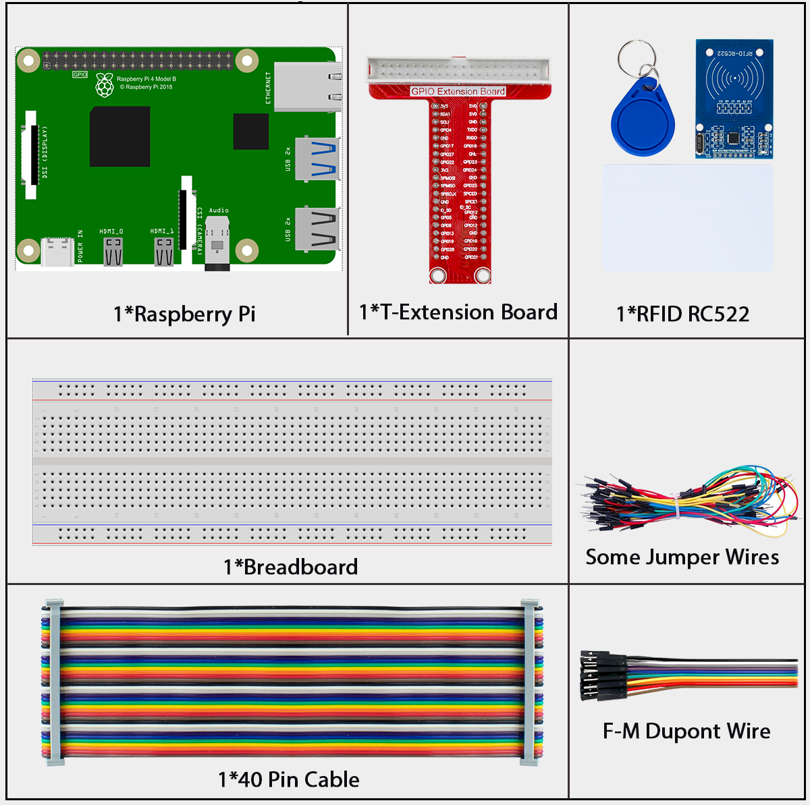
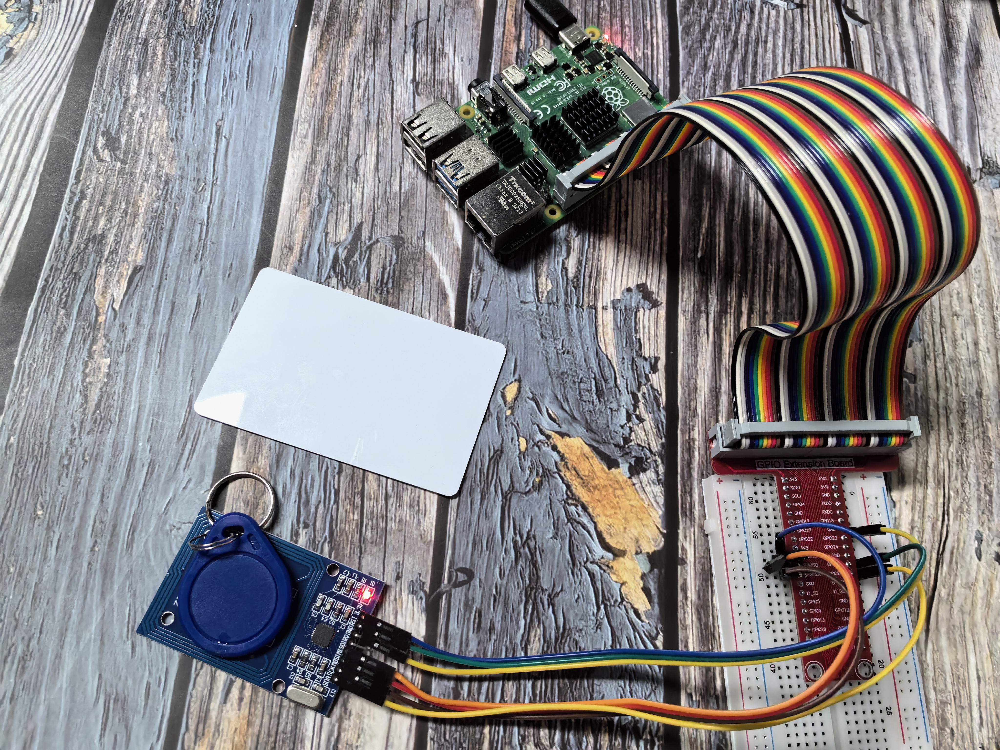

=========================
2.2.7 MFRC522 RFID Module
=========================

Introduction
------------

In this beginner-friendly project, you'll learn how to use RFID (Radio Frequency Identification) technology to wirelessly read and write data to special cards or tags! Think of it like a magical way to identify objects without touching them - just like how you tap your credit card or phone to pay, or use a key card to enter a building.

In this project, we'll explore how to read information from RFID cards and even write new data to them using the RC522 module.

Components
----------

**What is RFID Technology?**

RFID stands for "Radio Frequency Identification" - but think of it as "wireless identification" that works like magic! It's a way for devices to "talk" to each other using invisible radio waves, without any physical contact.

**Real-world examples you already know:**
- **Contactless payment:** Tap your credit card or phone to pay
- **Building access cards:** Swipe your student ID or office key card
- **Pet microchips:** Vets can scan to identify lost pets
- **Inventory tracking:** Stores use it to track products
- **Public transport:** Bus/subway cards that you tap
- **Car key fobs:** Modern car keys that unlock doors automatically

**How does RFID work? (The Simple Version)**

**The two main parts:**
1. **RFID Reader (RC522 module):** The "question asker" - sends out radio waves asking "Who are you?"
2. **RFID Tag/Card:** The "answer giver" - responds with its unique ID when it receives the radio waves

**The conversation process:**
1. **Reader broadcasts:** "Hello, is anyone there?" (sends radio waves)
2. **Tag receives power:** The radio waves actually power up the tag (no battery needed!)
3. **Tag responds:** "Yes, I'm here! My ID is 123456789" (sends back its unique information)
4. **Reader processes:** "Got it! I now know tag 123456789 is nearby"

**What's inside an RFID system?**

**RFID Reader (RC522 Module):**
- **Antenna:** Sends and receives radio signals
- **Processor:** Manages communication and data processing
- **Interface:** Connects to your Raspberry Pi via SPI

**RFID Tags/Cards:**
- **Microchip:** Stores the unique ID and any additional data
- **Antenna:** Receives power and sends data back to reader
- **No battery needed:** Gets power wirelessly from the reader's radio waves!

**Two types of RFID tags:**

**Passive Tags (what we're using):**
- **No battery:** Powered by the reader's radio waves
- **Short range:** Work within a few centimeters to meters
- **Cheap and simple:** Perfect for learning projects
- **Examples:** Credit cards, access cards, inventory tags

**Active Tags (more advanced):**
- **Have batteries:** Can transmit farther and store more data
- **Longer range:** Can work from several meters away
- **More expensive:** Used in specialized applications
- **Examples:** Toll road transponders, vehicle tracking

**Key advantages for beginners:**
- **No contact needed:** Just bring the card close to the reader
- **Works through materials:** Can read through plastic, paper, even thin walls
- **Fast identification:** Instant response when card is detected
- **Reusable:** Can read the same card thousands of times
- **Programmable:** Can store custom data, not just ID numbers

**Perfect for projects like:**
- **Access control system:** Only certain cards can unlock something
- **Attendance tracker:** Scan your card to record when you arrive
- **Smart pet feeder:** Only feeds when the right pet's tag is detected
- **Inventory management:** Track which items are where
- **Interactive games:** Different cards trigger different actions
- **Personal identification:** Create your own smart ID system

Connect
-------

.. image:: ./img/image232.png

Code
----

.. important::

   **SPI Configuration Required:** The RC522 RFID module communicates with Raspberry Pi via SPI interface. Before running the code, you need to enable SPI on your Raspberry Pi. Please refer to :doc:`../appendix/spi_configuration` for detailed setup instructions.

For C Language User
~~~~~~~~~~~~~~~~~~~~~

Go to the code folder compile and run.

.. code-block:: shell

   cd ~/super-starter-kit-for-raspberry-pi/c/2.2.7/

.. code-block:: shell

   make read

.. code-block:: shell
   
   make write

.. code-block:: shell
   
   sudo read

.. code-block:: shell
   
   sudo wriet

With the code run， You can write and read the data in the card

For Python Language User
~~~~~~~~~~~~~~~~~~~~~~~~~~

.. tip::

   **Virtual Environment Recommended:** For better dependency management and system security, we recommend using a Python virtual environment. Please refer to :doc:`../appendix/virtual_env` for detailed setup instructions.

1.Switch directory

.. code-block:: shell

   cd ~/super-starter-kit-for-raspberry-pi/python/2.2.7

2.Activation virtual environment

.. code-block:: shell
   
   source myenv/bin/activate

3.Installation library

.. code-block:: shell
   
   pip3 install spidev

.. code-block:: shell
   
   pip3 install mfrc522

4.Run executable file

.. code-block:: shell

   sudo python3 2.2.7_read.py
   
.. code-block:: shell
   
   sudo python3 2.2.7_write.py

5.Exit the virtual environment

.. code-block:: shell
   
   deactivate

For Python Language User(Pi5)
~~~~~~~~~~~~~~~~~~~~~~~~~~~~~~

The Pi 5 version has the MFRC522.py library pre-installed, so you can run the code directly without installing dependencies.

1.Switch directory

.. code-block:: shell

   cd ~/super-starter-kit-for-raspberry-pi/python/2.2.7_RFID_Pi5

2.Run executable file

.. code-block:: shell

   sudo python3 2.2.7_read.py
   
.. code-block:: shell
   
   sudo python3 2.2.7_write.py

Phenomenon
----------

