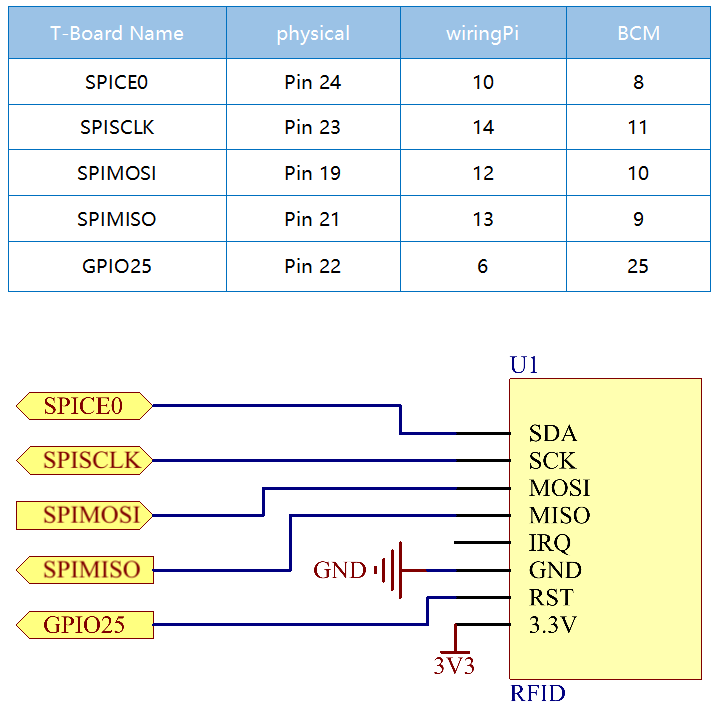

=======================
2.2.7 MFRC522 RFID Module
=======================

Introduction
------------

Radio Frequency Identification (RFID) refers to technologies that use wireless communication between an object (or tag) and interrogating device (or reader) to automatically track and identify such objects.

Some of the most common applications for this technology include retail supply chains, military supply chains, automated payment methods, baggage tracking and management, document tracking and pharmaceutical management, to name a few.

In this project, we will use RFID for reading and writing.

Components
----------

.. image:: ./img/list/list_2.2.7.png

**RFID**

Radio Frequency Identification RFID refers to technologies that involve using wireless communication between an object (or tag) and an interrogating device (or reader) to automatically track and identify such objects. The tag transmission range is limited to several meters from the reader. A clear line of sight between the reader and tag is not necessarily required.

Most tags contain at least one integrated circuit (IC) and an antenna. The microchip stores information and is responsible for managing the radio frequency (RF) communication with the reader. Passive tags do not have an independent energy source and depend on an external electromagnetic signal, provided by the reader, to power their operations. Active tags contain an independent energy source, such as a battery. Thus, they may have increased processing, transmission capabilities and range.

Connect
-------

.. image:: ./img/image232.png

Code
----

For C Language User
~~~~~~~~~~~~~~~~~~~~~

Go to the code folder compile and run.

.. code-block:: shell

   cd ~/super-starter-kit-for-raspberry-pi/c/2.2.7/
   make read
   make write
   sudo read
   sudo wriet

With the code run， You can write and read the data in the card

For Python Language User
~~~~~~~~~~~~~~~~~~~~~~~~~~

1.Switch directory

2.Activation virtual environment

3.Installation library

4.Exit the virtual environment

5.Run executable file

.. code-block:: shell

   1.
   cd ~/super-starter-kit-for-raspberry-pi/python/2.2.7
   2.
   source myenv/bin/activate
   3.
   sudo pip3 install spidev
   sudo pip3 install mfrc522
   4.
   deactivate
   5.
   sudo python3 2.2.7_read.py
   sudo python3 2.2.7_write.py

This is the complete code

.. code-block:: python

   xxxx

.. code-block:: python

   xxxx

Phenomenon
----------

.. image:: ./img/phenomenon/227.jpg