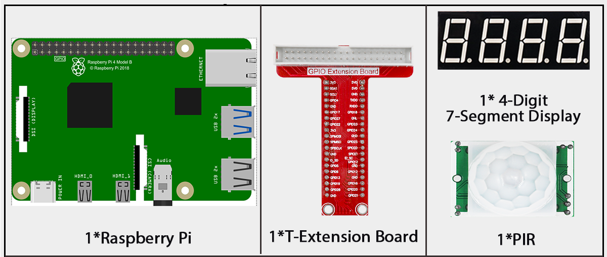
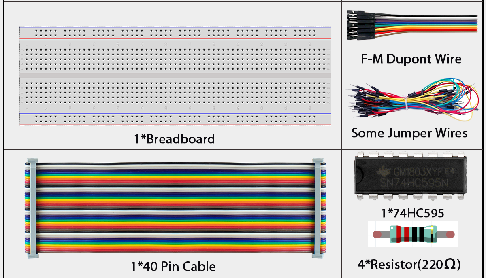
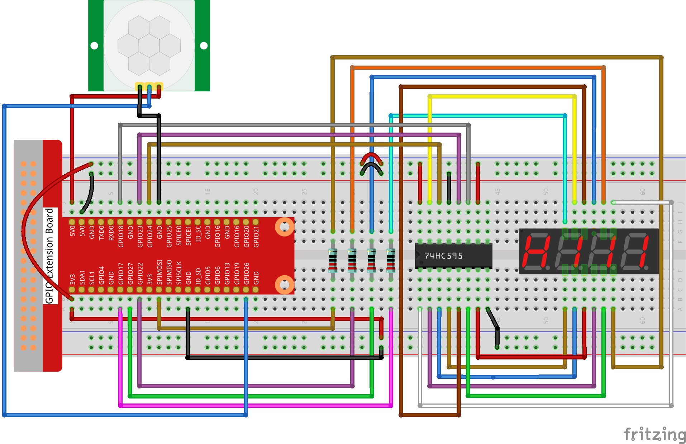
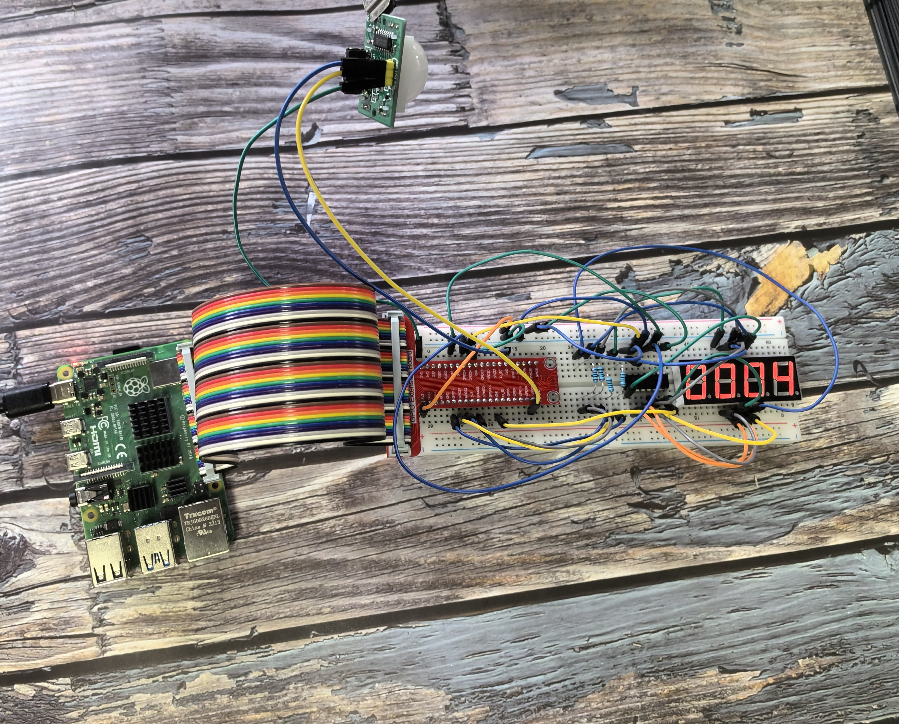

3.1.1 Counting Device
======================

Introduction
------------

In this beginner-friendly project, you'll build an automatic people counter that works like the ones you see in stores or buildings! We'll combine a PIR motion sensor (which detects when someone walks by) with a 4-digit display (which shows the count). Every time someone passes in front of the sensor, the number on the display increases by 1. This is perfect for counting visitors, monitoring foot traffic, or creating an attendance system.

Components
----------

Connect
-------

.. list-table::
   :header-rows: 1
   :widths: 25 25 25 25

   * - T-Board Name
     - physical
     - wiringPi
     - BCM
   * - GPIO17
     - Pin 11
     - 0
     - 17
   * - GPIO27
     - Pin 13
     - 2
     - 27
   * - GPIO22
     - Pin 15
     - 3
     - 22
   * - SPIMOSI
     - Pin 19
     - 12
     - 10
   * - GPIO18
     - Pin 12
     - 1
     - 18
   * - GPIO23
     - Pin 16
     - 4
     - 23
   * - GPIO24
     - Pin 18
     - 5
     - 24
   * - GPIO26
     - Pin 37
     - 25
     - 26

.. note:: 

   **Important Setup Tip:** When you first power on the PIR sensor, it needs about 1 minute to "warm up" and calibrate itself. During this time, try to stay away from the sensor and avoid moving in front of it, as this can make the sensor less accurate later. Just be patient and let it initialize!

Code
----

For C Language User
~~~~~~~~~~~~~~~~~~~

Go to the code folder compile and run.

.. code-block:: shell

   cd ~/super-starter-kit-for-raspberry-pi/c/3.1.1/

.. code-block:: shell

   gcc 3.1.1_CountingDevice.c -lwiringPi

.. code-block:: shell

   sudo ./a.out

.. tip:: 
   
   **Want to see the full code?** Use the command ``nano 3.1.1_CountingDevice.c`` to view and study the complete program!

**How it works:** Once your program is running, every time the PIR sensor detects motion (someone walking by), the counter on the 4-digit display will automatically increase by 1. It's like having an electronic doorman counting everyone who passes!

For Python Language User
~~~~~~~~~~~~~~~~~~~~~~~~

Go to the code folder and run.

.. code-block:: shell

   cd ~/super-starter-kit-for-raspberry-pi/python

.. code-block:: shell

   python 3.1.1_CountingDevice.py

**How it works:** Once your program is running, every time the PIR sensor detects motion (someone walking by), the counter on the 4-digit display will automatically increase by 1. It's like having an electronic doorman counting everyone who passes!

.. tip:: 

   **Fine-tuning your PIR sensor:** Your PIR module has two small knobs (potentiometers) that you can adjust:
   
   - **Sensitivity knob:** Controls how easily it detects motion
   - **Distance knob:** Controls how far away it can detect people
   
   **For best results:** Turn both knobs fully counterclockwise (all the way to the left). This makes the sensor most sensitive and gives it the longest detection range, so it won't miss anyone walking by!

Phenomenon
----------

