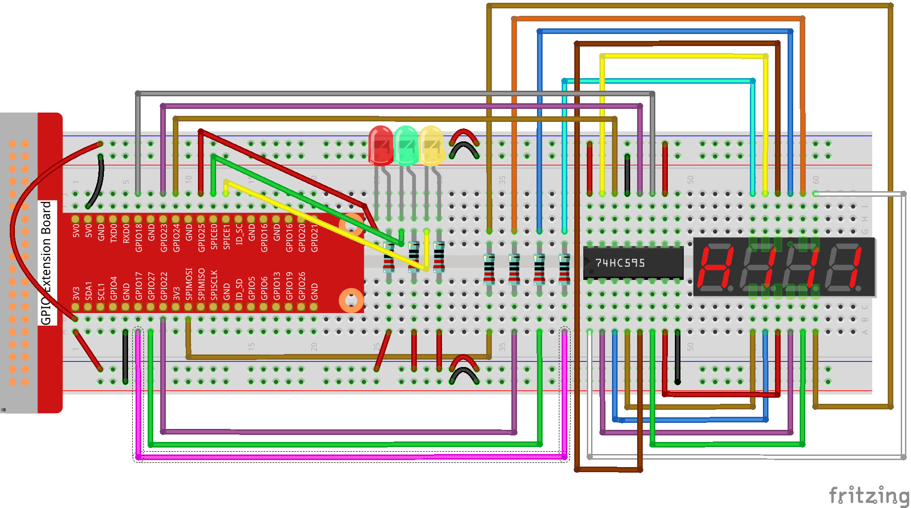

# 3.1.2 Traffic Light

## Introduction

In this project, we will use LED lights of three colors to realize the change of traffic lights and a four-digit 7-segment display will be used to display the timing of each traffic state.

## Components


## Connect

| T-Board Name | physical | wiringPi | BCM  |
| ------------ | -------- | -------- | ---- |
| GPIO17       | Pin 11   | 0        | 17   |
| GPIO27       | Pin 13   | 2        | 27   |
| GPIO22       | Pin 15   | 3        | 22   |
| SPIMOSI      | Pin 19   | 12       | 10   |
| GPIO18       | Pin 12   | 1        | 18   |
| GPIO23       | Pin 16   | 4        | 23   |
| GPIO24       | Pin 18   | 5        | 24   |
| GPIO25       | Pin 22   | 6        | 25   |
| SPICE0       | Pin 24   | 10       | 8    |
| SPICE1       | Pin 26   | 11       | 7    |




## Code

### For  C  Language User

Go to the code folder compile and run.

```sh
cd ~/super-starter-kit-for-raspberry-pi/c/3.1.2/
```

```sh
gcc 3.1.2_TrafficLight.c -lwiringPi
```

```sh
sudo ./a.out
```

As the code runs, LEDs will simulate the color changing of traffic lights. Firstly, the red LED lights up for 60s, then the green LED lights up for 30s; next, the yellow LED lights up for 5s. After that, the red LED lights up for 60s once again. In this way, this series of actions will be executed repeatedly.

<div class="warning" style="background-color: #E7F2FA; color=#6AB0DE; padding: 10px; border: 1px solid #333; border-radius: 5px;">
    NOTE: If you want to check the complete codes, you are suggested to use command `nano 3.1.2_TrafficLight.c` or `nano 3.1.2_TrafficLight.py`. 
</div>

### For  Python  Language User

Go to the code folder and run.

```sh
cd ~/super-starter-kit-for-raspberry-pi/python
```

```sh
python 3.1.2_TrafficLight.py
```

As the code runs, LEDs will simulate the color changing of traffic lights. Firstly, the red LED lights up for 60s, then the green LED lights up for 30s; next, the yellow LED lights up for 5s. After that, the red LED lights up for 60s once again. In this way, this series of actions will be executed repeatedly.

## Phenomenon


