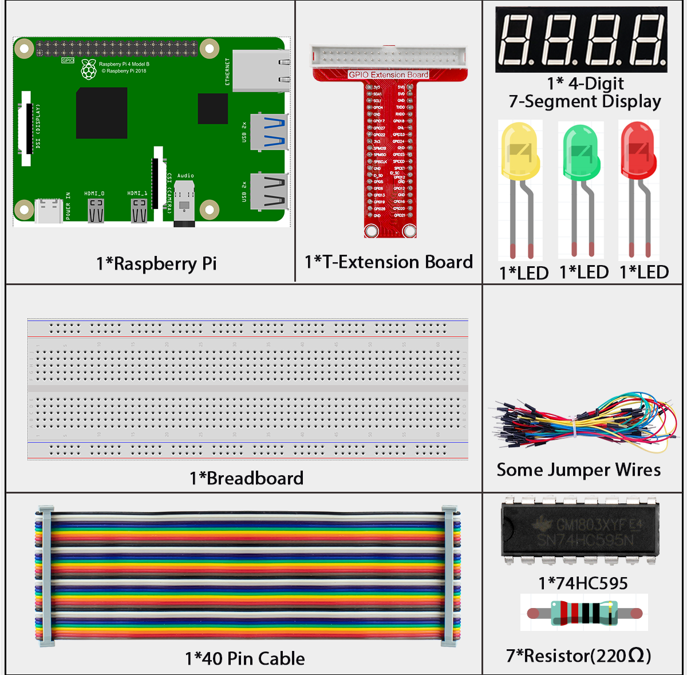
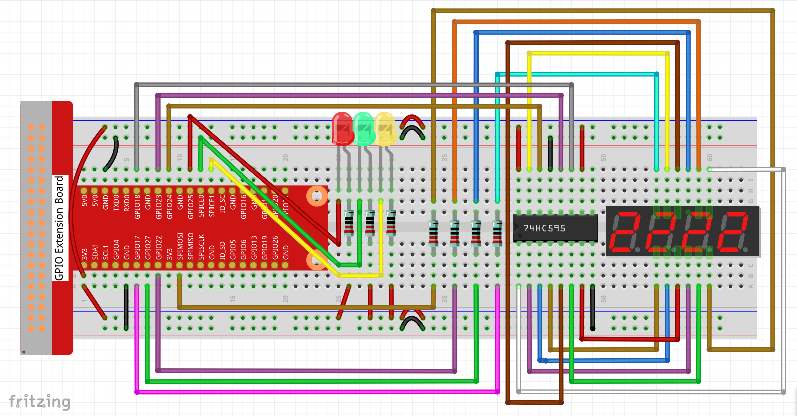

3.1.2 Traffic Light
===================

Introduction
------------

In this beginner-friendly project, you'll build your own working traffic light system using red, yellow, and green LEDs! Just like real traffic lights, your system will automatically cycle through different colors with proper timing. Plus, we'll add a 4-digit display that shows a countdown timer for each light phase - so drivers know exactly how much time is left!

Components
----------

Connect
-------

.. list-table::
   :header-rows: 1
   :widths: 25 25 25 25

   * - T-Board Name
     - physical
     - wiringPi
     - BCM
   * - GPIO17
     - Pin 11
     - 0
     - 17
   * - GPIO27
     - Pin 13
     - 2
     - 27
   * - GPIO22
     - Pin 15
     - 3
     - 22
   * - SPIMOSI
     - Pin 19
     - 12
     - 10
   * - GPIO18
     - Pin 12
     - 1
     - 18
   * - GPIO23
     - Pin 16
     - 4
     - 23
   * - GPIO24
     - Pin 18
     - 5
     - 24
   * - GPIO25
     - Pin 22
     - 6
     - 25
   * - SPICE0
     - Pin 24
     - 10
     - 8
   * - SPICE1
     - Pin 26
     - 11
     - 7

.. warning::

   **Important SPI Configuration Notice:** If you have previously enabled SPI on your Raspberry Pi, you must disable it before running this traffic light project. This is because two of our LEDs are connected to SPI-related pins, and having SPI enabled will prevent them from working properly.
   
   **To disable SPI:** Run ``sudo raspi-config`` → Interface Options → SPI → No

Code
----

For C Language User
~~~~~~~~~~~~~~~~~~~

Go to the code folder compile and run.

.. code-block:: shell

   cd ~/super-starter-kit-for-raspberry-pi/c/3.1.2/

.. code-block:: shell

   gcc 3.1.2_TrafficLight.c -lwiringPi

.. code-block:: shell

   sudo ./a.out

**How your traffic light works:**

Once the program starts, your traffic light will cycle through the standard sequence:

1. **🔴 Red Light:** 60 seconds (Stop! Wait for green)
2. **🟢 Green Light:** 30 seconds (Go! Safe to proceed) 
3. **🟡 Yellow Light:** 5 seconds (Caution! Prepare to stop)
4. **Back to Red:** The cycle repeats automatically forever

The 4-digit display will count down the remaining time for each phase, so you can see exactly when the light will change!

.. tip::

   **Want to explore the code?** Use ``nano 3.1.2_TrafficLight.c`` or ``nano 3.1.2_TrafficLight.py`` to see how the timing and LED control work!

For Python Language User
~~~~~~~~~~~~~~~~~~~~~~~~

Go to the code folder and run.

.. code-block:: shell

   cd ~/super-starter-kit-for-raspberry-pi/python

.. code-block:: shell

   python 3.1.2_TrafficLight.py

**How your traffic light works:**

Once the program starts, your traffic light will cycle through the standard sequence:

1. **🔴 Red Light:** 60 seconds (Stop! Wait for green)
2. **🟢 Green Light:** 30 seconds (Go! Safe to proceed) 
3. **🟡 Yellow Light:** 5 seconds (Caution! Prepare to stop)
4. **Back to Red:** The cycle repeats automatically forever

The 4-digit display will count down the remaining time for each phase, so you can see exactly when the light will change!

Phenomenon
----------

.. image:: ./img/phenomenon/312.gif