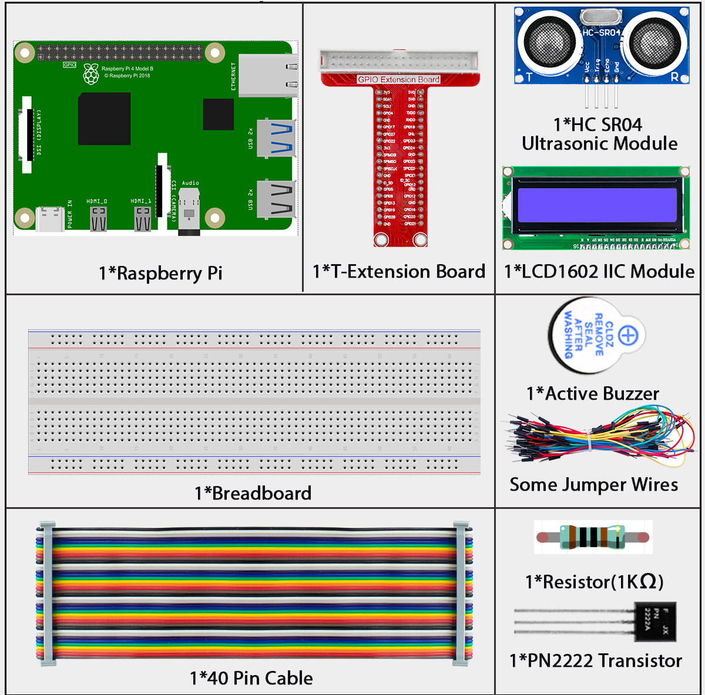
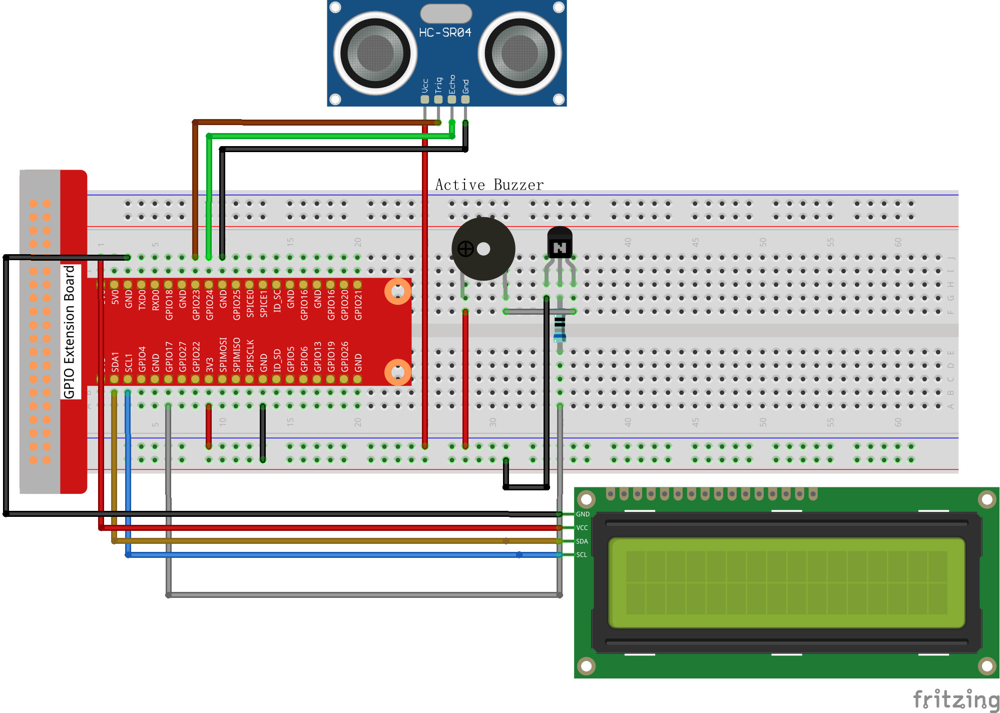

3.1.3 Reversing Alarm
=====================

Introduction
------------

In this beginner-friendly project, you'll build your own parking sensor system just like the ones in modern cars! Using an ultrasonic sensor (acts like electronic "eyes"), an LCD display (shows distance), and a buzzer (makes warning beeps), you'll create a complete reverse assist system. This is perfect for adding to RC cars, robots, or just learning how parking sensors work in real vehicles.

Components
----------

**How your parking sensor works:**

🔍 **Ultrasonic Sensor:** Acts as electronic "eyes" that measure the distance to obstacles (walls, objects, etc.)

📺 **LCD Display:** Shows the exact distance in an easy-to-read format, so you know precisely how far away obstacles are

🔊 **Smart Buzzer:** Changes its beeping pattern based on distance:
- **Far away:** Slow, quiet beeps (or no sound)
- **Getting closer:** Faster beeps 
- **Very close:** Rapid, urgent beeping (Watch out!)

Connect
-------

.. list-table::
   :header-rows: 1
   :widths: 25 25 25 25

   * - T-Board Name
     - physical
     - wiringPi
     - BCM
   * - GPIO23
     - Pin 16
     - 4
     - 23
   * - GPIO24
     - Pin 18
     - 5
     - 24
   * - GPIO17
     - Pin 11
     - 0
     - 17
   * - SDA1
     - Pin 3
     - 
     - 
   * - SCL1
     - Pin 5
     - 
     - 

Code
----

For C Language User
~~~~~~~~~~~~~~~~~~~

Go to the code folder compile and run.

.. code-block:: shell

   cd ~/super-starter-kit-for-raspberry-pi/c/3.1.3/

.. code-block:: shell

   gcc 3.1.3_ReversingAlarm.c -lwiringPi

.. code-block:: shell

   sudo ./a.out

**How it works in action:**

Once your program starts running:

1. **Distance Detection:** The ultrasonic sensor continuously measures how far away obstacles are
2. **Visual Feedback:** The LCD1602 display shows the exact distance in real-time 
3. **Audio Alerts:** The buzzer provides audio warnings that change based on how close you are to obstacles

The closer you get to an obstacle, the faster and more urgent the beeping becomes - just like a real car parking sensor!

.. warning::

   **Want to study the code?** Use ``nano 3.1.3_ReversingAlarm.c`` or ``nano 3.1.3_ReversingAlarm.py`` to see how distance measurement and audio feedback work together!

For Python Language User
~~~~~~~~~~~~~~~~~~~~~~~~

.. code-block:: shell

   cd ~/super-starter-kit-for-raspberry-pi/python/

.. code-block:: shell

   sudo python3 3.1.3_ReversingAlarm.py

Phenomenon
----------

.. image:: ./img/phenomenon/313.gif