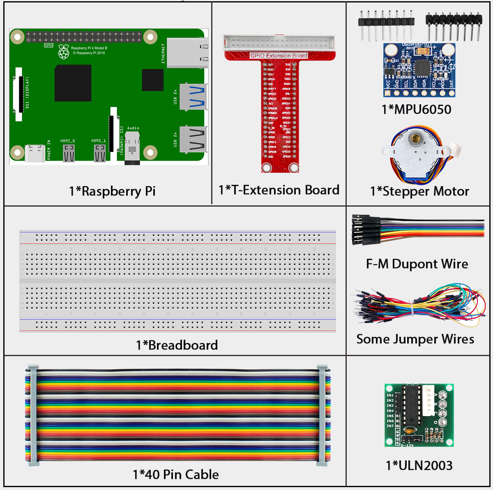
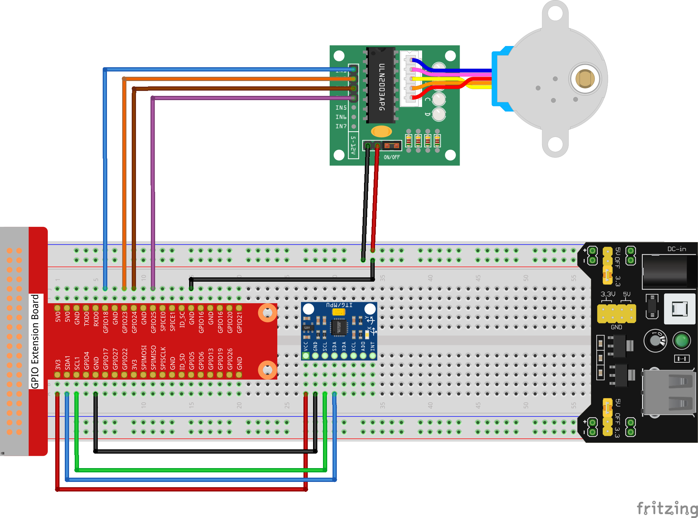
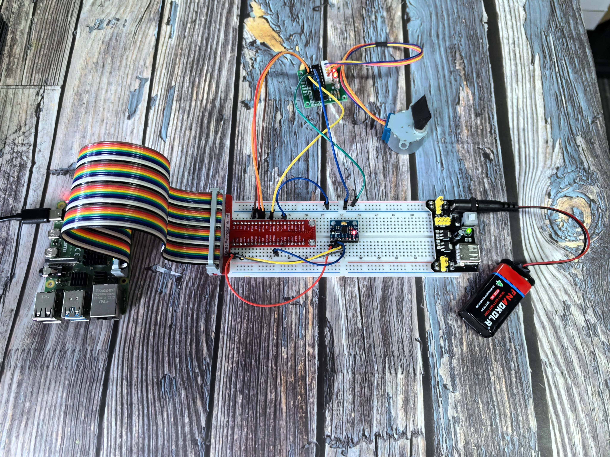

3.1.5 Motion Control
====================

Introduction
------------

In this exciting project, you'll create a motion-controlled motor system that responds to tilting movements! The MPU6050 motion sensor is mounted on your breadboard setup, and you can control a stepper motor by carefully tilting the entire breadboard. Think of it like magic - tilt the breadboard left and the motor spins one way, tilt right and it spins the other way! This is the same technology used in VR controllers, game controllers, and motion-controlled devices.

Components
----------

Connect
-------

.. list-table::
   :header-rows: 1
   :widths: 25 25 25 25

   * - T-Board Name
     - physical
     - wiringPi
     - BCM
   * - GPIO18
     - Pin 12
     - 1
     - 18
   * - GPIO23
     - Pin 16
     - 4
     - 23
   * - GPIO24
     - Pin 18
     - 5
     - 24
   * - GPIO25
     - Pin 22
     - 6
     - 25
   * - SDA1
     - Pin 3
     - 
     - 
   * - SCL1
     - Pin 5
     - 
     - 

Code
----

For C Language User
~~~~~~~~~~~~~~~~~~~

Go to the code folder compile and run.

.. code-block:: shell

   cd ~/super-starter-kit-for-raspberry-pi/c/3.1.5/

.. code-block:: shell

   gcc 3.1.5_MotionControl.c -lwiringPi -lm

.. code-block:: shell

   sudo ./a.out

**How motion control works:**

Once your program is running, the system responds to tilting the breadboard:

📋 **Tilt the breadboard LEFT (more than 45°):** 
   → Stepper motor rotates counterclockwise

📋 **Tilt the breadboard RIGHT (more than 45°):**
   → Stepper motor rotates clockwise  

📋 **Keep the breadboard level (between -45° and +45°):**
   → Motor stays still

It's like having a motion-sensitive control system built into your project!

.. tip::

   **Curious about the code?** Use ``nano 3.1.5_MotionControl.c`` or ``nano 3.1.5_MotionControl.py`` to see how motion sensing translates into motor control!

For Python Language User
~~~~~~~~~~~~~~~~~~~~~~~~

.. code-block:: shell

   cd ~/super-starter-kit-for-raspberry-pi/Python/

.. code-block:: shell

   python 3.1.5_MotionControl.py

**How motion control works:**

Once your program is running, the system responds to tilting the breadboard:

📋 **Tilt the breadboard LEFT (more than 45°):** 
   → Stepper motor rotates counterclockwise

📋 **Tilt the breadboard RIGHT (more than 45°):**
   → Stepper motor rotates clockwise  

📋 **Keep the breadboard level (between -45° and +45°):**
   → Motor stays still

It's like having a motion-sensitive control system built into your project!

Phenomenon
----------

