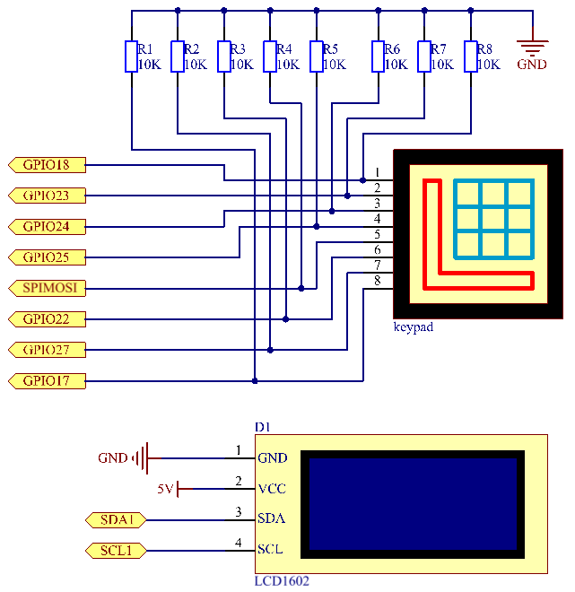

# 3.1.6 Password Lock

## Introduction

In this project, we will use a keypad and a LCD to make a combination lock. The LCD will display a corresponding prompt for you to type your password on the Keypad. If the password is input correctly, "Correct" will be displayed.

On the basis of this project, we can add additional electronic components, such as buzzer, LED and so on, to add different experimental phenomena for password input.

## Components


## Connect

| T-Board Name | physical | wiringPi | BCM  |
| ------------ | -------- | -------- | ---- |
| GPIO18       | Pin 12   | 1        | 18   |
| GPIO23       | Pin 16   | 4        | 23   |
| GPIO24       | Pin 18   | 5        | 24   |
| GPIO25       | Pin 22   | 6        | 25   |
| GPIO17       | Pin 11   | 0        | 17   |
| GPIO27       | Pin 13   | 2        | 27   |
| GPIO22       | Pin 15   | 3        | 22   |
| SPIMOSI      | Pin 19   | 12       | 10   |
| SDA1         | Pin 3    |          |      |
| SCL1         | Pin 5    |          |      |




## Code

### For  C  Language User

Go to the code folder compile and run.

```shell
cd ~/super-starter-kit-for-raspberry-pi/c/3.1.6/
gcc 3.1.6_PasswordLock.cpp -lwiringPi
sudo ./a.out
```

<div class="warning" style="background-color: #E7F2FA; color=#6AB0DE; padding: 10px; border: 1px solid #333; border-radius: 5px;">
    NOTE: If you want to check the complete codes, you are suggested to use command `nano 3.1.6_PasswordLock.cpp`or`nano 3.1.6_PasswordLock.py`.
</div>


### For Python Language User

```sh
cd ~/super-starter-kit-for-raspberry-pi/python
python 3.1.6_PasswordLock.py
```

## Phenomenon


