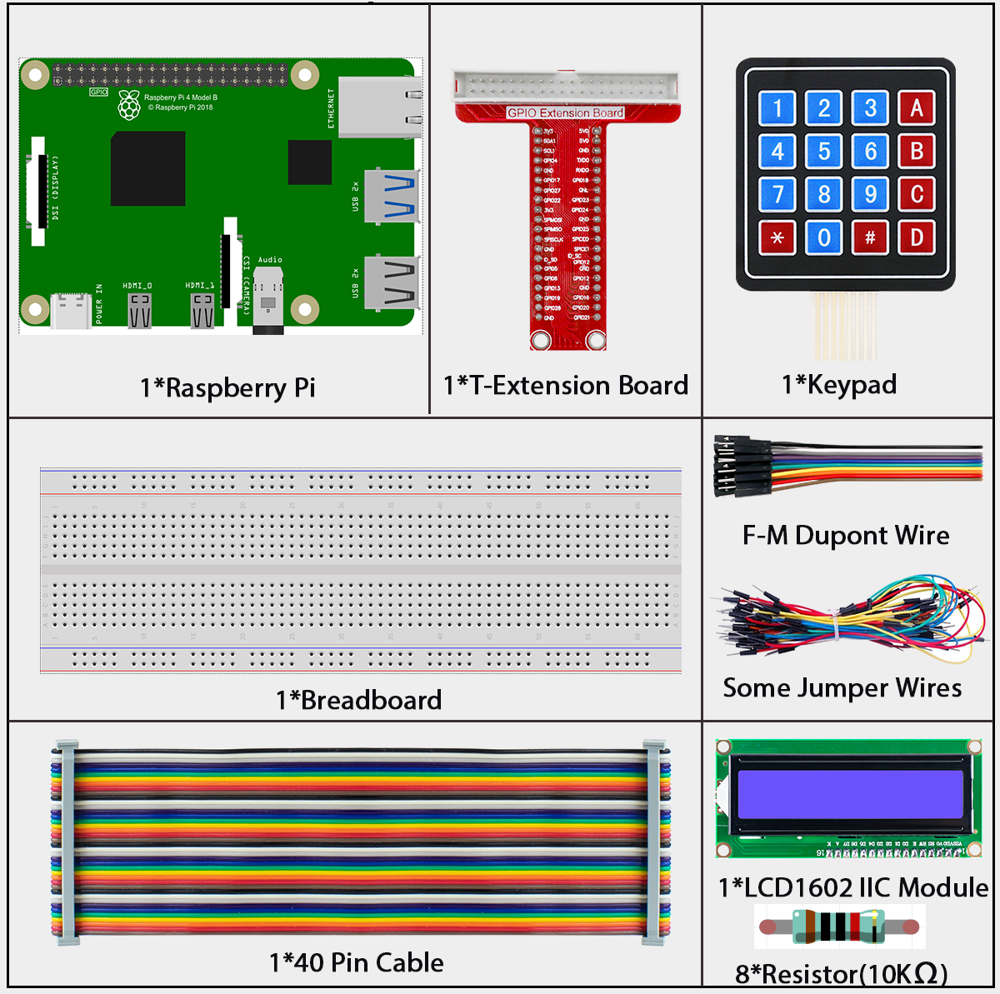
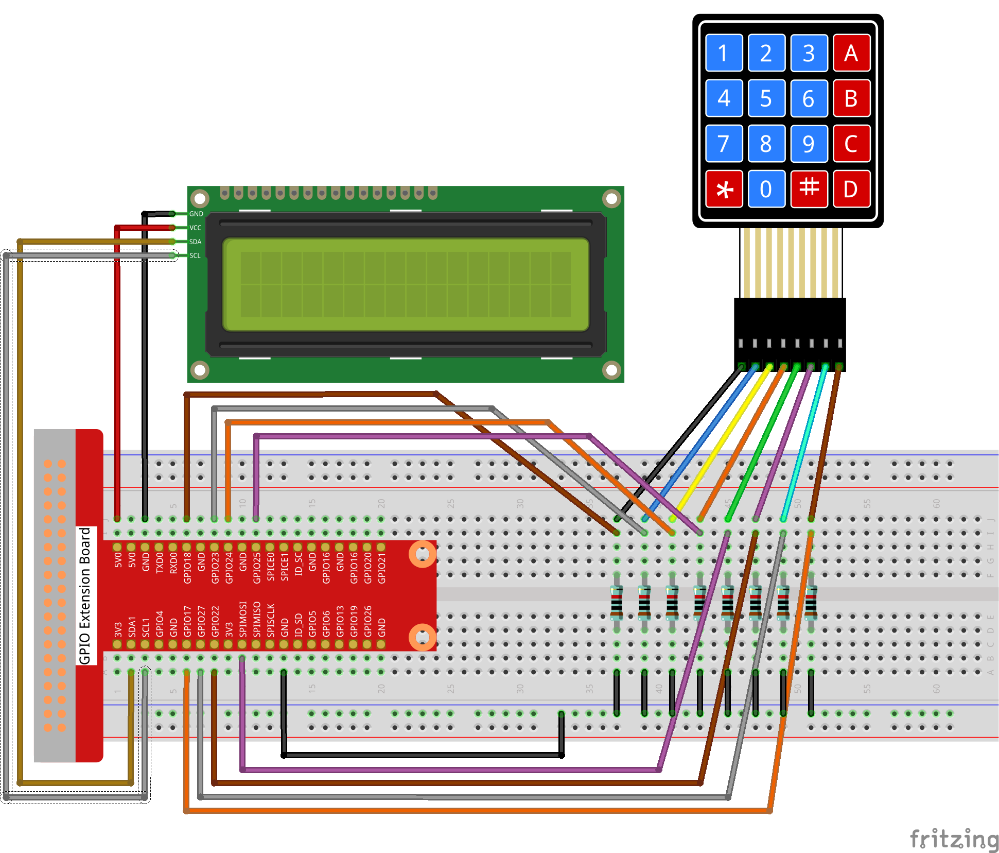
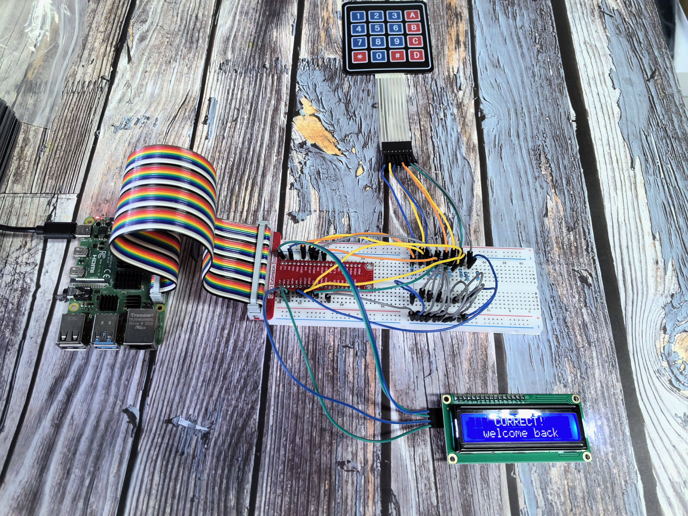

3.1.6 Password Lock
===================

Introduction
------------

In this exciting security project, you'll build your own digital password lock system just like the ones used in safes, doors, and secure areas! Using a keypad for input and an LCD screen for feedback, you'll create a system that only unlocks when the correct password is entered.

**How your password lock works:**
🔢 **LCD Display:** Shows prompts and guides you through the password entry process
⌨️ **Keypad Input:** Type your secret password using the number pad
✅ **Security Check:** System verifies if your password is correct and displays "Correct" for success

**Expansion possibilities:** This project is perfect for adding more security features like:
• 🔊 **Buzzer alerts:** Beep for wrong passwords or successful entry
• 💡 **LED indicators:** Green for correct, red for wrong password
• 🚨 **Alarm system:** Sound alert after multiple failed attempts

Components
----------

Connect
-------

.. list-table::
   :header-rows: 1
   :widths: 25 25 25 25

   * - T-Board Name
     - physical
     - wiringPi
     - BCM
   * - GPIO18
     - Pin 12
     - 1
     - 18
   * - GPIO23
     - Pin 16
     - 4
     - 23
   * - GPIO24
     - Pin 18
     - 5
     - 24
   * - GPIO25
     - Pin 22
     - 6
     - 25
   * - GPIO17
     - Pin 11
     - 0
     - 17
   * - GPIO27
     - Pin 13
     - 2
     - 27
   * - GPIO22
     - Pin 15
     - 3
     - 22
   * - SPIMOSI
     - Pin 19
     - 12
     - 10
   * - SDA1
     - Pin 3
     - 
     - 
   * - SCL1
     - Pin 5
     - 
     - 

Code
----

For C Language User
~~~~~~~~~~~~~~~~~~~

Go to the code folder compile and run.

.. code-block:: shell

   cd ~/super-starter-kit-for-raspberry-pi/c/3.1.6/

.. code-block:: shell

   gcc 3.1.6_PasswordLock.cpp -lwiringPi

.. code-block:: shell

   sudo ./a.out

.. tip::

   **Want to explore the security code?** Use ``nano 3.1.6_PasswordLock.cpp`` or ``nano 3.1.6_PasswordLock.py`` to see how password verification and user interface work together!

For Python Language User
~~~~~~~~~~~~~~~~~~~~~~~~

.. code-block:: shell

   cd ~/super-starter-kit-for-raspberry-pi/python

.. code-block:: shell

   python 3.1.6_PasswordLock.py

Phenomenon
----------

