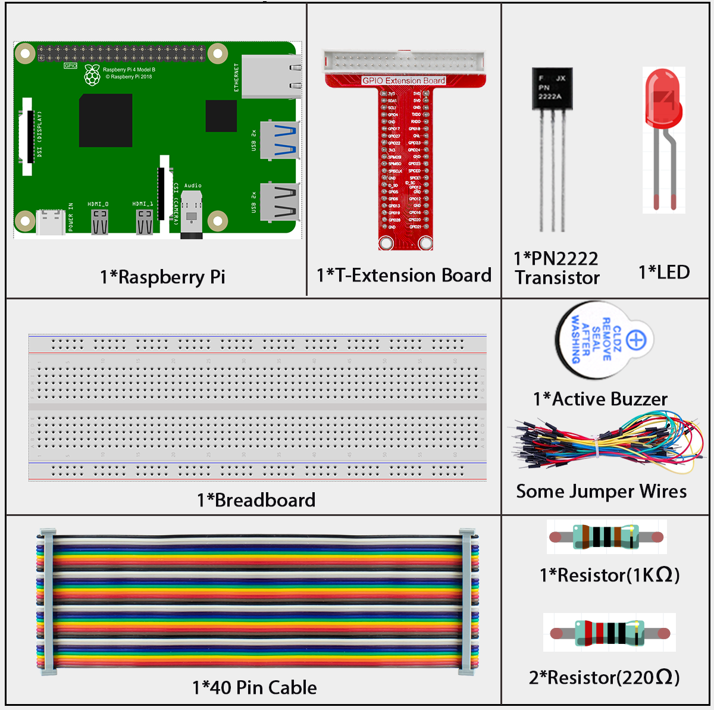
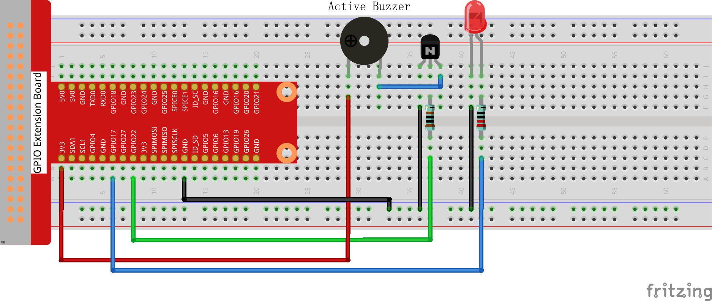

3.1.7 Morse Code Generator
==========================

Introduction
------------

In this fascinating communication project, you'll build your own Morse code transmitter that converts text into the classic "dot-dash" signals used by ships, planes, and emergency services! Using an LED for visual signals and a buzzer for audio signals, you'll create a device that can send secret messages or emergency signals.

**What is Morse Code?**
Morse code is a historic communication method that uses short signals (dots) and long signals (dashes) to represent letters and numbers. It was invented in the 1830s and is still used today in emergency situations!

**Project expansion ideas:**
• **Temperature alarm:** Replace manual input with a thermistor to send temperature warnings
• **Light alarm:** Use a photoresistor to send alerts when light levels change
• **Security system:** Create automatic alarm signals for different conditions

Components
----------

Connect
-------

.. list-table::
   :header-rows: 1
   :widths: 25 25 25 25

   * - T-Board Name
     - physical
     - wiringPi
     - BCM
   * - GPIO17
     - Pin 11
     - 0
     - 17
   * - GPIO22
     - Pin 15
     - 3
     - 22

Code
----

For C Language User
~~~~~~~~~~~~~~~~~~~

Go to the code folder compile and run.

.. code-block:: shell

   cd ~/super-starter-kit-for-raspberry-pi/c/3.1.11/

.. code-block:: shell

   gcc 3.1.7_MorseCodeGenerator.c -lwiringPi

.. code-block:: shell

   sudo ./a.out

.. tip::

   **Want to decode the programming?** Use ``nano 3.1.7_MorseCodeGenerator.c`` or ``nano 3.1.7_MorseCodeGenerator.py`` to see how text gets converted into Morse code patterns!

For Python Language User
~~~~~~~~~~~~~~~~~~~~~~~~

.. code-block:: shell

   cd ~/super-starter-kit-for-raspberry-pi/Python/

.. code-block:: shell

   python 3.1.7_MorseCodeGenerator.py

**How your Morse code transmitter works:**

Once the program starts:

1. **📝 Type your message:** Enter any text or characters you want to transmit
2. **🔄 Automatic conversion:** The system converts each letter/number into Morse code
3. **💡 Visual signals:** The LED flashes the dot-dash pattern (short flash = dot, long flash = dash)
4. **🔊 Audio signals:** The buzzer beeps the same pattern (short beep = dot, long beep = dash)
5. **📡 Message sent:** Your text is now transmitted in the universal Morse code language!

**Example:** Type "SOS" and you'll see/hear the famous distress signal: ••• ▬▬▬ •••

Phenomenon
----------

.. image:: ./img/phenomenon/317.gif