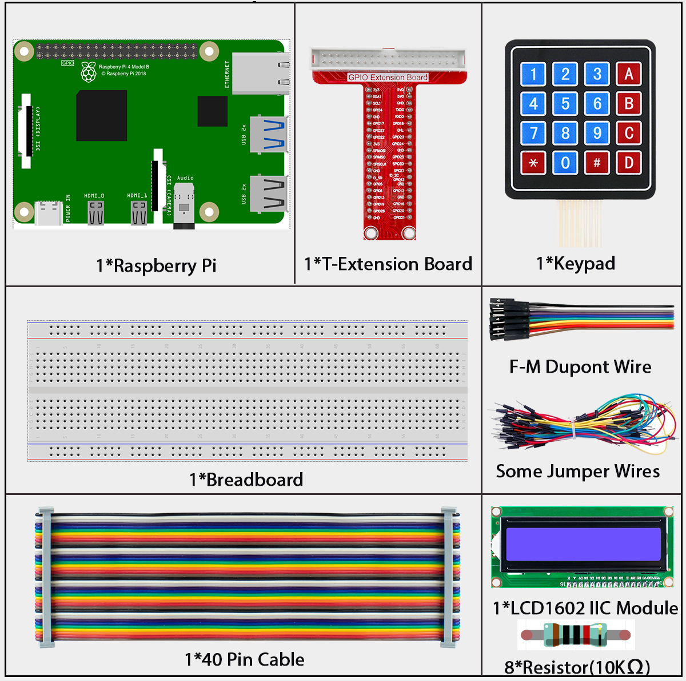
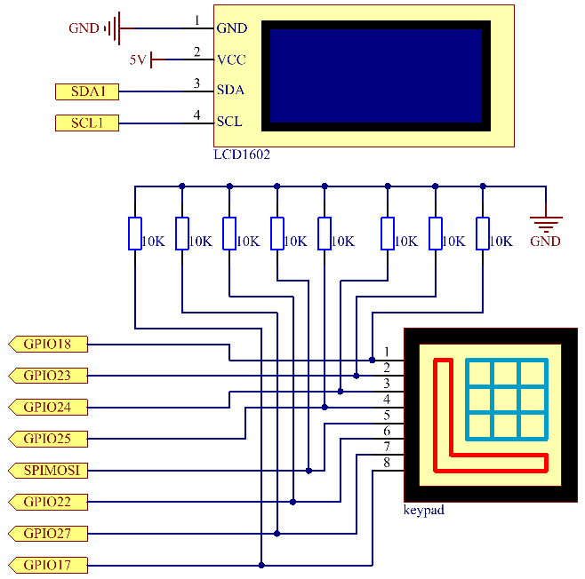
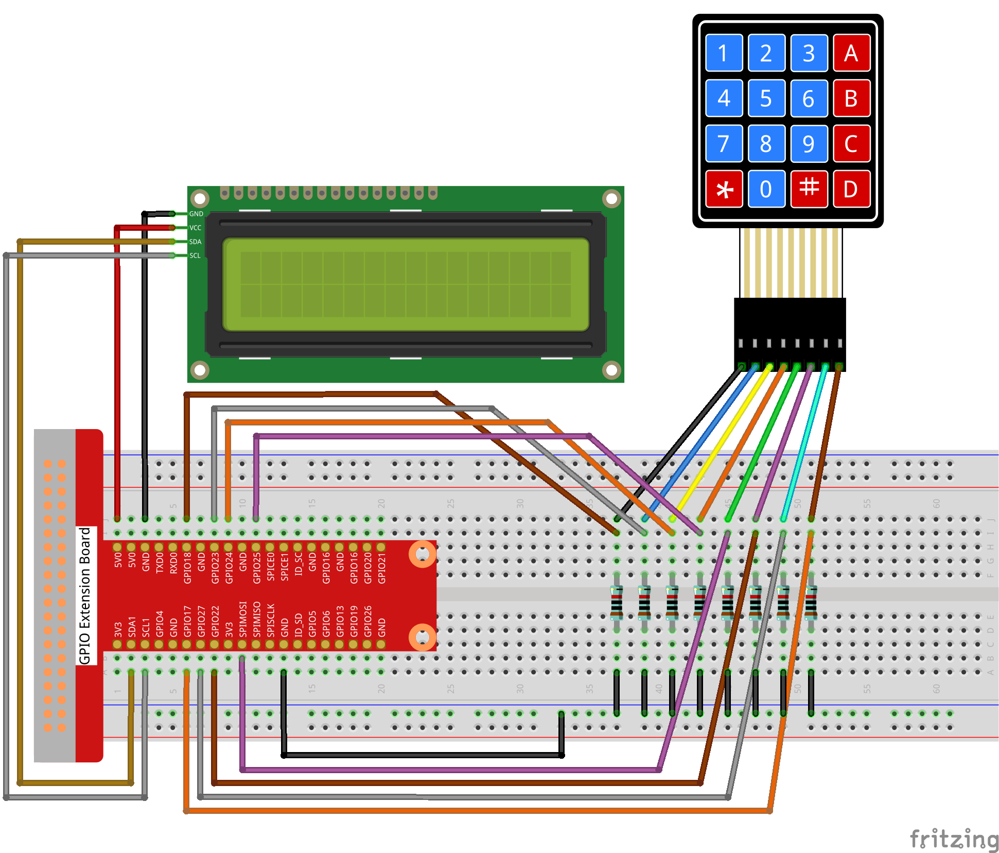

# 3.1.8 GAME– Guess Number

## Introduction

Guessing Numbers is a fun party game where you and your friends take turns inputting a number (0~99). The range will be smaller with the inputting of the number till a player answers the riddle correctly. Then the player is defeated and punished. For example, if the lucky number is 51 which the players cannot see, and the player ① inputs 50, the prompt of number range changes to 50~99; if the player ② inputs 70, the range of number can be 50~70; if the player ③ inputs 51, this player is the unlucky one. Here, we use keypad to input numbers and use LCD to output outcomes.

## Components



## Connect

| T-Board Name | physical | wiringPi | BCM     |
| ------------ | -------- | -------- | ------- |
| GPIO18       | Pin 12   | 1        | 18      |
| GPIO23       | Pin 16   | 4        | 23      |
| GPIO24       | Pin 18   | 5        | 24      |
| GPIO25       | Pin 22   | 6        | 25      |
| SPIMOSI      | Pin 19   | 12       | 10      |
| GPIO22       | Pin 15   | 3        | 22      |
| GPIO27       | Pin 13   | 2        | 27      |
| GPIO17       | Pin 11   | 0        | 17      |
| SDA1         | Pin 3    | SDA1(8)  | SDA1(2) |
| SCL1         | Pin 5    | SCL1(9)  | SDA1(3) |





## Code

### For  C  Language User

Go to the code folder compile and run.

```sh
cd ~/super-starter-kit-for-raspberry-pi/c/3.1.8/
gcc 3.1.8_GAME_GuessNumber.c -lwiringPi
sudo ./a.out
```

### For  Python  Language User

Go to the code folder and run.

```sh
cd ~/super-starter-kit-for-raspberry-pi/python
python 3.1.8_GAME_GuessNumber.py
```

After the program runs, there displays the initial page on the LCD:

```
Welcome!
Press A to go!
```

Press 'A', and the game will start and the game page will appear on the LCD.

```
Enter number:
0 ‹point‹ 99
```

A random number 'point' is produced but not displayed on the LCD when the game starts, and what you need to do is to guess it. The number you have typed appears at the end of the first line till the final calculation is finished. (Press 'D' to start the comparation, and if the input number is larger than 10, the automatic comparation will start.)

The number range of 'point' is displayed on the second line. And you must type the number within the range. When you type a number, the range narrows; if you got the lucky number luckily or unluckily, there will appear "You’ve got it!"

## Phenomenon


