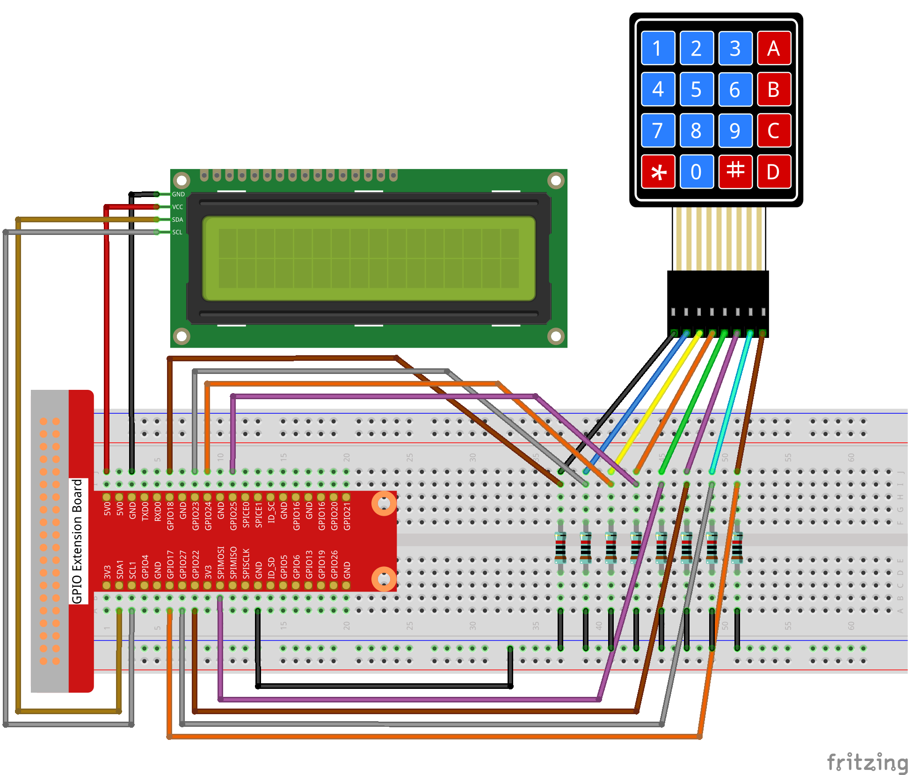
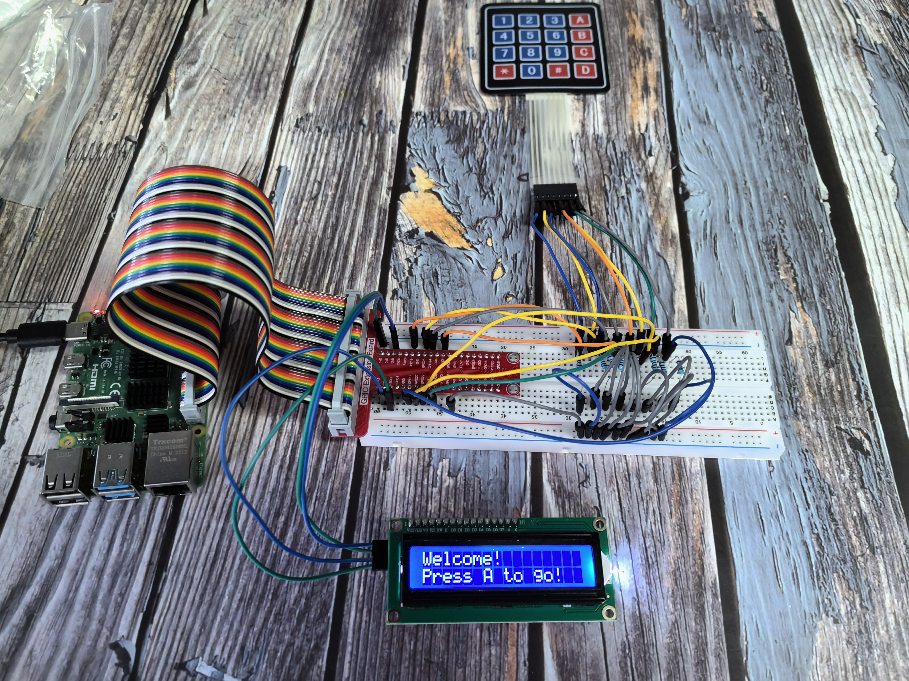

3.1.8 GAME–Guess Number
=======================

Introduction
------------

In this entertaining project, you'll build an electronic version of the classic "Guess the Number" game! Perfect for parties or just having fun, this interactive game challenges players to find a secret number between 0-99. Each guess narrows down the possible range until someone finds the target number.

**How the game works:**
🎯 **Secret target:** The system picks a random number (hidden from players)
🎮 **Player turns:** Take turns guessing numbers using the keypad
📱 **Smart feedback:** The LCD shows the narrowing range after each guess
🏆 **Winner/Loser:** Whoever guesses the exact number "wins" (or loses, depending on your rules!)

**Example game round:**
• Secret number: 51 (hidden)
• Player 1 guesses: 50 → Range becomes 50~99
• Player 2 guesses: 70 → Range becomes 50~70  
• Player 3 guesses: 51 → "You've got it!" (Game over!)

**Components:** Keypad for number input + LCD for displaying results and game status

Components
----------

.. image:: ./img/list/list_GAME_Guess_Number.png

Connect
-------

.. list-table::
   :header-rows: 1
   :widths: 25 25 25 25

   * - T-Board Name
     - physical
     - wiringPi
     - BCM
   * - GPIO18
     - Pin 12
     - 1
     - 18
   * - GPIO23
     - Pin 16
     - 4
     - 23
   * - GPIO24
     - Pin 18
     - 5
     - 24
   * - GPIO25
     - Pin 22
     - 6
     - 25
   * - SPIMOSI
     - Pin 19
     - 12
     - 10
   * - GPIO22
     - Pin 15
     - 3
     - 22
   * - GPIO27
     - Pin 13
     - 2
     - 27
   * - GPIO17
     - Pin 11
     - 0
     - 17
   * - SDA1
     - Pin 3
     - SDA1(8)
     - SDA1(2)
   * - SCL1
     - Pin 5
     - SCL1(9)
     - SDA1(3)

Code
----

For C Language User
~~~~~~~~~~~~~~~~~~~

Go to the code folder compile and run.

.. code-block:: shell

   cd ~/super-starter-kit-for-raspberry-pi/c/3.1.8/

.. code-block:: shell

   gcc 3.1.8_GAME_GuessNumber.c -lwiringPi

.. code-block:: shell

   sudo ./a.out

For Python Language User
~~~~~~~~~~~~~~~~~~~~~~~~

Go to the code folder and run.

.. code-block:: shell

   cd ~/super-starter-kit-for-raspberry-pi/python

.. code-block:: shell

   python 3.1.8_GAME_GuessNumber.py

**Getting started - Welcome screen:**

When you first run the program, the LCD displays a friendly welcome message:

.. code-block:: text

   Welcome!
   Press A to go!

**Starting the game:**

Press the 'A' key on your keypad to begin! The LCD will switch to the main game screen:

.. code-block:: text

   Enter number:
   0 ‹point‹ 99

**How to play:**

🎲 **Hidden target:** The system secretly generates a random number (the "point") that you need to guess

⌨️ **Enter your guess:** Type numbers using the keypad - your input appears on the first line

✅ **Submit your guess:** 
• Press 'D' to confirm your number, OR
• For numbers ≥ 10, the system automatically processes your guess

📊 **Range updates:** The second line shows the current valid range - you must guess within these limits

🎯 **Winning condition:** Keep guessing until the range narrows down and you hit the exact target number

🎉 **Victory message:** When you guess correctly, "You've got it!" appears on the screen

**Strategy tip:** Each guess eliminates possibilities and narrows the range, so choose wisely!

Phenomenon
----------

