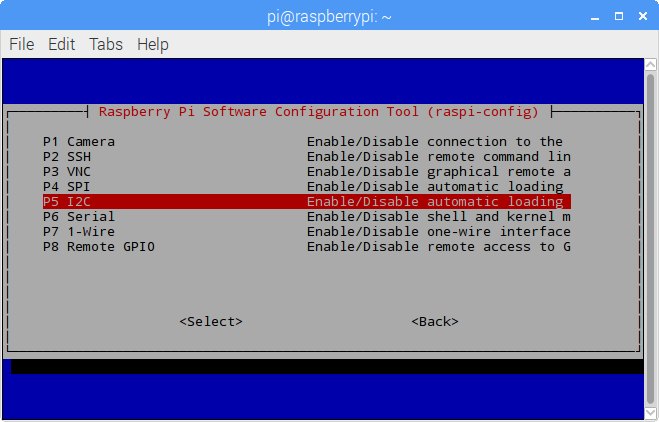
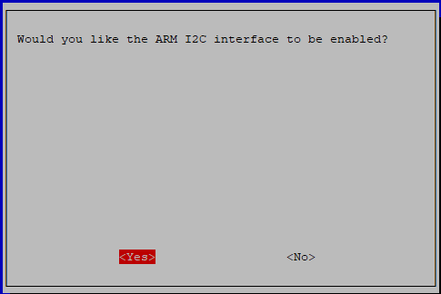

I2C Configuration
=================

**Step 1**: Enable the I2C port of your Raspberry Pi (If you have enabled it, skip this; if you do not know whether you have done that or not, please continue).

.. code-block:: shell

   sudo raspi-config

**3 Interfacing options**

.. image:: ./img/image282.png

**P5 I2C**

**<Yes>, then <Ok> -> <Finish>**

**Step 2:** Check whether the i2c modules are loaded and active.

.. code-block:: shell

   lsmod | grep i2c

Then the following codes will appear (the number may be different).

.. code-block:: text

   i2c_dev                     6276    0
   i2c_bcm2708                 4121    0

**Step 3:** Install i2c-tools.

.. code-block:: shell

   sudo apt-get install i2c-tools

**Step 4:** Check the address of the I2C device.

.. code-block:: shell

   i2cdetect -y 1      # For Raspberry Pi 2 and higher version

   i2cdetect -y 0      # For Raspberry Pi 1

.. code-block:: text

   pi@raspberrypi ~ $ i2cdetect -y 1
       0  1  2  3   4  5  6  7  8  9   a  b  c  d  e  f
   00:           -- -- -- -- -- -- -- -- -- -- -- -- --
   10: -- -- -- -- -- -- -- -- -- -- -- -- -- -- -- --
   20: -- -- -- -- -- -- -- -- -- -- -- -- -- -- -- --
   30: -- -- -- -- -- -- -- -- -- -- -- -- -- -- -- --
   40: -- -- -- -- -- -- -- -- 48 -- -- -- -- -- -- --
   50: -- -- -- -- -- -- -- -- -- -- -- -- -- -- -- --
   60: -- -- -- -- -- -- -- -- -- -- -- -- -- -- -- --
   70: -- -- -- -- -- -- -- --

If there is an I2C device connected, the address of the device will be displayed.

**Step 5:**

**For C language users:** Install libi2c-dev.

.. code-block:: shell

   sudo apt-get install libi2c-dev

**For Python users:** Install smbus for I2C.

.. code-block:: shell

   sudo pip3 install smbus2