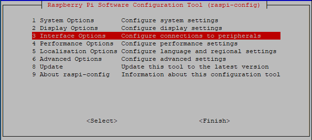
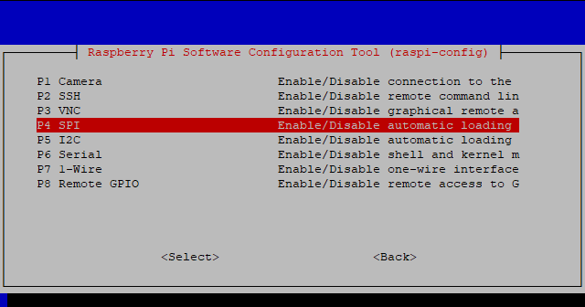
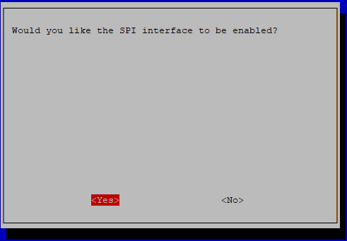

# SPI Configuration

**Step 1**: Enable the SPI port of your Raspberry Pi (If you have enabled it, skip this; if you do not know whether you have done that or not, please continue).

```
sudo raspi-config
```

**3 Interfacing options**



**P4 SPI**



**<YES>**, then click **<OK>** and **<Finish>**. Now you can use the `sudo reboot` command to reboot the Raspberry Pi.



**Step 2:** Check that the spi modules are loaded and active.

```
ls /dev/sp*
```

Then the following codes will appear (the number may be different).

```
/dev/spidev0.0  /dev/spidev0.1
```

**Step 3:** Install Python module SPI-Py.

```
git clone https://github.com/lthiery/SPI-Py.git
cd SPI-Py
sudo python3 setup.py install
```

<div class="warning" style="background-color: #E7F2FA; color=#6AB0DE; padding: 10px; border: 1px solid #333; border-radius: 5px;">
    NOTE: This step is for python users, if you use C language, please skip.
</div>