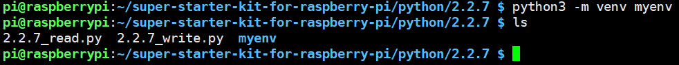
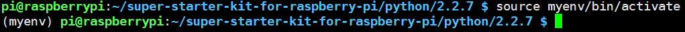
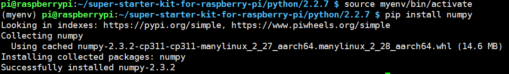
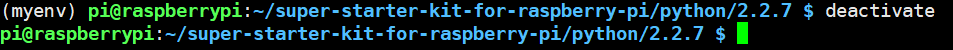
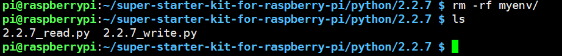

Virtual Environment Creation
=============================

When using a Raspberry Pi or similar devices, it is recommended to install packages with pip in a virtual environment. This provides dependency isolation, enhances system security, keeps the system clean, and simplifies project migration and sharing, making dependency management easier. These benefits make virtual environments an extremely important and useful tool in Python development.

Below are the steps to create a virtual environment:

Step 1: Create a Virtual Environment
------------------------------------

First, ensure that Python is installed on your system. Python versions 3.3 and later come with the venv module for creating virtual environments, eliminating the need for a separate installation. If you're using Python 2 or an earlier version than Python 3.3, you will need to install virtualenv.

**For Python 3:**

Python versions 3.3 and later can directly use the venv module:

.. code-block:: shell

   python3 -m venv myenv

This will create a virtual environment called ``myenv`` in the current directory.

.. note::

   The latest Raspberry Pi systems usually come with python3 installed, so you can create a virtual environment directly using python3 -m venv myenv.

Step 2: Activate the Virtual Environment
-----------------------------------------

After creating the virtual environment, you need to activate it for use.

.. important:: 
   
   Every time you restart the Raspberry Pi or open a new terminal, you will need to run the following command again to activate the virtual environment.

.. code-block:: shell

   source myenv/bin/activate

Once the virtual environment is activated, you will see the environment name before the command prompt, indicating that you are working within the virtual environment.

Step 3: Install Dependencies
-----------------------------

With the virtual environment activated, you can use pip to install the necessary dependencies. For example:

.. code-block:: shell

   pip install numpy

This will install the numpy library in the current virtual environment instead of the global environment. This step only needs to be done once.

Step 4: Exit the Virtual Environment
-------------------------------------

When you're finished working and want to exit the virtual environment, simply run:

.. code-block:: shell

   deactivate

This will return you to the system's global Python environment.

Step 5: Delete the Virtual Environment
---------------------------------------

If you no longer need a particular virtual environment, you can simply delete the directory that contains the virtual environment:

.. code-block:: shell

   rm -rf myenv

.. warning::

   Be careful when deleting virtual environments, as this action cannot be undone. Make sure you no longer need the virtual environment and any packages installed in it.