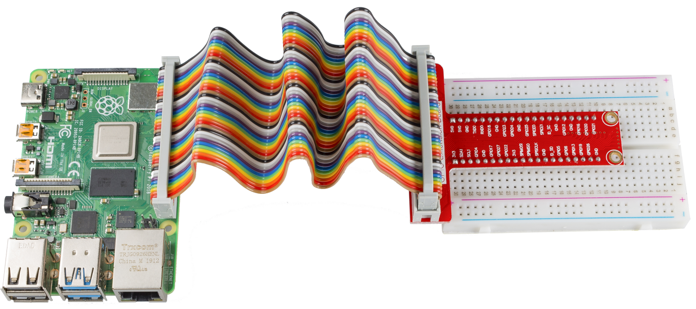

# GPIO Extension Board

Before starting to learn the commands, you first need to know more about the pins of the Raspberry Pi, which is key to the subsequent study.

We can easily lead out pins of the Raspberry Pi to breadboard by GPIO Extension Board to avoid GPIO damage caused by frequent plugging in or out. This is our 40-pin GPIO Extension Board and GPIO cable for Raspberry Pi model B+, 2 model B and 3, 4 model B.

**Pin Number**

The pins of Raspberry Pi have three kinds of ways to name and they are wiringPi, BCM and Board.

Among these naming methods, 40-pin GPIO Extension board uses the naming method, BCM. But for some special pins, such as I2C port and SPI port, they use the Name that comes with themselves.

The following table shows us the naming methods of WiringPi, Board and the intrinsic Name of each pin on GPIO Extension board. For example, for the GPIO17, the Board naming method of it is 11, the wiringPi naming method is 0, and the intrinsic naming method of it is GPIO0.

> [!NOTE]
>
> 1. In C Language, what is used is the naming method WiringPi.
> 2. In Python Language, the applied naming methods are Board and BCM, and the function GPIO.setmode() is used to set them.

    NOTE: 1. In C Language, what is used is the naming method WiringPi.
    2. In Python Language, the applied naming methods are Board and BCM, and the function GPIO.setmode() is used to set them.

