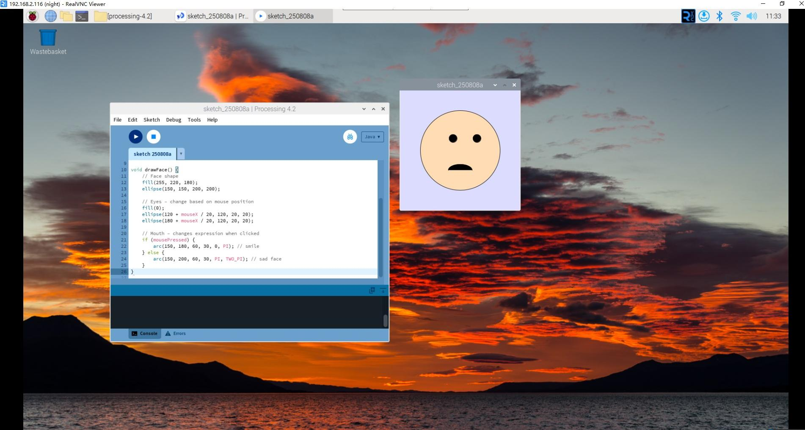

Interactive Face Expression Generator
=======================================

You're now running the Processing Development Environment (or PDE). 
There's not much to it; the large area is the Text Editor, and there's a row of buttons across the top; this is the toolbar. 
Below the editor is the Message Area, and below that is the Console. 
The Message Area is used for one line messages, and the Console is used for more technical details.

Let's get familiar with the usage of Processing and create an interactive face that responds to mouse movement and clicks!

**Sketch**

Copy the sketch below into Processing and run it. A new display window will appear with an interactive face that follows your mouse and changes expression when clicked!

.. code-block:: java

    void setup() {
        size(300, 300);
    }

    void draw() {
        background(220, 220, 255);
        drawFace();
    }

    void drawFace() {
        // Face shape
        fill(255, 220, 180);
        ellipse(150, 150, 200, 200);
        
        // Eyes – change based on mouse position
        fill(0);
        ellipse(120 + mouseX / 20, 120, 20, 20);
        ellipse(180 + mouseX / 20, 120, 20, 20);
        
        // Mouth – changes expression when clicked
        if (mousePressed) {
            arc(150, 180, 60, 30, 0, PI); // smile
        } else {
            arc(150, 200, 60, 30, PI, TWO_PI); // sad face
        }
    }

.. note:: 

    If you run it and the message area turns red and reports some errors, then there is something wrong with the sketch. Make sure you copy the sample sketch exactly: numbers should be enclosed in parentheses, with commas between each number, and lines should end with semicolons.

**How it works?**

This interactive face demonstrates several key Processing concepts:

**Interactive Elements:**
- **Eye tracking**: The eyes follow your mouse movement using ``mouseX`` to calculate eye position
- **Expression change**: Clicking the mouse switches between happy and sad expressions using ``mousePressed``
- **Real-time updates**: The ``draw()`` function continuously updates the display

**Coordinate System:**
Each pixel of the display window has coordinates (x,y). The origin (0,0) is in the upper left corner, with the X-axis pointing right and Y-axis pointing down.

**Drawing Functions Used:**
- ``ellipse()`` for the face shape and eyes
- ``arc()`` for the curved mouth (smile or frown)
- ``fill()`` to set colors for different face parts

**Mouse Interaction:**
- ``mouseX`` provides the horizontal mouse position
- ``mousePressed`` is true when any mouse button is held down

**Key Functions in This Project:**

* ``size(width, height)``: Sets the canvas size to 300x300 pixels
* ``background(red, green, blue)``: Creates a light blue background (220, 220, 255)
* ``ellipse(x, y, width, height)``: Draws circular shapes for the face and eyes
* ``arc(x, y, width, height, start, stop)``: Creates curved mouth shapes
* ``fill(red, green, blue)``: Sets the color for drawing shapes
* ``mouseX``: Built-in variable tracking horizontal mouse position
* ``mousePressed``: Built-in variable that's true when mouse is clicked

**Try These Experiments:**
- Move your mouse around and watch the eyes follow
- Click and hold to see the happy face
- Release the mouse to see the sad expression
- Try changing the face color by modifying the ``fill()`` values

For more please refer to `Processing Reference <https://processing.org/reference/>`_.